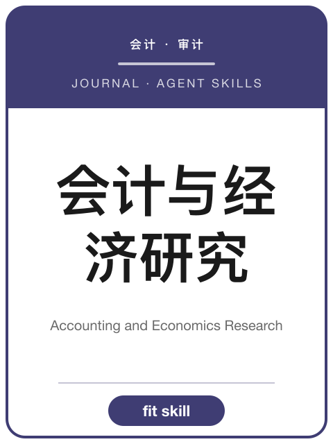

<!-- AJS-ROOT-JOURNAL-ENTRY -->
# 《会计与经济研究》

> 会计与经济理论应用学术期刊。

| 期刊概览 | |
|---|---|
| **学科** | 会计学、经济学 |
| **主办/出版** | 上海市教育委员会主管 · 上海立信会计金融学院主办 |
| **创刊** | 1987 |
| **ISSN** | 1009-6701 · CN 31-1944/F |
| **周期** | 双月刊 |
| **收录/地位** | CSSCI |
| **官网** | [kjyjjyj.cn](http://www.kjyjjyj.cn/) |
| **核验日期** | 2026-06-17 |

**▶ 调用 skill —— [`accounting-and-economics-research`](../Chinese-SocialScience-Journal-Skills/skills/accounting-and-economics-research/)：** 选题契合度、框架、方法与证据门槛、写作体例与拒稿雷区。

属于 **[中文社会科学期刊 Skills](../Chinese-SocialScience-Journal-Skills/)** 合集。投稿前请以官网最新《投稿须知》为准。

---

<!-- 机器可读的规范指针——请勿删除或改动（由 tools/audit_repo.py 校验）。 -->

- Canonical skill: [Chinese-SocialScience-Journal-Skills/skills/accounting-and-economics-research/](../Chinese-SocialScience-Journal-Skills/skills/accounting-and-economics-research/)
- Skill name: `accounting-and-economics-research`
- Bundle: [Chinese-SocialScience-Journal-Skills/](../Chinese-SocialScience-Journal-Skills/)

此目录刻意不包含 `SKILL.md`；真正可安装的 skill 保留在 bundle 内，确保插件路径和 skill 计数保持稳定。
