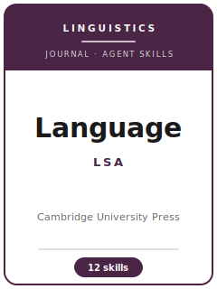

# Language (Linguistic Society of America) Skills

<p align="center">
  
</p>

[](LICENSE)
[](https://www.cambridge.org/core/journals/language)
[](https://www.linguisticsociety.org/publications/language)
[](https://github.com/anthropics/claude-code)

English | [简体中文](README.zh-CN.md)

Agent skill stack for manuscripts targeted at **Language**, the flagship journal of the **Linguistic
Society of America (LSA)** — published continuously since **1925** and, from **January 2026**, by
**Cambridge University Press** (fully **open access** from Volume 102). *Language* is a **generalist**
venue spanning every subfield — phonology, phonetics, syntax, semantics, morphology, historical and
typological linguistics, sociolinguistics, psycholinguistics, and computational linguistics — and it
judges each kind of work by the standards of its tradition while demanding one thing across the board:
a **theoretically grounded claim carried by rigorous, checkable linguistic evidence**, legible to the
whole discipline rather than to one framework's insiders.

This repository is opinionated. It is **not** a generic linguistics-writing toolbox and it is **not** a
subfield journal (*NLLT*, *Phonology*, *Journal of Semantics*, *Language Variation and Change*) pack
renamed. *Language*'s bar is breadth of readership plus depth of analysis: reviewers come from across
subfields under **double-anonymous** review, data are given in **numbered, Leipzig-glossed examples**,
references follow the **Language / Unified Style Sheet** (not APA or Chicago), and quantitative claims
are expected to rest on **properly specified models** (mixed-effects in R) with shared data.

---

## What Is Language, and Why a Dedicated Stack?

*Language*'s constraints differ from subfield venues and from generic journals:

| Constraint | Language (LSA) | Implication |
|------------|----------------|-------------|
| Owner / publisher | **LSA** / **Cambridge University Press** (since Jan 2026; previously Project MUSE / JHU Press) | Submit via **CUP ScholarOne**; Overleaf template |
| Access | **Fully open access** from Volume 102 (2026) | Check APC / waivers / read-and-publish terms |
| Premium on | **Theoretically grounded analysis** for a general audience | A descriptive data dump is off-fit (a desk return) |
| Framework stance | **Engage across frameworks** | Single-formalism parochialism is punished |
| Scope | Every subfield, each judged by its own standard | Do not force one template onto every paper |
| Review model | **Double-anonymous** | Anonymize the file; neutralize self-citations |
| Length | **General Research Article ≤ 18,000 words** (inclusive of notes/tables/appendices, excl. references); **> 12,000** held to a stricter bar | Long is tolerated, not rewarded; earn every page |
| Examples | **Numbered, Leipzig-glossed**; **IPA** in Unicode | Misaligned glosses / faked IPA are common errors |
| Style | **Language / Unified Style Sheet** (author-date) | **Not** APA or Chicago |
| Data | Documented, reproducible; ethical for consultants/communities | Share what you ethically can; do not over-state a mandate |

Volatile specifics (word/abstract limits, accepted formats, open-access terms, current masthead, data
policy) changed with the 2026 publisher move and are still settling. The refresh notes in
[`resources/official-source-map.md`](resources/official-source-map.md) route each fact to an official
LSA, Cambridge University Press, or Style Sheet source; live-check operational details in a browser
immediately before upload.

### Sections at a glance

- **General Research Article** — in-depth, advances linguistic theory for a general audience (≤18,000 words).
- **Research Report** — a smaller, targeted contribution.
- **Review Article** — state-of-the-art synthesis (≤5,000 words).
- **Discussion Notes**, **Reviews / Book Notices**.
- **Online-only (since 2013):** **Perspectives** (target article + Commentaries + Rejoinder),
  **Phonological Analysis**, **Language and Public Policy**, **Teaching Linguistics**.

---

## Quick Start

### Option A — Claude Code Plugin (recommended)

```bash
/plugin marketplace add https://github.com/brycewang-stanford/lang-skills
/plugin install lang-skills
/reload-plugins
```

### Option B — Manual Copy

```bash
git clone https://github.com/brycewang-stanford/lang-skills.git
cd lang-skills

mkdir -p ~/.claude/skills && cp -R skills/lang-* ~/.claude/skills/
# or
mkdir -p ~/.codex/skills && cp -R skills/lang-* ~/.codex/skills/
```

### First Prompt

```
Use lang-workflow to tell me which skill I should use next for my Language manuscript.
```

---

## Default Workflow

```text
lang-topic-selection
        ▼
lang-theory-building
        ▼
lang-literature-positioning
        ▼
lang-research-design
        ▼
lang-data-analysis
        ▼
lang-data-and-transparency
        ▼
lang-tables-figures
        ▼
lang-writing-style          (polish)
        ▼
lang-submission
        ▼
lang-review-process
        ▼
lang-rebuttal
```

`lang-workflow` is the router — it tells you which skill to use next based on your stage and whether the
piece is a **General Research Article**, a **Research Report**, a **Review Article**, a **Discussion
Note**, or a **Perspectives** target article. *Language* papers typically loop theory ↔ data ↔ analysis
several times before writing-style; the account that explains the pattern usually sharpens late.

---

## Skills

| Skill | Purpose |
|-------|---------|
| `lang-workflow` | Router — decides which sub-skill to invoke next |
| `lang-topic-selection` | Fit: a theoretically grounded claim legible across subfields, not a description |
| `lang-theory-building` | Raise a pattern to an analysis with explicit predictions that adjudicate frameworks |
| `lang-literature-positioning` | Locate the contribution in a live debate; engage rival frameworks fairly |
| `lang-research-design` | Defend the design by subfield (fieldwork, corpus, phonetic, typological, computational) |
| `lang-data-analysis` | Analysis norms; mixed-effects modeling; effect sizes; no pseudoreplication |
| `lang-data-and-transparency` | Documented, reproducible data; sourced glosses; consultant/community ethics |
| `lang-tables-figures` | Numbered examples, Leipzig glossing, IPA, trees/tableaux, figure alt text |
| `lang-writing-style` | General-audience prose; Language / Unified Style Sheet; front-load the claim |
| `lang-submission` | ScholarOne preflight — anonymization, word limits, glossing, style, open access |
| `lang-review-process` | Double-anonymous review; desk-return filters; decision categories |
| `lang-rebuttal` | R&R response letter + Perspectives author Rejoinder |

### Resources

- [`resources/external_tools.md`](resources/external_tools.md) — the linguistics stack (Praat, ELAN/FLEx, Montreal Forced Aligner, R/`lme4`/`brms`, corpora like CHILDES/BNC/Buckeye, IPA/Leipzig glossing tools, archives, OSF)
- [`resources/official-source-map.md`](resources/official-source-map.md) — official LSA / CUP / Style Sheet URLs behind every fact, with live-check notes
- [`resources/exemplars/library.md`](resources/exemplars/library.md) — well-known *Language* articles by subfield, with a sibling-journal guard
- [`resources/worked-examples/01-introduction.md`](resources/worked-examples/01-introduction.md) — an annotated *Language*-style introduction (before → after)

---

## What This Repo Does Not Do

- It does not write a submittable manuscript for you
- It does not simulate any specific editor's or reviewer's taste
- It does not assert volatile metadata (word/abstract limits, accepted formats, open-access terms,
  current masthead, data policy) without a current official-source route; live-check those before upload
- It does not decide whether your work is theoretically grounded enough for *Language* — that is the
  linguist's call

---

## Related

- [awesome-journal-skills](https://github.com/brycewang-stanford/awesome-journal-skills) — Index of journal-specific skill packs
- [Language (LSA)](https://www.linguisticsociety.org/publications/language) — the journal at the Linguistic Society of America
- [Language on Cambridge Core](https://www.cambridge.org/core/journals/language) — publisher home, author instructions, current issues

---

## License

MIT
