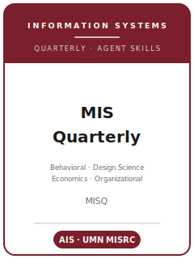

# MIS Quarterly (MISQ) Skills

<p align="center">
  
</p>

[](LICENSE)
[](https://misq.umn.edu/)
[](https://misq.umn.edu/)
[](https://github.com/anthropics/claude-code)

[English](README.md) | 简体中文

面向 **MIS Quarterly（管理信息系统季刊，MISQ）** 投稿的 Agent 技能栈 —— MISQ 是顶级的*信息系统（IS）*学术期刊，由明尼苏达大学卡尔森管理学院的信息系统研究中心（MISRC）出版，是**信息系统协会（AIS）**的官方期刊，按季度出版（3 月、6 月、9 月、12 月）。

本仓库是有立场的。它**不是**通用的"技术写作"或"社科方法"工具箱，而是围绕 MISQ 的核心特征打造的 **MISQ 专用**技能栈：MISQ 在**四大 IS 研究传统——行为学（behavioral）、设计科学（design science）、经济学（economics）、组织学（organizational）——之间是多元并立的**，并鼓励在其中任一传统（含跨传统融合）内做出严谨的理论贡献。尤为关键的是，MISQ 是 **IS 设计科学研究的标志性主场**（Hevner 等 2004 一脉），这一贡献模式在多数只接受行为学研究的顶级期刊中是缺位的。技能栈覆盖：分传统的选题、理论/设计理论构建、文献定位、与体裁匹配的研究设计与分析、贡献提炼、受页数限制约束的图表与文风、ScholarOne 投稿与多元透明度承诺、Senior-Editor/Associate-Editor 双盲评审流程，以及多轮修改。

> 仅描述持久规范。主编、费用、确切页数限制、摘要格式及各项政策会变化 —— 请务必以 MISQ 官方投稿/instructions 页面与当前版本的 MISQ Style Guide 为准。

---

## 为什么需要单独的 MISQ 技能栈？

相比管理学、经济学或计算机科学期刊，MISQ 的约束有本质差异：

| 约束维度   | MIS Quarterly                                                       | 含义                                                       |
|------------|---------------------------------------------------------------------|------------------------------------------------------------|
| 学科       | 信息系统 —— IT 人工物（artifact）必须居于核心                       | IT 仅作点缀的管理/经济/CS 文章不契合                       |
| 范式       | **多元并立**：行为学、设计科学、经济学、组织学                     | 先定传统，它决定了体裁、方法与贡献形态                     |
| 标志体裁   | 一等公民的 **Design Science（设计科学）**通道（Hevner 等 2004）     | 既要构建*也要评估* IT 人工物；设计原则才是贡献             |
| 篇幅       | **按页**计的限制，且**把一切都算进去**（正文、表、图、参考文献、附录） | 超长稿件会被退回；不鼓励补充材料                           |
| 体裁分类   | Research Article（50 页）、Research Notes（约一半）、Theory Development（55 页）、Theory-Generative Research Synthesis（65 页）、Issues & Opinions、Design Science | 投稿前自行选定体裁 |
| 透明度     | 多元、按体裁定制的透明度承诺，于投稿时上传                          | 程序/代码须足以支持复现；并非单一强制标准                 |
| 评审       | **双盲**；SE + AE 初审后再送外审；**Senior Editor 拥有决定权**      | 稿件不得含任何身份信息；多轮修改是常态                     |
| 服务义务   | 投稿即同意：若被邀请，每年最多为期刊评审**三篇**稿件               | 一项互惠义务                                              |
| 体例       | MISQ Style Guide；APA 第 7 版；正文引用**以被引信息领起，而非作者名** | 据此配置你的文献管理器 |

通用的"科研写作"或"社科方法"技能包无法覆盖这些约束。

---

## 快速开始

### 方式 A —— Claude Code 插件（推荐）

```bash
/plugin marketplace add https://github.com/brycewang-stanford/misq-skills
/plugin install misq-skills
/reload-plugins
```

### 方式 B —— 手动复制

```bash
git clone https://github.com/brycewang-stanford/misq-skills.git
cd misq-skills

mkdir -p ~/.claude/skills && cp -R skills/misq-* ~/.claude/skills/
# 或
mkdir -p ~/.codex/skills && cp -R skills/misq-* ~/.codex/skills/
```

### 第一条指令

```
用 misq-workflow 告诉我，我这篇 MIS Quarterly 稿子下一步该用哪个 skill。
```

---

## 默认工作流

```text
misq-topic-selection（选题：先定 IS 传统与体裁）
        ▼
misq-theory-development（理论：机制 / 设计理论 / 经济模型）
        ▼
misq-literature-positioning（文献定位）
        ▼
misq-methods（研究设计）
        ▼
misq-data-analysis（数据分析 + 透明度材料）
        ▼
misq-contribution-framing（贡献提炼）
        ▼
misq-tables-figures（图表）
        ▼
misq-writing-style（文风打磨）
        ▼
misq-submission（ScholarOne + 透明度承诺）
        ▼
misq-review-process（理解评审流程）
        ▼
misq-rebuttal（修改答复）
```

`misq-workflow` 是路由器 —— 它先帮你判定文章属于四大 IS 传统中的哪一个，再告诉你下一步该用哪个 skill。

---

## 技能列表

| Skill                          | 用途                                                                  |
|--------------------------------|-----------------------------------------------------------------------|
| `misq-workflow`                | 路由器 —— 判定 IS 传统并决定下一步调用哪个子技能                       |
| `misq-topic-selection`         | IS 选题契合度；选定传统（行为/设计/经济/组织）与体裁                   |
| `misq-theory-development`      | 机制、设计理论 + 设计原则、经济模型或过程理论                          |
| `misq-literature-positioning`  | 加入 IS 学术对话；保持 IT 人工物居于核心；对比 ISR/JMIS/JAIS           |
| `misq-methods`                 | 将研究设计或"构建-评估"策略与论断及传统匹配                            |
| `misq-data-analysis`           | SEM/CMB、因果识别、人工物评估、定性可追溯、透明度材料                  |
| `misq-contribution-framing`    | 用所属传统的"货币"陈述贡献；理论**与**实践并重                         |
| `misq-tables-figures`          | 分传统的、契合页数限制（图表也计入）的图表                            |
| `misq-writing-style`           | 论点前置、跨学科可读性、APA 7 / MISQ 体例                              |
| `misq-submission`              | ScholarOne 投稿前自检：Word 文件、匿名、体裁/页数上限、透明度承诺      |
| `misq-review-process`          | SE/AE 双盲流程；读懂决定信                                             |
| `misq-rebuttal`                | 多轮修改与逐条答复，以 SE 决定信为先                                   |

### 资源

- [`resources/official-source-map.md`](resources/official-source-map.md) —— 每条 MISQ 事实及其官方 URL，访问日期 2026-06-01，未核实项标注为 待核实
- [`resources/external_tools.md`](resources/external_tools.md) —— 分传统的 IS 研究工具（平台/数字痕迹数据、PLS/CB-SEM、因果计量、设计科学的构建/评估工具栈）

---

## 四大 IS 传统（以及技能栈如何适配）

| 传统           | 文章的任务                                   | 标志性方法/图表                        |
|----------------|----------------------------------------------|----------------------------------------|
| **行为学**     | 解释/预测 IT 的采纳、使用与影响              | 实验/问卷；PLS/CB-SEM、共同方法偏差处理 |
| **设计科学**   | 构建**并评估**新颖、有用的 IT 人工物         | 与基线对比的"构建-评估"；设计原则       |
| **IS 经济学**  | 识别 IT 的因果/经济效应                       | 自然实验 / DiD / IV / RD；稳健性        |
| **组织学**     | 在组织与社会情境中理论化 IT                   | 案例/定性；Gioia 式数据结构            |

如果你的文章没有居于核心的 IT 人工物、技术可被随意替换，MISQ 很可能不是合适的投稿对象。

---

## 相关链接

- [awesome-journal-skills](https://github.com/brycewang-stanford/awesome-journal-skills) —— 期刊专用技能包索引

---

## 许可证

MIT
