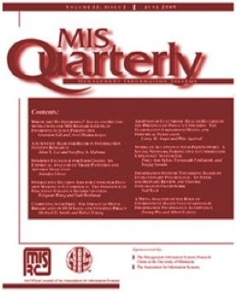

<!-- AJS-ROOT-JOURNAL-ENTRY -->
# MIS Quarterly

> Publishes research on the development, use, and management of information systems and information technology in organizations and society.

| At a glance | |
|---|---|
| **Field** | Information systems |
| **Publisher** | MIS Research Center, University of Minnesota |
| **Founded** | 1977 |
| **ISSN** | 0276-7783 (print) · 2162-9730 (online) |
| **Frequency** | Quarterly |
| **Standing** | FT50 · UTD24 |
| **Official** | [misq.umn.edu](https://misq.umn.edu/) |
| **Checked** | 2026-06-17 |

**▶ Use the skill — [`mis-quarterly`](../English-SocialScience-Journal-Skills/skills/mis-quarterly/):** venue fit, framing, the method-and-evidence bar, house style, and desk-reject heuristics.

Part of the **[English Social-Science Journal Skills](../English-SocialScience-Journal-Skills/)** bundle. Always re-check the live author guidelines on the official site before submitting.

---

<!-- Machine-readable canonical pointer — do not remove or alter (validated by tools/audit_repo.py). -->

- Canonical skill: [English-SocialScience-Journal-Skills/skills/mis-quarterly/](../English-SocialScience-Journal-Skills/skills/mis-quarterly/)
- Skill name: `mis-quarterly`
- Bundle: [English-SocialScience-Journal-Skills/](../English-SocialScience-Journal-Skills/)

This folder intentionally does not contain a `SKILL.md`; the installable skill stays inside the bundle so plugin paths and skill counts remain stable.
