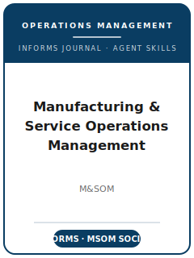

# Manufacturing & Service Operations Management (M&SOM) 技能包

<p align="center">
  
</p>

[](LICENSE)
[](https://pubsonline.informs.org/journal/msom)
[](https://msomsociety.org/)
[](https://github.com/anthropics/claude-code)

[English](README.md) | 简体中文

面向 **Manufacturing & Service Operations Management（M&SOM）** 投稿的 Agent 技能栈 —— 这是运营管理（Operations Management）领域的旗舰期刊，由 **INFORMS** 出版，并由 **MSOM Society**（运营管理学会）主办。

本仓库立场鲜明：它**不是**通用的"运筹/学术写作工具箱"，而是**针对 M&SOM 的专用技能栈**，围绕 M&SOM 的核心门槛构建：**运营决策或运营问题必须是论文贡献的核心**，并以顶尖严谨度完成 —— 无论采用**解析/随机建模**（优化、排队论、随机模型、博弈论、收益管理）还是**严谨的实证运营管理 / 数据驱动分析**。技能覆盖：以运营为核心的选题、模型与机制构建、文献定位、方法与识别、分析与可复现性、贡献提炼、INFORMS 体例的图表与文风、由作者自选 Department Editor 路由的 ScholarOne 投稿、双盲评审流程，以及 R&R 答复。

> 仅保留相对持久的规范。主编、Department 编辑名单、投稿系统付款提示与特殊通道日期都会变化；真正投稿前请检查官方 M&SOM 投稿指南页、编委会页与 INFORMS 体例文件。

---

## 为什么需要单独的 M&SOM 技能栈？

M&SOM 的约束与纯理论管理期刊或通用运筹期刊有本质差异：

| 约束维度        | Manufacturing & Service Operations Management              | 含义                                                       |
|-----------------|------------------------------------------------------------|------------------------------------------------------------|
| 学科            | 运营管理（制造业与服务业）                                 | 运营决策必须是核心，而非背景板                             |
| 核心门槛        | 运营核心性 + 顶尖执行力                                     | 强分析/金融/营销论文若运营核心不足会被桌拒                 |
| 方法论          | 解析/随机建模**与**实证运营管理                            | 方法必须产出可操作的运营洞见                               |
| 路由            | 作者自选 **Department** + 两位优先 Department Editor       | "契合"意味着匹配正确的 Department，而非通用编辑池          |
| 评审            | **双盲**；DE → AE → 审稿人                                  | 严格匿名；DE/AE 的优先级主导                               |
| 篇幅            | **32 页排版上限**，含参考文献/表/图/附录                   | 在官方模板上机械执行；图表占用页数预算                     |
| 在线补充        | **≤ 16 页** 在线补充材料                                    | 证明与额外数值实验放这里                                   |
| 摘要            | **结构化、≤ 300 词**，三个必填小节                          | "管理含义"是必填章节，而非可选包装                         |
| 体例            | INFORMS author-year（体例文件 v1.6）                       | 不是 APA；参考文献排序规则特定                             |
| 可复现          | INFORMS 数据/代码披露；授权数据需提供访问/链接说明         | 须准备共享/保留数据；授权数据须随附代码                    |

通用的"科学写作"或"运筹方法"技能包无法覆盖这些约束。

---

## 快速开始

### 方式 A —— Claude Code 插件（推荐）

```bash
/plugin marketplace add https://github.com/brycewang-stanford/msom-skills
/plugin install msom-skills
/reload-plugins
```

### 方式 B —— 手动复制

```bash
git clone https://github.com/brycewang-stanford/msom-skills.git
cd msom-skills

mkdir -p ~/.claude/skills && cp -R skills/msom-* ~/.claude/skills/
# 或
mkdir -p ~/.codex/skills && cp -R skills/msom-* ~/.codex/skills/
```

### 第一条提示词

```
用 msom-workflow 告诉我：针对我的 M&SOM 稿件，下一步该用哪个技能。
```

---

## 默认工作流

```text
msom-topic-selection
        ▼
msom-theory-development
        ▼
msom-literature-positioning
        ▼
msom-methods
        ▼
msom-data-analysis
        ▼
msom-contribution-framing
        ▼
msom-tables-figures
        ▼
msom-writing-style        （润色）
        ▼
msom-submission
        ▼
msom-review-process
        ▼
msom-rebuttal
```

`msom-workflow` 是路由器 —— 根据你所处的阶段，告诉你下一步该用哪个技能。

---

## 技能清单

| 技能                          | 用途                                                                   |
|-------------------------------|------------------------------------------------------------------------|
| `msom-workflow`               | 路由器 —— 决定下一步调用哪个子技能                                      |
| `msom-topic-selection`        | 运营核心性门槛 + 解析/实证赛道选择 + Department 契合                    |
| `msom-theory-development`     | 解析模型 / 运营机制；结构性结果                                         |
| `msom-literature-positioning` | 接入运营管理学术对话；路由到正确的 Department                           |
| `msom-methods`                | 让求解/识别方法匹配运营决策                                            |
| `msom-data-analysis`          | 证明 + 数值实验；可识别效应；INFORMS 可复现政策                         |
| `msom-contribution-framing`   | 明确的运营洞见 + M&SOM 结构化摘要                                      |
| `msom-tables-figures`         | 在页数上限内以 INFORMS 体例呈现策略/敏感性与结果图表                    |
| `msom-writing-style`          | 先抛洞见；控制符号；INFORMS author-year；32 页上限                      |
| `msom-submission`             | ScholarOne 投稿前检查：匿名、模板、Department 路由、数据/代码           |
| `msom-review-process`         | 六 Department 路由、双盲评审、特殊通道                                  |
| `msom-rebuttal`               | 围绕 DE/AE 优先级的 R&R 修改 + 逐条答复                                 |

### 资源

- [`skills/msom-submission/templates/manuscript_template.md`](skills/msom-submission/templates/manuscript_template.md) —— M&SOM 稿件骨架
- [`skills/msom-submission/templates/checklist.md`](skills/msom-submission/templates/checklist.md) —— 投稿前自查清单
- [`resources/external_tools.md`](resources/external_tools.md) —— 运营建模/求解器工具（Gurobi / CPLEX / MOSEK / AMPL / Pyomo / JuMP）、仿真（AnyLogic / SimPy），以及实证运营管理（Stata / R / Python 因果推断）
- [`resources/official-source-map.md`](resources/official-source-map.md) —— 每条事实背后的官方 INFORMS/M&SOM 链接（访问于 2026-06-20）

---

## M&SOM 的独特规范

- **运营核心性门槛** —— 运营决策/问题必须是首要贡献；否则即便分析/营销/金融功底再强也会被桌拒。
- **作者自选六大 Department** —— Manufacturing & Supply Chain Operations；Services, Platforms & Revenue Management；Environment, Health & Society；Operational Innovation；Analytics in OM；以及 **Practice Platform**。须提名两位优先 Department Editor（其中 Manufacturing-and-Supply-Chain 有第一/第二选择规则）。
- **实践与观点通道** —— 专设 Practice Platform，外加 **OM Forum** 署名栏目，把田野驱动与思想引领类运营研究制度化。
- **32 页排版硬上限**（含一切），另加独立的 **16 页** 在线补充 —— 比叙述式词数限制的期刊更严、更机械。
- **强制结构化摘要**（Problem definition / Methodology-results / Managerial implications），≤ 300 词、无术语堆砌。
- **学会与会议耦合** —— 由 MSOM Society 主办、与 MSOM Conference 紧密绑定，并有 **OM Grand Challenges（2026）** 从会议直通期刊专刊的快速通道。

---

## 与 Management Science / Operations Research / POM 的差异

| 维度               | M&SOM                                  | Management Science          | Operations Research            | POM（POMS）                  |
|--------------------|----------------------------------------|-----------------------------|--------------------------------|------------------------------|
| 核心贡献           | 运营决策必须是**核心**                 | 广义运筹/管理               | 方法/模型本身可作为贡献        | 运营管理，范围广             |
| 方法               | 解析**与**实证运营管理                 | 多元，含运营 Department     | 运筹方法学                     | 解析与实证运营管理           |
| 出版方/学会        | INFORMS / MSOM Society                  | INFORMS                     | INFORMS                        | POMS / Wiley                 |
| 常规投稿费         | M&SOM 作者指南未列出；以 ScholarOne 付款页为准 | $79（2025 年 8 月起）       | INFORMS                        | 按期刊变化                   |

如果运营决策不是论文的中心，M&SOM 就不是合适的投稿期刊。

---

## 相关项目

- [awesome-journal-skills](https://github.com/brycewang-stanford/awesome-journal-skills) —— 各期刊专用技能包索引

---

## 许可证

MIT
