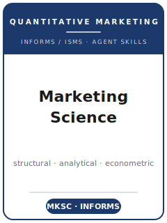

# 《营销科学》(Marketing Science) Skills

<p align="center">
  
</p>

[](LICENSE)
[](https://pubsonline.informs.org/journal/mksc)
[](https://pubsonline.informs.org/journal/mksc)
[](https://github.com/anthropics/claude-code)

[English](README.md) | 简体中文

面向 **《营销科学》(Marketing Science)** 投稿的 Agent 技能栈 —— 它是 **INFORMS 营销科学学会 (ISMS)** 的旗舰*量化营销*期刊，由 INFORMS（运筹学与管理科学学会）出版。

本仓库是有立场的。它**不是**通用的"营销写作"工具箱，**也不是**消费者行为（JCR 风格）实验技能包，而是围绕《营销科学》核心标准打造的 **本刊专用**技能栈：**用数学建模回答一个重要的营销问题**。本刊最主流的发表体裁是**结构计量模型**与**分析型（博弈论）模型**；计量、统计、机器学习、问卷与实验，只有在与正式模型严密结合时才受欢迎。覆盖范围包括以建模为驱动的选题、模型与识别的构建、文献定位、结构/分析型方法、估计与反事实分析、贡献提炼、符合 INFORMS 体例的图表与文风、ScholarOne 投稿、双盲评审流程，以及多轮 R&R 答复。

> 仅描述持久规范。主编、版面费、确切字数限制及各项政策会变化 —— 请务必以《营销科学》官方投稿页面、Replication and Disclosure Policy 以及 INFORMS 作者门户为准。

---

## 为什么需要单独的《营销科学》技能栈？

相比以行为为先的营销期刊（如 JCR）和档案型会计/金融期刊，《营销科学》的约束有本质差异：

| 约束维度       | 《营销科学》(Marketing Science)                                | 含义                                                        |
|----------------|----------------------------------------------------------------|-------------------------------------------------------------|
| 学科           | 量化营销（INFORMS / ISMS），并非营销协会型期刊                  | 运筹/分析血统；正式模型的严谨性是底线                         |
| 核心标准       | **用数学建模**回答一个重要的营销问题                            | 纯概念或量表验证类文章不契合                                  |
| 主流体裁       | 结构计量；分析型/博弈论模型                                      | 即便是实证/行为研究也须与正式模型挂钩                         |
| 识别           | 供需结构、均衡、工具变量、排他性逻辑                            | "只有简约式相关、没有模型"会被视为不对口                      |
| 分析           | GMM/MLE/SMM 估计、反事实、比较静态                              | 没有模型或政策实验的回归表显得单薄                            |
| 评审           | **双盲**；常规投稿须严格匿名化                                  | 经济学期刊的单盲习惯在此不适用                                |
| 透明度         | 录用后**强制提交数据 + 估计代码**                               | 从第一天起就准备可复现代码                                    |
| 体例           | INFORMS 体例；作者–年份引用；LaTeX/Word；正文力求简洁          | 具体限制请核实；Frontiers 严格限 6,000 词                     |
| 流程           | ScholarOne；Senior Editor / Associate Editor 路由；多轮 R&R    | 首轮直接录用几乎闻所未闻                                      |

通用的"科研写作"、消费者行为或"社科方法"技能包无法覆盖这些约束。

---

## 快速开始

### 方式 A —— Claude Code 插件（推荐）

```bash
/plugin marketplace add https://github.com/brycewang-stanford/mksc-skills
/plugin install mksc-skills
/reload-plugins
```

### 方式 B —— 手动复制

```bash
git clone https://github.com/brycewang-stanford/mksc-skills.git
cd mksc-skills

mkdir -p ~/.claude/skills && cp -R skills/mksc-* ~/.claude/skills/
# 或
mkdir -p ~/.codex/skills && cp -R skills/mksc-* ~/.codex/skills/
```

### 第一条指令

```
用 mksc-workflow 告诉我，我这篇 Marketing Science 稿子下一步该用哪个 skill。
```

---

## 默认工作流

```text
mksc-topic-selection（选题）
        ▼
mksc-theory-development（模型 + 识别）
        ▼
mksc-literature-positioning（文献定位）
        ▼
mksc-methods（结构/分析型方法）
        ▼
mksc-data-analysis（估计 + 反事实）
        ▼
mksc-contribution-framing（贡献提炼）
        ▼
mksc-tables-figures（图表）
        ▼
mksc-writing-style（文风打磨）
        ▼
mksc-submission（投稿前自检）
        ▼
mksc-review-process（理解评审流程）
        ▼
mksc-rebuttal（R&R 答复）
```

`mksc-workflow` 是路由器 —— 它根据你当前所处的阶段告诉你下一步该用哪个 skill。

---

## 技能列表

| Skill                        | 用途                                                                       |
|------------------------------|----------------------------------------------------------------------------|
| `mksc-workflow`              | 路由器 —— 决定下一步调用哪个子技能                                          |
| `mksc-topic-selection`       | 建模驱动的选题 + 本刊契合度判断（对比 JCR/JMR/Management Science）          |
| `mksc-theory-development`    | 构建分析型/结构模型；识别与均衡逻辑                                          |
| `mksc-literature-positioning`| 加入建模型学术对话；相对结构/分析型先例进行定位                              |
| `mksc-methods`               | 选择结构 vs. 分析型 vs. 因果机器学习；明确可估计的模型                        |
| `mksc-data-analysis`         | 估计（GMM/MLE/SMM/贝叶斯）、模型拟合、反事实、稳健性                          |
| `mksc-contribution-framing`  | 明确的实质性 + 方法/建模贡献陈述                                            |
| `mksc-tables-figures`        | 估计、拟合、比较静态、反事实图表，符合 INFORMS 体例                          |
| `mksc-writing-style`         | 模型直觉前置、INFORMS 作者–年份体例、简洁文风                                |
| `mksc-submission`            | ScholarOne 投稿前自检；匿名化、格式、复现包、track 选择                      |
| `mksc-review-process`        | 双盲 SE/AE 评审与决定如何运作；如何读懂决定信                                |
| `mksc-rebuttal`              | 多轮 R&R 修改与逐条答复信                                                    |

### 资源

- [`resources/external_tools.md`](resources/external_tools.md) —— 量化营销数据源（NielsenIQ/Kilts、Circana/IRI、扫描与点击流、Compustat/CRSP）与建模/估计软件（pyBLP、MATLAB/Julia、Stan/PyMC、Gurobi、econml）
- [`resources/official-source-map.md`](resources/official-source-map.md) —— 每条本刊事实对应的 INFORMS 官方 URL（访问于 2026-06-01）；未核实项标注 待核实

---

## 与 JCR / JMR / Management Science 的差异

| 维度       | Marketing Science                  | JCR                  | JMR                          | Management Science              |
|------------|-------------------------------------|----------------------|------------------------------|---------------------------------|
| 核心贡献   | **用数学建模**回答营销问题          | 消费者行为理论        | 较宽（建模+行为+方法）        | 运筹/管理科学，多领域           |
| 标志方法   | 结构计量；分析型/博弈论              | 实验室/田野实验       | 混合（建模与实验）            | 优化、随机模型、计量            |
| 编辑结构   | Senior Editor + Associate Editor    | 领域/副主编           | 领域主编                      | 常设**部门型 Area Editor**       |
| 出版方     | INFORMS / ISMS                      | 牛津大学出版社 / ACR  | 美国营销协会                  | INFORMS                         |
| 最契合     | 以建模为核心的定价/广告/渠道/分析    | 概念性消费者心理学    | 量化或行为营销                | 一般管理科学建模                |

如果你的贡献是没有正式模型的消费者心理学实验，应投 JCR；如果是一般管理科学，应投 Management Science。

---

## 《营销科学》的独特规范

- **建模核心 + 方法多元** —— 实证或行为类贡献必须与数学/量化模型挂钩；结构与分析型工作占主导。
- **Frontiers in Marketing Science** —— 更短、类 *Science*、评审更快的 track，全文严格限 **6,000 词**（含全部内容），奖励在某一主维度上的重大贡献。
- **强制复现存档** —— 录用后须提交数据与估计代码，遵循本刊领先全领域的 Replication and Disclosure Policy。
- **双盲评审** —— 常规投稿须严格匿名化；仅 Practice/Science-to-Practice track 为单盲。
- **专门 track** —— Database 论文、Practice Papers/Practice Prize（含 500–1,000 词 Impact Statement）、Science-to-Practice —— 体现 INFORMS 的分析/实践取向。

---

## 相关链接

- [awesome-journal-skills](https://github.com/brycewang-stanford/awesome-journal-skills) —— 期刊专用技能包索引

---

## 许可证

MIT
