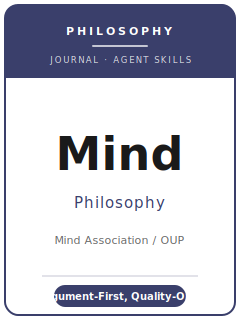

# Mind Skills

<p align="center">
  
</p>

[](LICENSE)
[](https://academic.oup.com/mind)
[](https://academic.oup.com/mind/pages/About)
[](https://github.com/anthropics/claude-code)

English | [简体中文](README.zh-CN.md)

Agent skill stack for articles targeted at **Mind** — a **leading journal in analytic philosophy**,
founded in **1876** and published by **Oxford University Press** on behalf of the **Mind Association**.
Mind takes **quality as the sole criterion of publication**, with **no area, no style, and no school of
philosophy excluded** — and is best known for cutting-edge work in **epistemology, metaphysics,
philosophy of language, philosophy of logic, and philosophy of mind**, while also welcoming ethics,
the history of philosophy, continental work, and interdisciplinary inquiry.

This repository is opinionated. It is **not** a generic humanities-writing toolbox and it is
**emphatically not** a social-science pack repurposed for philosophy. **There is no data here** — no
statistics, no datasets, no archives in the empirical sense. A Mind paper is a **work of argument**: a
**sharp thesis**, a **valid and sound argument** for it, the **strongest objection anticipated and
answered**, **conceptual precision**, **parsimony**, and prose accessible to a broad philosophical
readership. This stack exists to make that argument as good as it can be.

---

## What Is Mind, and Why a Dedicated Stack?

Mind's constraints differ from an empirical journal or a generic writing guide:

| Constraint            | Mind                                                                          | Implication                                                       |
|-----------------------|-------------------------------------------------------------------------------|------------------------------------------------------------------|
| Discipline            | **Analytic philosophy** (all areas, all schools)                              | The piece is judged as an argument, not a data analysis          |
| Premium on            | **A significant thesis + a sound argument**                                   | A survey or a bare intuition is not yet a paper                  |
| Sole criterion        | **Quality** — no area, style, or school excluded                              | Topic fashion does not help; the argument must be excellent      |
| Publisher / owner      | **Oxford University Press** / **Mind Association**                            | Submitted via **ScholarOne**, not Editorial Manager / OUP-other  |
| Review model          | **Triple-anonymous**                                                          | Editors *and* referees are blind; prepare for anonymous review   |
| Preparation gate      | Papers **not prepared for anonymous refereeing will not be read**             | Strip self-identifying references and acknowledgements           |
| Length                | Articles **~8,000 words total**; abstract **50–200 words** (published)        | One clean thesis beats three half-defended ones                  |
| Submission limit      | **One article per corresponding author per 12 months**                        | Choose your strongest paper                                      |
| Review-copy format    | **Line numbering required**; Word or PDF + high-res images                    | Add line numbers (LaTeX `lineno` / Word) before upload           |
| Style                 | **MIND house style** (MIND Stylesheet), applied at acceptance                 | A generic Chicago/APA export is not the house style              |
| Fee                   | **No submission fee** stated; optional OA charge after acceptance             | Do not budget a submission fee                                   |

Volatile specifics (editors and term, exact caps, OA charges, house-style details, accepted content
types) change — items not directly confirmed are marked **待核实** in
[`resources/official-source-map.md`](resources/official-source-map.md). **Verify on the official
journal page.**

### Content types Mind publishes

- **Articles** — original, free-standing arguments, **~8,000 words**; the main format.
- **Discussions** — short, sharply targeted responses to a specific published paper.
- **Book reviews** — evaluative summaries of recent books in the discipline.
- **Critical notices** — longer engagements with a book that develop the author's **own** ideas.

---

## Quick Start

### Option A — Claude Code Plugin (recommended)

```bash
/plugin marketplace add https://github.com/brycewang-stanford/mind-skills
/plugin install mind-skills
/reload-plugins
```

### Option B — Manual Copy

```bash
git clone https://github.com/brycewang-stanford/mind-skills.git
cd mind-skills

mkdir -p ~/.claude/skills && cp -R skills/mind-* ~/.claude/skills/
# or
mkdir -p ~/.codex/skills && cp -R skills/mind-* ~/.codex/skills/
```

### First Prompt

```
Use mind-workflow to tell me which skill I should use next for my Mind article.
```

---

## Default Workflow

```text
mind-topic-selection
        ▼
mind-literature-positioning
        ▼
mind-thesis-and-argument
        ▼
mind-objections-and-replies
        ▼
mind-conceptual-analysis-and-method
        ▼
mind-structure-and-exposition
        ▼
mind-writing-style          (polish)
        ▼
mind-citation-and-style
        ▼
mind-review-process
        ▼
mind-submission
        ▼
mind-revision-and-response
```

`mind-workflow` is the router — it tells you which skill to use next based on where you are. Most
papers **loop thesis ↔ objections ↔ conceptual analysis** several times before exposition: at Mind,
answering the strongest objection is much of the contribution, so expect to revisit the argument.

---

## Skills

| Skill                                  | Purpose                                                                       |
|----------------------------------------|-------------------------------------------------------------------------------|
| `mind-workflow`                        | Router — decides which sub-skill to invoke next                               |
| `mind-topic-selection`                 | Is there a sharp, significant, defensible thesis? Pick the content type       |
| `mind-literature-positioning`          | Enter a live debate; engage the strongest version of the target view          |
| `mind-thesis-and-argument`             | State the thesis; build a valid, sound argument (premises → conclusion)        |
| `mind-objections-and-replies`          | Anticipate the strongest objection; rebut, concede-and-limit, or bite it      |
| `mind-conceptual-analysis-and-method`  | Precise concepts, distinctions, thought experiments, parsimony, method         |
| `mind-structure-and-exposition`        | Architect the paper so the argument unfolds clearly within ~8,000 words        |
| `mind-writing-style`                   | Clear prose for a broad readership; gloss technical material informally        |
| `mind-citation-and-style`              | MIND house style / Stylesheet; line numbering; anonymized references           |
| `mind-review-process`                  | Triple-anonymous review, quality-only criterion, expert referees, expectations |
| `mind-submission`                      | ScholarOne preflight (anonymization, word/abstract caps, line numbers, rules)  |
| `mind-revision-and-response`           | Answer expert referee objections without diluting the thesis                   |

### Resources

- [`resources/external_tools.md`](resources/external_tools.md) — philosophy reference works (SEP / IEP / PhilPapers / JSTOR), logic and argument-mapping tools, LaTeX `lineno`, the MIND Stylesheet
- [`resources/official-source-map.md`](resources/official-source-map.md) — official OUP / Mind URLs behind every fact, with 待核实 markers on unverified items

---

## What This Repo Does Not Do

- It does not write a submittable article — let alone the philosophy — for you
- It does not simulate any specific editor's or referee's taste
- It does not treat philosophy as empirical: there is **no data, no statistics, no archives** here
- It does not assert volatile metadata (current editors and term, exact caps, OA charges, house-style details) — verify on the official page; unverified items are marked 待核实
- It does not decide whether your thesis is significant or your argument sound — that is the philosopher's work

---

## Related

- [awesome-journal-skills](https://github.com/brycewang-stanford/awesome-journal-skills) — Index of journal-specific skill packs
- [Mind on Oxford Academic](https://academic.oup.com/mind) — publisher home, issues, advance articles
- [Mind General Instructions](https://academic.oup.com/mind/pages/General_Instructions) — author guidance, submission, house style
- [Why submit to Mind](https://academic.oup.com/mind/pages/why-submit) — triple-anonymous review, quality-only criterion

---

## License

MIT
