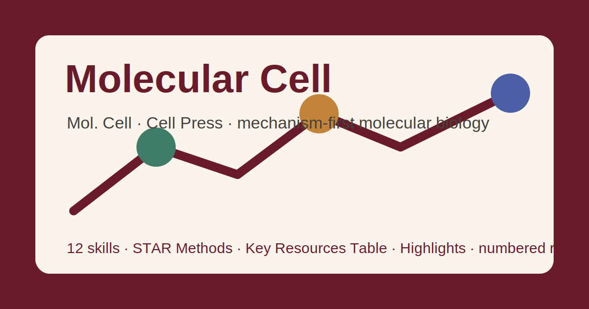

# Molecular Cell Skills

<p align="center">
  
</p>

[](LICENSE)
[-6a1b2a)](https://www.cell.com/molecular-cell/home)
[](https://www.cell.com/molecular-cell/home)
[](https://github.com/anthropics/claude-code)

[English](README.md) | 简体中文

面向 **Molecular Cell（Mol. Cell，Cell Press）** 投稿的 Agent Skill 工具栈——机制性分子生物学旗舰刊。

本仓库刻意**不通用**。它不是泛化的"科研写作助手"，而是把 Molecular Cell 的编辑底线——**一个深入的分子机制，由多种正交方法证明，并具有生理相关性**——以及由此衍生的具体规范沉淀成一套方法论：约 7,000 词 / 约 7 个图表预算内的单一机制 Article（或约 4,000 词的 Short Article）、含**关键资源表（Key Resources Table）** 与 **Resource Availability** 的 **STAR Methods**、数据/结构/代码存档（GEO/PDB/EMDB/PRIDE）、标志性的 Cell Press **Highlights / eTOC 短文 / 图文摘要（Graphical Abstract）** 三件套、Summary，以及——最具区别性的——当前 Cell Press 的**数字上标引用体例**。

---

## 为什么要为 Molecular Cell 单独做一套 Skills？

Molecular Cell 奖励的东西与 *Cell* 或宽口径领域刊都不同——**机制深度重于广度**，其规范也随之不同：

| 维度        | Molecular Cell 要求                                        | 隐含含义                                       |
|-----------|---------------------------------------------------------|--------------------------------------------|
| 编辑底线     | **深入的分子机制** + 正交验证                                | 描述性/相关性或单一技术稿件**多数不送审、直接拒稿**    |
| 深度 vs 广度 | 机制细到残基/碱基/步骤，且有生理支撑                          | 广而浅归 *Cell*；深而窄归 Mol. Cell             |
| 文章结构     | Summary · 引言 · Results · Discussion · **STAR Methods**  | 自由文本 Methods 段不合体例                      |
| 篇幅预算     | Article 约 **7,000 词** / 约 **7** 个图表；Short Article 约 **4,000** | 求全不被奖励——收敛到机制                       |
| 方法        | **STAR Methods** + 关键资源表 + Resource Availability     | 每个抗体、质粒、寡核苷酸、纯化蛋白都要来源 + 标识符     |
| 数据与结构   | 须存档并给登录号/DOI；结构须含图/结构因子                      | 主数据"按需提供"不被接受                          |
| 参考文献     | **Cell Press 数字制**（上标，按出现顺序）、全作者列出           | 著者-年份稿件必须**重新编号**                     |
| 标志件      | **Highlights**、**eTOC 短文**、**图文摘要**                | 缺失或薄弱会在各编辑环节吃亏                       |
| 过度解读     | 拒稿首要原因之一；审稿人要求机制"闭环"                         | 结论（及结构）不得超出证据                         |

通用的"科研写作"Skill 包不会编码这些"按刊定制"的约束。

---

## 快速开始

### 方式 A — Claude Code 插件（推荐）

```bash
/plugin marketplace add https://github.com/brycewang-stanford/awesome-journal-skills
/plugin install molcell-skills
/reload-plugins
```

### 方式 B — 手动复制

```bash
git clone https://github.com/brycewang-stanford/awesome-journal-skills.git
cd awesome-journal-skills/Molecular-Cell-Skills

mkdir -p ~/.claude/skills && cp -R skills/molcell-* ~/.claude/skills/
# 或
mkdir -p ~/.codex/skills && cp -R skills/molcell-* ~/.codex/skills/
```

### 第一条提示词

```
用 molcell-workflow 告诉我，针对 Molecular Cell 的稿子，下一步该用哪个 skill。
```

---

## 默认工作流

```text
molcell-fit            （先过"深机制 + 正交验证"这一关）
        ▼
molcell-framing        （锁定单一机制主线：问题 → 机制 → 生理意义）
        ▼
molcell-writing        （Article 结构；约 7,000 词预算；用 STAR Methods 而非自由文本）
        ▼
molcell-figures        （图件控制在约 7 个内；展示原始数据；印迹/结构/基因组学规范）
        ▼
molcell-star-methods   （关键资源表 + Resource Availability + QSA）
        ▼
molcell-data           （GEO/PDB/EMDB/PRIDE 存档 + 可得性声明）
        ▼
molcell-summary        （约 150 词 Summary——润色）
        ▼
molcell-highlights     （Highlights + eTOC 短文 + 图文摘要——润色）
        ▼
molcell-citation       （Cell Press 数字制引用——润色）
        ▼
molcell-submission     （投稿信 + 投稿前自检）
        ▼
molcell-rebuttal       （送审之后）
```

`molcell-workflow` 是路由器——根据你所处阶段告诉你下一个该用哪个 skill。

---

## Skills 一览

| Skill                  | 作用                                                          |
|------------------------|-------------------------------------------------------------|
| `molcell-workflow`     | 路由器——决定下一步调用哪个子 skill                             |
| `molcell-fit`          | 初筛过滤：深机制 + 正交验证判定；Cell Press 选刊路由              |
| `molcell-framing`      | 锁定单一机制主线、陈述式标题                                    |
| `molcell-writing`      | Article 结构；约 7,000 词 / 约 7 图表预算；STAR Methods 位置      |
| `molcell-figures`      | 栏宽尺寸（85/114/174 mm）、展示原始数据、印迹/结构/基因组学规范     |
| `molcell-star-methods` | 关键资源表 + Resource Availability（三小节）+ QSA               |
| `molcell-data`         | 存档（GEO/PDB/EMDB/PRIDE/Mendeley Data）、登录号、可得性声明       |
| `molcell-summary`      | 约 150 词非结构化 Summary，点明分子机制、量化                    |
| `molcell-highlights`   | Highlights（≤85 字符）、eTOC 短文（~50 词）、图文摘要             |
| `molcell-citation`     | Cell Press **数字**上标引用、按出现顺序、全作者列出               |
| `molcell-submission`   | 完整投稿前自检清单 + 稿件/投稿信模板                             |
| `molcell-rebuttal`     | 决议分诊、实验优先级、逐条回复                                   |

### 资源

- [`skills/molcell-submission/templates/checklist.md`](skills/molcell-submission/templates/checklist.md) — 完整投稿前自检清单
- [`skills/molcell-submission/templates/manuscript_template.md`](skills/molcell-submission/templates/manuscript_template.md) — Molecular Cell 稿件骨架（STAR Methods、KRT、eTOC 短文、Highlights、投稿信脚手架）
- [`resources/external_tools.md`](resources/external_tools.md) — 数据存档仓库、STAR Methods/RRID 标准、分子生物学工具栈、Cell Press 作者页面
- [`resources/official-source-map.md`](resources/official-source-map.md) — 官方 URL + 已核实期刊事实（核查于 2026-07-16）
- [`resources/exemplars/library.md`](resources/exemplars/library.md) — 方法 × 主题定位与姊妹刊混淆护栏
- [`resources/worked-examples/01-introduction.md`](resources/worked-examples/01-introduction.md) — 带批注的 Summary + 机制式开场

---

## 与 Cell / Nature / Cell Press 姊妹刊的差异

| 维度      | Molecular Cell                    | Cell                          | Nature / Science                  |
|---------|-----------------------------------|-------------------------------|-----------------------------------|
| 门槛      | **深入分子机制** + 正交验证          | 完整、宽广、有机制的故事          | 顶尖广泛意义                        |
| 深度 vs 广度 | 深度优先；限定领域                | 广度 + 深度                     | 广度优先                           |
| 摘要      | **Summary**，~150 词、非结构化       | Summary，≤150 词               | Science ≤125 词 + 一句话总结        |
| 方法      | **STAR Methods** + 关键资源表        | STAR Methods + 关键资源表        | Methods 段 / 补充材料               |
| 参考文献   | **Cell Press 数字制**（上标）        | Cell Press 数字制               | Science：按出现顺序编号              |
| 何时切换    | —                                 | 宽广跨领域的完整故事              | 想要最广读者时                      |

> 注意：Molecular Cell（与其他 Cell Press 刊一样）现采用**数字**上标引用体例。旗舰刊见姊妹包 [Cell-Skills](https://github.com/brycewang-stanford/awesome-journal-skills/tree/main/Cell-Skills)；分子肿瘤学见 [Cancer-Cell-Skills](https://github.com/brycewang-stanford/awesome-journal-skills/tree/main/Cancer-Cell-Skills)。

---

## 相关

- [awesome-journal-skills](https://github.com/brycewang-stanford/awesome-journal-skills) — 期刊定制 skill 包索引
- [Cell-Skills](https://github.com/brycewang-stanford/awesome-journal-skills/tree/main/Cell-Skills) · [Science-Skills](https://github.com/brycewang-stanford/awesome-journal-skills/tree/main/Science-Skills) · [PNAS-Skills](https://github.com/brycewang-stanford/awesome-journal-skills/tree/main/PNAS-Skills)

---

## 免责声明

本包为独立、社区构建的 skill 包，**与 Cell Press / Elsevier / Molecular Cell 无任何隶属、背书或合作关系**。所有指标（字数、字符上限、图件上限、体例规则）均依据写作时公开的作者指南——**投稿前请务必以最新的 [Molecular Cell 作者指南](https://www.cell.com/molecular-cell/information-for-authors) 与 [STAR Methods 指南](https://www.cell.com/star-methods) 为准**。

---

## 许可证

MIT
