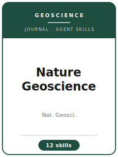

# Nature Geoscience Skills

<p align="center">
  
</p>

[](LICENSE)
[](https://www.nature.com/ngeo/)
[](https://www.nature.com/)
[](https://github.com/anthropics/claude-code)

[English](README.md) | 简体中文

面向 **Nature Geoscience（Nat. Geosci.，《自然·地球科学》）** 投稿的智能体技能栈——Nature Portfolio 旗下的地球科学旗舰期刊，发表覆盖**固体地球、大气、海洋、冰冻圈、气候与行星科学**的广泛兴趣型研究。

本仓库是高度定制化的。它**不是**通用的地球科学写作工具箱，而是围绕 Nature Geoscience 的核心约束构建的**专用**技能栈：成果必须是**广泛的、跨学科的地球系统进展**，建立在**带有量化不确定度的定量证据**之上，以**非专业读者也能理解**的方式在严格的 Nature 论文体量内表达，可复现的细节下放到在线 **Methods** 与 **Supplementary Information（补充信息）**。

---

## 为什么需要独立的 Nature Geoscience 技能栈？

Nature Geoscience 的约束与地球科学社区期刊（JGR、GRL、Climate Dynamics）乃至其姊妹刊 *Communications Earth & Environment* 有本质区别：

| 约束               | Nature Geoscience                                        | 含义                                                       |
|--------------------|----------------------------------------------------------|------------------------------------------------------------|
| 准入门槛            | 广泛的地球系统进展**且**跨学科兴趣                       | 严谨但区域性/增量性的结果会因"兴趣不足"被拒                |
| 初筛               | 内部编辑在**送审前**拒掉大多数投稿                        | 投稿信中的"广度论证"至关重要；**无预投稿咨询通道**          |
| 读者群             | 全体地球科学家，而非仅你的子领域                          | 稿件会被编辑改写，以对非专业读者可读                        |
| 证据门槛            | 定量数据/经数据验证的模型，且带不确定度                   | 纯模型或缺失不确定度的结果会被直接拒稿                      |
| 篇幅               | Article 约 3,000 词；摘要约 200 词（请核实）             | 需无情地把内容分配到在线 Methods 与补充信息                 |
| 图表数量            | 4–6 个图/表（请核实）                                     | 图 1 必须一眼呈现进展及其不确定度                          |
| 结构               | 独立的在线 **Methods**；摘要用 **"Here we show"**         | 可复现的方法细节不计入正文词数                              |
| 合规               | Reporting Summary + 数据可得性 + 代码可得性               | 这些决定**能否被接收**，而不仅是能否投稿                    |
| 评审               | 默认单盲；**可选双盲**                                    | 选择双盲则需匿名化                                          |

通用的"科学写作"技能包无法应对广泛兴趣型的桌面初筛、无预投稿导致的投稿信重担、在线 Methods 的拆分，以及 Reporting Summary 与数据/代码可得性的门槛。

> 易变的具体数值（当前词数/图表/参考文献上限、内容类型、Reporting Summary、投稿系统、APC）会变化——请务必在 Nature Geoscience 官方作者页面核实。

---

## 快速开始

### 方式 A —— Claude Code 插件（推荐）

```bash
/plugin marketplace add https://github.com/brycewang-stanford/ngeo-skills
/plugin install ngeo-skills
/reload-plugins
```

### 方式 B —— 手动复制

```bash
git clone https://github.com/brycewang-stanford/ngeo-skills.git
cd ngeo-skills

mkdir -p ~/.claude/skills && cp -R skills/ngeo-* ~/.claude/skills/
# 或
mkdir -p ~/.codex/skills && cp -R skills/ngeo-* ~/.codex/skills/
```

### 首个提示词

```
用 ngeo-workflow 告诉我，我的 Nature Geoscience 稿件下一步该用哪个技能。
```

---

## 默认工作流

```text
ngeo-scope-fit
        ▼
ngeo-results-framing
        ▼
ngeo-methods
        ▼
ngeo-figures
        ▼
ngeo-supplementary
        ▼
ngeo-writing-style        （润色）
        ▼
ngeo-length-management    （适配论文体量）
        ▼
ngeo-cover-letter
        ▼
ngeo-submission
        ▼
ngeo-referee-strategy
        ▼
ngeo-revision
```

`ngeo-workflow` 是路由器——它根据你当前所处的阶段，告诉你下一步该用哪个技能。

---

## 技能列表

| 技能                      | 用途                                                                     |
|---------------------------|--------------------------------------------------------------------------|
| `ngeo-workflow`           | 路由器——决定下一步调用哪个子技能                                         |
| `ngeo-scope-fit`          | 广泛兴趣的地球系统门槛；Nat. Geosci. 还是社区期刊                        |
| `ngeo-results-framing`    | 单一进展叙事、"Here we show"摘要、结论先行的开篇                        |
| `ngeo-methods`            | 用数据 + 量化不确定度为每个论断托底的在线 Methods                        |
| `ngeo-figures`            | 4–6 个图表；首图承载进展及其不确定度                                     |
| `ngeo-supplementary`      | 把扩展数据下放到补充信息；保持正文独立成立                               |
| `ngeo-writing-style`      | Nature 文风、非专业可读性、与证据匹配的论断                              |
| `ngeo-length-management`  | 适配约 3,000 词 + 4–6 图表 + 约 50 篇参考文献                            |
| `ngeo-cover-letter`       | 向内部编辑论证广泛兴趣（无预投稿通道）                                   |
| `ngeo-submission`         | 投稿前预检 + Reporting Summary、数据/代码可得性、Editorial Manager       |
| `ngeo-referee-strategy`   | 推荐/回避审稿人；预先化解广度与"托底"异议                                |
| `ngeo-revision`           | 逐条回复、再投稿，以及 Nature Portfolio 申诉途径                         |

### 资源

- [`skills/ngeo-submission/templates/manuscript_template.md`](skills/ngeo-submission/templates/manuscript_template.md) —— Article 骨架（"Here we show"摘要、正文、在线 Methods、可得性声明、补充信息、投稿信）
- [`skills/ngeo-submission/templates/checklist.md`](skills/ngeo-submission/templates/checklist.md) —— 10 大类投稿前自检清单
- [`resources/external_tools.md`](resources/external_tools.md) —— 再分析/卫星/代用指标数据、CMIP 输出、数据仓库（PANGAEA/Zenodo）与地理空间软件栈
- [`resources/official-source-map.md`](resources/official-source-map.md) —— 每条事实背后的官方真实网址与核实日期
- [`resources/exemplars/library.md`](resources/exemplars/library.md) —— 按子领域 × 证据类型组织的知名地球系统进展
- [`resources/worked-examples/01-introduction.md`](resources/worked-examples/01-introduction.md) —— 带注解的 Nature Geoscience 摘要 + 开篇改写前后对照

---

## 与地球科学社区期刊的差异

| 维度               | Nature Geoscience                    | JGR / GRL / 社区期刊 + CEE           |
|--------------------|--------------------------------------|--------------------------------------|
| 准入门槛           | 广泛进展 **+ 跨学科兴趣**            | 严谨性 + 子领域相关性               |
| 初筛               | 编辑送审前拒稿                       | 通常所有扎实工作都送审               |
| 读者群             | 全体地球科学家                       | 特定子领域                          |
| 篇幅               | Article 约 3,000 词；严格            | 宽裕；完整存档式处理                |
| 方法               | 独立的在线 Methods                   | 方法写在正文                        |
| 区域性/增量性      | 因兴趣不足被拒                       | 恰当且受欢迎                        |

如果你的结果扎实但偏区域性或增量，`ngeo-scope-fit` 会建议改投社区期刊或 *Communications Earth & Environment*，而不是硬碰广泛兴趣门槛。

---

## 相关链接

- [awesome-journal-skills](https://github.com/brycewang-stanford/awesome-journal-skills) —— 期刊专用技能包索引
- [Nature Geoscience](https://www.nature.com/ngeo/) —— Nature Portfolio 官方期刊页面
- [Nature Portfolio](https://www.nature.com/) —— 出版方

---

## 许可证

MIT
