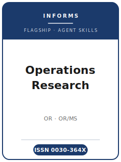

# Operations Research (OR) Skills

<p align="center">
  
</p>

[](LICENSE)
[](https://pubsonline.informs.org/journal/opre)
[](https://www.informs.org/)
[](https://github.com/anthropics/claude-code)

English | [简体中文](README.zh-CN.md)

Agent skill stack for manuscripts targeted at **Operations Research (OR)** — the
flagship methodology journal of **INFORMS** (the Institute for Operations Research and
the Management Sciences).

This repository is opinionated. It is **not** a generic "math writing" or "data
science" toolbox. It is an **Operations Research-specific** stack built around OR's
defining bar: a **mathematically rigorous, original OR/MS methodological contribution**
— optimization, stochastic/probabilistic models, simulation, or decision analysis —
with **provable results** (theorems and proofs) alongside increasingly data-driven and
applied work. It covers OR/MS topic selection and area fit, model formulation and
result development, literature positioning, proof/algorithm methodology, reproducible
computational studies, the mandatory contribution statement, INFORMS house-style
exhibits and the equation-free introduction, INFORMS Author Portal/ScholarOne
submission with area-editor routing, the soft double-anonymous departmental review
process, the ORJournal GitHub code/data reproducibility workflow, and multi-round
revisions.

> Durable norms only. The Editor-in-Chief, area editors, fees, exact page tiers, and
> policies change — always verify on the official OR submission-guidelines page, the
> Code and Data Disclosure Policy, and the ORJournal Instructions for Authors.

---

## Why a Separate Operations Research Skill Stack?

OR imposes constraints that differ materially from empirical management or
capital-markets accounting journals:

| Constraint              | Operations Research                                          | Implication                                                   |
|-------------------------|-------------------------------------------------------------|---------------------------------------------------------------|
| Discipline              | OR/MS methodology (optimization, stochastic, simulation, decision analysis) | Pure-application or thin-method papers are off-fit         |
| Core bar                | Mathematically rigorous, original methodological contribution | Numbers without a method or proof read as a tech report      |
| Results                 | Theorems and proofs; tight bounds, rates, guarantees        | Numerically "shown" regularities are not theorems            |
| Introduction            | **Equation-free** — problem, results, significance in words  | Notation in the intro violates the house rule                 |
| Contribution            | **Mandatory <500-word contribution statement** (cover letter, since 1 Jun 2023) | Cannot be left implicit                                |
| Routing                 | Select one of the journal's named **editorial areas**        | Wrong area forces a re-route                                  |
| Review                  | **Soft double-anonymous** with asymmetric transparency       | You see the Area Editor's name; reviewers never see you       |
| Reproducibility         | **ORJournal GitHub** pull-request code/data review           | "Available on request" does not satisfy the policy            |
| Format                  | Page tiers (20/20/30/~40), 1.5-spaced, 11-pt, author-year    | Substantial, precisely formatted manuscripts                  |

Generic "scientific writing" or "ML methods" packs do not address these constraints.

---

## Quick Start

### Option A — Claude Code Plugin (recommended)

```bash
/plugin marketplace add https://github.com/brycewang-stanford/ors-skills
/plugin install ors-skills
/reload-plugins
```

### Option B — Manual Copy

```bash
git clone https://github.com/brycewang-stanford/ors-skills.git
cd ors-skills

mkdir -p ~/.claude/skills && cp -R skills/ors-* ~/.claude/skills/
# or
mkdir -p ~/.codex/skills && cp -R skills/ors-* ~/.codex/skills/
```

### First Prompt

```
Use ors-workflow to tell me which skill I should use next for my Operations Research manuscript.
```

---

## Default Workflow

```text
ors-topic-selection
        ▼
ors-theory-development
        ▼
ors-literature-positioning
        ▼
ors-methods
        ▼
ors-data-analysis
        ▼
ors-contribution-framing
        ▼
ors-tables-figures
        ▼
ors-writing-style        (polish)
        ▼
ors-submission
        ▼
ors-review-process
        ▼
ors-rebuttal
```

`ors-workflow` is the router — it tells you which skill to use next based on where you are.

---

## Skills

| Skill                        | Purpose                                                                       |
|------------------------------|-------------------------------------------------------------------------------|
| `ors-workflow`               | Router — decides which sub-skill to invoke next                               |
| `ors-topic-selection`        | OR/MS fit test + correct editorial-area routing (vs. MS / M&SOM / IJOC)        |
| `ors-theory-development`     | Model formulation; theorems/propositions at the right strength; assumptions   |
| `ors-literature-positioning` | Technical delta vs. the closest prior work (assumptions, bounds, complexity)  |
| `ors-methods`                | Proof technique, algorithm guarantees, simulation/output-analysis methodology |
| `ors-data-analysis`          | Reproducible computational study: benchmarks, baselines, CIs, ORJournal deposit |
| `ors-contribution-framing`   | The mandatory <500-word contribution statement + significance to OR           |
| `ors-tables-figures`         | Theorem layout, comparison/computational tables, convergence/scaling plots    |
| `ors-writing-style`          | Equation-free intro, ≤200-word text-only abstract, INFORMS author-year style  |
| `ors-submission`             | Author Portal/ScholarOne preflight: area, 3 AEs + 5 reviewers, page tiers      |
| `ors-review-process`         | Departmental routing; soft double-anonymous; reading the decision letter       |
| `ors-rebuttal`               | Point-by-point response; closing proof gaps; ORJournal reproducibility review |

### Resources

- [`resources/external_tools.md`](resources/external_tools.md) — OR/MS modeling languages and solvers (AMPL / JuMP / Pyomo / Gurobi / CPLEX / Mosek / SCIP), simulation and stochastic tools (SimPy / SDDP.jl / RSOME / SimOpt), proof/computation aids, and the ORJournal reproducibility workflow
- [`resources/official-source-map.md`](resources/official-source-map.md) — official INFORMS/OR URLs behind every verified fact in this pack (accessed 2026-06-20)

---

## Differences vs. Sibling INFORMS / OR/MS Venues

| Dimension          | Operations Research                | Management Science              | M&SOM                              | INFORMS J. on Computing       |
|--------------------|------------------------------------|---------------------------------|------------------------------------|-------------------------------|
| Core contribution  | Rigorous OR/MS **methodology**     | Management science broadly       | Operations/SC management           | Computation/algorithms artifacts |
| Signature output   | Theorems, proofs, guarantees       | Theory + empirics across fields  | OM models + managerial insight     | Computational methods, software |
| Best fit           | New model class / provable result  | Broad MS questions               | Supply chain / service operations  | Algorithm and software contributions |

If your contribution is mainly a computational artifact, consider *INFORMS Journal on
Computing*; if it is managerial operations, consider *M&SOM* or *Management Science*.

---

## Key OR Facts (verify before relying)

- **Publisher / sponsor:** INFORMS. **Editor-in-Chief:** Amy R. Ward (Chicago Booth), term began 1 January 2024.
- **Review:** soft double-anonymous; authors see the Area Editor's name, reviewers do not see authors.
- **Submission:** ScholarOne via the INFORMS Author Portal; select an editorial area; recommend 3 Associate Editors and suggest 5 reviewers.
- **Contribution statement:** mandatory since 1 June 2023, <500 words, in the cover letter.
- **Introduction:** equation-free. **Abstract:** ≤200 words, text-only. **Keywords:** up to 3.
- **Length tiers (excl. references):** Focused Technical 20 / Context-and-Challenge 20 / regular 30 / lengthy ~40 pages; e-companion ≤ manuscript.
- **Format:** 1.5-spaced, 11-pt, 1-inch margins; PDF at submission; LaTeX style files; author-year citations.
- **Reproducibility:** Code and Data Disclosure Policy via the ORJournal GitHub pull-request workflow.
- **Fees:** no submission/processing fee stated in the official guidelines; optional INFORMS Open Option open-access fee US$3,000 after acceptance.

See [`resources/official-source-map.md`](resources/official-source-map.md) for sources and items flagged 待核实 / re-confirm.

---

## Related

- [awesome-journal-skills](https://github.com/brycewang-stanford/awesome-journal-skills) — index of journal-specific skill packs

---

## License

MIT
