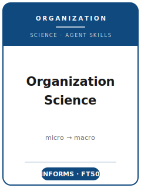

# Organization Science Skills

<p align="center">
  
</p>

[](LICENSE)
[](https://pubsonline.informs.org/journal/orsc)
[](https://pubsonline.informs.org/journal/orsc)
[](https://github.com/anthropics/claude-code)

English | [简体中文](README.zh-CN.md)

Agent skill stack for manuscripts targeted at **Organization Science** — the interdisciplinary, **theory-driven** journal about organizations published by **INFORMS**, spanning **micro (individual/team) to macro (organizational/field/population)** levels.

This repository is opinionated. It is **not** a generic "management writing" toolbox. It is an **Organization Science-specific** stack built around the journal's defining bar — **overall contribution over novelty** ("theoretical novelty is neither necessary nor sufficient") — and its **methodological eclecticism**, with a signature openness to **qualitative and inductive** work alongside quantitative, experimental, computational, and formal-analytical research. It covers theory-driven topic selection, deductive or inductive theory development, interdisciplinary literature positioning, method-fit design and transparent analysis, a concise **cover-letter contribution case**, INFORMS house-style exhibits and prose, ScholarOne submission under the all-inclusive ~50-page norm, the decentralized senior-editor review process, and R&R rebuttals under the journal's codified author-response norms.

> Source-backed norms only. Check the live INFORMS submission guidelines, editorial statement, data and methods transparency page, editorial board, and Manuscript Length Policy PDF before upload.

---

## Why a Separate Organization Science Skill Stack?

Organization Science imposes constraints that differ materially from identification-first or theory-only journals:

| Constraint              | Organization Science                                            | Implication                                                       |
|-------------------------|----------------------------------------------------------------|-------------------------------------------------------------------|
| Discipline              | Interdisciplinary organizations research, micro → macro          | Pure-discipline or pure-method papers are off-fit                 |
| Core bar                | **Overall contribution** > novelty                              | "Never been studied" is not a contribution                        |
| Methodology             | Eclectic; **qualitative/inductive signature**                   | Causal identification not required ("often impossible")           |
| Inference               | Design + theory + institutional knowledge + mechanism            | A credible mechanism beats a thin instrument                      |
| Contribution case       | Cover letter visible to EIC/SE, not reviewers                         | State the contribution plainly; keep it concise             |
| Length                  | All-inclusive **~50-page** norm; editor discretion              | Heavy material goes in a **separate anonymized appendix**         |
| Review                  | Submission workflow requires **double-blind** preparation; ≥ 2 reviewers | Main manuscript fully anonymized; ORCID required                  |
| Editorial model         | **Decentralized senior editors** with autonomy; COI cascade     | The SE — not an area editor — decides your paper                  |
| Format                  | INFORMS author-date; no Helvetica Narrow; abstract ≤ 250 words  | Numeric citation styles are wrong here                            |

Generic "scientific writing" or identification-first methods packs do not address these constraints.

---

## Quick Start

### Option A — Claude Code Plugin (recommended)

```bash
/plugin marketplace add https://github.com/brycewang-stanford/orgsci-skills
/plugin install orgsci-skills
/reload-plugins
```

### Option B — Manual Copy

```bash
git clone https://github.com/brycewang-stanford/orgsci-skills.git
cd orgsci-skills

mkdir -p ~/.claude/skills && cp -R skills/orgsci-* ~/.claude/skills/
# or
mkdir -p ~/.codex/skills && cp -R skills/orgsci-* ~/.codex/skills/
```

### First Prompt

```
Use orgsci-workflow to tell me which skill I should use next for my Organization Science manuscript.
```

---

## Default Workflow

```text
orgsci-topic-selection
        ▼
orgsci-theory-development
        ▼
orgsci-literature-positioning
        ▼
orgsci-methods
        ▼
orgsci-data-analysis
        ▼
orgsci-contribution-framing
        ▼
orgsci-tables-figures
        ▼
orgsci-writing-style        (polish)
        ▼
orgsci-submission
        ▼
orgsci-review-process
        ▼
orgsci-rebuttal
```

`orgsci-workflow` is the router — it tells you which skill to use next based on where you are.

---

## Skills

| Skill                          | Purpose                                                                            |
|--------------------------------|------------------------------------------------------------------------------------|
| `orgsci-workflow`              | Router — decides which sub-skill to invoke next                                    |
| `orgsci-topic-selection`       | Theory-driven question + fit test (vs. ASQ / AMJ / Management Science)              |
| `orgsci-theory-development`    | Deductive a priori mechanism **or** inductive grounded model; micro-macro bridging |
| `orgsci-literature-positioning`| Joining an organization-theory conversation; problematization over gap-spotting     |
| `orgsci-methods`               | Matching eclectic methods to the question; inference without identification         |
| `orgsci-data-analysis`         | Method-specific rigor: trustworthiness, multilevel/EH estimators, simulation/formal |
| `orgsci-contribution-framing`  | Cover-letter contribution case + matching discussion                               |
| `orgsci-tables-figures`        | Data structure / process model / nested tables / sensitivity figures, INFORMS style  |
| `orgsci-writing-style`         | Front-loaded argument for a micro-to-macro audience; INFORMS author-date style       |
| `orgsci-submission`            | ScholarOne preflight (contribution statement, anonymization, ~50-page norm, appendix) |
| `orgsci-review-process`        | The decentralized senior-editor model and how to read a decision letter             |
| `orgsci-rebuttal`              | R&R revision + response letter under the journal's codified author-response norms    |

### Resources

- [`resources/official-source-map.md`](resources/official-source-map.md) — every venue fact with its official INFORMS URL and upload-week live-check boundary
- [`resources/external_tools.md`](resources/external_tools.md) — organization-research data sources and software across the journal's eclectic methods (NVivo/ATLAS.ti and Gioia templates; NetLogo/Mesa and formal modeling; igraph/ERGM networks; lme4/Mplus/Stata multilevel & event-history)

---

## Differences vs. ASQ / AMJ / Management Science

| Dimension          | Organization Science                          | ASQ                                | AMJ                              | Management Science                     |
|--------------------|-----------------------------------------------|------------------------------------|----------------------------------|----------------------------------------|
| Publisher          | INFORMS                                        | Cornell / SAGE                     | Academy of Management            | INFORMS                                |
| Core bar           | **Overall contribution** > novelty            | Bold framing, deep context         | Empirical **+** theoretical      | Often identification-leaning           |
| Methods            | Eclectic; qualitative/inductive signature     | Qualitative & quantitative         | SEM / HLM / panel / experiments  | More quantitative / analytical         |
| Causal ID          | Valued but "not necessary, often impossible"  | Not required                       | Expected for archival claims     | Frequently expected                    |
| Routing            | Autonomous **senior editors**; COI cascade     | Editor + board                     | AOM action editors               | **Departmental area editors**          |
| Data policy        | 2025 transparency policy: code/data sharing with exceptions | Journal policy                     | AOM transparency policy          | **Mandatory code-and-data disclosure** |

If your paper needs no theory and lives or dies on a clean instrument, Management Science may fit better; if it is a bold, contextually deep study, ASQ; if you need equal empirical + theoretical weight under a page limit, AMJ. Organization Science rewards an **overall contribution** to organization research, with the method that fits.

---

## Related

- [awesome-journal-skills](https://github.com/brycewang-stanford/awesome-journal-skills) — index of journal-specific skill packs

---

## License

MIT
