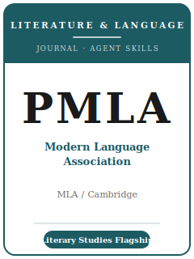

# PMLA（现代语言协会会刊）技能包

<p align="center">
  
</p>

[](LICENSE)
[](https://www.cambridge.org/core/journals/pmla)
[](https://www.mla.org/Publications/Journals/PMLA)
[](https://github.com/anthropics/claude-code)

[English](README.md) | 简体中文

面向 **《现代语言协会会刊》（PMLA, Publications of the Modern Language Association）** 投稿的 Agent
技能栈。PMLA 是 **美国现代语言协会（MLA）的旗舰综合性期刊**，是美国历史最悠久的学术期刊之一，由
**剑桥大学出版社** 出版。它刊发对 **语言与文学领域学者及教师** 都有价值的论文，覆盖整个会员群体：
不限时期、不限语种，**接纳一切学术方法与理论取向**——文学批评、文学理论、比较文学，以及对语言与
文学的广义研究。

本仓库是**有主见的**，并且**面向人文学科**。它**不是**社会科学技能包，**也不是**把数据/复现工具箱
改头换面套到文学上。这里没有数据集、没有统计、没有复现材料包。一篇 PMLA 论文是 **论证、细读、
理论框定，以及对批评对话的介入**，面向广泛的会员群体写作，并以 **MLA 体例**（依据 MLA Handbook 的
正文夹注 + Works Cited 文献表）排版。**文本即证据。**

---

## PMLA 是什么，为何需要专属技能栈？

PMLA 的约束既不同于狭窄的专门刊，也不同于社会科学期刊：

| 约束 | PMLA | 含义 |
|------|------|------|
| 领域 | **文学与语言研究**——整个 MLA 会员群体 | 论文须超越你的专门方向才有意义 |
| 看重 | 一个**有意义的问题** + 充分展开其蕴含 | 仅限专门方向的窄读不合适 |
| 证据 | **文本**——细读，而非数据或统计 | 无数据集、无复现；严谨意味着读得精确 |
| 方法 | **接纳一切方法与理论取向** | 理论须照亮文本，而非替代细读 |
| 出版方 / 所有者 | **剑桥大学出版社** / **MLA** | 通过 **PMLA 的 ScholarOne** 投稿 |
| 评审模式 | **匿名（盲审）**——≥ 2 位评审，编委会定夺 | 去除第一人称自我指认；使用封面页 |
| 投稿资格 | 作者（及全部合著者）**须为 MLA 会员** | 投稿前先加入 MLA |
| 篇幅 | **论文 6,000–9,000 词**；含说明性脚注 | Works Cited 与译文不计入字数 |
| 体例 | 依最新 **MLA Handbook** 的 **MLA 体例**（夹注 + Works Cited） | 非 Chicago/APA；按核心要素模板著录 |
| AI 披露 | 投稿时须标注一切由 **AI 工具** 生成的内容 | 提前声明 AI 辅助 |
| 特色栏目 | Theories and Methodologies · The Changing Profession · Criticism in Translation · Little-known Documents · 专题特辑 | 投稿前选对栏目 |

易变的具体信息（主编与任期、确切篇幅上限、特色栏目截稿期、会员/费用条款）会变化——未直接核实项在
[`resources/official-source-map.md`](resources/official-source-map.md) 中标记 **待核实**。
**请以官方页面为准。**

### 栏目类型

- **常规论文（Regular article）**——主力形式；**6,000–9,000 词**，以细读论证一个有意义的问题。
- **Theories and Methodologies**——就近期研究或某种方法所作的、篇幅较短的及时介入。
- **The Changing Profession**——论新兴领域与学科现状。
- **Criticism in Translation**——将一篇重要批评文本译介为英文。
- **Little-known Documents**——以学术评注呈现的档案新发现。

---

## 快速开始

### 方式 A — Claude Code 插件（推荐）

```bash
/plugin marketplace add https://github.com/brycewang-stanford/pmla-skills
/plugin install pmla-skills
/reload-plugins
```

### 方式 B — 手动复制

```bash
git clone https://github.com/brycewang-stanford/pmla-skills.git
cd pmla-skills

mkdir -p ~/.claude/skills && cp -R skills/pmla-* ~/.claude/skills/
# 或
mkdir -p ~/.codex/skills && cp -R skills/pmla-* ~/.codex/skills/
```

### 第一条提示

```
用 pmla-workflow 告诉我，我的 PMLA 论文下一步该用哪个技能。
```

---

## 默认工作流

```text
pmla-topic-selection
        ▼
pmla-scholarly-positioning
        ▼
pmla-argument-development
        ▼
pmla-textual-evidence-and-close-reading
        ▼
pmla-theory-and-method
        ▼
pmla-structure-and-exposition
        ▼
pmla-writing-style          （润色）
        ▼
pmla-citation-and-style
        ▼
pmla-review-process
        ▼
pmla-submission
        ▼
pmla-revision-and-response
```

`pmla-workflow` 是路由器——根据你所处阶段告诉你下一步用哪个技能。若你写的是**特色栏目**
（Theories and Methodologies、The Changing Profession、Criticism in Translation、Little-known
Documents），尽早走 `pmla-theory-and-method` 或 `pmla-textual-evidence-and-close-reading`，以契合
该栏目的期待。

---

## 技能列表

| 技能 | 用途 |
|------|------|
| `pmla-workflow` | 路由器——决定下一步调用哪个子技能 |
| `pmla-topic-selection` | 面向综合性会员群体的契合度；选对栏目 |
| `pmla-scholarly-positioning` | 在批评对话中、跨领域地确立你的介入 |
| `pmla-argument-development` | 把一次细读打造成有蕴含、有分量的论证 |
| `pmla-textual-evidence-and-close-reading` | 以细读为证据；从可靠版本中精确引用 |
| `pmla-theory-and-method` | 用理论照亮文本；特色栏目的主场 |
| `pmla-structure-and-exposition` | 在 6,000–9,000 词内把论文组织清晰 |
| `pmla-writing-style` | 面向整个会员群体的简洁、可读文风 |
| `pmla-citation-and-style` | MLA 体例——依 MLA Handbook 的夹注 + Works Cited |
| `pmla-review-process` | 匿名评审、≥ 2 位评审、编委会定夺、投稿资格 |
| `pmla-submission` | ScholarOne 投稿前检查（匿名化、会员资格、字数、MLA 体例） |
| `pmla-revision-and-response` | 回应评审报告，同时守护论证与匿名性 |

### 资源

- [`resources/external_tools.md`](resources/external_tools.md) — 文本、版本、档案（EEBO/ECCO、HathiTrust、检索工具）、MLA 国际书目、JSTOR / Project MUSE，以及 MLA 体例 / 文献管理工具
- [`resources/official-source-map.md`](resources/official-source-map.md) — 每条事实背后的 MLA / 剑桥官方 URL，未核实项标 待核实

---

## 本仓库不做什么

- 不替你写出可直接投稿的论文
- 不模拟任何特定主编或评审人的口味
- 不把文学批评变成数据/统计练习——这里没有数据集或复现材料包
- 不臆断易变元数据（现任主编与任期、确切上限、截稿期、费用/会员措辞）——请以官方页面为准；未核实项标 待核实
- 不替你判断你的问题是否对会员群体具有重要意义——那是研究者的判断

---

## 相关

- [awesome-journal-skills](https://github.com/brycewang-stanford/awesome-journal-skills) — 期刊专属技能包索引
- [PMLA（剑桥 Core）](https://www.cambridge.org/core/journals/pmla) — 出版方主页
- [MLA 上的 PMLA](https://www.mla.org/Publications/Journals/PMLA) — 所有者、投稿指南、PMLA 之所重

---

## 许可

MIT
