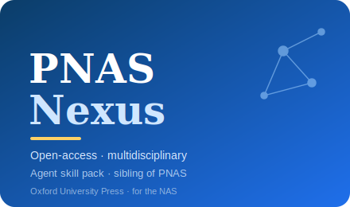

# PNAS Nexus Skills

<p align="center">
  
</p>

[](LICENSE)
[](https://academic.oup.com/pnasnexus)
[](https://academic.oup.com/pnasnexus/pages/what-makes-pnas-nexus-unique)
[](https://academic.oup.com/pnasnexus/pages/about)
[](https://github.com/anthropics/claude-code)

English | [简体中文](README.zh-CN.md)

Agent skill stack for manuscripts targeted at **PNAS Nexus** — the **fully open-access, multidisciplinary
sibling journal of PNAS**, published by **Oxford University Press (OUP)** on behalf of the **U.S. National
Academy of Sciences (NAS)**.

This pack is opinionated, and it is **not** a relabeled flagship-PNAS pack. PNAS Nexus is a *different
journal* with its own rules, and this stack encodes exactly the things that differ: a **gold open-access
business model with an article processing charge (APC)** and a **CC BY / CC BY-NC license** choice; **no
Direct/Contributed (NAS-member) submission track** (every paper goes through standard editor-assigned
peer review); the **PNAS → PNAS Nexus transfer route** that carries reviews over; a **broad scope** across
biological/health/medical, physical sciences & engineering, and social & political sciences; **page-based
length budgets** and explicit **article types** (Research Report, Brief Report, Perspective, Review,
Registered Reports); a required **50–120-word Significance Statement**; a **≤250-word single-paragraph
abstract**; **in-text Materials and Methods**; a **mandatory** data/code deposition policy (with raw-image
retention and retraction teeth); and references that are **format-neutral at submission**.

> ⚠️ **PNAS Nexus ≠ flagship PNAS.** If you want the *Proceedings of the National Academy of Sciences*
> (the hybrid flagship with the Direct/Contributed tracks), use the sibling
> [PNAS-Skills](../PNAS-Skills/) pack instead. The two journals have different editors, business models,
> submission processes, length rules, and reference styles — do not mix their facts.

---

## Why a Separate PNAS Nexus Stack?

PNAS Nexus imposes constraints that differ materially from flagship PNAS — and from field journals:

| Constraint                | PNAS Nexus                                                   | Implication                                                  |
|---------------------------|--------------------------------------------------------------|-------------------------------------------------------------|
| Business model            | **Fully gold open access**; an **APC** applies (priced via OUP's region/category calculator) | Confirm the APC live, check waivers/Read-&-Publish, and pick a license *before* submitting |
| Submission track          | **None** — no Direct vs Contributed; all editor-assigned peer review (≥2 reviewers) | An NAS member **cannot** "contribute" a paper here          |
| Route in from PNAS        | **Transfer/cascade**: sound work declined by PNAS may transfer, **reviews carried over** | A real path in — accept it when the decline was about fit, not soundness |
| Scope                     | Broad & explicitly cross-disciplinary; board spans NAS + NAE + NAM | Write for a reader in *another* division                    |
| Significance Statement    | **50–120 words** (note the **minimum**), broad audience       | A too-short statement is non-compliant, not just a too-long one |
| Abstract                  | **≤250 words**, single paragraph, **no headings**             | Quantify at least one result                                |
| Length                    | **Page-based** (Research Report 6 pp pref / 12 max ≈ 4,000 words, 50 refs, 4 items) by article type | Captions, legends, abstract, and significance all count     |
| Methods location          | **Materials and Methods kept in the main text**               | Cannot be provided solely as Supporting Information         |
| Data & code               | **Mandatory** public-repository deposition on publication; raw images retained; `[dataset]` citations; non-compliance → rejection/retraction | Build the deposition package as you go                      |
| References                | **Any readable style at submission**                          | Don't burn effort house-styling up front — just be clean and complete |

Generic "scientific writing" packs — and the flagship-PNAS pack — do not encode these venue constraints.

---

## Quick Start

### Option A — Claude Code Plugin (recommended)

```bash
/plugin marketplace add https://github.com/brycewang-stanford/awesome-journal-skills
/plugin install pnas-nexus-skills
/reload-plugins
```

### Option B — Manual Copy

```bash
git clone https://github.com/brycewang-stanford/awesome-journal-skills.git
cd awesome-journal-skills/PNAS-Nexus-Skills

mkdir -p ~/.claude/skills && cp -R skills/pnasnexus-* ~/.claude/skills/
# or
mkdir -p ~/.codex/skills && cp -R skills/pnasnexus-* ~/.codex/skills/
```

### First Prompt

```
Use pnasnexus-workflow to tell me which skill I should use next for my manuscript targeted at PNAS Nexus.
```

---

## Default Workflow

```text
pnasnexus-fit            (clear the broad, cross-disciplinary bar; PNAS-transfer call)
        ▼
pnasnexus-openaccess     (APC, waivers/Read-&-Publish, CC BY vs CC BY-NC — do early)
        ▼
pnasnexus-writing        (article type, page budget, classification, Methods in-text)
        ▼
pnasnexus-figures        (display items within the graphical-element budget)
        ▼
pnasnexus-statistics     (rigor + reproducibility; Registered Reports)
        ▼
pnasnexus-data           (mandatory data/code deposition + raw-image retention)
        ▼
pnasnexus-significance   (50–120-word Significance Statement — high-value)
        ▼
pnasnexus-abstract       (≤250-word single-paragraph abstract — polish)
        ▼
pnasnexus-citation       (references — format-neutral at submission; make them clean)
        ▼
pnasnexus-submission     (preflight + cover letter)
        ▼
pnasnexus-rebuttal       (after review)
```

`pnasnexus-workflow` is the router — it tells you which skill to use next based on where you are.

---

## Skills

| Skill                  | Purpose                                                                          |
|------------------------|----------------------------------------------------------------------------------|
| `pnasnexus-workflow`   | Router — decides which sub-skill to invoke next                                   |
| `pnasnexus-fit`        | Broad, cross-disciplinary bar; PNAS Nexus vs flagship PNAS vs field; **PNAS transfer** call |
| `pnasnexus-openaccess` | **Gold OA + APC + CC BY/CC BY-NC license** (replaces flagship PNAS's track choice) |
| `pnasnexus-significance` | The required **50–120-word Significance Statement** for a broad audience         |
| `pnasnexus-abstract`   | **≤250-word** single-paragraph abstract, no headings; distinct from the significance statement |
| `pnasnexus-writing`    | **Article type** + **page-based budget**, classification, **Methods in-text**     |
| `pnasnexus-figures`    | Graphical-element budget, sizing, show-the-data, colorblind-safe, raw-image retention |
| `pnasnexus-statistics` | Effect size + CI + n + test; replication; reproducibility; **Registered Reports** |
| `pnasnexus-data`       | **Mandatory** data/code deposition, raw images, accession/DOI, `[dataset]` tag    |
| `pnasnexus-citation`   | References — **format-neutral at submission**; consistent, complete, resolvable   |
| `pnasnexus-submission` | Full preflight checklist + cover-letter template (incl. transfer & OA)            |
| `pnasnexus-rebuttal`   | Decision triage, experiment prioritization, point-by-point response (incl. carried-over PNAS reviews) |

### Resources

- [`resources/official-source-map.md`](resources/official-source-map.md) — the authoritative fact-of-record (editors, APC, licenses, length, policy) with access dates and 待核实 flags
- [`resources/external_tools.md`](resources/external_tools.md) — OA/APC pages, deposition repositories, reporting standards, figure/stats tooling, official PNAS Nexus pages
- [`resources/exemplars/library.md`](resources/exemplars/library.md) — **real, web-verified PNAS Nexus articles** (`10.1093/pnasnexus/…` DOIs) across the three divisions, with a sibling-confusion guard
- [`resources/worked-examples/01-introduction.md`](resources/worked-examples/01-introduction.md) — before→after of the Significance Statement + abstract (fictional teaching example)
- [`skills/pnasnexus-submission/templates/checklist.md`](skills/pnasnexus-submission/templates/checklist.md) — full preflight checklist
- [`skills/pnasnexus-submission/templates/cover_letter_template.md`](skills/pnasnexus-submission/templates/cover_letter_template.md) — cover-letter scaffold

---

## Differences vs. flagship PNAS

| Dimension          | PNAS Nexus                                   | Flagship PNAS ([PNAS-Skills](../PNAS-Skills/)) |
|--------------------|----------------------------------------------|------------------------------------------------|
| Publisher          | **Oxford University Press** (for the NAS)     | NAS / PNAS                                      |
| Access model       | **Fully gold OA + APC**                       | Hybrid (subscription + optional OA)             |
| Submission track   | **None** (all editor-assigned)                | **Direct vs Contributed** (NAS member)          |
| Route in           | **Transfer from PNAS** (reviews carried over) | n/a                                             |
| Significance Statement | **50–120 words** (min + max)              | ≤120 words                                      |
| Length             | **Page-based** by article type (6 pp / 12 max) | Page/character budget                          |
| References         | **Any readable style at submission**          | Numbered, in order of appearance, up front      |

For flagship PNAS, see the sibling [PNAS-Skills](../PNAS-Skills/) pack.

---

## Disclaimer

This is an independent, community-built skill pack. It is **not** affiliated with, endorsed by, or
produced by Oxford University Press, the National Academy of Sciences, *PNAS*, or *PNAS Nexus*. All
targets (word/page counts, item limits, fees, license options, policy rules) reflect publicly documented
author guidelines at the time of writing (**access date 2026-06-23**) and are recorded with sources in
[`resources/official-source-map.md`](resources/official-source-map.md) — **always confirm against the
current [PNAS Nexus author guidelines](https://academic.oup.com/pnasnexus/pages/general-instructions)**
before submitting. The **APC is region/category-personalized** and **must be confirmed live** in
OUP's calculator; OUP publishes no fixed figure (public third-party trackers disagree, ≈US$2,200–4,200),
and the billed amount varies by region/category and may be waived or discounted. Editors rotate;
re-verify the sitting editor-in-chief at submission time.

---

## License

MIT
