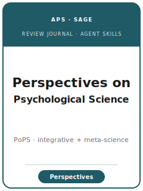

# Perspectives on Psychological Science Skills

<p align="center"></p>

[](LICENSE)
[](https://www.psychologicalscience.org/publications/perspectives)
[](https://journals.sagepub.com/home/pps)
[](https://www.psychologicalscience.org/publications/perspectives/pps-submissions)

English | [简体中文](README.zh-CN.md)

Twelve agent skills for manuscripts targeted at **Perspectives on Psychological Science (PoPS)** — the
**SAGE / Association for Psychological Science** bimonthly that publishes **broad integrative reviews,
theoretical and metatheoretical statements, methodology and meta-science commentary, and big-picture
perspective pieces** across all of psychology. Historically the home of major meta-science, replication,
and reform work, PoPS rewards a **field-shaping synthesis or argument**, not a primary empirical study.
The pack keeps the manuscript distinct from *Psychological Science*, *Psychological Bulletin*, *Annual
Review of Psychology*, and *Current Directions*, and treats exemplary open science as a first-class
requirement.

**Official basis checked 2026-06** (re-check volatile details before submission): see [`resources/official-source-map.md`](resources/official-source-map.md).

## Why a separate stack?

| PoPS constraint | What it forces |
|-----------------|----------------|
| Scope | The contribution must be **broad and integrative** — a superordinate message about the field, not a single study or a routine meta-analysis |
| Contribution route | **Stand-alone** (proposal optional) vs. **cooperative / miscellaneous** (proposal required); a warm proposal reply is not an acceptance |
| Organizing argument | The piece needs a real **spine** (taxonomy / unifying theory / reframe), or it fails as an annotated bibliography |
| Balance | Field-spanning coverage, steelmanned camps, and **reform-minded but evidence-based** critique |
| Open science | PoPS is an open-science leader; deposits, reproducible meta-science protocols, and disclosure are exemplary, not optional |
| Sibling boundary | Must explain why not *Psychological Science*, *Psychological Bulletin*, *Annual Review of Psychology*, or *Current Directions* |
| Source discipline | Current process facts are cited or marked 待核实 |

## Quick Start

```text
/plugin marketplace add ./Perspectives-on-Psychological-Science-Skills
/plugin install perspectives-on-psychological-science-skills
```

Manual use: start with [`skills/ppsych-workflow/SKILL.md`](skills/ppsych-workflow/SKILL.md).

## Default Workflow

```text
ppsych-workflow → ppsych-topic-selection → ppsych-proposal-and-commissioning → ppsych-literature-synthesis →
ppsych-organizing-framework → ppsych-comprehensiveness-and-balance → ppsych-tables-figures → ppsych-writing-style →
ppsych-transparency-and-reproducibility → ppsych-editor-strategy → ppsych-submission → ppsych-revision
```

## Skills

| # | Skill | What it does |
|---|-------|--------------|
| 1 | [`ppsych-workflow`](skills/ppsych-workflow/SKILL.md) | Workflow router for PoPS manuscripts (stage + contribution type) |
| 2 | [`ppsych-topic-selection`](skills/ppsych-topic-selection/SKILL.md) | Is the question PoPS-shaped (broad, integrative, superordinate)? |
| 3 | [`ppsych-proposal-and-commissioning`](skills/ppsych-proposal-and-commissioning/SKILL.md) | The proposal route; cooperative/miscellaneous require a proposal |
| 4 | [`ppsych-literature-synthesis`](skills/ppsych-literature-synthesis/SKILL.md) | Systematic cross-area reading; meta-science protocol |
| 5 | [`ppsych-organizing-framework`](skills/ppsych-organizing-framework/SKILL.md) | The unifying argument / spine that reframes the field |
| 6 | [`ppsych-comprehensiveness-and-balance`](skills/ppsych-comprehensiveness-and-balance/SKILL.md) | Evidence appraisal, coverage, balance, reform calibration |
| 7 | [`ppsych-tables-figures`](skills/ppsych-tables-figures/SKILL.md) | Framework figure, summary tables, meta-science exhibits (APA) |
| 8 | [`ppsych-writing-style`](skills/ppsych-writing-style/SKILL.md) | The broad, provocative, accessible PoPS voice; ≤200-word abstract |
| 9 | [`ppsych-transparency-and-reproducibility`](skills/ppsych-transparency-and-reproducibility/SKILL.md) | Repository deposits, preregistered protocols, exemplary disclosure |
| 10 | [`ppsych-editor-strategy`](skills/ppsych-editor-strategy/SKILL.md) | Editor relationship, referee anticipation, suggested reviewers |
| 11 | [`ppsych-submission`](skills/ppsych-submission/SKILL.md) | ScholarOne preflight, declarations, ≥5 objective reviewers |
| 12 | [`ppsych-revision`](skills/ppsych-revision/SKILL.md) | Point-by-point response to the PoPS decision letter |

## Resources

- [`resources/README.md`](resources/README.md) — resource index
- [`resources/official-source-map.md`](resources/official-source-map.md) — official SAGE/APS URLs and volatile checks
- [`resources/external_tools.md`](resources/external_tools.md) — search, preregistration, repository, and meta-science tooling
- [`resources/worked-examples/01-introduction.md`](resources/worked-examples/01-introduction.md) — fictional before/after introduction in the PoPS voice
- [`resources/exemplars/library.md`](resources/exemplars/library.md) — real PoPS papers (web-verified) + sibling-journal guardrails

## Differences vs. sibling journals

| Journal | Niche | This pack's boundary rule |
|---------|-------|---------------------------|
| **Perspectives on Psychological Science** | Broad integrative reviews + theory + **meta-science** flagship (APS) | the target here |
| **Psychological Science** | Short **single-study** empirical reports (APS sister) | route single studies here, not PoPS |
| **Psychological Bulletin** | Formal, comprehensive **meta-analyses** | route routine meta-analyses here unless a superordinate message |
| **Annual Review of Psychology** | **Invited** exhaustive subfield surveys for specialists | invited, specialist — not a submitted broad perspective |
| **Current Directions in Psychological Science** | Short, **non-technical** sketches for a broad audience (APS) | brief, non-technical — not a full integrative argument |

## Related Links

- https://www.psychologicalscience.org/publications/perspectives
- https://www.psychologicalscience.org/publications/perspectives/pps-submissions
- https://journals.sagepub.com/home/pps

## License

MIT (c) 2026 Bryce Wang. See [LICENSE](LICENSE).
