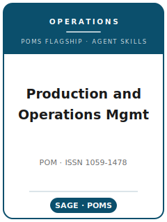

# 《生产与运营管理》(POM) 技能包

<p align="center">
  
</p>

[](LICENSE)
[](https://www.poms.org/journal)
[](https://journals.sagepub.com/home/PAO)
[](https://github.com/anthropics/claude-code)

[English](README.md) | 简体中文

面向 **Production and Operations Management（POM，《生产与运营管理》）** 投稿的智能体技能栈。POM 是 **生产与运营管理学会（POMS）** 的旗舰期刊，由 **SAGE** 出版（自 2024 年 1 月起；此前为 Wiley-Blackwell）。ISSN 1059-1478。

本仓库是有立场的：它**不是**通用的"运营管理写作工具箱"，而是围绕 POM 核心门槛构建的**专属技能栈**——无论采用何种方法，研究都必须**对运营管理实务有显著价值**，*同时*对**知识与实践做出实质性贡献**。技能覆盖选题、运营管理模型/理论构建、文献定位、跨 POM 各研究传统（解析/数学建模、实证 OM、行为/实验 OM、运营数据科学）的方法匹配与分析、贡献提炼、图表、文风、向 **部门编辑（Department Editor）** 的 ScholarOne 投稿、评审流程与 R&R 回复。

> 仅沉淀持久性规范。主编、费用、部门名单与具体限额会变化——务必在 POMS 官方作者须知页与 SAGE 期刊页核实。无法确认的事实在 `resources/official-source-map.md` 中标记为 **待核实**。

---

## 为什么需要独立的 POM 技能栈？

POM 的约束与纯理论管理期刊或资本市场金融/会计期刊有本质差异：

| 约束维度        | 《生产与运营管理》POM                                              | 含义                                                          |
|-----------------|-------------------------------------------------------------------|---------------------------------------------------------------|
| 学科            | 运营管理与供应链（OM 全谱系）                                      | 纯非 OM 的经济学、组织行为、营销论文不对口                     |
| 核心门槛        | 对运营管理实务有显著价值 **且** 有实质性贡献                       | 模型精巧但无管理启示，会被视为纯数学练习                       |
| 路由            | 投稿至**某一具名部门**（行为运营、供应链、医疗运营、可持续运营、运营数据分析、交叉学科部门等） | 投错部门即误投；投稿信必须明确目标部门                         |
| 方法            | 不限定方法；以解析建模为根基，并有实证、行为、数据科学等支线       | 方法须**匹配**问题并严谨执行                                   |
| 实践相关性门槛  | "对运营经理意味着什么？"与严谨性同等加权                           | 缺乏管理洞见的技术性工作是拒稿信号                             |
| 篇幅            | **32 页**硬性上限（含参考文献、附录、表、图）；1.5 倍行距、11 号字 | 证明/补充材料移入**无页数限制的在线 e-companion**              |
| 摘要            | ≤ 350 词，**不含公式/参考文献/缩写**；标题 ≤ 25 词                 | 开篇即需克制规范                                              |
| 评审            | **双盲**；删除姓名与致谢                                           | 自我指认的引用/注释会破坏匿名性                               |
| 重投            | 被拒论文**不得**重投同一或不同部门，除非决定信明确邀请            | 比多数同行更严——每篇论文一次机会                             |
| 披露            | 投稿信须列出**同数据/相关在先工作**                               | 未披露的数据重叠属严重学术诚信问题                            |

通用"科学写作"或"社会科学方法"技能包无法覆盖这些约束。

---

## 快速开始

### 方式 A — Claude Code 插件（推荐）

```bash
/plugin marketplace add https://github.com/brycewang-stanford/pom-skills
/plugin install pom-skills
/reload-plugins
```

### 方式 B — 手动复制

```bash
git clone https://github.com/brycewang-stanford/pom-skills.git
cd pom-skills

mkdir -p ~/.claude/skills && cp -R skills/pom-* ~/.claude/skills/
# 或
mkdir -p ~/.codex/skills && cp -R skills/pom-* ~/.codex/skills/
```

### 第一条提示

```
用 pom-workflow 告诉我，我的 POM 稿件下一步该用哪个技能。
```

---

## 默认工作流

```text
pom-topic-selection
        ▼
pom-theory-development
        ▼
pom-literature-positioning
        ▼
pom-methods
        ▼
pom-data-analysis
        ▼
pom-contribution-framing
        ▼
pom-tables-figures
        ▼
pom-writing-style        （润色）
        ▼
pom-submission
        ▼
pom-review-process
        ▼
pom-rebuttal
```

`pom-workflow` 是路由器——它根据你所处的阶段，以及论文所属的研究传统（解析/实证/行为/数据科学），告诉你下一步该用哪个技能。

---

## 技能列表

| 技能                        | 用途                                                                                 |
|-----------------------------|--------------------------------------------------------------------------------------|
| `pom-workflow`              | 路由器——决定下一个子技能；识别你的方法路线                                            |
| `pom-topic-selection`       | OM 问题 + POM 适配性检验 + 目标部门选择                                               |
| `pom-theory-development`    | 构建模型/机制：假设、均衡、命题或可检验假说                                           |
| `pom-literature-positioning`| 加入某个 OM 对话；针对对应部门的在先工作定位                                          |
| `pom-methods`               | 将方法（优化/随机/博弈/实证/行为/机器学习）匹配到问题                                 |
| `pom-data-analysis`         | 执行与汇报：证明与数值，或识别、估计、稳健性                                          |
| `pom-contribution-framing`  | 提炼管理洞见 + 对 OM 知识与实践的贡献                                                 |
| `pom-tables-figures`        | 结果表、灵敏度/比较静态图、模型示意图                                                 |
| `pom-writing-style`         | 前置论点、作者-年份引用、32 页纪律、e-companion 拆分                                  |
| `pom-submission`            | ScholarOne 投稿前检查：部门路由、双盲、350 词摘要、同数据披露                          |
| `pom-review-process`        | POM 部门评审/决定如何运作；不可重投规则                                               |
| `pom-rebuttal`              | R&R 修改与对部门编辑及审稿人的逐条回复                                                |

### 资源

- [`resources/official-source-map.md`](resources/official-source-map.md) — 每条期刊事实附官方 URL 与访问日期；未确认项标记 **待核实**
- [`resources/external_tools.md`](resources/external_tools.md) — 求解器（Gurobi / CPLEX / Mosek）、建模语言（AMPL / Pyomo / JuMP）、仿真（Arena / AnyLogic / SimPy）、计量（Stata / R `fixest`）、实验（oTree / Prolific）、数据科学（scikit-learn / 预测）

---

## 与 M&SOM / Management Science(运营) / JOM / IJOPM 的差异

| 维度            | POM                                          | M&SOM                          | Management Science(运营)        | JOM / IJOPM                    |
|-----------------|----------------------------------------------|--------------------------------|---------------------------------|--------------------------------|
| 学会/出版商     | POMS / SAGE                                   | INFORMS                        | INFORMS                         | 多家 / Elsevier                |
| 覆盖面          | OM 全谱系，**按部门路由**                     | OM，偏建模                     | 广义管理，OM 部门               | 偏实证 / 流程                  |
| 标志性侧重      | 严谨性 **且** 面向运营经理的相关性            | 建模 + 实证 OM                 | 方法论深度                      | 实证 OM、运营实践              |
| 格式特点        | 32 页上限 + 无限 e-companion；不可重投        | INFORMS 限额                   | INFORMS 限额                    | 出版商各异                     |

POM 的标志性结构性规范是**投稿至某一具名部门编辑** + **实践相关性门槛**——投稿前先选对部门。

---

## 相关

- [awesome-journal-skills](https://github.com/brycewang-stanford/awesome-journal-skills) — 期刊专属技能包索引

---

## 许可证

MIT
