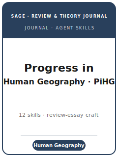

# Progress in Human Geography Skills

<p align="center"></p>

[](LICENSE)
[](https://journals.sagepub.com/home/phg)
[](https://journals.sagepub.com/home/phg)
[](https://journals.sagepub.com/home/phg)

English | [简体中文](README.zh-CN.md)

Twelve agent skills for **critical review essays, conceptual interventions, and commissioned progress reports** targeted at **Progress in Human Geography (PiHG)** — SAGE's flagship **review and state-of-the-art** journal in human geography (founded 1977), which publishes major critical reviews of philosophical, conceptual, theoretical, topical, methodological, ethical, and political debates, plus the famous commissioned **progress reports** that survey the development of subfields (economic, urban, political, cultural, feminist, development, more-than-human geographies). Because PiHG publishes **no original empirical findings or detailed cases**, the pack replaces identification and replication-package craft with **review craft**: scoping a synthesis-worthy debate, the dual intake route (commissioned report vs. submitted review), systematic critical coverage across theoretical traditions, imposing a conceptual argument instead of an annotated bibliography, fairness and reflexivity across traditions, debate-mapping exhibits, the authoritative-yet-accessible voice that closes on a research agenda, and the transparency of scholarly apparatus and positionality.

**Official basis checked 2026-06** (re-check volatile details before submission): see [`resources/official-source-map.md`](resources/official-source-map.md).

## Why a separate stack?

| PiHG constraint | What it forces |
|-----------------|----------------|
| Artefact | A **critical review / conceptual intervention** that synthesizes others' work — no identification strategy, no replication package of your own |
| Scope | PiHG **does not publish empirical results or detailed cases** — the contribution is critical synthesis, never new data |
| Intake | **Two routes**: progress reports are **commissioned by the editors**; reviews/interventions are **submitted** in content strands (Perspectives, Reviews, Opinions, Biographies, Key Publications) |
| Audience | Accessible to **human geographers outside the subfield**, not only specialists |
| Spine | The contribution is a **conceptual argument** about where the field is and should go — PiHG is agenda-setting |
| Balance | Fair, **reflexive** engagement across theoretical traditions (political-economic, feminist, poststructural, postcolonial, more-than-human, quantitative); no self-promotion |
| Transparency | Qualitative/critical norms — scholarly apparatus, positionality, a narrative coverage account (not a PRISMA tally) |
| Sibling boundary | Distinct from **Annals of the AAG** (primary research), **Transactions of the IBG** (primary + some review), and **Antipode** (radical geography) |

## Quick Start

```text
/plugin marketplace add ./Progress-in-Human-Geography-Skills
/plugin install progress-in-human-geography-skills
```

Manual use: start with [`skills/proghg-workflow/SKILL.md`](skills/proghg-workflow/SKILL.md).

## Default Workflow

```text
proghg-workflow → proghg-topic-selection → proghg-proposal-and-commissioning → proghg-literature-synthesis →
proghg-organizing-framework → proghg-comprehensiveness-and-balance → proghg-tables-figures → proghg-writing-style →
proghg-transparency-and-reproducibility → proghg-editor-strategy → proghg-submission → proghg-revision
```

## Skills

| # | Skill | What it does |
|---|-------|--------------|
| 1 | [`proghg-workflow`](skills/proghg-workflow/SKILL.md) | Workflow router for PiHG reviews and progress reports |
| 2 | [`proghg-topic-selection`](skills/proghg-topic-selection/SKILL.md) | Is the debate PiHG-scale? The four fit tests |
| 3 | [`proghg-proposal-and-commissioning`](skills/proghg-proposal-and-commissioning/SKILL.md) | The commissioned-report vs. submitted-review intake routes |
| 4 | [`proghg-literature-synthesis`](skills/proghg-literature-synthesis/SKILL.md) | Systematic critical coverage across theoretical traditions |
| 5 | [`proghg-organizing-framework`](skills/proghg-organizing-framework/SKILL.md) | Imposing the conceptual argument (vs. annotated bibliography) |
| 6 | [`proghg-comprehensiveness-and-balance`](skills/proghg-comprehensiveness-and-balance/SKILL.md) | Completeness, selectivity, and fair/reflexive engagement |
| 7 | [`proghg-tables-figures`](skills/proghg-tables-figures/SKILL.md) | Debate-mapping tables and the conceptual figure |
| 8 | [`proghg-writing-style`](skills/proghg-writing-style/SKILL.md) | The authoritative-accessible voice + forward-agenda close |
| 9 | [`proghg-transparency-and-reproducibility`](skills/proghg-transparency-and-reproducibility/SKILL.md) | Scholarly apparatus, positionality, coverage account |
| 10 | [`proghg-editor-strategy`](skills/proghg-editor-strategy/SKILL.md) | Working with the editors: commission vs. submission |
| 11 | [`proghg-submission`](skills/proghg-submission/SKILL.md) | SAGE ScholarOne submission preflight |
| 12 | [`proghg-revision`](skills/proghg-revision/SKILL.md) | Responding to editor/referee feedback on a review |

## Resources

- [`resources/README.md`](resources/README.md) — resource index
- [`resources/official-source-map.md`](resources/official-source-map.md) — official URLs and volatile checks
- [`resources/external_tools.md`](resources/external_tools.md) — databases, synthesis tools, deposit repositories
- [`resources/worked-examples/01-introduction.md`](resources/worked-examples/01-introduction.md) — fictional before/after review introduction
- [`resources/exemplars/library.md`](resources/exemplars/library.md) — candidate PiHG articles + guarded slots (sibling-journal guard)

This pack ships no `code/` directory: a PiHG review reports no primary estimates, so there is no empirical replication kit. The shared method references are background only — used to *appraise* the studies a review synthesizes, not to run analysis of your own.

## Differences vs. sibling venues

| Venue | Relationship to PiHG |
|-------|----------------------|
| **Annals of the AAG** | Primary-research flagship across four areas — original empirical findings; PiHG reviews them, it does not compete |
| **Transactions of the IBG** | Primary research plus some review/commentary; PiHG is review/state-of-the-art only |
| **Antipode** | Radical geography (often original empirical/activist work); PiHG reviews radical scholarship but is not Antipode |
| **Dialogues in Human Geography / Progress in Economic Geography** | Adjacent debate/review outlets; check the venue before citing as PiHG |

## Related Links

- https://journals.sagepub.com/home/phg
- https://journals.sagepub.com/author-instructions/phg
- https://mc.manuscriptcentral.com/pihg

## License

MIT (c) 2026 Bryce Wang. See [LICENSE](LICENSE).
