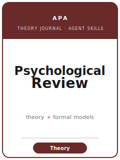

# Psychological Review Skills

<p align="center">
  
</p>

[](LICENSE)
[](https://www.apa.org/pubs/journals/rev)
[](https://www.apa.org/pubs/journals/rev)
[](https://github.com/anthropics/claude-code)

English | [简体中文](README.zh-CN.md)

Agent skill stack for manuscripts targeted at **Psychological Review** — the American Psychological Association's (APA) flagship journal for **theoretical contributions** in scientific psychology. Psychological Review publishes new theoretical frameworks, formal/mathematical/computational **models**, and major theoretical syntheses across cognition, perception, learning, development, social psychology, and neuroscience. It does **not** publish primary empirical reports — data appear only to *motivate* or *constrain* theory.

This repository is opinionated. It is **not** a generic psychology-writing toolbox and it is **not** an empirical-psychology stack. It is a **Psychological Review-specific, theory-building** stack covering theory-fit screening, theoretical-problem framing, formal/conceptual model construction, conversation positioning against rival models, deriving and confronting predictions, scope and boundary conditions (including identifiability), model diagrams and simulation-of-behavior exhibits, contribution differentiation, APA house style, and masked review via Editorial Manager.

**Official basis checked 2026-06** (verify volatile specifics on the official APA page; 检索于 2026-06；以官网为准).

---

## Why a Separate Psychological Review Skill Stack?

Psychological Review imposes constraints that differ materially from empirical psychology journals (the JEP family, Psychological Science):

| Constraint                | Psychological Review                                            | Implication                                                  |
|---------------------------|----------------------------------------------------------------|--------------------------------------------------------------|
| Deliverable               | New **theory** or **formal/computational model**               | An empirical study is off-fit; route it to JEP / Psychological Science |
| Data                      | Only to **motivate or constrain** the theory                   | There is no Method or Results section of the author's own    |
| Core unit                 | **Derived, falsifiable predictions** of a model               | Not hypotheses tested against a fresh sample                 |
| Rigor standard            | **Logical & formal soundness**                                 | Derivation/simulation plays the role statistics play empirically |
| Positioning               | Beat or subsume **named rival models**                         | A topic review with no rivals named fails                    |
| Scope                     | Stated boundaries + (formal) **identifiability**               | "Explains everything" reads as unfalsifiable                 |
| Figures                   | Model diagrams + simulation-of-model-behavior plots            | No experiment figures — every box a construct, every curve a simulation |
| Contribution              | Differentiated "before → after" over a prior model            | A relabel or a better fit is a desk-reject signal            |
| Computational models      | Share the author's **own model code**                          | Not a shared empirical-analysis kit; there is no dataset to deposit |
| Review                    | Masked, multi-round (Editorial Manager)                        | Reviewers are usually the rival modelers themselves          |

Generic "scientific writing" or empirical-psychology skill packs do not address these constraints.

> Accuracy note: the editor, exact length / abstract limits, portal URL, fees, and APA edition change over time. Verify all portal-stage specifics on the official Psychological Review / APA author page before submitting.

---

## Quick Start

### Option A — Claude Code Plugin (recommended)

```bash
/plugin marketplace add https://github.com/brycewang-stanford/psychological-review-skills
/plugin install psychological-review-skills
/reload-plugins
```

### Option B — Manual Copy

```bash
git clone https://github.com/brycewang-stanford/psychological-review-skills.git
cd psychological-review-skills

mkdir -p ~/.claude/skills && cp -R skills/psychrev-* ~/.claude/skills/
# or
mkdir -p ~/.codex/skills && cp -R skills/psychrev-* ~/.codex/skills/
```

### First Prompt

```
Use psychrev-workflow to tell me which skill I should use next for my Psychological Review manuscript.
```

---

## Default Workflow

```text
psychrev-topic-selection
        ▼
psychrev-literature-positioning
        ▼
psychrev-theory-construction
        ▼
psychrev-argument-development     (derive predictions; confront data + rivals)
        ▼
psychrev-boundary-conditions      (scope, identifiability, what it does NOT explain)
        ▼
psychrev-conceptual-exhibits      (model diagram + simulation figures)
        ▼
psychrev-contribution-framing
        ▼
psychrev-writing-style            (polish)
        ▼
psychrev-submission
        ▼
psychrev-review-process
        ▼
psychrev-rebuttal
```

`psychrev-workflow` is the router — it tells you which skill to use next based on where you are.

---

## Skills

| Skill                          | Purpose                                                                  |
|--------------------------------|--------------------------------------------------------------------------|
| `psychrev-workflow`            | Router — decides which sub-skill to invoke next                          |
| `psychrev-topic-selection`     | Is there a real theoretical problem, and is it theory (not empirical)?   |
| `psychrev-theory-construction` | Build assumptions, mechanisms, formal structure, derived behavior        |
| `psychrev-literature-positioning`| Name the theories you extend and the rival models you must beat        |
| `psychrev-argument-development` | Derive predictions; confront existing data and rival models             |
| `psychrev-boundary-conditions` | Scope, identifiability/recovery/mimicry, what the theory does NOT explain |
| `psychrev-conceptual-exhibits` | Model/architecture diagrams + simulation-of-model-behavior figures       |
| `psychrev-writing-style`       | APA house style; mechanism-first, model-vocabulary prose (polish)        |
| `psychrev-contribution-framing`| Differentiate the advance over a named prior model ("before → after")    |
| `psychrev-review-process`      | Masked review, Theoretical Notes, and the theory-specific objections     |
| `psychrev-submission`          | Editorial Manager preflight + checklist (format, masking, model code)    |
| `psychrev-rebuttal`            | Revision + response document that shows the theory was genuinely strengthened |

### Resources

- [`skills/psychrev-submission/templates/checklist.md`](skills/psychrev-submission/templates/checklist.md) — 8-section pre-submission self-check (scope / format / masking / abstract / theory / figures-code / references / ethics & portal)
- [`resources/external_tools.md`](resources/external_tools.md) — Theory/modeling tools (modeling environments, identifiability/recovery analysis, diagram software, argument-logic aids)
- [`resources/official-source-map.md`](resources/official-source-map.md) — Official APA Psychological Review scope, format, and portal facts (with verification dates)
- [`resources/exemplars/library.md`](resources/exemplars/library.md) — Six web-verified Psychological Review theory/model papers, by form, with a sibling-journal guard
- [`resources/worked-examples/01-introduction.md`](resources/worked-examples/01-introduction.md) — Fictional before→after theory-introduction in house style

---

## Differences vs. Sibling Journals

| Dimension          | Psychological Review              | Psychological Bulletin        | BBS                        | JEP family / Psych Science |
|--------------------|----------------------------------|-------------------------------|----------------------------|----------------------------|
| Deliverable        | New theory / formal model        | Review / meta-analysis        | Target article + commentary | Empirical report           |
| Data               | Motivates/constrains only        | Synthesized evidence          | Argument                   | The contribution itself    |
| Core unit          | Derived predictions              | Effect sizes / synthesis      | Open commentary            | Hypotheses tested          |
| Rigor standard     | Logical/formal soundness         | Synthesis rigor               | Debate quality             | Statistical rigor          |
| Figures            | Model diagrams, simulations      | Forest plots, summaries       | (varies)                   | Data plots, results tables |

If your project's contribution is data, a synthesis, or a debate format, a different venue fits better — Psychological Review builds the formal theory those literatures test and summarize.

---

## Related

- [awesome-journal-skills](https://github.com/brycewang-stanford/awesome-journal-skills) — Index of journal-specific skill packs
- [Academy-of-Management-Review-Skills](https://github.com/brycewang-stanford/amr-skills) — A sibling theory-only depth pack

---

## License

MIT
