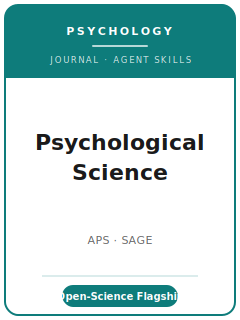

# Psychological Science Skills

<p align="center">
  
</p>

[](LICENSE)
[](https://journals.sagepub.com/home/pss)
[](https://www.psychologicalscience.org/publications/psychological_science)
[](https://github.com/anthropics/claude-code)

English | [简体中文](README.zh-CN.md)

Agent skill stack for manuscripts targeted at **Psychological Science** — the **flagship empirical
journal of the Association for Psychological Science (APS)**, founded in **1990** and published by
**SAGE**. Psychological Science publishes concise, high-impact empirical work across all of
psychology, and it is one of the field's leaders on **open science**.

This repository is opinionated. It is **not** a generic psychology-writing toolbox and it is **not** a
relabeled social-science pack. It is **Psychological Science-specific**: a tight **short-report**
format, a **150-word structured abstract**, **APA 7th-edition** style with embedded exhibits,
demanding statistics (effect sizes + confidence intervals, sample-size justification, full
disclosure), and the journal's **post-2024 open-science regime** — required open data and materials
plus a graded **Research Transparency Statement**.

---

## What Is Psychological Science, and Why a Dedicated Stack?

Its constraints differ sharply from a long-format social-science journal:

| Constraint            | Psychological Science                                                          | Implication                                                       |
|-----------------------|--------------------------------------------------------------------------------|------------------------------------------------------------------|
| Format                | **Intro + Discussion + Footnotes + Acks + Appendices ≤ 2,000 words combined**; Method + Results excluded (≤ ~2,500) | Tight reasoning; no sprawling lit review |
| Abstract              | **150 words**, must state **sample sizes, populations, and design limitations** | A structured, content-bearing abstract                          |
| Style                 | **APA 7th edition**; **tables/figures embedded** in text                       | Not end-of-manuscript exhibits                                   |
| Publisher / owner     | **SAGE** / **APS**                                                             | Submitted via **Manuscript Central** (`/psci`); anonymized       |
| Open science          | **Open data + materials required** (case-by-case exemptions) since **1 Jan 2024** | Plan deposits + DOIs before submission                        |
| Transparency          | **Research Transparency Statement** between Intro and Methods, **graded** in review | "Limits on transparency will be a factor in editorial decisions" |
| Preregistration       | **Quality factored into editorial decisions** (badges retired)                 | Preregister well; report it honestly                             |
| Statistics            | **Effect sizes + CIs**, sample-size justification / power, full disclosure      | Stars-only reporting won't pass                                  |
| Formats               | Research Article · Registered Reports (Stage 1/2) · RR with Existing Data · Commentary (≤1,000) | Pick the right one up front                             |

Volatile specifics (editor, exact word format, open-science wording, accepted types) change — items
not directly confirmed are marked **待核实** in
[`resources/official-source-map.md`](resources/official-source-map.md). **Verify on the official page.**

---

## Quick Start

### Option A — Claude Code Plugin (recommended)

```bash
/plugin marketplace add https://github.com/brycewang-stanford/psci-skills
/plugin install psci-skills
/reload-plugins
```

### Option B — Manual Copy

```bash
git clone https://github.com/brycewang-stanford/psci-skills.git
cd psci-skills

mkdir -p ~/.claude/skills && cp -R skills/psci-* ~/.claude/skills/
# or
mkdir -p ~/.codex/skills && cp -R skills/psci-* ~/.codex/skills/
```

### First Prompt

```
Use psci-workflow to tell me which skill I should use next for my Psychological Science manuscript.
```

---

## Default Workflow

```text
psci-topic-selection
        ▼
psci-literature-positioning
        ▼
psci-theory-and-hypotheses
        ▼
psci-study-design          (preregister here if prospective)
        ▼
psci-data-analysis
        ▼
psci-tables-figures
        ▼
psci-writing-style          (polish to the word format)
        ▼
psci-open-science-and-transparency
        ▼
psci-review-process
        ▼
psci-submission
        ▼
psci-rebuttal
```

`psci-workflow` is the router. If your design is **prospective**, route to `psci-study-design` and
`psci-review-process` early to use **Registered Reports** (Stage 1 acceptance before data).

---

## Skills

| Skill                                  | Purpose                                                                       |
|----------------------------------------|-------------------------------------------------------------------------------|
| `psci-workflow`                        | Router — decides which sub-skill to invoke next                               |
| `psci-topic-selection`                 | High-impact empirical fit; choose Research Article vs. Registered Report       |
| `psci-literature-positioning`          | Position a broad, cumulative contribution in tight space                       |
| `psci-theory-and-hypotheses`           | State theory and confirmatory vs. exploratory hypotheses cleanly              |
| `psci-study-design`                    | Power / sample-size justification, preregistration, confound control          |
| `psci-data-analysis`                   | Effect sizes + CIs, full disclosure, no p-hacking / HARKing                   |
| `psci-tables-figures`                  | APA 7th exhibits embedded in the text                                          |
| `psci-writing-style`                   | APA style within the 2,000-word format; the 150-word structured abstract       |
| `psci-open-science-and-transparency`   | Required open data/materials, the Research Transparency Statement, DOIs        |
| `psci-review-process`                  | Anonymized review; transparency + preregistration as graded factors            |
| `psci-submission`                      | Manuscript Central preflight (format, abstract, anonymization, transparency)   |
| `psci-rebuttal`                        | R&R response-letter strategy for multiple reviewers + editor                   |

### Resources

- [`resources/external_tools.md`](resources/external_tools.md) — preregistration (OSF), repositories (OSF/Dataverse/Zenodo), power analysis (G*Power/`simr`), effect-size/CI tooling, `papaja`
- [`resources/official-source-map.md`](resources/official-source-map.md) — official APS / SAGE URLs behind every fact, with 待核实 markers

---

## What This Repo Does Not Do

- It does not write a submittable manuscript for you
- It does not simulate any specific editor's or reviewer's taste
- It does not assert volatile metadata (current editor, exact word format, open-science wording) — verify on the official page; unverified items are marked 待核实
- It does not decide whether your finding is robust and important enough — that is the researcher's call

---

## Related

- [awesome-journal-skills](https://github.com/brycewang-stanford/awesome-journal-skills) — Index of journal-specific skill packs
- [Psychological Science (APS)](https://www.psychologicalscience.org/publications/psychological_science) — owner, submission guidelines, open-science policy
- [Psychological Science (SAGE)](https://journals.sagepub.com/home/pss) — publisher home

---

## License

MIT
