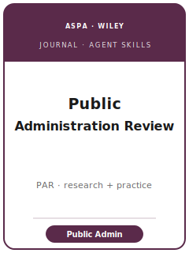

# Public Administration Review Skills

<p align="center">
  
</p>

[](LICENSE)
[](https://onlinelibrary.wiley.com/journal/15406210)
[](https://www.aspanet.org/ASPA/Publications/Public-Administration-Review/Public-Administration-Review.aspx)
[](https://github.com/anthropics/claude-code)

English | [简体中文](README.zh-CN.md)

Agent skill stack for manuscripts targeted at **Public Administration Review (PAR)** — the **flagship
journal of the American Society for Public Administration (ASPA)**, published by **Wiley**, and the
field's premier venue for **bureaucracy & governance, public-sector performance & management, public
personnel/HR, public finance & budgeting, collaborative governance, public service motivation, and
policy implementation**. PAR's defining feature is that it **bridges research and practice**: every
article is expected to speak to practitioners as well as scholars, via **Evidence for Practice**.

This repository is opinionated. It is **not** a generic social-science writing toolbox and it is
**not** a public-policy pack repurposed for administration. It is a **PAR-specific** stack: a question
of **field-wide significance to public administration**, a credible **practitioner "so-what,"** a
design defended on its own methodological terms, **double-blind** preparation, and a **TOP-compliant
transparency package** (Dataverse / QDR).

Official basis checked **2026-06** (检索于 2026-06；以官网为准). Volatile specifics (editors and term,
exact caps, fee/APC, portal, policy wording) change — items not directly confirmed are marked **待核实**
in [`resources/official-source-map.md`](resources/official-source-map.md). **Verify on the official
journal page.**

---

## What Is PAR, and Why a Dedicated Stack?

PAR's constraints differ from a theory-driven PA journal or a policy-analysis journal:

| Constraint            | PAR                                                                            | Implication                                                       |
|-----------------------|-------------------------------------------------------------------------------|------------------------------------------------------------------|
| Scope                 | **Whole field** of public administration & management                          | The paper must matter beyond its niche                           |
| Premium on            | **Field-wide significance + practitioner relevance** (research↔practice bridge)| A purely academic finding with no "so-what" is off-fit            |
| Methods               | Quantitative, experimental, qualitative, mixed — judged on own terms           | Do not force one template onto every paper                       |
| Signature requirement | **Evidence for Practice** — 3–5 takeaway points for practitioners              | Draft it with the contribution, not at the end                  |
| Publisher / owner     | **Wiley** / **ASPA**                                                           | Wiley submission system; confirm the live portal                 |
| Review model          | **Double-blind**                                                               | Anonymize the manuscript; refer to prior work in the third person|
| Fee                   | **No submission fee** stated                                                   | Do not budget a submission fee (verify) 待核实                    |
| Length                | **≤ 8,000 words** incl. abstract/endnotes/references; abstract **≤ 150**       | Tables/figures/appendices are excluded from the count           |
| Style                 | **APA author–date**                                                            | Confirm the current edition                                      |
| Transparency          | **TOP-guidelines signatory** — Dataverse/QDR, data-availability statement      | Build materials as you go; document design/prep decisions       |
| Article types         | Scholarly Take · Conceptualizing PA · Early Career Intel · Practically Speaking| Choose the right type up front                                   |

### Article types

- **Scholarly Takes** — submitted research manuscripts; the main empirical format.
- **Conceptualizing Public Administration** — conceptual/theoretical thought pieces and "state of PA."
- **Early Career Intel** — research manuscripts by junior scholars; same rigor, tighter scope.
- **Practically Speaking** — practitioner–scholar co-authored pieces (often from PAR Talk / On PAR).
- **Public Administration in Print** — book reviews (out of scope for this empirical stack).

---

## Quick Start

### Option A — Claude Code Plugin (recommended)

```bash
/plugin marketplace add https://github.com/brycewang-stanford/public-administration-review-skills
/plugin install public-administration-review-skills
/reload-plugins
```

### Option B — Manual Copy

```bash
git clone https://github.com/brycewang-stanford/public-administration-review-skills.git
cd public-administration-review-skills

mkdir -p ~/.claude/skills && cp -R skills/pubar-* ~/.claude/skills/
# or
mkdir -p ~/.codex/skills && cp -R skills/pubar-* ~/.codex/skills/
```

### First Prompt

```
Use pubar-workflow to tell me which skill I should use next for my PAR manuscript.
```

---

## Default Workflow

```text
pubar-topic-selection
        ▼
pubar-literature-positioning
        ▼
pubar-theory-building
        ▼
pubar-research-design
        ▼
pubar-data-analysis
        ▼
pubar-tables-figures
        ▼
pubar-writing-style          (polish + Evidence for Practice)
        ▼
pubar-transparency-and-data
        ▼
pubar-review-process
        ▼
pubar-submission
        ▼
pubar-rebuttal
```

`pubar-workflow` is the router — it tells you which skill to use next based on where you are and which
article type you are targeting. Draft the **practitioner "so-what"** alongside the contribution, not at
the end.

---

## Skills

| Skill                            | Purpose                                                                       |
|----------------------------------|-------------------------------------------------------------------------------|
| `pubar-workflow`                 | Router — decides which sub-skill to invoke next                               |
| `pubar-topic-selection`          | Field-wide significance + practitioner fit; pick the right article type        |
| `pubar-literature-positioning`   | Engage core PA debates; speak past your niche; guard against JPART/JPAM drift  |
| `pubar-theory-building`          | Build a portable mechanism with a managerial lever (the dual test)            |
| `pubar-research-design`          | Defend the design — reform DiD, bureaucrat/citizen experiments, case, mixed    |
| `pubar-data-analysis`            | Analysis norms, uncertainty, robustness; estimates that bear Evidence for Practice |
| `pubar-tables-figures`           | Accessible, self-contained exhibits that show magnitude to managers           |
| `pubar-writing-style`            | APA style; reach scholars + practitioners; write honest Evidence for Practice  |
| `pubar-transparency-and-data`    | TOP transparency; Dataverse/QDR; data-availability statement; restricted data  |
| `pubar-review-process`           | Double-blind review, desk screening, article-type routing, decision spectrum   |
| `pubar-submission`               | Preflight — anonymization, word/abstract caps, Evidence for Practice, portal    |
| `pubar-rebuttal`                 | R&R response-letter strategy protecting the contribution + Evidence for Practice|

### Resources

- [`resources/external_tools.md`](resources/external_tools.md) — PA data sources (FedScope / FEVS / Census of Governments / WGI / QoG) + R / Stata / Python and qualitative/CAQDAS tooling
- [`resources/official-source-map.md`](resources/official-source-map.md) — official Wiley / ASPA URLs behind every fact, with 待核实 markers on unverified items
- [`resources/worked-examples/01-introduction.md`](resources/worked-examples/01-introduction.md) — a before→after PAR-style introduction (fictional)
- [`resources/exemplars/library.md`](resources/exemplars/library.md) — real, web-verified PAR papers by subfield × method
- [`resources/code/`](resources/code/) — vendored Stata + Python causal-inference skeleton

---

## Differences vs. Sibling Journals

| Journal | Owner / publisher | What it is | How it differs from PAR |
|---------|-------------------|-----------|--------------------------|
| **PAR** | ASPA / Wiley | Practice-bridging PA flagship | Demands a credible practitioner "so-what" (Evidence for Practice) |
| **JPART** | Oxford | Theory-driven PA | More formal/theoretical; no practitioner-takeaway requirement |
| **JPAM** | APPAM / Wiley | Policy analysis & evaluation | Contribution is to *policy choice*, not *administration* |
| **Governance** | Wiley | Comparative institutions / governance | Lens is regime/institutional design, not public-management practice |
| **ARPA / Public Administration** | Sage / Wiley | General PA field journals | Distinct venues; do not attribute PAR policies to them |

---

## What This Repo Does Not Do

- It does not write a submittable manuscript for you
- It does not simulate any specific editor's or reviewer's taste
- It does not assert volatile metadata (current editors and term, exact caps, fee/APC, portal, policy wording) — verify on the official page; unverified items are marked 待核实
- It does not decide whether your question is of field-wide significance or whether your practitioner takeaway is honest — that is the researcher's call

---

## Related

- [awesome-journal-skills](https://github.com/brycewang-stanford/awesome-journal-skills) — Index of journal-specific skill packs
- [Public Administration Review (Wiley Online Library)](https://onlinelibrary.wiley.com/journal/15406210) — publisher home
- [PAR at ASPA](https://www.aspanet.org/ASPA/Publications/Public-Administration-Review/Public-Administration-Review.aspx) — owner, journal information

---

## License

MIT
