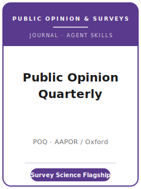

# 舆论季刊（POQ）技能包

<p align="center">
  
</p>

[](LICENSE)
[](https://academic.oup.com/poq)
[](https://academic.oup.com/poq/pages/About)
[](https://github.com/anthropics/claude-code)

[English](README.md) | 简体中文

面向 **《舆论季刊》（Public Opinion Quarterly, POQ）** 投稿的 Agent 技能栈。POQ 是
**舆论与调查研究领域的领军期刊**，**自 1937 年起出版**，由 **牛津大学出版社** 出版，是
**美国舆论研究协会（AAPOR）的官方期刊**。POQ 择优发表关于 **舆论与传播理论**、**当下舆论分析**，
以及 **调查效度方法论问题**（问卷设计、访员与访问、抽样策略、施测模式、无回应、加权）的重要创新成果。

本仓库是**有主见的**。它**不是**通用社会科学写作工具箱，**也不是**把经济学包改个名字套用到调查研究。
它是 **POQ 专属** 技能栈，以**调查科学**为脊梁：用 **总调查误差（Total Survey Error）** 框定贡献，
一个在覆盖/抽样/无回应/测量/模式/加权各环节都站得住的设计，写入 **"附录 A：披露要素（Appendix A:
Disclosure Elements）"** 的 **AAPOR 标准方法学披露**，**双盲** 稿件准备，以及一份存入
**Harvard Dataverse 上 POQ Dataverse**、能复现每一张表与图的可复现材料包。

---

## POQ 是什么，为何需要专属技能栈？

POQ 的约束不同于通用社科刊或纯方法刊：

| 约束 | POQ | 含义 |
|------|------|------|
| 范围 | **舆论 + 调查方法论**（兼及传播、行为） | 论文须对舆论或对调查效度有贡献 |
| 看重 | 以 **总调查误差** 框定的 **调查严谨性** | 无误差框架的朴素调查分析不合适 |
| 披露 | 写入 **"附录 A：披露要素"** 的 **AAPOR 标准披露** | 报告确切措辞、抽样、加权与回应率 |
| 回应率 | 按 **AAPOR 标准定义**（RR1–RR6）计算并展示算法 | 单给一个百分比不够 |
| 出版方 / 隶属 | **牛津大学出版社** / **AAPOR** | 通过 **ScholarOne Manuscripts** 投稿 |
| 评审模式 | **双盲**，通常 2–3 名审稿人 | 稿件须匿名；副主编评审中可索取代码/数据 |
| 篇幅 | **论文 ≤ 6,500**；**研究札记 < 3,000**；**Polls in Context ≤ 2,500** 词 | 上限计正文+注释；图表/附录不计入 |
| 透明度 | **可复现材料包存入 POQ 的 Harvard Dataverse**，排版前归档 | 边做边建；须复现每一张表与图 |
| 数据声明 | 篇末须含 **数据可得性声明（DAS）** | 规划 DAS 及任何禁运/受限数据路径 |

易变的具体信息（编辑与任期、确切篇幅上限、栏目名称、费用/APC、禁运期、政策措辞）会变化——未直接核实项在
[`resources/official-source-map.md`](resources/official-source-map.md) 中标记 **待核实**。
**请以官方页面为准。**

### 五种投稿类型

- **Original Articles（常规论文）**——完整研究，**≤ 6,500 词** 正文与注释；期刊主力形式。
- **Research Notes（研究札记）**——单一发现、重要扩展或复现，**< 3,000 词**。
- **Polls in Context（民调情境解读）**——对当下民调数据的简短、及时解读，**≤ 2,500 词**（栏目命名——
  历史上的 "The Polls — Trends / Review" 与当前 "Poll Trends" / "Polls in Context" 之别——为 待核实）。
- **Research Syntheses（研究综述）**——整合某一文献的整合性综述，**≤ 6,500 词**（含注释）。
- **Book Reviews（书评）**——对近期相关著作的简短评介，**约 1,200 词**。

---

## 快速开始

### 方式 A — Claude Code 插件（推荐）

```bash
/plugin marketplace add https://github.com/brycewang-stanford/poq-skills
/plugin install poq-skills
/reload-plugins
```

### 方式 B — 手动复制

```bash
git clone https://github.com/brycewang-stanford/poq-skills.git
cd poq-skills

mkdir -p ~/.claude/skills && cp -R skills/poq-* ~/.claude/skills/
# 或
mkdir -p ~/.codex/skills && cp -R skills/poq-* ~/.codex/skills/
```

### 第一条提示

```
用 poq-workflow 告诉我，我的 POQ 稿件下一步该用哪个技能。
```

---

## 默认工作流

```text
poq-topic-selection
        ▼
poq-literature-positioning
        ▼
poq-theory-and-hypotheses
        ▼
poq-survey-design-and-measurement
        ▼
poq-data-analysis
        ▼
poq-tables-figures
        ▼
poq-writing-style          （润色）
        ▼
poq-transparency-and-data-policy
        ▼
poq-review-process
        ▼
poq-submission
        ▼
poq-rebuttal
```

`poq-workflow` 是路由器——根据你所处阶段告诉你下一步用哪个技能。无论投稿类型，都应尽早走
`poq-survey-design-and-measurement` 锁定 **总调查误差** 框架，并在动笔前就开始撰写
**"附录 A：披露要素"**——披露是关卡，不是事后补丁。

---

## 技能列表

| 技能 | 用途 |
|------|------|
| `poq-workflow` | 路由器——决定下一步调用哪个子技能 |
| `poq-topic-selection` | 舆论贡献 vs. 调查效度贡献；选对投稿类型 |
| `poq-literature-positioning` | 既对话舆论争论，也接上调查方法论谱系 |
| `poq-theory-and-hypotheses` | 构念、机制与可证伪假设（实质性或方法性） |
| `poq-survey-design-and-measurement` | 总调查误差：覆盖、抽样、无回应、测量、模式、加权 |
| `poq-data-analysis` | 设计加权推断（权数/分层/聚类）、不确定性、稳健性 |
| `poq-tables-figures` | 自洽图表，含设计加权不确定性与基数 N |
| `poq-writing-style` | 在类型字数上限内触达 POQ 读者；点明方法学贡献 |
| `poq-transparency-and-data-policy` | 附录 A 披露；POQ Dataverse 可复现材料包；数据可得性声明 |
| `poq-review-process` | 双盲评审、2–3 审稿人、AAPOR 披露门槛、副主编索取代码/数据 |
| `poq-submission` | ScholarOne 投稿前检查（匿名、字数、附录 A、DAS、材料包） |
| `poq-rebuttal` | 面向调查方法论审稿人 + 副主编的 R&R 回应信策略 |

### 资源

- [`resources/external_tools.md`](resources/external_tools.md) — 调查数据源（ANES / GSS / CES / Pew / Eurobarometer / ESS）+ 复杂抽样、加权、测量与预测试工具
- [`resources/official-source-map.md`](resources/official-source-map.md) — 每条事实背后的 OUP / AAPOR 官方 URL，未核实项标 待核实

---

## 本仓库不做什么

- 不替你写出可直接投稿的稿件
- 不模拟任何特定编辑或审稿人的口味
- 不臆断易变元数据（现任编辑与任期、确切上限、栏目名称、费用/APC、政策措辞）——请以官方页面为准；未核实项标 待核实
- 不替你判断你的贡献属于舆论还是调查效度——那是研究者的判断

---

## 相关

- [awesome-journal-skills](https://github.com/brycewang-stanford/awesome-journal-skills) — 期刊专属技能包索引
- [Public Opinion Quarterly（牛津 Academic）](https://academic.oup.com/poq) — 出版方主页
- [美国舆论研究协会（AAPOR）](https://aapor.org/) — 所有者/隶属、透明度倡议、标准定义

---

## 许可

MIT
