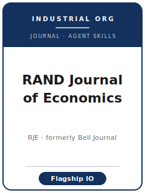

# RAND Journal of Economics Skills

<p align="center">
  
</p>

[](LICENSE)
[](https://www.rje.org/)
[](https://www.rje.org/)
[](https://github.com/anthropics/claude-code)

English | [简体中文](README.zh-CN.md)

Agent skill stack for manuscripts targeted at **The RAND Journal of Economics (RJE)** — the field's **flagship industrial-organization journal**, owned and sponsored by the **RAND Corporation** (Santa Monica) and published in partnership with **Wiley**. RJE is the continuation of the **Bell Journal of Economics**, and its purpose, in its own words, is "to support and encourage research in the behavior of regulated industries, the economic analysis of organizations, and more generally, applied microeconomics."

This repository is opinionated. It is **not** a generic economics-writing toolbox. It is an **RJE-specific** stack for **industrial organization**: a first-order question about how a market or firm works, answered with a structural model or a credible reduced-form design, delivering a competition, regulation, or welfare lesson — written to the RJE Style Guide and squeezed inside the journal's hard page caps.

---

## Why a Separate RJE Skill Stack?

RJE imposes constraints that differ materially from a general-interest top-5 (QJE) or a methods journal (Econometrica):

| Constraint            | RJE                                                                   | Implication                                                       |
|-----------------------|------------------------------------------------------------------------|------------------------------------------------------------------|
| Scope                 | **Deliberately narrow** — applied micro with an **IO core**            | A general-micro or macro question is off-fit                     |
| Length                | **Hard page caps**: main text <=40 pp, total <=50 pp, double-spaced     | You manage **pages**, not words; the cap is enforced at submission|
| Abstract              | **<=100 words**                                                        | No 250-word abstract                                             |
| Submission fee        | **$100 per article**, **non-refundable** as of January 1, 2026          | Budget for it; do not expect a refund (verify amount — 待核实)    |
| Portal                | **Wiley Research Exchange** (`wiley.atyponrex.com/journal/RAND`)        | Mandatory since April 23, 2025 (replaced Editorial Express)      |
| Review                | Editor screen (possible desk reject) → **two anonymous referees**       | The IO hook must be legible on page one                         |
| House style           | Author-date, **no page numbers**, **no issue numbers**, subsections unnumbered | Numbered/footnote cites read as off-template                |
| Usage rules           | because/as not *since*; whereas/although not *while*; **"article"** not *"paper"* | Copy editors enforce these                                  |
| Supporting info       | **Discouraged** "as a general rule"; not hosted by the journal; may be declined | Keep core results in the article + appendix                 |

Generic "scientific writing" or "econ writing" packs do not address these constraints. Volatile specifics (editors, exact fee, page caps, portal URL, data policy) change — **verify them on rje.org and the Wiley For Authors page**. Items this pack could not confirm officially are marked **待核实**.

---

## Quick Start

### Option A — Claude Code Plugin (recommended)

```bash
/plugin marketplace add https://github.com/brycewang-stanford/rje-skills
/plugin install rje-skills
/reload-plugins
```

### Option B — Manual Copy

```bash
git clone https://github.com/brycewang-stanford/rje-skills.git
cd rje-skills

mkdir -p ~/.claude/skills && cp -R skills/rje-* ~/.claude/skills/
# or
mkdir -p ~/.codex/skills && cp -R skills/rje-* ~/.codex/skills/
```

### First Prompt

```
Use rje-workflow to tell me which skill I should use next for my RJE manuscript.
```

---

## Default Workflow

```text
rje-topic-selection
        ▼
rje-contribution-framing
        ▼
rje-literature-positioning
        ▼
rje-identification-strategy
        ▼
rje-data-analysis
        ▼
rje-tables-figures
        ▼
rje-writing-style          (polish)
        ▼
rje-replication-and-data-policy
        ▼
rje-review-process
        ▼
rje-submission
        ▼
rje-rebuttal
```

`rje-workflow` is the router — it tells you which skill to use next based on where you are.

---

## Skills

| Skill                            | Purpose                                                                       |
|----------------------------------|-------------------------------------------------------------------------------|
| `rje-workflow`                   | Router — decides which sub-skill to invoke next                               |
| `rje-topic-selection`            | Test IO fit against RJE's deliberately narrow scope                           |
| `rje-contribution-framing`       | The one-sentence IO contribution, legible to the editor screen               |
| `rje-literature-positioning`     | Stake the contribution against the IO frontier (no standalone survey)        |
| `rje-identification-strategy`    | Structural demand/conduct/entry/auctions or reduced-form merger/regulation   |
| `rje-data-analysis`              | IO estimation diagnostics, robustness, and disciplined counterfactuals       |
| `rje-tables-figures`             | Parameter/elasticity/markup/welfare exhibits under the RJE Style Guide       |
| `rje-writing-style`              | Author-date cites + RJE house usage rules                                     |
| `rje-replication-and-data-policy`| Reproducible package + RJE's discouraging supporting-information rules        |
| `rje-review-process`             | Editor screen → two anonymous referees → handling Editor                     |
| `rje-submission`                 | Page caps, 100-word abstract, $100 fee, Wiley Research Exchange preflight     |
| `rje-rebuttal`                   | Respond to two referees + the Editor within the hard page caps               |

### Resources

- [`resources/official-source-map.md`](resources/official-source-map.md) — official RJE / Wiley URLs behind every fact, with accessed dates and 待核实 flags
- [`resources/external_tools.md`](resources/external_tools.md) — IO data sources (Nielsen/Kilts, FSRDC, FCC/FERC/DOT/CMS) and Stata / R / Python packages (`pyblp`, `BLPestimatoR`, `csdid`, `fixest`)

---

## Differences vs. Other Econ Stacks

| Dimension          | RJE                                       | QJE (general-interest)              | Econometrica                  |
|--------------------|-------------------------------------------|-------------------------------------|-------------------------------|
| Scope              | Narrow — industrial organization          | All of economics, general-interest  | Methods / theory              |
| Length control     | **Hard page caps** (40/50 pp)             | No firm cap; extensive appendix     | No firm cap                   |
| Lead with          | A market/firm mechanism + welfare lesson  | A big empirical-micro question      | A method / theorem            |
| Method             | Structural **or** reduced-form IO         | Natural experiment, figure-forward  | Estimator properties          |
| House style        | Author-date, no page/issue numbers        | Author-date (Chicago)               | Theorem-proof rigor           |

---

## What This Repo Does Not Do

- It does not write a submittable manuscript for you
- It does not simulate any specific editor's or referee's taste
- It does not assert volatile metadata (current editors, exact fee, page caps, data policy) — verify on rje.org; unconfirmed items are flagged 待核实
- It does not judge whether your IO question is genuinely first-order — that is the researcher's call

---

## Related

- [awesome-journal-skills](https://github.com/brycewang-stanford/awesome-journal-skills) — Index of journal-specific skill packs
- [RAND Journal of Economics (official)](https://www.rje.org/) — RAND Corporation / Wiley

---

## License

MIT
