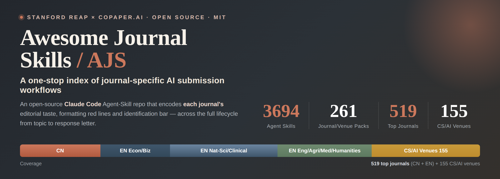

# Awesome Journal Skills (AJS)

<p align="center">
  
</p>

[](https://awesome.re)
[](LICENSE)
[](https://github.com/anthropics/claude-code)
[](https://copaper.ai)
[](https://github.com/brycewang-stanford/StatsPAI)

English | [简体中文](README.md)

<div align="center">
  <table>
    <tr>
      <td align="center">
        <a href="https://copaper.ai"></a>
      </td>
      <td width="56"></td>
      <td align="center">
        <a href="https://reap.fsi.stanford.edu/"></a>
      </td>
    </tr>
  </table>
  <sub><strong>Stanford REAP × CoPaper.AI</strong> · Curated and maintained by Stanford's empirical-methodology team</sub>
  <br/>
  <table>
    <tr>
      <td align="center">
        <a href="https://copaper.ai"></a><br/>
        <strong>Visit <a href="https://copaper.ai">copaper.ai</a></strong>
      </td>
      <td width="40"></td>
      <td align="center">
        <br/>
        <strong>WeChat: CoPaper.AI</strong>
      </td>
    </tr>
  </table>
</div>

<p align="center"><b>Coverage by 11 mainstream discipline areas</b></p>

<ul>
  <li><h1><a href="#discipline-cross">Multidisciplinary and cross-field venues</a></h1></li>
  <li><h1><a href="#discipline-business">Economics and management</a></h1></li>
  <li><h1><a href="#discipline-social-sciences">Social sciences</a></h1></li>
  <li><h1><a href="#discipline-humanities">Humanities</a></h1></li>
  <li><h1><a href="#discipline-math-physical">Mathematics and physical sciences</a></h1></li>
  <li><h1><a href="#discipline-life-sciences">Life sciences</a></h1></li>
  <li><h1><a href="#discipline-medicine-health">Medicine and health</a></h1></li>
  <li><h1><a href="#discipline-engineering-tech">Engineering and technology</a></h1></li>
  <li><h1><a href="#discipline-cs-ai">Computer science and AI</a></h1></li>
  <li><h1><a href="#discipline-agri-env-earth">Agriculture / environment / earth science</a></h1></li>
  <li><h1><a href="#discipline-sport-science">Sport science</a></h1></li>
</ul>

<p align="center">
Click any discipline name to jump to its explanation. Representative subfields are expanded in the overview paragraph below; the cover walls browse by venue, and the full map is in <a href="#-coverage-at-a-glance">Coverage at a Glance</a>.
</p>
<p align="center">
  <sub>
    <a href="#-quick-browsing--layout-guide">🧭 Layout Guide</a> ·
    <a href="#-the-skill-packs">📚 The Skill Packs</a> ·
    <a href="#-how-to-use">⚡ How to Use</a> ·
    <a href="#-roadmap">🗺 Roadmap</a> ·
    <a href="README.md">🌐 简体中文</a>
  </sub>
</p>

<p align="center">
  <a href="Economic-Research-Journal-Skills/"></a>
  <a href="Journal-of-Management-World-Skills/"></a>
  <a href="Social-Sciences-in-China-Skills/"></a>
  <a href="China-Industrial-Economics-Skills/"></a>
  <a href="Journal-of-World-Economy-Skills/"></a>
  <a href="China-Economic-Quarterly-Skills/"></a>
  <a href="Journal-of-Quantitative-and-Technological-Economics-Skills/"></a>
  <a href="Accounting-Research-Skills/"></a>
  <a href="Journal-of-Financial-Research-Skills/"></a>
  <a href="Journal-of-Management-Sciences-in-China-Skills/"></a>
  <a href="Nankai-Business-Review-Skills/"></a>
  <a href="Sociological-Studies-Skills/"></a>
</p>
<p align="center">
  <sub>Flagship Chinese social-science venues — every cover opens a journal-specific skill pack.</sub>
</p>
<p align="center">
  <a href="English-SocialScience-Journal-Skills/skills/american-economic-review/"></a>
  <a href="English-SocialScience-Journal-Skills/skills/quarterly-journal-of-economics/"></a>
  <a href="English-SocialScience-Journal-Skills/skills/journal-of-political-economy/"></a>
  <a href="English-SocialScience-Journal-Skills/skills/econometrica/"></a>
  <a href="English-SocialScience-Journal-Skills/skills/review-of-economic-studies/"></a>
  <a href="English-SocialScience-Journal-Skills/skills/journal-of-finance/"></a>
  <a href="English-SocialScience-Journal-Skills/skills/journal-of-financial-economics/"></a>
  <a href="English-SocialScience-Journal-Skills/skills/review-of-financial-studies/"></a>
  <a href="English-SocialScience-Journal-Skills/skills/academy-of-management-journal/"></a>
  <a href="English-SocialScience-Journal-Skills/skills/academy-of-management-review/"></a>
  <a href="English-SocialScience-Journal-Skills/skills/administrative-science-quarterly/"></a>
  <a href="English-SocialScience-Journal-Skills/skills/strategic-management-journal/"></a>
  <a href="English-SocialScience-Journal-Skills/skills/journal-of-marketing/"></a>
  <a href="English-SocialScience-Journal-Skills/skills/journal-of-marketing-research/"></a>
  <a href="English-SocialScience-Journal-Skills/skills/marketing-science/"></a>
  <a href="English-SocialScience-Journal-Skills/skills/the-accounting-review/"></a>
  <a href="English-SocialScience-Journal-Skills/skills/journal-of-accounting-research/"></a>
  <a href="English-SocialScience-Journal-Skills/skills/journal-of-accounting-and-economics/"></a>
  <a href="English-SocialScience-Journal-Skills/skills/management-science/"></a>
  <a href="English-SocialScience-Journal-Skills/skills/operations-research/"></a>
  <a href="English-SocialScience-Journal-Skills/skills/mis-quarterly/"></a>
  <a href="English-SocialScience-Journal-Skills/skills/information-systems-research/"></a>
</p>
<p align="center">
  <sub>Flagship English econ &amp; business venues from the <a href="English-SocialScience-Journal-Skills/">English-SocialScience-Journal-Skills</a> breadth bundle (<b>100 journals + selection router</b>). Tier badges (Top-5 · Top-3 · FT50 · UTD24) indicate tiering.</sub>
</p>
<details open>
<summary><b>🔬 Expanded by default: Natural Science &amp; Medicine Flagships — 154-journal cover wall</b>　General · Life sciences · Clinical medicine · Nature research · Physics &amp; astronomy · Chemistry &amp; materials · Earth &amp; environment · Mathematics &amp; computation · Frontiers</summary>

<!-- STEM-WALL-START -->
<h3 align="center">Natural Science &amp; Medicine Flagships — 154 Top Journals Covered</h3>
<p align="center"><sub>Click any cover to open the corresponding skill pack. <b>Depth packs (12 skills)</b>: Science · Nature · Cell · Cancer Cell · PNAS · PNAS Nexus · NEJM · JAMA · The Lancet · PRL · JACS · ES&amp;T; other covers link to the <a href="English-NaturalScience-Journal-Skills/">English-NaturalScience-Journal-Skills</a> breadth bundle.</sub></p>

<p align="center"><b>Multidisciplinary</b></p>
<p align="center">
  <a href="Science-Skills/"></a>
  <a href="English-NaturalScience-Journal-Skills/skills/nature/"></a>
  <a href="PNAS-Skills/"></a>
  <a href="PNAS-Nexus-Skills/"></a>
  <a href="English-NaturalScience-Journal-Skills/skills/science-advances/"></a>
  <a href="English-NaturalScience-Journal-Skills/skills/nature-communications/"></a>
  <a href="English-NaturalScience-Journal-Skills/skills/national-science-review/"></a>
  <a href="English-NaturalScience-Journal-Skills/skills/the-innovation/"></a>
</p>

<p align="center"><b>Life Sciences</b></p>
<p align="center">
  <a href="Cell-Skills/"></a>
  <a href="English-NaturalScience-Journal-Skills/skills/molecular-cell/"></a>
  <a href="English-NaturalScience-Journal-Skills/skills/cell-stem-cell/"></a>
  <a href="English-NaturalScience-Journal-Skills/skills/cell-metabolism/"></a>
  <a href="English-NaturalScience-Journal-Skills/skills/cell-host-and-microbe/"></a>
  <a href="English-NaturalScience-Journal-Skills/skills/developmental-cell/"></a>
  <a href="English-NaturalScience-Journal-Skills/skills/current-biology/"></a>
  <a href="English-NaturalScience-Journal-Skills/skills/immunity/"></a>
  <a href="English-NaturalScience-Journal-Skills/skills/neuron/"></a>
  <a href="English-NaturalScience-Journal-Skills/skills/the-plant-cell/"></a>
  <a href="English-NaturalScience-Journal-Skills/skills/genome-biology/"></a>
  <a href="English-NaturalScience-Journal-Skills/skills/nucleic-acids-research/"></a>
  <a href="English-NaturalScience-Journal-Skills/skills/the-embo-journal/"></a>
  <a href="English-NaturalScience-Journal-Skills/skills/elife/"></a>
  <a href="English-NaturalScience-Journal-Skills/skills/plos-biology/"></a>
  <a href="English-NaturalScience-Journal-Skills/skills/molecular-biology-and-evolution/"></a>
</p>

<p align="center"><b>Clinical Medicine</b></p>
<p align="center">
  <a href="NEJM-Skills/"></a>
  <a href="Lancet-Skills/"></a>
  <a href="JAMA-Skills/"></a>
  <a href="English-NaturalScience-Journal-Skills/skills/the-bmj/"></a>
  <a href="English-NaturalScience-Journal-Skills/skills/annals-of-internal-medicine/"></a>
  <a href="English-NaturalScience-Journal-Skills/skills/nature-medicine/"></a>
  <a href="English-NaturalScience-Journal-Skills/skills/ca-a-cancer-journal-for-clinicians/"></a>
  <a href="English-NaturalScience-Journal-Skills/skills/journal-of-clinical-oncology/"></a>
  <a href="English-NaturalScience-Journal-Skills/skills/journal-of-clinical-investigation/"></a>
  <a href="English-NaturalScience-Journal-Skills/skills/journal-of-experimental-medicine/"></a>
  <a href="English-NaturalScience-Journal-Skills/skills/cancer-discovery/"></a>
  <a href="Cancer-Cell-Skills/"></a>
  <a href="English-NaturalScience-Journal-Skills/skills/the-lancet-oncology/"></a>
  <a href="English-NaturalScience-Journal-Skills/skills/the-lancet-neurology/"></a>
  <a href="English-NaturalScience-Journal-Skills/skills/the-lancet-infectious-diseases/"></a>
  <a href="English-NaturalScience-Journal-Skills/skills/circulation/"></a>
  <a href="English-NaturalScience-Journal-Skills/skills/european-heart-journal/"></a>
  <a href="English-NaturalScience-Journal-Skills/skills/journal-of-the-american-college-of-cardiology/"></a>
  <a href="English-NaturalScience-Journal-Skills/skills/blood/"></a>
  <a href="English-NaturalScience-Journal-Skills/skills/gastroenterology/"></a>
  <a href="English-NaturalScience-Journal-Skills/skills/gut/"></a>
  <a href="English-NaturalScience-Journal-Skills/skills/diabetes-care/"></a>
  <a href="English-NaturalScience-Journal-Skills/skills/plos-medicine/"></a>
  <a href="English-NaturalScience-Journal-Skills/skills/molecular-psychiatry/"></a>
</p>

<p align="center"><b>Nature Research</b></p>
<p align="center">
  <a href="English-NaturalScience-Journal-Skills/skills/nature-genetics/"></a>
  <a href="English-NaturalScience-Journal-Skills/skills/nature-methods/"></a>
  <a href="English-NaturalScience-Journal-Skills/skills/nature-biotechnology/"></a>
  <a href="English-NaturalScience-Journal-Skills/skills/nature-cell-biology/"></a>
  <a href="English-NaturalScience-Journal-Skills/skills/nature-immunology/"></a>
  <a href="English-NaturalScience-Journal-Skills/skills/nature-microbiology/"></a>
  <a href="English-NaturalScience-Journal-Skills/skills/nature-neuroscience/"></a>
  <a href="English-NaturalScience-Journal-Skills/skills/nature-structural-and-molecular-biology/"></a>
  <a href="English-NaturalScience-Journal-Skills/skills/nature-human-behaviour/"></a>
  <a href="English-NaturalScience-Journal-Skills/skills/nature-machine-intelligence/"></a>
  <a href="English-NaturalScience-Journal-Skills/skills/nature-materials/"></a>
  <a href="English-NaturalScience-Journal-Skills/skills/nature-nanotechnology/"></a>
  <a href="English-NaturalScience-Journal-Skills/skills/nature-chemistry/"></a>
  <a href="English-NaturalScience-Journal-Skills/skills/nature-catalysis/"></a>
  <a href="English-NaturalScience-Journal-Skills/skills/nature-physics/"></a>
  <a href="English-NaturalScience-Journal-Skills/skills/nature-photonics/"></a>
  <a href="English-NaturalScience-Journal-Skills/skills/nature-astronomy/"></a>
  <a href="English-NaturalScience-Journal-Skills/skills/nature-geoscience/"></a>
  <a href="English-NaturalScience-Journal-Skills/skills/nature-climate-change/"></a>
  <a href="English-NaturalScience-Journal-Skills/skills/nature-ecology-and-evolution/"></a>
  <a href="English-NaturalScience-Journal-Skills/skills/nature-energy/"></a>
  <a href="English-NaturalScience-Journal-Skills/skills/nature-sustainability/"></a>
</p>

<p align="center"><b>Physics &amp; Astronomy</b></p>
<p align="center">
  <a href="Physical-Review-Letters-Skills/"></a>
  <a href="English-NaturalScience-Journal-Skills/skills/physical-review-x/"></a>
  <a href="English-NaturalScience-Journal-Skills/skills/physical-review-b/"></a>
  <a href="English-NaturalScience-Journal-Skills/skills/physical-review-d/"></a>
  <a href="English-NaturalScience-Journal-Skills/skills/reviews-of-modern-physics/"></a>
  <a href="English-NaturalScience-Journal-Skills/skills/reports-on-progress-in-physics/"></a>
  <a href="English-NaturalScience-Journal-Skills/skills/prx-quantum/"></a>
  <a href="English-NaturalScience-Journal-Skills/skills/the-astrophysical-journal/"></a>
  <a href="English-NaturalScience-Journal-Skills/skills/monthly-notices-of-the-royal-astronomical-society/"></a>
  <a href="English-NaturalScience-Journal-Skills/skills/astronomy-and-astrophysics/"></a>
  <a href="English-NaturalScience-Journal-Skills/skills/the-astronomical-journal/"></a>
  <a href="English-NaturalScience-Journal-Skills/skills/journal-of-high-energy-physics/"></a>
  <a href="English-NaturalScience-Journal-Skills/skills/new-journal-of-physics/"></a>
  <a href="English-NaturalScience-Journal-Skills/skills/physical-review-e/"></a>
  <a href="English-NaturalScience-Journal-Skills/skills/physical-review-applied/"></a>
  <a href="English-NaturalScience-Journal-Skills/skills/nature-reviews-physics/"></a>
  <a href="English-NaturalScience-Journal-Skills/skills/physics-reports/"></a>
  <a href="English-NaturalScience-Journal-Skills/skills/classical-and-quantum-gravity/"></a>
  <a href="English-NaturalScience-Journal-Skills/skills/living-reviews-in-relativity/"></a>
  <a href="English-NaturalScience-Journal-Skills/skills/astrophysical-journal-letters/"></a>
  <a href="English-NaturalScience-Journal-Skills/skills/annual-review-of-astronomy-and-astrophysics/"></a>
</p>

<p align="center"><b>Chemistry &amp; Materials</b></p>
<p align="center">
  <a href="Journal-of-the-American-Chemical-Society-Skills/"></a>
  <a href="English-NaturalScience-Journal-Skills/skills/angewandte-chemie-international-edition/"></a>
  <a href="English-NaturalScience-Journal-Skills/skills/chemical-reviews/"></a>
  <a href="English-NaturalScience-Journal-Skills/skills/chemical-society-reviews/"></a>
  <a href="English-NaturalScience-Journal-Skills/skills/accounts-of-chemical-research/"></a>
  <a href="English-NaturalScience-Journal-Skills/skills/chem/"></a>
  <a href="English-NaturalScience-Journal-Skills/skills/acs-nano/"></a>
  <a href="English-NaturalScience-Journal-Skills/skills/advanced-materials/"></a>
  <a href="English-NaturalScience-Journal-Skills/skills/joule/"></a>
  <a href="English-NaturalScience-Journal-Skills/skills/energy-and-environmental-science/"></a>
  <a href="English-NaturalScience-Journal-Skills/skills/nature-reviews-chemistry/"></a>
  <a href="English-NaturalScience-Journal-Skills/skills/acs-catalysis/"></a>
  <a href="English-NaturalScience-Journal-Skills/skills/nature-reviews-materials/"></a>
  <a href="English-NaturalScience-Journal-Skills/skills/matter/"></a>
  <a href="English-NaturalScience-Journal-Skills/skills/nature-synthesis/"></a>
  <a href="English-NaturalScience-Journal-Skills/skills/jacs-au/"></a>
  <a href="English-NaturalScience-Journal-Skills/skills/acs-central-science/"></a>
  <a href="English-NaturalScience-Journal-Skills/skills/coordination-chemistry-reviews/"></a>
  <a href="English-NaturalScience-Journal-Skills/skills/advanced-energy-materials/"></a>
  <a href="English-NaturalScience-Journal-Skills/skills/advanced-functional-materials/"></a>
  <a href="English-NaturalScience-Journal-Skills/skills/acs-energy-letters/"></a>
  <a href="English-NaturalScience-Journal-Skills/skills/npj-computational-materials/"></a>
</p>

<p align="center"><b>Earth, Environment &amp; Ecology</b></p>
<p align="center">
  <a href="Environmental-Science-and-Technology-Skills/"></a>
  <a href="English-NaturalScience-Journal-Skills/skills/ecology-letters/"></a>
  <a href="English-NaturalScience-Journal-Skills/skills/one-earth/"></a>
  <a href="English-NaturalScience-Journal-Skills/skills/trends-in-ecology-and-evolution/"></a>
  <a href="English-NaturalScience-Journal-Skills/skills/global-ecology-and-biogeography/"></a>
  <a href="English-NaturalScience-Journal-Skills/skills/the-isme-journal/"></a>
  <a href="English-NaturalScience-Journal-Skills/skills/geophysical-research-letters/"></a>
  <a href="English-NaturalScience-Journal-Skills/skills/reviews-of-geophysics/"></a>
  <a href="English-NaturalScience-Journal-Skills/skills/nature-water/"></a>
  <a href="English-NaturalScience-Journal-Skills/skills/water-research/"></a>
  <a href="English-NaturalScience-Journal-Skills/skills/atmospheric-chemistry-and-physics/"></a>
  <a href="English-NaturalScience-Journal-Skills/skills/annual-review-of-ecology-evolution-and-systematics/"></a>
  <a href="English-NaturalScience-Journal-Skills/skills/molecular-ecology/"></a>
  <a href="English-NaturalScience-Journal-Skills/skills/journal-of-ecology/"></a>
  <a href="English-NaturalScience-Journal-Skills/skills/functional-ecology/"></a>
  <a href="English-NaturalScience-Journal-Skills/skills/journal-of-geophysical-research-atmospheres/"></a>
  <a href="English-NaturalScience-Journal-Skills/skills/nature-reviews-earth-and-environment/"></a>
  <a href="English-NaturalScience-Journal-Skills/skills/earths-future/"></a>
  <a href="English-NaturalScience-Journal-Skills/skills/the-cryosphere/"></a>
</p>

<p align="center"><b>Mathematics &amp; Computation</b></p>
<p align="center">
  <a href="English-NaturalScience-Journal-Skills/skills/annals-of-mathematics/"></a>
  <a href="English-NaturalScience-Journal-Skills/skills/inventiones-mathematicae/"></a>
  <a href="English-NaturalScience-Journal-Skills/skills/journal-of-the-american-mathematical-society/"></a>
  <a href="English-NaturalScience-Journal-Skills/skills/journal-of-machine-learning-research/"></a>
  <a href="English-NaturalScience-Journal-Skills/skills/ieee-transactions-on-pattern-analysis-and-machine-intelligence/"></a>
  <a href="English-NaturalScience-Journal-Skills/skills/communications-on-pure-and-applied-mathematics/"></a>
  <a href="English-NaturalScience-Journal-Skills/skills/advances-in-mathematics/"></a>
  <a href="English-NaturalScience-Journal-Skills/skills/duke-mathematical-journal/"></a>
  <a href="English-NaturalScience-Journal-Skills/skills/siam-review/"></a>
  <a href="English-NaturalScience-Journal-Skills/skills/journal-of-the-acm/"></a>
  <a href="English-NaturalScience-Journal-Skills/skills/acta-mathematica/"></a>
  <a href="English-NaturalScience-Journal-Skills/skills/geometry-and-topology/"></a>
  <a href="English-NaturalScience-Journal-Skills/skills/foundations-of-computational-mathematics/"></a>
  <a href="English-NaturalScience-Journal-Skills/skills/siam-journal-on-computing/"></a>
</p>

<p align="center"><b>Frontiers</b></p>
<p align="center">
  <a href="English-NaturalScience-Journal-Skills/skills/science-immunology/"></a>
  <a href="English-NaturalScience-Journal-Skills/skills/science-robotics/"></a>
  <a href="English-NaturalScience-Journal-Skills/skills/science-translational-medicine/"></a>
  <a href="English-NaturalScience-Journal-Skills/skills/trends-in-cognitive-sciences/"></a>
  <a href="English-NaturalScience-Journal-Skills/skills/science-signaling/"></a>
  <a href="English-NaturalScience-Journal-Skills/skills/cell-reports-medicine/"></a>
  <a href="English-NaturalScience-Journal-Skills/skills/nature-reviews-methods-primers/"></a>
  <a href="English-NaturalScience-Journal-Skills/skills/nature-reviews-drug-discovery/"></a>
  <a href="English-NaturalScience-Journal-Skills/skills/the-lancet-digital-health/"></a>
</p>
<!-- STEM-WALL-END -->

</details>

A curated index of **journal- and conference-specific agent skill packs** for manuscript work — every skill covers one stage of the paper lifecycle: selecting topics, framing the advance, identifying causal effects, formatting tables and figures, preparing replication / data-availability packages, and responding to reviewers. Coverage spans these **11 mainstream discipline areas**: **multidisciplinary and cross-field venues** (generalist journals, interdisciplinary science, computational social science, bioinformatics, network science), **economics and business** (economics, finance, accounting, management, marketing, operations, information systems, entrepreneurship), **social sciences** (sociology, anthropology, political science, law, public administration, demography, communication, geography, psychology), **humanities** (history, philosophy, literature, arts, religious studies), **mathematics and physical sciences** (mathematics, statistics, physics, astronomy, chemistry, materials, energy), **life sciences** (cell biology, molecular biology, genomics, immunology, microbiology, neuroscience, plant science, ecology and evolution), **medicine and health** (general medicine, oncology, cardiovascular medicine, neurology, infectious disease, internal medicine, public health, translational medicine), **engineering and technology** (control, communications, electronics, power systems, robotics, biomedical engineering, manufacturing, aerospace, civil and transportation engineering, chemical and process engineering), **computer science and AI** (machine learning, artificial intelligence, data mining, natural language processing, computer vision, robotics, human-computer interaction, systems, security, software engineering), **agriculture / environment / earth science** (agriculture, food, plants, soil, crops, environment, climate, earth science, atmospheric science, hydrology, ocean science), and **sport science** (exercise science, sports medicine, training science, sport humanities and social science).

Each pack is **journal-specific by design**: it encodes the editorial preferences, formatting conventions, identification standards, and review culture of a single target venue. Generic "scientific writing" skill packs miss these constraints.

---

> ### 🎯 In one line: turn "where to submit, how to write, and why it got rejected" into an installable, journal-specific AI workflow.
>
> Your manuscript stalls at **AER** over identification, at **Management World** over missing China institutional context, at **Economic Research** over missing classic theory — **same paper, completely different desk-reject triggers**. A one-size-fits-all "academic writing" assistant can never learn that difference. This repo encodes each journal's editorial preferences, formatting red lines, and review culture, one venue at a time.

### ⚡ 30-Second Start

```bash
# 1) Add this repository as a marketplace once
/plugin marketplace add https://github.com/brycewang-stanford/awesome-journal-skills
# 2) Install the target journal pack (QJE shown here; pack names are listed in each depth pack / breadth bundle)
/plugin install qje-skills
/reload-plugins
```

Then hand your target journal's manuscript to its workflow skill:

```text
Use qje-workflow to assess how far my draft is from QJE's bar and what to do next.
```

> Not sure where to submit yet? Use a **breadth bundle**'s router skill to pick a venue first, then install the matching **depth pack**. Full path in the [Quick Browsing & Layout Guide](#-quick-browsing--layout-guide) below.

### 🧭 Contents

| 🧭 Start · Rationale | 📚 Browse · Index | 🚀 Use · Collaborate |
|---|---|---|
| [Quick Browsing & Layout Guide](#-quick-browsing--layout-guide) | [The Skill Packs](#-the-skill-packs) | [How to Use](#-how-to-use) |
| [Why journal-specific](#-why-journal-specific-skills) | [200 Root Journal Folders](#-200-root-journal-folders) | [Pack Picker](#-pack-selection-cheat-sheet) |
| [Roadmap](#-roadmap) | [Repository Layout](#-repository-layout) | [Contributing](#-contributing) |
| [Related Projects](#-related-projects) | [Maintainers](#-maintainers) | [🌐 中文 README](README.md) |

### 📊 Coverage at a Glance

| Block | Subfields | Representative venues | Form |
|------|-----------|-----------------------|------|
| <a id="discipline-cross"></a>🌐 **Multidisciplinary & cross-field** | general flagships · cross-disciplinary science · computational social science · bioinformatics · network science | Science · PNAS · Nature Communications · Science Advances · PNAS Nexus · Nature Human Behaviour | depth packs + EN natural-science breadth bundle + imported Nature family |
| <a id="discipline-business"></a>💼 **Economics & management** | economics · finance · management · accounting · marketing · operations · information systems | AER · QJE · JPE · Econometrica · JF · AMJ · TAR · MISQ · Economic Research · Management World | depth packs + CN/EN breadth bundles |
| <a id="discipline-social-sciences"></a>🧭 **Social sciences** | sociology · anthropology · political science · psychology · education · demography · communication · public administration · law · geography | ASR · AJS · APSR · AJPS · JPSP · Demography · POQ · HLR · Progress in Human Geography | depth packs + CN/EN breadth bundles |
| <a id="discipline-humanities"></a>🏛 **Humanities** | history · art history · philosophy · literature · religion · critical theory | AHR · PMLA · Mind · Critical Inquiry · The Art Bulletin · JAAR | depth packs + English humanities breadth bundle |
| <a id="discipline-math-physical"></a>📐 **Mathematics & physical sciences** | mathematics · physics · astronomy · chemistry · materials · energy | Annals of Mathematics · PRL · Nature Physics · JACS · Nature Materials · Nature Energy | depth packs + EN natural-science breadth bundle |
| <a id="discipline-life-sciences"></a>🧬 **Life sciences** | cell · molecular · genomics · immunology · microbiology · neuroscience · plant science · ecology/evolution | Cell · Cancer Cell · Molecular Cell · Neuron · Immunity · The Plant Cell · eLife | depth packs + EN natural-science breadth bundle |
| <a id="discipline-medicine-health"></a>🩺 **Medicine & health** | general medicine · oncology · cardiology · neurology · infectious disease · internal medicine · public health · translational medicine | NEJM · The Lancet · JAMA · BMJ · JCO · Circulation · Blood · Gastroenterology | depth packs + clinical medicine breadth bundle + EN natural-science breadth bundle |
| <a id="discipline-engineering-tech"></a>⚙️ **Engineering & technology** | control · communications · signal processing · power · robotics · photonics · biomedical engineering · materials | Proceedings of the IEEE · TAC · Automatica · Optica · Nature Electronics · Acta Materialia | English engineering breadth bundle |
| <a id="discipline-cs-ai"></a>🤖 **Computer science & AI** | AI/ML · CV · NLP · data mining · systems · databases · security · HCI · theory | NeurIPS · ICML · ICLR · AAAI · IJCAI · AISTATS + 155 venues | CS/AI depth packs + conference breadth bundle |
| <a id="discipline-agri-env-earth"></a>🌱 **Agriculture, environment & earth science** | agricultural systems · crops · environmental science · climate · conservation · earth systems | Field Crops Research · Agricultural Systems · ES&T · Global Environmental Change · Conservation Biology · Global Change Biology | depth packs + agriculture/environment breadth bundle |
| <a id="discipline-sport-science"></a>🏅 **Sport science** | training · physical education · kinesiology · sport social science | 体育科学 · Journal of Beijing Sport University · Journal of Shanghai University of Sport | Chinese sport-science breadth bundle |

<sub><b>195 packs / 2902 skills</b> total. A "depth pack" = one venue, end-to-end (~12 skills); a "breadth bundle" = one lightweight "venue-fit + house-style" skill per venue plus a router.</sub>

---

## 🧭 Quick Browsing & Layout Guide

Use the repo in three passes:

| What you see | What it means | Use it when |
|---|---|---|
| **Cover cards and root journal folders** like `American-Economic-Review/` or `Jingji-Yanjiu/` | Navigation entries only; they point to the canonical skill location and intentionally do not contain `SKILL.md`. | You are browsing by journal name from the GitHub root. |
| **Depth packs** like `Economic-Research-Journal-Skills/`, `Cell-Skills/`, or `Quarterly-Journal-of-Economics-Skills/` | Full per-venue workflows, usually 9-13 skills covering topic fit, framing, methods, tables, submission, and rebuttal. | You are targeting a flagship venue and need lifecycle help. |
| **Breadth bundles**: `Chinese-SocialScience-Journal-Skills/`, `English-SocialScience-Journal-Skills/`, `English-NaturalScience-Journal-Skills/`, `Engineering-Technology-Journal-Skills/`, `Agriculture-Environment-Journal-Skills/`, `Clinical-Medicine-Journal-Skills/`, `English-Humanities-Journal-Skills/`, `Chinese-Sport-Science-Journal-Skills/`, `Computer-Science-Conference-Skills/` | One lightweight fit-and-house-style skill per journal, plus a router skill for venue selection. | You need broad coverage across 100-journal roadmaps, or you are still comparing targets. |
| **Third-party listings (external links)** like [nature-skills](https://github.com/Yuan1z0825/nature-skills), [claude-scholar](https://github.com/Galaxy-Dawn/claude-scholar), or [codex-claude-academic-skills](https://github.com/zLanqing/codex-claude-academic-skills) | Curated upstream packs or general academic tooling listed as external links, not vendored into this repository. | You need cross-journal research, writing, or workflow support. |

Rule of thumb: start from a root folder or cover card when browsing, use a breadth bundle when choosing between venues, and use a depth pack once the target journal is fixed.

<details open>
<summary><b>📂 Click to expand: the 200 root journal-entry folders</b> (100 Chinese pinyin folders + 100 English folders, for browsing by venue name on the GitHub home page)</summary>

<!-- ROOT-JOURNAL-FOLDERS:START -->

## 📂 200 Root Journal Folders

For visual browsing at the repository root, the 200 social-science breadth journals now also have one lightweight folder each: 100 Chinese roadmap journals in pinyin folder names, and 100 English econ / finance / management / business journals in title-style folder names. These folders are navigation entries only; the canonical installable `SKILL.md` files remain inside their bundle directories, so plugin paths and the 2902-skill count stay stable.

### Chinese Roadmap Journals · 100 Pinyin Folders

|  |  |  |  |
|---|---|---|---|
| [Kuaiji-Yu-Jingji-Yanjiu/](Kuaiji-Yu-Jingji-Yanjiu/)<br><sub>《会计与经济研究》</sub> | [Kuaiji-Yanjiu/](Kuaiji-Yanjiu/)<br><sub>《会计研究》</sub> | [Yatai-Jingji/](Yatai-Jingji/)<br><sub>《亚太经济》</sub> | [Shenji-Yu-Jingji-Yanjiu/](Shenji-Yu-Jingji-Yanjiu/)<br><sub>《审计与经济研究》</sub> |
| [Shenji-Yanjiu/](Shenji-Yanjiu/)<br><sub>《审计研究》</sub> | [Zhongguo-Kexueyuan-Yuankan/](Zhongguo-Kexueyuan-Yuankan/)<br><sub>《中国科学院院刊》</sub> | [Jingji-Guanli/](Jingji-Guanli/)<br><sub>《经济管理》</sub> | [Kuaiji-Pinglun/](Kuaiji-Pinglun/)<br><sub>《会计评论》</sub> |
| [Jingjixue-Jikan/](Jingjixue-Jikan/)<br><sub>《经济学（季刊）》</sub> | [Zhongguo-Jingji-Wenti/](Zhongguo-Jingji-Wenti/)<br><sub>《中国经济问题》</sub> | [Zhongguo-Gongye-Jingji/](Zhongguo-Gongye-Jingji/)<br><sub>《中国工业经济》</sub> | [Gonggong-Guanli-Pinglun/](Gonggong-Guanli-Pinglun/)<br><sub>《公共管理评论》</sub> |
| [Zhongguo-Nongcun-Jingji/](Zhongguo-Nongcun-Jingji/)<br><sub>《中国农村经济》</sub> | [Zhongguo-Nongcun-Guancha/](Zhongguo-Nongcun-Guancha/)<br><sub>《中国农村观察》</sub> | [Zhongguo-Ruan-Kexue/](Zhongguo-Ruan-Kexue/)<br><sub>《中国软科学》</sub> | [Guanli-Xuebao/](Guanli-Xuebao/)<br><sub>《管理学报》</sub> |
| [Zhongguo-Guanli-Kexue/](Zhongguo-Guanli-Kexue/)<br><sub>《中国管理科学》</sub> | [Zhongguo-Xingzheng-Guanli/](Zhongguo-Xingzheng-Guanli/)<br><sub>《中国行政管理》</sub> | [Jinrong-Pinglun/](Jinrong-Pinglun/)<br><sub>《金融评论》</sub> | [Jingji-Shehui-Tizhi-Bijiao/](Jingji-Shehui-Tizhi-Bijiao/)<br><sub>《经济社会体制比较》</sub> |
| [Xiandai-Riben-Jingji/](Xiandai-Riben-Jingji/)<br><sub>《现代日本经济》</sub> | [Dangdai-Caijing/](Dangdai-Caijing/)<br><sub>《当代财经》</sub> | [Dianzi-Zhengwu/](Dianzi-Zhengwu/)<br><sub>《电子政务》</sub> | [Huadong-Jingji-Guanli/](Huadong-Jingji-Guanli/)<br><sub>《华东经济管理》</sub> |
| [Jingji-Zongheng/](Jingji-Zongheng/)<br><sub>《经济纵横》</sub> | [Jingjixue-Dongtai/](Jingjixue-Dongtai/)<br><sub>《经济学动态》</sub> | [Jingji-Wenti/](Jingji-Wenti/)<br><sub>《经济问题》</sub> | [Jingji-Yanjiu/](Jingji-Yanjiu/)<br><sub>《经济研究》</sub> |
| [Jingji-Pinglun/](Jingji-Pinglun/)<br><sub>《经济评论》</sub> | [Jingji-Kexue/](Jingji-Kexue/)<br><sub>《经济科学》</sub> | [Jingji-Lilun-Yu-Jingji-Guanli/](Jingji-Lilun-Yu-Jingji-Guanli/)<br><sub>《经济理论与经济管理》</sub> | [Jingjixuejia/](Jingjixuejia/)<br><sub>《经济学家》</sub> |
| [Caijing-Kexue/](Caijing-Kexue/)<br><sub>《财经科学》</sub> | [Caimao-Jingji/](Caimao-Jingji/)<br><sub>《财贸经济》</sub> | [Jinrong-Jianguan-Yanjiu/](Jinrong-Jianguan-Yanjiu/)<br><sub>《金融监管研究》</sub> | [Waiguo-Jingji-Yu-Guanli/](Waiguo-Jingji-Yu-Guanli/)<br><sub>《外国经济与管理》</sub> |
| [Zhongguo-Keji-Luntan/](Zhongguo-Keji-Luntan/)<br><sub>《中国科技论坛》</sub> | [Gongcheng-Guanli-Keji-Qianyan/](Gongcheng-Guanli-Keji-Qianyan/)<br><sub>《工程管理科技前沿》</sub> | [Zhili-Yanjiu/](Zhili-Yanjiu/)<br><sub>《治理研究》</sub> | [Chanye-Jingji-Yanjiu/](Chanye-Jingji-Yanjiu/)<br><sub>《产业经济研究》</sub> |
| [Jingji-Wenti-Tansuo/](Jingji-Wenti-Tansuo/)<br><sub>《经济问题探索》</sub> | [Guoji-Jingji-Pinglun/](Guoji-Jingji-Pinglun/)<br><sub>《国际经济评论》</sub> | [Guoji-Jingmao-Tansuo/](Guoji-Jingmao-Tansuo/)<br><sub>《国际经贸探索》</sub> | [Nongye-Jingji-Wenti/](Nongye-Jingji-Wenti/)<br><sub>《农业经济问题》</sub> |
| [Nongye-Jishu-Jingji/](Nongye-Jishu-Jingji/)<br><sub>《农业技术经济》</sub> | [Shangye-Jingji-Yu-Guanli/](Shangye-Jingji-Yu-Guanli/)<br><sub>《商业经济与管理》</sub> | [Zhongyang-Caijing-Daxue-Xuebao/](Zhongyang-Caijing-Daxue-Xuebao/)<br><sub>《中央财经大学学报》</sub> | [Caijing-Yanjiu/](Caijing-Yanjiu/)<br><sub>《财经研究》</sub> |
| [Jinrong-Yanjiu/](Jinrong-Yanjiu/)<br><sub>《金融研究》</sub> | [Guangdong-Caijing-Daxue-Xuebao/](Guangdong-Caijing-Daxue-Xuebao/)<br><sub>《广东财经大学学报》</sub> | [Guanli-Gongcheng-Xuebao/](Guanli-Gongcheng-Xuebao/)<br><sub>《管理工程学报》</sub> | [Guoji-Maoyi-Wenti/](Guoji-Maoyi-Wenti/)<br><sub>《国际贸易问题》</sub> |
| [Jiangxi-Caijing-Daxue-Xuebao/](Jiangxi-Caijing-Daxue-Xuebao/)<br><sub>《江西财经大学学报》</sub> | [Hongguan-Zhiliang-Yanjiu/](Hongguan-Zhiliang-Yanjiu/)<br><sub>《宏观质量研究》</sub> | [Guanli-Xuekan/](Guanli-Xuekan/)<br><sub>《管理学刊》</sub> | [Guanli-Kexue-Xuebao/](Guanli-Kexue-Xuebao/)<br><sub>《管理科学学报》</sub> |
| [Gonggong-Guanli-Xuebao/](Gonggong-Guanli-Xuebao/)<br><sub>《公共管理学报》</sub> | [Shuliang-Jingji-Jishu-Jingji-Yanjiu/](Shuliang-Jingji-Jishu-Jingji-Yanjiu/)<br><sub>《数量经济技术经济研究》</sub> | [Shanghai-Caijing-Daxue-Xuebao/](Shanghai-Caijing-Daxue-Xuebao/)<br><sub>《上海财经大学学报》</sub> | [Shanxi-Caijing-Daxue-Xuebao/](Shanxi-Caijing-Daxue-Xuebao/)<br><sub>《山西财经大学学报》</sub> |
| [Shijie-Jingji/](Shijie-Jingji/)<br><sub>《世界经济》</sub> | [Zhongnan-Caijing-Zhengfa-Daxue-Xuebao/](Zhongnan-Caijing-Zhengfa-Daxue-Xuebao/)<br><sub>《中南财经政法大学学报》</sub> | [Hongguan-Jingji-Yanjiu/](Hongguan-Jingji-Yanjiu/)<br><sub>《宏观经济研究》</sub> | [Guanli-Pinglun/](Guanli-Pinglun/)<br><sub>《管理评论》</sub> |
| [Guanli-Kexue/](Guanli-Kexue/)<br><sub>《管理科学》</sub> | [Guanli-Shijie/](Guanli-Shijie/)<br><sub>《管理世界》</sub> | [Xiandai-Jingji-Tantao/](Xiandai-Jingji-Tantao/)<br><sub>《现代经济探讨》</sub> | [Dangdai-Jingji-Kexue/](Dangdai-Jingji-Kexue/)<br><sub>《当代经济科学》</sub> |
| [Xiandai-Caijing-Tianjin-Caijing-Daxue-Xuebao/](Xiandai-Caijing-Tianjin-Caijing-Daxue-Xuebao/)<br><sub>《现代财经（天津财经大学学报）》</sub> | [Xiandai-Jinrong-Yanjiu/](Xiandai-Jinrong-Yanjiu/)<br><sub>《现代金融研究》</sub> | [Nankai-Guanli-Pinglun/](Nankai-Guanli-Pinglun/)<br><sub>《南开管理评论》</sub> | [Nankai-Jingji-Yanjiu/](Nankai-Jingji-Yanjiu/)<br><sub>《南开经济研究》</sub> |
| [Zuzhi-Yu-Guanli/](Zuzhi-Yu-Guanli/)<br><sub>《组织与管理》</sub> | [Gonggong-Guanli-Yu-Zhengce-Pinglun/](Gonggong-Guanli-Yu-Zhengce-Pinglun/)<br><sub>《公共管理与政策评论》</sub> | [Caizheng-Yanjiu/](Caizheng-Yanjiu/)<br><sub>《财政研究》</sub> | [Gaige/](Gaige/)<br><sub>《改革》</sub> |
| [Jingji-Tizhi-Gaige/](Jingji-Tizhi-Gaige/)<br><sub>《经济体制改革》</sub> | [Yanjiu-Yu-Fazhan-Guanli/](Yanjiu-Yu-Fazhan-Guanli/)<br><sub>《研究与发展管理》</sub> | [Jingji-Yu-Guanli-Yanjiu/](Jingji-Yu-Guanli-Yanjiu/)<br><sub>《经济与管理研究》</sub> | [Caijing-Wenti-Yanjiu/](Caijing-Wenti-Yanjiu/)<br><sub>《财经问题研究》</sub> |
| [Zhengzhi-Jingjixue-Pinglun/](Zhengzhi-Jingjixue-Pinglun/)<br><sub>《政治经济学评论》</sub> | [Nongcun-Jingji/](Nongcun-Jingji/)<br><sub>《农村经济》</sub> | [Keji-Jinbu-Yu-Duice/](Keji-Jinbu-Yu-Duice/)<br><sub>《科技进步与对策》</sub> | [Kexuexue-Yu-Kexue-Jishu-Guanli/](Kexuexue-Yu-Kexue-Jishu-Guanli/)<br><sub>《科学学与科学技术管理》</sub> |
| [Keyan-Guanli/](Keyan-Guanli/)<br><sub>《科研管理》</sub> | [Kexue-Juece/](Kexue-Juece/)<br><sub>《科学决策》</sub> | [Kexue-Guanli-Yanjiu/](Kexue-Guanli-Yanjiu/)<br><sub>《科学管理研究》</sub> | [Zhengquan-Shichang-Daobao/](Zhengquan-Shichang-Daobao/)<br><sub>《证券市场导报》</sub> |
| [Shanghai-Jingji-Yanjiu/](Shanghai-Jingji-Yanjiu/)<br><sub>《上海经济研究》</sub> | [Shehui-Baozhang-Pinglun/](Shehui-Baozhang-Pinglun/)<br><sub>《社会保障评论》</sub> | [Ruan-Kexue/](Ruan-Kexue/)<br><sub>《软科学》</sub> | [Nanfang-Jingji/](Nanfang-Jingji/)<br><sub>《南方经济》</sub> |
| [Laodong-Jingji-Yanjiu/](Laodong-Jingji-Yanjiu/)<br><sub>《劳动经济研究》</sub> | [Kexuexue-Yanjiu/](Kexuexue-Yanjiu/)<br><sub>《科学学研究》</sub> | [Jinrong-Jingjixue-Yanjiu/](Jinrong-Jingjixue-Yanjiu/)<br><sub>《金融经济学研究》</sub> | [Guoji-Jinrong-Yanjiu/](Guoji-Jinrong-Yanjiu/)<br><sub>《国际金融研究》</sub> |
| [Xitong-Gongcheng-Lilun-Yu-Shijian/](Xitong-Gongcheng-Lilun-Yu-Shijian/)<br><sub>《系统工程理论与实践》</sub> | [Shuiwu-Yanjiu/](Shuiwu-Yanjiu/)<br><sub>《税务研究》</sub> | [Shijie-Jingji-Wenhui/](Shijie-Jingji-Wenhui/)<br><sub>《世界经济文汇》</sub> | [Shijie-Jingji-Yanjiu/](Shijie-Jingji-Yanjiu/)<br><sub>《世界经济研究》</sub> |

### English Econ & Business Journals · 100 Folders

|  |  |  |  |
|---|---|---|---|
| [American-Economic-Review/](American-Economic-Review/)<br><sub>American Economic Review</sub> | [Quarterly-Journal-of-Economics/](Quarterly-Journal-of-Economics/)<br><sub>Quarterly Journal of Economics</sub> | [Journal-of-Political-Economy/](Journal-of-Political-Economy/)<br><sub>Journal of Political Economy</sub> | [Econometrica/](Econometrica/)<br><sub>Econometrica</sub> |
| [Review-of-Economic-Studies/](Review-of-Economic-Studies/)<br><sub>Review of Economic Studies</sub> | [AER-Insights/](AER-Insights/)<br><sub>AER: Insights</sub> | [AEJ-Applied-Economics/](AEJ-Applied-Economics/)<br><sub>AEJ: Applied Economics</sub> | [AEJ-Macroeconomics/](AEJ-Macroeconomics/)<br><sub>AEJ: Macroeconomics</sub> |
| [AEJ-Microeconomics/](AEJ-Microeconomics/)<br><sub>AEJ: Microeconomics</sub> | [AEJ-Economic-Policy/](AEJ-Economic-Policy/)<br><sub>AEJ: Economic Policy</sub> | [Journal-of-Economic-Literature/](Journal-of-Economic-Literature/)<br><sub>Journal of Economic Literature</sub> | [Journal-of-Economic-Perspectives/](Journal-of-Economic-Perspectives/)<br><sub>Journal of Economic Perspectives</sub> |
| [Review-of-Economics-and-Statistics/](Review-of-Economics-and-Statistics/)<br><sub>Review of Economics and Statistics</sub> | [Journal-of-Econometrics/](Journal-of-Econometrics/)<br><sub>Journal of Econometrics</sub> | [Journal-of-Monetary-Economics/](Journal-of-Monetary-Economics/)<br><sub>Journal of Monetary Economics</sub> | [Journal-of-Economic-Growth/](Journal-of-Economic-Growth/)<br><sub>Journal of Economic Growth</sub> |
| [Journal-of-Labor-Economics/](Journal-of-Labor-Economics/)<br><sub>Journal of Labor Economics</sub> | [Journal-of-the-European-Economic-Association/](Journal-of-the-European-Economic-Association/)<br><sub>Journal of the European Economic Association</sub> | [The-Economic-Journal/](The-Economic-Journal/)<br><sub>The Economic Journal</sub> | [RAND-Journal-of-Economics/](RAND-Journal-of-Economics/)<br><sub>RAND Journal of Economics</sub> |
| [Journal-of-International-Economics/](Journal-of-International-Economics/)<br><sub>Journal of International Economics</sub> | [Journal-of-Public-Economics/](Journal-of-Public-Economics/)<br><sub>Journal of Public Economics</sub> | [Journal-of-Development-Economics/](Journal-of-Development-Economics/)<br><sub>Journal of Development Economics</sub> | [Journal-of-Economic-Theory/](Journal-of-Economic-Theory/)<br><sub>Journal of Economic Theory</sub> |
| [Journal-of-Money-Credit-and-Banking/](Journal-of-Money-Credit-and-Banking/)<br><sub>Journal of Money, Credit and Banking</sub> | [Review-of-Economic-Dynamics/](Review-of-Economic-Dynamics/)<br><sub>Review of Economic Dynamics</sub> | [European-Economic-Review/](European-Economic-Review/)<br><sub>European Economic Review</sub> | [Journal-of-Human-Resources/](Journal-of-Human-Resources/)<br><sub>Journal of Human Resources</sub> |
| [International-Economic-Review/](International-Economic-Review/)<br><sub>International Economic Review</sub> | [Experimental-Economics/](Experimental-Economics/)<br><sub>Experimental Economics</sub> | [Journal-of-Applied-Econometrics/](Journal-of-Applied-Econometrics/)<br><sub>Journal of Applied Econometrics</sub> | [Journal-of-Business-and-Economic-Statistics/](Journal-of-Business-and-Economic-Statistics/)<br><sub>Journal of Business & Economic Statistics</sub> |
| [Journal-of-Health-Economics/](Journal-of-Health-Economics/)<br><sub>Journal of Health Economics</sub> | [Journal-of-Environmental-Economics-and-Management/](Journal-of-Environmental-Economics-and-Management/)<br><sub>Journal of Environmental Economics and Management</sub> | [Journal-of-Urban-Economics/](Journal-of-Urban-Economics/)<br><sub>Journal of Urban Economics</sub> | [Games-and-Economic-Behavior/](Games-and-Economic-Behavior/)<br><sub>Games and Economic Behavior</sub> |
| [Journal-of-Law-and-Economics/](Journal-of-Law-and-Economics/)<br><sub>Journal of Law and Economics</sub> | [Journal-of-Law-Economics-and-Organization/](Journal-of-Law-Economics-and-Organization/)<br><sub>Journal of Law, Economics, and Organization</sub> | [World-Development/](World-Development/)<br><sub>World Development</sub> | [World-Bank-Economic-Review/](World-Bank-Economic-Review/)<br><sub>World Bank Economic Review</sub> |
| [IMF-Economic-Review/](IMF-Economic-Review/)<br><sub>IMF Economic Review</sub> | [Annual-Review-of-Economics/](Annual-Review-of-Economics/)<br><sub>Annual Review of Economics</sub> | [Brookings-Papers-on-Economic-Activity/](Brookings-Papers-on-Economic-Activity/)<br><sub>Brookings Papers on Economic Activity</sub> | [Economic-Policy/](Economic-Policy/)<br><sub>Economic Policy</sub> |
| [Journal-of-Risk-and-Uncertainty/](Journal-of-Risk-and-Uncertainty/)<br><sub>Journal of Risk and Uncertainty</sub> | [Quantitative-Economics/](Quantitative-Economics/)<br><sub>Quantitative Economics</sub> | [The-Econometrics-Journal/](The-Econometrics-Journal/)<br><sub>The Econometrics Journal</sub> | [Econometric-Theory/](Econometric-Theory/)<br><sub>Econometric Theory</sub> |
| [Journal-of-Economic-Behavior-and-Organization/](Journal-of-Economic-Behavior-and-Organization/)<br><sub>Journal of Economic Behavior & Organization</sub> | [Journal-of-Economic-Geography/](Journal-of-Economic-Geography/)<br><sub>Journal of Economic Geography</sub> | [Journal-of-Finance/](Journal-of-Finance/)<br><sub>Journal of Finance</sub> | [Journal-of-Financial-Economics/](Journal-of-Financial-Economics/)<br><sub>Journal of Financial Economics</sub> |
| [Review-of-Financial-Studies/](Review-of-Financial-Studies/)<br><sub>Review of Financial Studies</sub> | [Review-of-Finance/](Review-of-Finance/)<br><sub>Review of Finance</sub> | [Journal-of-Financial-and-Quantitative-Analysis/](Journal-of-Financial-and-Quantitative-Analysis/)<br><sub>Journal of Financial and Quantitative Analysis</sub> | [Journal-of-Financial-Intermediation/](Journal-of-Financial-Intermediation/)<br><sub>Journal of Financial Intermediation</sub> |
| [Journal-of-Financial-Markets/](Journal-of-Financial-Markets/)<br><sub>Journal of Financial Markets</sub> | [Journal-of-Banking-and-Finance/](Journal-of-Banking-and-Finance/)<br><sub>Journal of Banking & Finance</sub> | [Journal-of-Corporate-Finance/](Journal-of-Corporate-Finance/)<br><sub>Journal of Corporate Finance</sub> | [Journal-of-International-Money-and-Finance/](Journal-of-International-Money-and-Finance/)<br><sub>Journal of International Money and Finance</sub> |
| [Mathematical-Finance/](Mathematical-Finance/)<br><sub>Mathematical Finance</sub> | [Journal-of-Empirical-Finance/](Journal-of-Empirical-Finance/)<br><sub>Journal of Empirical Finance</sub> | [Financial-Management/](Financial-Management/)<br><sub>Financial Management</sub> | [Academy-of-Management-Journal/](Academy-of-Management-Journal/)<br><sub>Academy of Management Journal</sub> |
| [Academy-of-Management-Review/](Academy-of-Management-Review/)<br><sub>Academy of Management Review</sub> | [Academy-of-Management-Annals/](Academy-of-Management-Annals/)<br><sub>Academy of Management Annals</sub> | [Administrative-Science-Quarterly/](Administrative-Science-Quarterly/)<br><sub>Administrative Science Quarterly</sub> | [Strategic-Management-Journal/](Strategic-Management-Journal/)<br><sub>Strategic Management Journal</sub> |
| [Organization-Science/](Organization-Science/)<br><sub>Organization Science</sub> | [Journal-of-Management/](Journal-of-Management/)<br><sub>Journal of Management</sub> | [Journal-of-Management-Studies/](Journal-of-Management-Studies/)<br><sub>Journal of Management Studies</sub> | [Organization-Studies/](Organization-Studies/)<br><sub>Organization Studies</sub> |
| [Human-Relations/](Human-Relations/)<br><sub>Human Relations</sub> | [Human-Resource-Management/](Human-Resource-Management/)<br><sub>Human Resource Management</sub> | [Journal-of-International-Business-Studies/](Journal-of-International-Business-Studies/)<br><sub>Journal of International Business Studies</sub> | [Research-Policy/](Research-Policy/)<br><sub>Research Policy</sub> |
| [Journal-of-Business-Venturing/](Journal-of-Business-Venturing/)<br><sub>Journal of Business Venturing</sub> | [Entrepreneurship-Theory-and-Practice/](Entrepreneurship-Theory-and-Practice/)<br><sub>Entrepreneurship Theory and Practice</sub> | [Journal-of-Marketing/](Journal-of-Marketing/)<br><sub>Journal of Marketing</sub> | [Journal-of-Marketing-Research/](Journal-of-Marketing-Research/)<br><sub>Journal of Marketing Research</sub> |
| [Marketing-Science/](Marketing-Science/)<br><sub>Marketing Science</sub> | [Journal-of-Consumer-Research/](Journal-of-Consumer-Research/)<br><sub>Journal of Consumer Research</sub> | [Journal-of-Consumer-Psychology/](Journal-of-Consumer-Psychology/)<br><sub>Journal of Consumer Psychology</sub> | [Journal-of-the-Academy-of-Marketing-Science/](Journal-of-the-Academy-of-Marketing-Science/)<br><sub>Journal of the Academy of Marketing Science</sub> |
| [The-Accounting-Review/](The-Accounting-Review/)<br><sub>The Accounting Review</sub> | [Journal-of-Accounting-Research/](Journal-of-Accounting-Research/)<br><sub>Journal of Accounting Research</sub> | [Journal-of-Accounting-and-Economics/](Journal-of-Accounting-and-Economics/)<br><sub>Journal of Accounting and Economics</sub> | [Review-of-Accounting-Studies/](Review-of-Accounting-Studies/)<br><sub>Review of Accounting Studies</sub> |
| [Contemporary-Accounting-Research/](Contemporary-Accounting-Research/)<br><sub>Contemporary Accounting Research</sub> | [Accounting-Organizations-and-Society/](Accounting-Organizations-and-Society/)<br><sub>Accounting, Organizations and Society</sub> | [Management-Science/](Management-Science/)<br><sub>Management Science</sub> | [Operations-Research/](Operations-Research/)<br><sub>Operations Research</sub> |
| [Manufacturing-and-Service-Operations-Management/](Manufacturing-and-Service-Operations-Management/)<br><sub>Manufacturing & Service Operations Management</sub> | [Journal-of-Operations-Management/](Journal-of-Operations-Management/)<br><sub>Journal of Operations Management</sub> | [Production-and-Operations-Management/](Production-and-Operations-Management/)<br><sub>Production and Operations Management</sub> | [MIS-Quarterly/](MIS-Quarterly/)<br><sub>MIS Quarterly</sub> |
| [Information-Systems-Research/](Information-Systems-Research/)<br><sub>Information Systems Research</sub> | [Journal-of-Management-Information-Systems/](Journal-of-Management-Information-Systems/)<br><sub>Journal of Management Information Systems</sub> | [Journal-of-the-Association-for-Information-Systems/](Journal-of-the-Association-for-Information-Systems/)<br><sub>Journal of the Association for Information Systems</sub> | [INFORMS-Journal-on-Computing/](INFORMS-Journal-on-Computing/)<br><sub>INFORMS Journal on Computing</sub> |

<!-- ROOT-JOURNAL-FOLDERS:END -->

</details>

---

## 🎯 Why "Journal-Specific" Skills?

Top journals impose constraints that differ materially across venues:

- **AER** desk-rejects on identification design (TWFE, weak IV, naive RDD).
- **《管理世界》** desk-rejects on missing China institutional context.
- **《经济研究》** desk-rejects on missing canonical theory citations.

A one-size-fits-all "economics writing" skill cannot encode these differences. Each pack here is opinionated by venue.

---

## 🔬 What's Inside a Depth Pack?

Take the most complete one — the **Economic Research depth pack** (18 skills) — as the model. A depth pack slices the **full lifecycle** of an empirical paper, from topic selection to reviewer rebuttal, into stages an agent can invoke one at a time. Each skill owns a single stage, and every one of them encodes **this one journal's** specific red lines — not generic "academic writing."

| Stage | Skills | What it gates for you |
|-------|--------|-----------------------|
| **① Topic & positioning** | `er-topic-selection` · `er-literature-review` · `er-theory-hypotheses` | theoretical contribution, literature positioning, hypothesis chain |
| **② Empirical design** | `er-identification` · `er-data-sample` · `er-mechanism` · `er-heterogeneity` · `er-robustness` | identification strategy, data construction, mechanism & heterogeneity, robustness |
| **③ Drafting** | `er-introduction` · `er-abstract` · `er-tables-figures` · `er-style` · `er-policy-implication` | intro narrative, abstract conventions, table/figure format, policy implications |
| **④ Submission & revision** | `er-reviewer-lens` · `er-reproducibility` · `er-submission` · `er-rebuttal` | reviewer-lens self-audit, replication package, pre-submission preflight, point-by-point rebuttal |
| **⑤ Orchestration** | `er-workflow` | runs across the whole flow, deciding which skill to call next |

> **Depth pack vs. breadth bundle:** a journal in a **breadth bundle** ships just one lightweight "fit + house-style" skill — ideal for the **selection stage** when comparing targets. Once you've picked, install the matching **depth pack** for the full ~18-step workflow. Stage counts vary slightly by journal (~11–18 steps).

---

## 📚 The Skill Packs

> **Scope.** This index targets **business & social-science flagships (Chinese + English)**, **humanities & broader social science** (sociology / anthropology / law / geography / political science / psychology / demography / communication / history / art / philosophy / literature / religion), **top natural-science / clinical / physical / environment / agriculture journals (English)**, **top engineering & technology journals (English)**, and **top computer-science conferences with AI first**. Each flagship venue ships as a **depth pack** (single-venue, end-to-end ~12-step workflow); nine **breadth bundles** add one fit-and-house-style skill per venue — [Computer-Science-Conference-Skills](Computer-Science-Conference-Skills/) for 155 CS conferences + router, [Chinese-SocialScience-Journal-Skills](Chinese-SocialScience-Journal-Skills/) for 103 Chinese social-science journal profiles (the 100 China econ/management roadmap journals plus 3 broader social-science flagships), [English-SocialScience-Journal-Skills](English-SocialScience-Journal-Skills/) for the 100 mainstream English econ/finance/management/accounting/marketing/OM/IS journals, [English-NaturalScience-Journal-Skills](English-NaturalScience-Journal-Skills/) for 154 mainstream English natural-science / clinical / physical / formal-science journals, [Engineering-Technology-Journal-Skills](Engineering-Technology-Journal-Skills/) for 40 flagship English engineering and technology journals, [Agriculture-Environment-Journal-Skills](Agriculture-Environment-Journal-Skills/) for 30 flagship English agriculture, environment and earth-science journals, [Clinical-Medicine-Journal-Skills](Clinical-Medicine-Journal-Skills/) for 30 flagship English specialty clinical-medicine journals, and [English-Humanities-Journal-Skills](English-Humanities-Journal-Skills/) for 36 flagship English humanities journals, and [Chinese-Sport-Science-Journal-Skills](Chinese-Sport-Science-Journal-Skills/) for 12 flagship Chinese sport-science (体育学) journals. The flagship Chinese venues, AER on the English side, and the five natural-science flagships (Science, Cell, PNAS, NEJM, The Lancet) are intentionally covered both ways. Natural sciences also ship as **first-party depth packs** alongside the curated third-party Nature packs.

### Computer science · AI-first conference breadth bundle

| Bundle | Pack | Coverage | Skills |
|--------|------|----------|-------:|
| **155 CS/AI conference profiles** | [Computer-Science-Conference-Skills/](Computer-Science-Conference-Skills/) | 155 conference skills + `cs-ai-conference-workflow` router | 156 |

### Computer science · AI-first conference depth packs

| Venue | Pack | Coverage | Skills |
|-------|------|----------|-------:|
| **NeurIPS** Conference on Neural Information Processing Systems | [NeurIPS-Skills/](NeurIPS-Skills/) | Main-track submission, OpenReview author response, camera-ready, artifacts, reproducibility, supplementary material, review process, writing style, related work, experiments, workflow, and topic selection | 12 |
| **ICML** International Conference on Machine Learning | [ICML-Skills/](ICML-Skills/) | Main-track submission, OpenReview rebuttal, PMLR camera-ready, artifacts, reproducibility, supplementary material, review process, writing style, related work, experiments, workflow, and topic selection | 12 |
| **ICLR** International Conference on Learning Representations | [ICLR-Skills/](ICLR-Skills/) | OpenReview submission, author discussion, camera-ready, artifacts, reproducibility, supplementary material, review process, writing style, related work, experiments, workflow, and topic selection | 12 |
| **AAAI** AAAI Conference on Artificial Intelligence | [AAAI-Skills/](AAAI-Skills/) | Main technical track submission, two-phase review, rebuttal, AI-assisted review handling, camera-ready, artifacts, reproducibility, supplementary material, writing style, experiments, workflow, and topic selection | 12 |
| **IJCAI** International Joint Conference on Artificial Intelligence | [IJCAI-Skills/](IJCAI-Skills/) | Chairing Tool submission, two-phase review, one-page author response, camera-ready, artifacts, reproducibility, supplementary material, related work, experiments, workflow, and topic selection | 12 |
| **AISTATS** International Conference on Artificial Intelligence and Statistics | [AISTATS-Skills/](AISTATS-Skills/) | OpenReview submission, text-only author-reviewer discussion, PMLR camera-ready, artifacts, reproducibility checklist, supplementary material, statistical writing, experiments, workflow, and topic selection | 12 |

This bundle puts AI conferences first: NeurIPS, ICML, ICLR, AAAI, IJCAI, AISTATS, UAI, COLT, MLSys, KDD, CVPR, ACL, EMNLP, SIGIR, ICRA, CHI, SOSP, IEEE S&P, ICSE, PLDI, SIGMOD, STOC, and 130+ more. Each profile is a conference-fit and current-cycle submission checklist; volatile facts such as deadlines, page limits, templates, AI-use policies, artifact rules, rebuttal formats, and camera-ready requirements must be re-checked on the live official CFP or author kit before submission.

### Social science · Chinese top journals — depth packs

| Icon | Venue | Pack | Discipline | Skills |
|:----:|-------|------|------------|-------:|
| <a href="Economic-Research-Journal-Skills/"></a> | **《经济研究》** Economic Research | [Economic-Research-Journal-Skills/](Economic-Research-Journal-Skills/) | Economics (China-CSSCI top) | 18 |
| <a href="Journal-of-Management-World-Skills/"></a> | **《管理世界》** Management World | [Journal-of-Management-World-Skills/](Journal-of-Management-World-Skills/) | Management + applied economics | 11 |
| <a href="Social-Sciences-in-China-Skills/"></a> | **《中国社会科学》** Social Sciences in China | [Social-Sciences-in-China-Skills/](Social-Sciences-in-China-Skills/) | General social science | 11 |
| <a href="China-Industrial-Economics-Skills/"></a> | **《中国工业经济》** China Industrial Economics | [China-Industrial-Economics-Skills/](China-Industrial-Economics-Skills/) | Industrial economics | 13 |
| <a href="Journal-of-Quantitative-and-Technological-Economics-Skills/"></a> | **《数量经济技术经济研究》** Quantitative & Technological Economics | [Journal-of-Quantitative-and-Technological-Economics-Skills/](Journal-of-Quantitative-and-Technological-Economics-Skills/) | Quantitative economics | 13 |
| <a href="Accounting-Research-Skills/"></a> | **《会计研究》** Accounting Research | [Accounting-Research-Skills/](Accounting-Research-Skills/) | Accounting | 13 |
| <a href="China-Economic-Quarterly-Skills/"></a> | **《经济学(季刊)》** China Economic Quarterly | [China-Economic-Quarterly-Skills/](China-Economic-Quarterly-Skills/) | Economics | 12 |
| <a href="Journal-of-Financial-Research-Skills/"></a> | **《金融研究》** Journal of Financial Research | [Journal-of-Financial-Research-Skills/](Journal-of-Financial-Research-Skills/) | Finance | 12 |
| <a href="Journal-of-World-Economy-Skills/"></a> | **《世界经济》** The Journal of World Economy | [Journal-of-World-Economy-Skills/](Journal-of-World-Economy-Skills/) | International economics | 12 |
| <a href="Journal-of-Management-Sciences-in-China-Skills/"></a> | **《管理科学学报》** J. of Management Sciences in China | [Journal-of-Management-Sciences-in-China-Skills/](Journal-of-Management-Sciences-in-China-Skills/) | Management science | 12 |
| <a href="Nankai-Business-Review-Skills/"></a> | **《南开管理评论》** Nankai Business Review | [Nankai-Business-Review-Skills/](Nankai-Business-Review-Skills/) | Management | 12 |
| <a href="Sociological-Studies-Skills/"></a> | **《社会学研究》** Sociological Studies | [Sociological-Studies-Skills/](Sociological-Studies-Skills/) | Sociology | 12 |
| <a href="China-Rural-Economy-Skills/"></a> | **《中国农村经济》** China Rural Economy | [China-Rural-Economy-Skills/](China-Rural-Economy-Skills/) | Agricultural & rural economics | 12 |
| <a href="Journal-of-Finance-and-Economics-Skills/"></a> | **《财经研究》** Journal of Finance and Economics | [Journal-of-Finance-and-Economics-Skills/](Journal-of-Finance-and-Economics-Skills/) | Economics & finance (comprehensive) | 12 |
| <a href="Chinese-Public-Administration-Skills/"></a> | **《中国行政管理》** Chinese Public Administration | [Chinese-Public-Administration-Skills/](Chinese-Public-Administration-Skills/) | Public administration & governance | 12 |

### Social science · Chinese top journals — breadth bundle

| Bundle | Pack | Coverage | Skills |
|--------|------|----------|-------:|
| **102 Chinese social-science journal profiles** | [Chinese-SocialScience-Journal-Skills/](Chinese-SocialScience-Journal-Skills/) | 102 journal skills + 1 router | 103 |

<details open>
<summary><b>🖼️ Click to expand: all 102 Chinese social-science journal covers</b> (grouped by discipline)</summary>

<!-- COVER-GALLERY:cn-soc:START -->
<p align="center"><sub>📚 <b>All 102 Chinese social-science journal covers</b> &mdash; grouped by discipline</sub></p>

<p align="center">
  <a href="Chinese-SocialScience-Journal-Skills/skills/economic-research/"></a>
  <a href="Chinese-SocialScience-Journal-Skills/skills/china-industrial-economics/"></a>
  <a href="Chinese-SocialScience-Journal-Skills/skills/journal-of-world-economy/"></a>
  <a href="Chinese-SocialScience-Journal-Skills/skills/china-economic-quarterly/"></a>
  <a href="Chinese-SocialScience-Journal-Skills/skills/asia-pacific-economic-review/"></a>
  <a href="Chinese-SocialScience-Journal-Skills/skills/china-economic-studies/"></a>
  <a href="Chinese-SocialScience-Journal-Skills/skills/china-rural-economy/"></a>
  <a href="Chinese-SocialScience-Journal-Skills/skills/china-rural-survey/"></a>
  <a href="Chinese-SocialScience-Journal-Skills/skills/comparative-economic-and-social-systems/"></a>
  <a href="Chinese-SocialScience-Journal-Skills/skills/contemporary-economy-of-japan/"></a>
  <a href="Chinese-SocialScience-Journal-Skills/skills/contemporary-finance-and-economics/"></a>
  <a href="Chinese-SocialScience-Journal-Skills/skills/east-china-economic-management/"></a>
  <a href="Chinese-SocialScience-Journal-Skills/skills/economic-aspects/"></a>
  <a href="Chinese-SocialScience-Journal-Skills/skills/economic-perspectives/"></a>
  <a href="Chinese-SocialScience-Journal-Skills/skills/economic-problems/"></a>
  <a href="Chinese-SocialScience-Journal-Skills/skills/economic-review-cn/"></a>
  <a href="Chinese-SocialScience-Journal-Skills/skills/economic-science/"></a>
  <a href="Chinese-SocialScience-Journal-Skills/skills/economic-theory-and-business-management/"></a>
  <a href="Chinese-SocialScience-Journal-Skills/skills/economist-cn/"></a>
  <a href="Chinese-SocialScience-Journal-Skills/skills/finance-and-economics/"></a>
  <a href="Chinese-SocialScience-Journal-Skills/skills/finance-and-trade-economics/"></a>
  <a href="Chinese-SocialScience-Journal-Skills/skills/industrial-economics-research/"></a>
  <a href="Chinese-SocialScience-Journal-Skills/skills/inquiry-into-economic-issues/"></a>
  <a href="Chinese-SocialScience-Journal-Skills/skills/international-economic-review-cn/"></a>
  <a href="Chinese-SocialScience-Journal-Skills/skills/international-economics-and-trade-research/"></a>
  <a href="Chinese-SocialScience-Journal-Skills/skills/issues-in-agricultural-economy/"></a>
  <a href="Chinese-SocialScience-Journal-Skills/skills/journal-of-agrotechnical-economics/"></a>
  <a href="Chinese-SocialScience-Journal-Skills/skills/journal-of-business-economics/"></a>
  <a href="Chinese-SocialScience-Journal-Skills/skills/journal-of-central-university-of-finance-and-economics/"></a>
  <a href="Chinese-SocialScience-Journal-Skills/skills/journal-of-finance-and-economics/"></a>
  <a href="Chinese-SocialScience-Journal-Skills/skills/journal-of-guangdong-university-of-finance-and-economics/"></a>
  <a href="Chinese-SocialScience-Journal-Skills/skills/journal-of-international-trade/"></a>
  <a href="Chinese-SocialScience-Journal-Skills/skills/journal-of-jiangxi-university-of-finance-and-economics/"></a>
  <a href="Chinese-SocialScience-Journal-Skills/skills/journal-of-macro-quality-research/"></a>
  <a href="Chinese-SocialScience-Journal-Skills/skills/journal-of-shanghai-university-of-finance-and-economics/"></a>
  <a href="Chinese-SocialScience-Journal-Skills/skills/journal-of-shanxi-university-of-finance-and-economics/"></a>
  <a href="Chinese-SocialScience-Journal-Skills/skills/journal-of-zhongnan-university-of-economics-and-law/"></a>
  <a href="Chinese-SocialScience-Journal-Skills/skills/macroeconomics/"></a>
  <a href="Chinese-SocialScience-Journal-Skills/skills/modern-economic-research/"></a>
  <a href="Chinese-SocialScience-Journal-Skills/skills/modern-economic-science/"></a>
  <a href="Chinese-SocialScience-Journal-Skills/skills/modern-finance-and-economics/"></a>
  <a href="Chinese-SocialScience-Journal-Skills/skills/nankai-economic-studies/"></a>
  <a href="Chinese-SocialScience-Journal-Skills/skills/public-finance-research/"></a>
  <a href="Chinese-SocialScience-Journal-Skills/skills/reform/"></a>
  <a href="Chinese-SocialScience-Journal-Skills/skills/reform-of-economic-system/"></a>
  <a href="Chinese-SocialScience-Journal-Skills/skills/research-on-economics-and-management/"></a>
  <a href="Chinese-SocialScience-Journal-Skills/skills/research-on-financial-and-economic-issues/"></a>
  <a href="Chinese-SocialScience-Journal-Skills/skills/review-of-political-economy/"></a>
  <a href="Chinese-SocialScience-Journal-Skills/skills/rural-economy/"></a>
  <a href="Chinese-SocialScience-Journal-Skills/skills/shanghai-journal-of-economics/"></a>
  <a href="Chinese-SocialScience-Journal-Skills/skills/south-china-journal-of-economics/"></a>
  <a href="Chinese-SocialScience-Journal-Skills/skills/studies-in-labor-economics/"></a>
  <a href="Chinese-SocialScience-Journal-Skills/skills/world-economic-papers/"></a>
  <a href="Chinese-SocialScience-Journal-Skills/skills/world-economic-studies/"></a>
  <a href="Chinese-SocialScience-Journal-Skills/skills/journal-of-financial-research/"></a>
  <a href="Chinese-SocialScience-Journal-Skills/skills/chinese-review-of-financial-studies/"></a>
  <a href="Chinese-SocialScience-Journal-Skills/skills/financial-regulation-research/"></a>
  <a href="Chinese-SocialScience-Journal-Skills/skills/modern-financial-research/"></a>
  <a href="Chinese-SocialScience-Journal-Skills/skills/securities-market-herald/"></a>
  <a href="Chinese-SocialScience-Journal-Skills/skills/studies-of-financial-economics/"></a>
  <a href="Chinese-SocialScience-Journal-Skills/skills/studies-of-international-finance/"></a>
  <a href="Chinese-SocialScience-Journal-Skills/skills/management-world/"></a>
  <a href="Chinese-SocialScience-Journal-Skills/skills/nankai-business-review/"></a>
  <a href="Chinese-SocialScience-Journal-Skills/skills/journal-of-management-sciences-china/"></a>
  <a href="Chinese-SocialScience-Journal-Skills/skills/business-management-journal/"></a>
  <a href="Chinese-SocialScience-Journal-Skills/skills/chinese-journal-of-management/"></a>
  <a href="Chinese-SocialScience-Journal-Skills/skills/chinese-journal-of-management-science/"></a>
  <a href="Chinese-SocialScience-Journal-Skills/skills/foreign-economics-and-management/"></a>
  <a href="Chinese-SocialScience-Journal-Skills/skills/frontiers-of-engineering-management-science-and-technology/"></a>
  <a href="Chinese-SocialScience-Journal-Skills/skills/journal-of-industrial-engineering-and-engineering-management/"></a>
  <a href="Chinese-SocialScience-Journal-Skills/skills/journal-of-management/"></a>
  <a href="Chinese-SocialScience-Journal-Skills/skills/management-review/"></a>
  <a href="Chinese-SocialScience-Journal-Skills/skills/management-science-cn/"></a>
  <a href="Chinese-SocialScience-Journal-Skills/skills/organization-and-management/"></a>
  <a href="Chinese-SocialScience-Journal-Skills/skills/accounting-research/"></a>
  <a href="Chinese-SocialScience-Journal-Skills/skills/accounting-and-economics-research/"></a>
  <a href="Chinese-SocialScience-Journal-Skills/skills/auditing-and-economics-research/"></a>
  <a href="Chinese-SocialScience-Journal-Skills/skills/auditing-research/"></a>
  <a href="Chinese-SocialScience-Journal-Skills/skills/china-accounting-review/"></a>
  <a href="Chinese-SocialScience-Journal-Skills/skills/tax-research/"></a>
  <a href="Chinese-SocialScience-Journal-Skills/skills/journal-of-quantitative-technological-economics/"></a>
  <a href="Chinese-SocialScience-Journal-Skills/skills/bulletin-of-chinese-academy-of-sciences/"></a>
  <a href="Chinese-SocialScience-Journal-Skills/skills/china-soft-science/"></a>
  <a href="Chinese-SocialScience-Journal-Skills/skills/forum-on-science-and-technology-in-china/"></a>
  <a href="Chinese-SocialScience-Journal-Skills/skills/research-and-development-management/"></a>
  <a href="Chinese-SocialScience-Journal-Skills/skills/science-and-technology-progress-and-policy/"></a>
  <a href="Chinese-SocialScience-Journal-Skills/skills/science-of-science-and-management-of-st/"></a>
  <a href="Chinese-SocialScience-Journal-Skills/skills/science-research-management/"></a>
  <a href="Chinese-SocialScience-Journal-Skills/skills/scientific-decision-making/"></a>
  <a href="Chinese-SocialScience-Journal-Skills/skills/scientific-management-research/"></a>
  <a href="Chinese-SocialScience-Journal-Skills/skills/soft-science/"></a>
  <a href="Chinese-SocialScience-Journal-Skills/skills/studies-in-science-of-science/"></a>
  <a href="Chinese-SocialScience-Journal-Skills/skills/systems-engineering-theory-and-practice/"></a>
  <a href="Chinese-SocialScience-Journal-Skills/skills/china-public-administration-review/"></a>
  <a href="Chinese-SocialScience-Journal-Skills/skills/chinese-public-administration/"></a>
  <a href="Chinese-SocialScience-Journal-Skills/skills/e-government/"></a>
  <a href="Chinese-SocialScience-Journal-Skills/skills/governance-studies/"></a>
  <a href="Chinese-SocialScience-Journal-Skills/skills/journal-of-public-management/"></a>
  <a href="Chinese-SocialScience-Journal-Skills/skills/public-administration-and-policy-review/"></a>
  <a href="Chinese-SocialScience-Journal-Skills/skills/social-sciences-in-china/"></a>
  <a href="Chinese-SocialScience-Journal-Skills/skills/sociological-studies/"></a>
  <a href="Chinese-SocialScience-Journal-Skills/skills/social-security-studies/"></a>
</p>
<!-- COVER-GALLERY:cn-soc:END -->

</details>

### Social science · English top journals — depth packs

| Icon | Venue | Pack | Discipline | Skills |
|:----:|-------|------|------------|-------:|
| <a href="https://github.com/brycewang-stanford/AER-skills"></a> | **American Economic Review** + AER:Insights + AEJ family | [AER-skills](https://github.com/brycewang-stanford/AER-skills) | Economics (top-5) | 9 |
| <a href="Quarterly-Journal-of-Economics-Skills/"></a> | **Quarterly Journal of Economics** (QJE) | [Quarterly-Journal-of-Economics-Skills/](Quarterly-Journal-of-Economics-Skills/) | Economics (top-5) | 12 |
| <a href="Journal-of-Political-Economy-Skills/"></a> | **Journal of Political Economy** (JPE) | [Journal-of-Political-Economy-Skills/](Journal-of-Political-Economy-Skills/) | Economics (top-5) | 12 |
| <a href="Econometrica-Skills/"></a> | **Econometrica** | [Econometrica-Skills/](Econometrica-Skills/) | Econometric & economic theory (top-5) | 12 |
| <a href="Review-of-Economic-Studies-Skills/"></a> | **The Review of Economic Studies** (REStud) | [Review-of-Economic-Studies-Skills/](Review-of-Economic-Studies-Skills/) | Economics (top-5) | 12 |
| <a href="Journal-of-Development-Economics-Skills/"></a> | **Journal of Development Economics** (JDE) | [Journal-of-Development-Economics-Skills/](Journal-of-Development-Economics-Skills/) | Development economics | 12 |
| <a href="Journal-of-Public-Economics-Skills/"></a> | **Journal of Public Economics** (JPubE) | [Journal-of-Public-Economics-Skills/](Journal-of-Public-Economics-Skills/) | Public economics | 12 |
| <a href="Journal-of-Labor-Economics-Skills/"></a> | **Journal of Labor Economics** (JOLE) | [Journal-of-Labor-Economics-Skills/](Journal-of-Labor-Economics-Skills/) | Labor economics | 12 |
| <a href="Journal-of-International-Economics-Skills/"></a> | **Journal of International Economics** (JIE) | [Journal-of-International-Economics-Skills/](Journal-of-International-Economics-Skills/) | International economics | 12 |
| <a href="Journal-of-Monetary-Economics-Skills/"></a> | **Journal of Monetary Economics** (JME) | [Journal-of-Monetary-Economics-Skills/](Journal-of-Monetary-Economics-Skills/) | Monetary economics and macroeconomics | 12 |
| <a href="RAND-Journal-of-Economics-Skills/"></a> | **RAND Journal of Economics** (RJE) | [RAND-Journal-of-Economics-Skills/](RAND-Journal-of-Economics-Skills/) | Industrial organization | 12 |
| <a href="Journal-of-Econometrics-Skills/"></a> | **Journal of Econometrics** (JoE) | [Journal-of-Econometrics-Skills/](Journal-of-Econometrics-Skills/) | Econometric methodology | 12 |
| <a href="Econometric-Theory-Skills/"></a> | **Econometric Theory** (ET) | [Econometric-Theory-Skills/](Econometric-Theory-Skills/) | Econometric theory | 12 |
| <a href="Quantitative-Economics-Skills/"></a> | **Quantitative Economics** (QE) | [Quantitative-Economics-Skills/](Quantitative-Economics-Skills/) | Quantitative economics | 12 |
| <a href="Journal-of-Applied-Econometrics-Skills/"></a> | **Journal of Applied Econometrics** (JAE) | [Journal-of-Applied-Econometrics-Skills/](Journal-of-Applied-Econometrics-Skills/) | Applied econometrics | 12 |
| <a href="Journal-of-Business-and-Economic-Statistics-Skills/"></a> | **Journal of Business & Economic Statistics** (JBES) | [Journal-of-Business-and-Economic-Statistics-Skills/](Journal-of-Business-and-Economic-Statistics-Skills/) | Business and economic statistics | 12 |
| <a href="The-Econometrics-Journal-Skills/"></a> | **The Econometrics Journal** (EctJ) | [The-Econometrics-Journal-Skills/](The-Econometrics-Journal-Skills/) | Econometrics (RES/OUP) | 12 |
| <a href="Review-of-Economic-Dynamics-Skills/"></a> | **Review of Economic Dynamics** (RED) | [Review-of-Economic-Dynamics-Skills/](Review-of-Economic-Dynamics-Skills/) | Dynamic economics | 12 |
| <a href="Journal-of-Economic-Growth-Skills/"></a> | **Journal of Economic Growth** (JEG) | [Journal-of-Economic-Growth-Skills/](Journal-of-Economic-Growth-Skills/) | Growth and dynamic macroeconomics | 12 |
| <a href="Journal-of-Economic-Theory-Skills/"></a> | **Journal of Economic Theory** (JET) | [Journal-of-Economic-Theory-Skills/](Journal-of-Economic-Theory-Skills/) | Economic theory | 12 |
| <a href="Games-and-Economic-Behavior-Skills/"></a> | **Games and Economic Behavior** (GEB) | [Games-and-Economic-Behavior-Skills/](Games-and-Economic-Behavior-Skills/) | Game theory | 12 |
| <a href="Journal-of-Human-Resources-Skills/"></a> | **Journal of Human Resources** (JHR) | [Journal-of-Human-Resources-Skills/](Journal-of-Human-Resources-Skills/) | Empirical microeconomics | 12 |
| <a href="Journal-of-Finance-Skills/"></a> | **The Journal of Finance** (JF) | [Journal-of-Finance-Skills/](Journal-of-Finance-Skills/) | Finance (top-3) | 12 |
| <a href="Journal-of-Financial-Economics-Skills/"></a> | **Journal of Financial Economics** (JFE) | [Journal-of-Financial-Economics-Skills/](Journal-of-Financial-Economics-Skills/) | Finance (top-3) | 12 |
| <a href="Review-of-Financial-Studies-Skills/"></a> | **The Review of Financial Studies** (RFS) | [Review-of-Financial-Studies-Skills/](Review-of-Financial-Studies-Skills/) | Finance (top-3) | 12 |
| <a href="Review-of-Finance-Skills/"></a> | **Review of Finance** (RoF) | [Review-of-Finance-Skills/](Review-of-Finance-Skills/) | Finance | 12 |
| <a href="Journal-of-Financial-and-Quantitative-Analysis-Skills/"></a> | **Journal of Financial and Quantitative Analysis** (JFQA) | [Journal-of-Financial-and-Quantitative-Analysis-Skills/](Journal-of-Financial-and-Quantitative-Analysis-Skills/) | Quantitative finance | 12 |
| <a href="Journal-of-Financial-Intermediation-Skills/"></a> | **Journal of Financial Intermediation** (JFI) | [Journal-of-Financial-Intermediation-Skills/](Journal-of-Financial-Intermediation-Skills/) | Banking and intermediation | 12 |
| <a href="Journal-of-Corporate-Finance-Skills/"></a> | **Journal of Corporate Finance** (JCF) | [Journal-of-Corporate-Finance-Skills/](Journal-of-Corporate-Finance-Skills/) | Corporate finance | 12 |
| <a href="Journal-of-Banking-and-Finance-Skills/"></a> | **Journal of Banking & Finance** (JBF) | [Journal-of-Banking-and-Finance-Skills/](Journal-of-Banking-and-Finance-Skills/) | Banking and finance | 12 |
| <a href="Mathematical-Finance-Skills/"></a> | **Mathematical Finance** | [Mathematical-Finance-Skills/](Mathematical-Finance-Skills/) | Financial mathematics | 12 |
| <a href="Academy-of-Management-Journal-Skills/"></a> | **Academy of Management Journal** (AMJ) | [Academy-of-Management-Journal-Skills/](Academy-of-Management-Journal-Skills/) | Management (empirical) | 12 |
| <a href="Academy-of-Management-Review-Skills/"></a> | **Academy of Management Review** (AMR) | [Academy-of-Management-Review-Skills/](Academy-of-Management-Review-Skills/) | Management theory | 12 |
| <a href="Administrative-Science-Quarterly-Skills/"></a> | **Administrative Science Quarterly** (ASQ) | [Administrative-Science-Quarterly-Skills/](Administrative-Science-Quarterly-Skills/) | Organization theory | 12 |
| <a href="Strategic-Management-Journal-Skills/"></a> | **Strategic Management Journal** (SMJ) | [Strategic-Management-Journal-Skills/](Strategic-Management-Journal-Skills/) | Strategy | 12 |
| <a href="Management-Science-Skills/"></a> | **Management Science** | [Management-Science-Skills/](Management-Science-Skills/) | Management science / INFORMS | 12 |
| <a href="Operations-Research-Skills/"></a> | **Operations Research** (OR) | [Operations-Research-Skills/](Operations-Research-Skills/) | Operations research | 12 |
| <a href="Manufacturing-and-Service-Operations-Management-Skills/"></a> | **Manufacturing & Service Operations Management** (M&SOM) | [Manufacturing-and-Service-Operations-Management-Skills/](Manufacturing-and-Service-Operations-Management-Skills/) | Operations management | 12 |
| <a href="Journal-of-Operations-Management-Skills/"></a> | **Journal of Operations Management** (JOM) | [Journal-of-Operations-Management-Skills/](Journal-of-Operations-Management-Skills/) | Empirical operations management | 12 |
| <a href="Production-and-Operations-Management-Skills/"></a> | **Production and Operations Management** (POM) | [Production-and-Operations-Management-Skills/](Production-and-Operations-Management-Skills/) | Operations management | 12 |
| <a href="Journal-of-Marketing-Skills/"></a> | **Journal of Marketing** (JM) | [Journal-of-Marketing-Skills/](Journal-of-Marketing-Skills/) | Marketing | 12 |
| <a href="Journal-of-Marketing-Research-Skills/"></a> | **Journal of Marketing Research** (JMR) | [Journal-of-Marketing-Research-Skills/](Journal-of-Marketing-Research-Skills/) | Marketing research | 12 |
| <a href="Marketing-Science-Skills/"></a> | **Marketing Science** | [Marketing-Science-Skills/](Marketing-Science-Skills/) | Quantitative marketing | 12 |
| <a href="Journal-of-Consumer-Research-Skills/"></a> | **Journal of Consumer Research** (JCR) | [Journal-of-Consumer-Research-Skills/](Journal-of-Consumer-Research-Skills/) | Consumer research | 12 |
| <a href="MIS-Quarterly-Skills/"></a> | **MIS Quarterly** (MISQ) | [MIS-Quarterly-Skills/](MIS-Quarterly-Skills/) | Information systems | 12 |
| <a href="Information-Systems-Research-Skills/"></a> | **Information Systems Research** (ISR) | [Information-Systems-Research-Skills/](Information-Systems-Research-Skills/) | Information systems | 12 |
| <a href="The-Accounting-Review-Skills/"></a> | **The Accounting Review** (TAR) | [The-Accounting-Review-Skills/](The-Accounting-Review-Skills/) | Accounting | 12 |
| <a href="Journal-of-Accounting-Research-Skills/"></a> | **Journal of Accounting Research** (JAR) | [Journal-of-Accounting-Research-Skills/](Journal-of-Accounting-Research-Skills/) | Accounting | 12 |
| <a href="Journal-of-Accounting-and-Economics-Skills/"></a> | **Journal of Accounting and Economics** (JAE) | [Journal-of-Accounting-and-Economics-Skills/](Journal-of-Accounting-and-Economics-Skills/) | Accounting | 12 |
| <a href="Contemporary-Accounting-Research-Skills/"></a> | **Contemporary Accounting Research** (CAR) | [Contemporary-Accounting-Research-Skills/](Contemporary-Accounting-Research-Skills/) | Accounting | 12 |
| <a href="Organization-Science-Skills/"></a> | **Organization Science** | [Organization-Science-Skills/](Organization-Science-Skills/) | Organization theory | 12 |
| <a href="Journal-of-International-Business-Studies-Skills/"></a> | **Journal of International Business Studies** (JIBS) | [Journal-of-International-Business-Studies-Skills/](Journal-of-International-Business-Studies-Skills/) | International business | 12 |
| <a href="Journal-of-Business-Venturing-Skills/"></a> | **Journal of Business Venturing** (JBV) | [Journal-of-Business-Venturing-Skills/](Journal-of-Business-Venturing-Skills/) | Entrepreneurship | 12 |
| <a href="AEJ-Applied-Economics-Skills/"></a> | **American Economic Journal: Applied Economics** (AEJ: Applied) | [AEJ-Applied-Economics-Skills/](AEJ-Applied-Economics-Skills/) | Applied microeconomics | 12 |
| <a href="AEJ-Macroeconomics-Skills/"></a> | **American Economic Journal: Macroeconomics** (AEJ: Macro) | [AEJ-Macroeconomics-Skills/](AEJ-Macroeconomics-Skills/) | Macroeconomics | 12 |
| <a href="AEJ-Microeconomics-Skills/"></a> | **American Economic Journal: Microeconomics** (AEJ: Micro) | [AEJ-Microeconomics-Skills/](AEJ-Microeconomics-Skills/) | Microeconomic theory | 12 |
| <a href="AEJ-Economic-Policy-Skills/"></a> | **American Economic Journal: Economic Policy** (AEJ: Policy) | [AEJ-Economic-Policy-Skills/](AEJ-Economic-Policy-Skills/) | Economic policy | 12 |
| <a href="AER-Insights-Skills/"></a> | **American Economic Review: Insights** (AER: Insights) | [AER-Insights-Skills/](AER-Insights-Skills/) | Economics (short-format) | 12 |
| <a href="Journal-of-the-European-Economic-Association-Skills/"></a> | **Journal of the European Economic Association** (JEEA) | [Journal-of-the-European-Economic-Association-Skills/](Journal-of-the-European-Economic-Association-Skills/) | Economics (general interest) | 12 |
| <a href="The-Economic-Journal-Skills/"></a> | **The Economic Journal** (EJ) | [The-Economic-Journal-Skills/](The-Economic-Journal-Skills/) | Economics (general interest) | 12 |
| <a href="International-Economic-Review-Skills/"></a> | **International Economic Review** (IER) | [International-Economic-Review-Skills/](International-Economic-Review-Skills/) | Economics (theory/quant) | 12 |
| <a href="Review-of-Economics-and-Statistics-Skills/"></a> | **The Review of Economics and Statistics** (REStat) | [Review-of-Economics-and-Statistics-Skills/](Review-of-Economics-and-Statistics-Skills/) | Applied economics | 12 |
| <a href="European-Economic-Review-Skills/"></a> | **European Economic Review** (EER) | [European-Economic-Review-Skills/](European-Economic-Review-Skills/) | Economics (general interest) | 12 |
| <a href="Journal-of-Economic-Literature-Skills/"></a> | **Journal of Economic Literature** (JEL) | [Journal-of-Economic-Literature-Skills/](Journal-of-Economic-Literature-Skills/) | Economics surveys | 12 |
| <a href="Journal-of-Economic-Perspectives-Skills/"></a> | **Journal of Economic Perspectives** (JEP) | [Journal-of-Economic-Perspectives-Skills/](Journal-of-Economic-Perspectives-Skills/) | Economics (non-technical) | 12 |
| <a href="Journal-of-Money-Credit-and-Banking-Skills/"></a> | **Journal of Money, Credit and Banking** (JMCB) | [Journal-of-Money-Credit-and-Banking-Skills/](Journal-of-Money-Credit-and-Banking-Skills/) | Money & banking | 12 |
| <a href="Journal-of-Financial-Markets-Skills/"></a> | **Journal of Financial Markets** (JFM) | [Journal-of-Financial-Markets-Skills/](Journal-of-Financial-Markets-Skills/) | Financial markets | 12 |
| <a href="Journal-of-International-Money-and-Finance-Skills/"></a> | **Journal of International Money and Finance** (JIMF) | [Journal-of-International-Money-and-Finance-Skills/](Journal-of-International-Money-and-Finance-Skills/) | International finance | 12 |
| <a href="Financial-Management-Skills/"></a> | **Financial Management** (FM) | [Financial-Management-Skills/](Financial-Management-Skills/) | Financial management | 12 |
| <a href="Journal-of-Health-Economics-Skills/"></a> | **Journal of Health Economics** (JHE) | [Journal-of-Health-Economics-Skills/](Journal-of-Health-Economics-Skills/) | Health economics | 12 |
| <a href="Journal-of-Urban-Economics-Skills/"></a> | **Journal of Urban Economics** (JUE) | [Journal-of-Urban-Economics-Skills/](Journal-of-Urban-Economics-Skills/) | Urban economics | 12 |
| <a href="Journal-of-Environmental-Economics-and-Management-Skills/"></a> | **Journal of Environmental Economics and Management** (JEEM) | [Journal-of-Environmental-Economics-and-Management-Skills/](Journal-of-Environmental-Economics-and-Management-Skills/) | Environmental economics | 12 |
| <a href="Journal-of-Economic-Behavior-and-Organization-Skills/"></a> | **Journal of Economic Behavior & Organization** (JEBO) | [Journal-of-Economic-Behavior-and-Organization-Skills/](Journal-of-Economic-Behavior-and-Organization-Skills/) | Behavioral & org. economics | 12 |
| <a href="Journal-of-Law-and-Economics-Skills/"></a> | **The Journal of Law and Economics** (JLE) | [Journal-of-Law-and-Economics-Skills/](Journal-of-Law-and-Economics-Skills/) | Law & economics | 12 |
| <a href="World-Development-Skills/"></a> | **World Development** (WD) | [World-Development-Skills/](World-Development-Skills/) | Development studies | 12 |
| <a href="World-Bank-Economic-Review-Skills/"></a> | **The World Bank Economic Review** (WBER) | [World-Bank-Economic-Review-Skills/](World-Bank-Economic-Review-Skills/) | Development economics | 12 |
| <a href="Journal-of-Economic-Geography-Skills/"></a> | **Journal of Economic Geography** (JEG) | [Journal-of-Economic-Geography-Skills/](Journal-of-Economic-Geography-Skills/) | Economic geography | 12 |
| <a href="Journal-of-Risk-and-Uncertainty-Skills/"></a> | **Journal of Risk and Uncertainty** (JRU) | [Journal-of-Risk-and-Uncertainty-Skills/](Journal-of-Risk-and-Uncertainty-Skills/) | Risk & uncertainty | 12 |
| <a href="Experimental-Economics-Skills/"></a> | **Experimental Economics** (Exp. Econ.) | [Experimental-Economics-Skills/](Experimental-Economics-Skills/) | Experimental economics | 12 |
| <a href="Journal-of-Management-Skills/"></a> | **Journal of Management** (JOM) | [Journal-of-Management-Skills/](Journal-of-Management-Skills/) | Management | 12 |
| <a href="Journal-of-Management-Studies-Skills/"></a> | **Journal of Management Studies** (JMS) | [Journal-of-Management-Studies-Skills/](Journal-of-Management-Studies-Skills/) | Management | 12 |
| <a href="Research-Policy-Skills/"></a> | **Research Policy** (RP) | [Research-Policy-Skills/](Research-Policy-Skills/) | Innovation studies | 12 |
| <a href="Organization-Studies-Skills/"></a> | **Organization Studies** (OS) | [Organization-Studies-Skills/](Organization-Studies-Skills/) | Organization studies | 12 |
| <a href="Academy-of-Management-Annals-Skills/"></a> | **Academy of Management Annals** (AMA) | [Academy-of-Management-Annals-Skills/](Academy-of-Management-Annals-Skills/) | Management reviews | 12 |
| <a href="Review-of-Accounting-Studies-Skills/"></a> | **Review of Accounting Studies** (RAST) | [Review-of-Accounting-Studies-Skills/](Review-of-Accounting-Studies-Skills/) | Accounting | 12 |
| <a href="Journal-of-the-Academy-of-Marketing-Science-Skills/"></a> | **Journal of the Academy of Marketing Science** (JAMS) | [Journal-of-the-Academy-of-Marketing-Science-Skills/](Journal-of-the-Academy-of-Marketing-Science-Skills/) | Marketing | 12 |
| <a href="Journal-of-Consumer-Psychology-Skills/"></a> | **Journal of Consumer Psychology** (JCP) | [Journal-of-Consumer-Psychology-Skills/](Journal-of-Consumer-Psychology-Skills/) | Consumer psychology | 12 |
| <a href="Human-Resource-Management-Skills/"></a> | **Human Resource Management** (HRM) | [Human-Resource-Management-Skills/](Human-Resource-Management-Skills/) | Human resource management | 12 |
| <a href="Human-Relations-Skills/"></a> | **Human Relations** | [Human-Relations-Skills/](Human-Relations-Skills/) | Org. & management | 12 |
| <a href="Entrepreneurship-Theory-and-Practice-Skills/"></a> | **Entrepreneurship Theory and Practice** (ETP) | [Entrepreneurship-Theory-and-Practice-Skills/](Entrepreneurship-Theory-and-Practice-Skills/) | Entrepreneurship | 12 |
| <a href="Journal-of-Management-Information-Systems-Skills/"></a> | **Journal of Management Information Systems** (JMIS) | [Journal-of-Management-Information-Systems-Skills/](Journal-of-Management-Information-Systems-Skills/) | Information systems | 12 |
| <a href="Journal-of-the-Association-for-Information-Systems-Skills/"></a> | **Journal of the Association for Information Systems** (JAIS) | [Journal-of-the-Association-for-Information-Systems-Skills/](Journal-of-the-Association-for-Information-Systems-Skills/) | Information systems | 12 |
| <a href="INFORMS-Journal-on-Computing-Skills/"></a> | **INFORMS Journal on Computing** (IJOC) | [INFORMS-Journal-on-Computing-Skills/](INFORMS-Journal-on-Computing-Skills/) | Computing & OR | 12 |
| <a href="IMF-Economic-Review-Skills/"></a> | **IMF Economic Review** (IMFER) | [IMF-Economic-Review-Skills/](IMF-Economic-Review-Skills/) | International macro | 12 |
| <a href="Economic-Policy-Skills/"></a> | **Economic Policy** (EP) | [Economic-Policy-Skills/](Economic-Policy-Skills/) | Economic policy | 12 |
| <a href="Journal-of-Law-Economics-and-Organization-Skills/"></a> | **Journal of Law, Economics, and Organization** (JLEO) | [Journal-of-Law-Economics-and-Organization-Skills/](Journal-of-Law-Economics-and-Organization-Skills/) | Law, economics & organization | 12 |
| <a href="Annual-Review-of-Economics-Skills/"></a> | **Annual Review of Economics** (ARE) | [Annual-Review-of-Economics-Skills/](Annual-Review-of-Economics-Skills/) | Economics reviews | 12 |
| <a href="Comparative-Political-Studies-Skills/"></a> | **Comparative Political Studies** (CPS) | [Comparative-Political-Studies-Skills/](Comparative-Political-Studies-Skills/) | Comparative politics | 12 |
| <a href="British-Journal-of-Political-Science-Skills/"></a> | **British Journal of Political Science** (BJPS) | [British-Journal-of-Political-Science-Skills/](British-Journal-of-Political-Science-Skills/) | Political science (general) | 12 |
| <a href="European-Sociological-Review-Skills/"></a> | **European Sociological Review** (ESR) | [European-Sociological-Review-Skills/](European-Sociological-Review-Skills/) | Sociology (quantitative) | 12 |
| <a href="Public-Administration-Review-Skills/"></a> | **Public Administration Review** (PAR) | [Public-Administration-Review-Skills/](Public-Administration-Review-Skills/) | Public administration | 12 |
| <a href="Journal-of-Public-Administration-Research-and-Theory-Skills/"></a> | **Journal of Public Administration Research and Theory** (JPART) | [Journal-of-Public-Administration-Research-and-Theory-Skills/](Journal-of-Public-Administration-Research-and-Theory-Skills/) | Public management theory | 12 |
| <a href="Journal-of-Policy-Analysis-and-Management-Skills/"></a> | **Journal of Policy Analysis and Management** (JPAM) | [Journal-of-Policy-Analysis-and-Management-Skills/](Journal-of-Policy-Analysis-and-Management-Skills/) | Public policy analysis | 12 |
| <a href="Governance-Journal-Skills/"></a> | **Governance** | [Governance-Journal-Skills/](Governance-Journal-Skills/) | Governance & institutions | 12 |
| <a href="Population-and-Development-Review-Skills/"></a> | **Population and Development Review** (PDR) | [Population-and-Development-Review-Skills/](Population-and-Development-Review-Skills/) | Demography & development | 12 |
| <a href="Communication-Research-Skills/"></a> | **Communication Research** (CR) | [Communication-Research-Skills/](Communication-Research-Skills/) | Communication science | 12 |
| <a href="New-Media-and-Society-Skills/"></a> | **New Media & Society** | [New-Media-and-Society-Skills/](New-Media-and-Society-Skills/) | Digital media & society | 12 |
| <a href="Annals-of-the-American-Association-of-Geographers-Skills/"></a> | **Annals of the American Association of Geographers** (Annals of the AAG) | [Annals-of-the-American-Association-of-Geographers-Skills/](Annals-of-the-American-Association-of-Geographers-Skills/) | Geography | 12 |
| <a href="American-Anthropologist-Skills/"></a> | **American Anthropologist** (AA) | [American-Anthropologist-Skills/](American-Anthropologist-Skills/) | Anthropology | 12 |

### Social science · English top journals — breadth bundle

| Bundle | Pack | Coverage | Skills |
|--------|------|----------|-------:|
| **100 English econ/management roadmap journals** | [English-SocialScience-Journal-Skills/](English-SocialScience-Journal-Skills/) | one fit-and-house-style skill per journal + `en-journal-workflow` router | 101 |

This bundle covers the full English roadmap below: Economics 50 · Finance 13 · Management/Strategy/Org 15 · Marketing 6 · Accounting 6 · Operations & Information Systems 10. Like the Chinese breadth bundle, each profile is a venue-selection / re-framing tool that defers volatile facts (impact factors, fees, word limits) to a per-journal official-submission re-check.

<details open>
<summary><b>🖼️ Click to expand: all 100 English social-science journal covers</b> (grouped by discipline)</summary>

<!-- COVER-GALLERY:en-soc:START -->
<p align="center"><sub>📚 <b>All 100 English social-science journal covers</b> &mdash; grouped by discipline</sub></p>

<p align="center">
  <a href="English-SocialScience-Journal-Skills/skills/american-economic-review/"></a>
  <a href="English-SocialScience-Journal-Skills/skills/quarterly-journal-of-economics/"></a>
  <a href="English-SocialScience-Journal-Skills/skills/journal-of-political-economy/"></a>
  <a href="English-SocialScience-Journal-Skills/skills/econometrica/"></a>
  <a href="English-SocialScience-Journal-Skills/skills/review-of-economic-studies/"></a>
  <a href="English-SocialScience-Journal-Skills/skills/aer-insights/"></a>
  <a href="English-SocialScience-Journal-Skills/skills/aej-applied-economics/"></a>
  <a href="English-SocialScience-Journal-Skills/skills/aej-macroeconomics/"></a>
  <a href="English-SocialScience-Journal-Skills/skills/aej-microeconomics/"></a>
  <a href="English-SocialScience-Journal-Skills/skills/aej-economic-policy/"></a>
  <a href="English-SocialScience-Journal-Skills/skills/journal-of-economic-literature/"></a>
  <a href="English-SocialScience-Journal-Skills/skills/journal-of-economic-perspectives/"></a>
  <a href="English-SocialScience-Journal-Skills/skills/review-of-economics-and-statistics/"></a>
  <a href="English-SocialScience-Journal-Skills/skills/journal-of-econometrics/"></a>
  <a href="English-SocialScience-Journal-Skills/skills/journal-of-monetary-economics/"></a>
  <a href="English-SocialScience-Journal-Skills/skills/journal-of-economic-growth/"></a>
  <a href="English-SocialScience-Journal-Skills/skills/journal-of-labor-economics/"></a>
  <a href="English-SocialScience-Journal-Skills/skills/journal-of-the-european-economic-association/"></a>
  <a href="English-SocialScience-Journal-Skills/skills/the-economic-journal/"></a>
  <a href="English-SocialScience-Journal-Skills/skills/rand-journal-of-economics/"></a>
  <a href="English-SocialScience-Journal-Skills/skills/journal-of-international-economics/"></a>
  <a href="English-SocialScience-Journal-Skills/skills/journal-of-public-economics/"></a>
  <a href="English-SocialScience-Journal-Skills/skills/journal-of-development-economics/"></a>
  <a href="English-SocialScience-Journal-Skills/skills/journal-of-economic-theory/"></a>
  <a href="English-SocialScience-Journal-Skills/skills/journal-of-money-credit-and-banking/"></a>
  <a href="English-SocialScience-Journal-Skills/skills/review-of-economic-dynamics/"></a>
  <a href="English-SocialScience-Journal-Skills/skills/european-economic-review/"></a>
  <a href="English-SocialScience-Journal-Skills/skills/journal-of-human-resources/"></a>
  <a href="English-SocialScience-Journal-Skills/skills/international-economic-review/"></a>
  <a href="English-SocialScience-Journal-Skills/skills/experimental-economics/"></a>
  <a href="English-SocialScience-Journal-Skills/skills/journal-of-applied-econometrics/"></a>
  <a href="English-SocialScience-Journal-Skills/skills/journal-of-business-and-economic-statistics/"></a>
  <a href="English-SocialScience-Journal-Skills/skills/journal-of-health-economics/"></a>
  <a href="English-SocialScience-Journal-Skills/skills/journal-of-environmental-economics-and-management/"></a>
  <a href="English-SocialScience-Journal-Skills/skills/journal-of-urban-economics/"></a>
  <a href="English-SocialScience-Journal-Skills/skills/games-and-economic-behavior/"></a>
  <a href="English-SocialScience-Journal-Skills/skills/journal-of-law-and-economics/"></a>
  <a href="English-SocialScience-Journal-Skills/skills/journal-of-law-economics-and-organization/"></a>
  <a href="English-SocialScience-Journal-Skills/skills/world-development/"></a>
  <a href="English-SocialScience-Journal-Skills/skills/world-bank-economic-review/"></a>
  <a href="English-SocialScience-Journal-Skills/skills/imf-economic-review/"></a>
  <a href="English-SocialScience-Journal-Skills/skills/annual-review-of-economics/"></a>
  <a href="English-SocialScience-Journal-Skills/skills/brookings-papers-on-economic-activity/"></a>
  <a href="English-SocialScience-Journal-Skills/skills/economic-policy/"></a>
  <a href="English-SocialScience-Journal-Skills/skills/journal-of-risk-and-uncertainty/"></a>
  <a href="English-SocialScience-Journal-Skills/skills/quantitative-economics/"></a>
  <a href="English-SocialScience-Journal-Skills/skills/the-econometrics-journal/"></a>
  <a href="English-SocialScience-Journal-Skills/skills/econometric-theory/"></a>
  <a href="English-SocialScience-Journal-Skills/skills/journal-of-economic-behavior-and-organization/"></a>
  <a href="English-SocialScience-Journal-Skills/skills/journal-of-economic-geography/"></a>
  <a href="English-SocialScience-Journal-Skills/skills/journal-of-finance/"></a>
  <a href="English-SocialScience-Journal-Skills/skills/journal-of-financial-economics/"></a>
  <a href="English-SocialScience-Journal-Skills/skills/review-of-financial-studies/"></a>
  <a href="English-SocialScience-Journal-Skills/skills/review-of-finance/"></a>
  <a href="English-SocialScience-Journal-Skills/skills/journal-of-financial-and-quantitative-analysis/"></a>
  <a href="English-SocialScience-Journal-Skills/skills/journal-of-financial-intermediation/"></a>
  <a href="English-SocialScience-Journal-Skills/skills/journal-of-financial-markets/"></a>
  <a href="English-SocialScience-Journal-Skills/skills/journal-of-banking-and-finance/"></a>
  <a href="English-SocialScience-Journal-Skills/skills/journal-of-corporate-finance/"></a>
  <a href="English-SocialScience-Journal-Skills/skills/journal-of-international-money-and-finance/"></a>
  <a href="English-SocialScience-Journal-Skills/skills/mathematical-finance/"></a>
  <a href="English-SocialScience-Journal-Skills/skills/journal-of-empirical-finance/"></a>
  <a href="English-SocialScience-Journal-Skills/skills/financial-management/"></a>
  <a href="English-SocialScience-Journal-Skills/skills/academy-of-management-journal/"></a>
  <a href="English-SocialScience-Journal-Skills/skills/academy-of-management-review/"></a>
  <a href="English-SocialScience-Journal-Skills/skills/academy-of-management-annals/"></a>
  <a href="English-SocialScience-Journal-Skills/skills/administrative-science-quarterly/"></a>
  <a href="English-SocialScience-Journal-Skills/skills/strategic-management-journal/"></a>
  <a href="English-SocialScience-Journal-Skills/skills/organization-science/"></a>
  <a href="English-SocialScience-Journal-Skills/skills/journal-of-management-en/"></a>
  <a href="English-SocialScience-Journal-Skills/skills/journal-of-management-studies/"></a>
  <a href="English-SocialScience-Journal-Skills/skills/organization-studies/"></a>
  <a href="English-SocialScience-Journal-Skills/skills/human-relations/"></a>
  <a href="English-SocialScience-Journal-Skills/skills/human-resource-management/"></a>
  <a href="English-SocialScience-Journal-Skills/skills/journal-of-international-business-studies/"></a>
  <a href="English-SocialScience-Journal-Skills/skills/research-policy/"></a>
  <a href="English-SocialScience-Journal-Skills/skills/journal-of-business-venturing/"></a>
  <a href="English-SocialScience-Journal-Skills/skills/entrepreneurship-theory-and-practice/"></a>
  <a href="English-SocialScience-Journal-Skills/skills/journal-of-marketing/"></a>
  <a href="English-SocialScience-Journal-Skills/skills/journal-of-marketing-research/"></a>
  <a href="English-SocialScience-Journal-Skills/skills/marketing-science/"></a>
  <a href="English-SocialScience-Journal-Skills/skills/journal-of-consumer-research/"></a>
  <a href="English-SocialScience-Journal-Skills/skills/journal-of-consumer-psychology/"></a>
  <a href="English-SocialScience-Journal-Skills/skills/journal-of-the-academy-of-marketing-science/"></a>
  <a href="English-SocialScience-Journal-Skills/skills/the-accounting-review/"></a>
  <a href="English-SocialScience-Journal-Skills/skills/journal-of-accounting-research/"></a>
  <a href="English-SocialScience-Journal-Skills/skills/journal-of-accounting-and-economics/"></a>
  <a href="English-SocialScience-Journal-Skills/skills/review-of-accounting-studies/"></a>
  <a href="English-SocialScience-Journal-Skills/skills/contemporary-accounting-research/"></a>
  <a href="English-SocialScience-Journal-Skills/skills/accounting-organizations-and-society/"></a>
  <a href="English-SocialScience-Journal-Skills/skills/management-science/"></a>
  <a href="English-SocialScience-Journal-Skills/skills/operations-research/"></a>
  <a href="English-SocialScience-Journal-Skills/skills/manufacturing-and-service-operations-management/"></a>
  <a href="English-SocialScience-Journal-Skills/skills/journal-of-operations-management/"></a>
  <a href="English-SocialScience-Journal-Skills/skills/production-and-operations-management/"></a>
  <a href="English-SocialScience-Journal-Skills/skills/mis-quarterly/"></a>
  <a href="English-SocialScience-Journal-Skills/skills/information-systems-research/"></a>
  <a href="English-SocialScience-Journal-Skills/skills/journal-of-management-information-systems/"></a>
  <a href="English-SocialScience-Journal-Skills/skills/journal-of-the-association-for-information-systems/"></a>
  <a href="English-SocialScience-Journal-Skills/skills/informs-journal-on-computing/"></a>
</p>
<!-- COVER-GALLERY:en-soc:END -->

</details>

### Social science · Humanities & broader social science — depth packs

Beyond business and economics, depth packs now extend to **sociology, political science & IR, psychology, communication, education, and demography**, plus the humanities — **history, art, philosophy, literature, religion**. Each is a single-venue, end-to-end pack (~12 skills) encoding that journal's theoretical tradition, methodological preferences, formatting, and review culture — e.g. the theory-mechanism narrative of ASR/AJS, the formal-plus-causal-identification balance of APSR, the multi-study + preregistration norms of JPSP, the historiographic positioning of AHR, and MLA style at PMLA.

| Discipline | Venue | Pack | Skills |
|------------|-------|------|-------:|
| Sociology / criminology | American Sociological Review (ASR) | [American-Sociological-Review-Skills/](American-Sociological-Review-Skills/) | 12 |
| Sociology | American Journal of Sociology (AJS) | [American-Journal-of-Sociology-Skills/](American-Journal-of-Sociology-Skills/) | 12 |
| Sociology | Social Forces | [Social-Forces-Skills/](Social-Forces-Skills/) | 12 |
| Social psychology | Social Psychology Quarterly (SPQ) | [Social-Psychology-Quarterly-Skills/](Social-Psychology-Quarterly-Skills/) | 12 |
| Family sociology | Journal of Marriage and Family (JMF) | [Journal-of-Marriage-and-Family-Skills/](Journal-of-Marriage-and-Family-Skills/) | 12 |
| Criminology | Criminology | [Criminology-Skills/](Criminology-Skills/) | 12 |
| Demography | Demography | [Demography-Skills/](Demography-Skills/) | 12 |
| Political science | American Political Science Review (APSR) | [American-Political-Science-Review-Skills/](American-Political-Science-Review-Skills/) | 12 |
| Political science | American Journal of Political Science (AJPS) | [American-Journal-of-Political-Science-Skills/](American-Journal-of-Political-Science-Skills/) | 12 |
| Political science | The Journal of Politics (JOP) | [Journal-of-Politics-Skills/](Journal-of-Politics-Skills/) | 12 |
| International relations | World Politics | [World-Politics-Skills/](World-Politics-Skills/) | 12 |
| International relations | International Organization (IO) | [International-Organization-Skills/](International-Organization-Skills/) | 12 |
| Psychology | Journal of Personality and Social Psychology (JPSP) | [Journal-of-Personality-and-Social-Psychology-Skills/](Journal-of-Personality-and-Social-Psychology-Skills/) | 12 |
| Psychology | Psychological Bulletin | [Psychological-Bulletin-Skills/](Psychological-Bulletin-Skills/) | 12 |
| Psychology | Psychological Science | [Psychological-Science-Skills/](Psychological-Science-Skills/) | 12 |
| Communication | Journal of Communication | [Journal-of-Communication-Skills/](Journal-of-Communication-Skills/) | 12 |
| Public opinion / survey | Public Opinion Quarterly (POQ) | [Public-Opinion-Quarterly-Skills/](Public-Opinion-Quarterly-Skills/) | 12 |
| Education | American Educational Research Journal (AERJ) | [American-Educational-Research-Journal-Skills/](American-Educational-Research-Journal-Skills/) | 12 |
| History | The American Historical Review (AHR) | [American-Historical-Review-Skills/](American-Historical-Review-Skills/) | 12 |
| Art history | The Art Bulletin | [The-Art-Bulletin-Skills/](The-Art-Bulletin-Skills/) | 12 |
| Philosophy | Mind | [Mind-Skills/](Mind-Skills/) | 12 |
| Literature / language | PMLA | [PMLA-Skills/](PMLA-Skills/) | 12 |
| Critical theory | Critical Inquiry | [Critical-Inquiry-Skills/](Critical-Inquiry-Skills/) | 12 |
| Religion | Journal of the American Academy of Religion (JAAR) | [Journal-of-the-American-Academy-of-Religion-Skills/](Journal-of-the-American-Academy-of-Religion-Skills/) | 12 |

<details open>
<summary><b>🖼️ Click to expand: the 24 humanities & broader-social-science covers</b> (sociology · political science · psychology · communication · education · history · art · philosophy · literature · religion)</summary>

<p align="center"><sub>📚 24 humanities / broader-social-science flagship venues · one dedicated depth pack each</sub></p>

<p align="center">
  <a href="American-Sociological-Review-Skills/"></a>
  <a href="American-Journal-of-Sociology-Skills/"></a>
  <a href="Social-Forces-Skills/"></a>
  <a href="Social-Psychology-Quarterly-Skills/"></a>
  <a href="Journal-of-Marriage-and-Family-Skills/"></a>
  <a href="Criminology-Skills/"></a>
  <a href="Demography-Skills/"></a>
  <a href="American-Political-Science-Review-Skills/"></a>
  <a href="American-Journal-of-Political-Science-Skills/"></a>
  <a href="Journal-of-Politics-Skills/"></a>
  <a href="World-Politics-Skills/"></a>
  <a href="International-Organization-Skills/"></a>
  <a href="Journal-of-Personality-and-Social-Psychology-Skills/"></a>
  <a href="Psychological-Bulletin-Skills/"></a>
  <a href="Psychological-Science-Skills/"></a>
  <a href="Journal-of-Communication-Skills/"></a>
  <a href="Public-Opinion-Quarterly-Skills/"></a>
  <a href="American-Educational-Research-Journal-Skills/"></a>
  <a href="American-Historical-Review-Skills/"></a>
  <a href="The-Art-Bulletin-Skills/"></a>
  <a href="Mind-Skills/"></a>
  <a href="PMLA-Skills/"></a>
  <a href="Critical-Inquiry-Skills/"></a>
  <a href="Journal-of-the-American-Academy-of-Religion-Skills/"></a>
</p>

</details>

### Natural sciences · English top journals — depth packs

| Icon | Venue | Pack | Discipline | Skills |
|:----:|-------|------|------------|-------:|
| <a href="Science-Skills/"></a> | **Science** (AAAS) | [Science-Skills/](Science-Skills/) | Multidisciplinary (natural sciences) | 12 |
| <a href="Cell-Skills/"></a> | **Cell** (Cell Press) | [Cell-Skills/](Cell-Skills/) | Life sciences / molecular biology | 12 |
| <a href="PNAS-Skills/"></a> | **PNAS** | [PNAS-Skills/](PNAS-Skills/) | Multidisciplinary (bio / phys / social) | 12 |
| <a href="PNAS-Nexus-Skills/"></a> | **PNAS Nexus** (OUP, gold OA) | [PNAS-Nexus-Skills/](PNAS-Nexus-Skills/) | Multidisciplinary · cross-field (open access) | 12 |
| <a href="NEJM-Skills/"></a> | **NEJM** New England Journal of Medicine | [NEJM-Skills/](NEJM-Skills/) | Clinical medicine | 12 |
| <a href="Lancet-Skills/"></a> | **The Lancet** | [Lancet-Skills/](Lancet-Skills/) | Clinical medicine / global health | 12 |
| <a href="JAMA-Skills/"></a> | **JAMA** (J. of the American Medical Association) | [JAMA-Skills/](JAMA-Skills/) | Clinical medicine | 12 |
| <a href="Cancer-Cell-Skills/"></a> | **Cancer Cell** (Cell Press) | [Cancer-Cell-Skills/](Cancer-Cell-Skills/) | Oncology / molecular biology | 12 |
| <a href="Physical-Review-Letters-Skills/"></a> | **Physical Review Letters** (PRL) | [Physical-Review-Letters-Skills/](Physical-Review-Letters-Skills/) | Physics (letters) | 12 |
| <a href="Journal-of-the-American-Chemical-Society-Skills/"></a> | **J. of the American Chemical Society** (JACS) | [Journal-of-the-American-Chemical-Society-Skills/](Journal-of-the-American-Chemical-Society-Skills/) | Chemistry | 12 |
| <a href="Annals-of-Mathematics-Skills/"></a> | **Annals of Mathematics** | [Annals-of-Mathematics-Skills/](Annals-of-Mathematics-Skills/) | Pure mathematics | 12 |

Each natural-science pack is opinionated by venue: Science encodes the one-sentence summary and broad-significance desk filter; Cell encodes STAR Methods + the Key Resources Table and the Highlights/eTOC/graphical-abstract trio; PNAS encodes the ≤120-word Significance Statement and the Direct/Contributed submission tracks; **PNAS Nexus (PNAS's gold open-access sibling, published by OUP) encodes an entirely different set: gold OA + APC + CC BY/CC BY-NC license choice, no Direct/Contributed track, the transfer route from PNAS, a 50–120-word Significance Statement, page-based length with article types (incl. Registered Reports), mandatory data/code deposition, and references that are format-neutral at submission**; NEJM and The Lancet encode trial registration, CONSORT/STROBE/PRISMA reporting, structured clinical abstracts, ICMJE ethics/disclosures, and (for The Lancet) the *Research in context* panel.

### Natural sciences · Environment / ecology / agriculture — depth packs

Single-venue depth packs (~12 skills each) for environmental science, conservation, and agricultural-systems researchers, encoding each journal's methodological red lines and data / reporting conventions — e.g. ES&T's environmental-relevance and analytical-method reproducibility, Conservation Biology's conservation-implications framing, Global Change Biology's cross-scale mechanistic evidence, and Field Crops Research's multi-site / multi-season field-trial design.

| Discipline | Venue | Pack | Skills |
|------------|-------|------|-------:|
| Environmental science & technology | Environmental Science & Technology (ES&T) | [Environmental-Science-and-Technology-Skills/](Environmental-Science-and-Technology-Skills/) | 12 |
| Conservation biology | Conservation Biology | [Conservation-Biology-Skills/](Conservation-Biology-Skills/) | 12 |
| Global-change ecology | Global Change Biology | [Global-Change-Biology-Skills/](Global-Change-Biology-Skills/) | 12 |
| Global environmental change | Global Environmental Change | [Global-Environmental-Change-Skills/](Global-Environmental-Change-Skills/) | 12 |
| Agricultural systems | Agricultural Systems | [Agricultural-Systems-Skills/](Agricultural-Systems-Skills/) | 12 |
| Crop science | Field Crops Research | [Field-Crops-Research-Skills/](Field-Crops-Research-Skills/) | 12 |

<details open>
<summary><b>🖼️ Click to expand: the 6 environment / ecology / agriculture covers</b></summary>

<p align="center"><sub>📚 6 environment / ecology / agriculture flagship venues · one dedicated depth pack each</sub></p>

<p align="center">
  <a href="Environmental-Science-and-Technology-Skills/"></a>
  <a href="Conservation-Biology-Skills/"></a>
  <a href="Global-Change-Biology-Skills/"></a>
  <a href="Global-Environmental-Change-Skills/"></a>
  <a href="Agricultural-Systems-Skills/"></a>
  <a href="Field-Crops-Research-Skills/"></a>
</p>

</details>

### Natural sciences · English top journals — breadth bundle

| Bundle | Pack | Coverage | Skills |
|--------|------|----------|-------:|
| **154 English natural-science / clinical / physical / formal-science journals** | [English-NaturalScience-Journal-Skills/](English-NaturalScience-Journal-Skills/) | one fit-and-house-style skill per journal + `en-natsci-journal-workflow` router | 155 |

This bundle is the natural-science sibling of the English social-science breadth bundle — the "other 100", now grown to 154: General & multidisciplinary 9 · Cell/molecular/genome biology 16 · Ecology/evolution/plant 12 · Immunology/microbiology/experimental medicine 4 · Open-access & genomics 3 · Neuroscience & behaviour 4 · Clinical general 9 · Clinical specialty 11 · Translational & cancer 5 · Physics 17 · Astronomy 7 · Chemistry 16 · Materials & energy 11 · Earth/environment/climate 14 · CS/AI/engineering 6 · Mathematics 10. Like the other breadth bundles, each profile defers volatile facts (impact factors, fees, word/figure limits) to a per-journal official-submission re-check, and for clinical venues to the applicable reporting guideline (CONSORT/PRISMA/STROBE/ARRIVE).

<details open>
<summary><b>🖼️ Click to expand: all 154 English natural-science journal covers</b> (grouped by discipline)</summary>

<!-- COVER-GALLERY:en-nat:START -->
<p align="center"><sub>📚 <b>All 154 English natural-science journal covers</b> &mdash; grouped by discipline</sub></p>

<p align="center">
  <a href="English-NaturalScience-Journal-Skills/skills/nature/"></a>
  <a href="English-NaturalScience-Journal-Skills/skills/science/"></a>
  <a href="English-NaturalScience-Journal-Skills/skills/pnas/"></a>
  <a href="English-NaturalScience-Journal-Skills/skills/science-advances/"></a>
  <a href="English-NaturalScience-Journal-Skills/skills/nature-communications/"></a>
  <a href="English-NaturalScience-Journal-Skills/skills/national-science-review/"></a>
  <a href="English-NaturalScience-Journal-Skills/skills/the-innovation/"></a>
  <a href="English-NaturalScience-Journal-Skills/skills/science-signaling/"></a>
  <a href="English-NaturalScience-Journal-Skills/skills/nature-reviews-methods-primers/"></a>
  <a href="English-NaturalScience-Journal-Skills/skills/cell/"></a>
  <a href="English-NaturalScience-Journal-Skills/skills/molecular-cell/"></a>
  <a href="English-NaturalScience-Journal-Skills/skills/developmental-cell/"></a>
  <a href="English-NaturalScience-Journal-Skills/skills/cell-stem-cell/"></a>
  <a href="English-NaturalScience-Journal-Skills/skills/current-biology/"></a>
  <a href="English-NaturalScience-Journal-Skills/skills/nature-cell-biology/"></a>
  <a href="English-NaturalScience-Journal-Skills/skills/nature-genetics/"></a>
  <a href="English-NaturalScience-Journal-Skills/skills/nature-methods/"></a>
  <a href="English-NaturalScience-Journal-Skills/skills/nature-biotechnology/"></a>
  <a href="English-NaturalScience-Journal-Skills/skills/nature-structural-and-molecular-biology/"></a>
  <a href="English-NaturalScience-Journal-Skills/skills/the-embo-journal/"></a>
  <a href="English-NaturalScience-Journal-Skills/skills/genome-biology/"></a>
  <a href="English-NaturalScience-Journal-Skills/skills/nucleic-acids-research/"></a>
  <a href="English-NaturalScience-Journal-Skills/skills/the-plant-cell/"></a>
  <a href="English-NaturalScience-Journal-Skills/skills/plos-biology/"></a>
  <a href="English-NaturalScience-Journal-Skills/skills/elife/"></a>
  <a href="English-NaturalScience-Journal-Skills/skills/cell-metabolism/"></a>
  <a href="English-NaturalScience-Journal-Skills/skills/ecology-letters/"></a>
  <a href="English-NaturalScience-Journal-Skills/skills/nature-ecology-and-evolution/"></a>
  <a href="English-NaturalScience-Journal-Skills/skills/molecular-biology-and-evolution/"></a>
  <a href="English-NaturalScience-Journal-Skills/skills/trends-in-ecology-and-evolution/"></a>
  <a href="English-NaturalScience-Journal-Skills/skills/global-ecology-and-biogeography/"></a>
  <a href="English-NaturalScience-Journal-Skills/skills/the-isme-journal/"></a>
  <a href="English-NaturalScience-Journal-Skills/skills/annual-review-of-ecology-evolution-and-systematics/"></a>
  <a href="English-NaturalScience-Journal-Skills/skills/molecular-ecology/"></a>
  <a href="English-NaturalScience-Journal-Skills/skills/journal-of-ecology/"></a>
  <a href="English-NaturalScience-Journal-Skills/skills/functional-ecology/"></a>
  <a href="English-NaturalScience-Journal-Skills/skills/immunity/"></a>
  <a href="English-NaturalScience-Journal-Skills/skills/nature-immunology/"></a>
  <a href="English-NaturalScience-Journal-Skills/skills/nature-microbiology/"></a>
  <a href="English-NaturalScience-Journal-Skills/skills/cell-host-and-microbe/"></a>
  <a href="English-NaturalScience-Journal-Skills/skills/journal-of-experimental-medicine/"></a>
  <a href="English-NaturalScience-Journal-Skills/skills/science-immunology/"></a>
  <a href="English-NaturalScience-Journal-Skills/skills/neuron/"></a>
  <a href="English-NaturalScience-Journal-Skills/skills/nature-neuroscience/"></a>
  <a href="English-NaturalScience-Journal-Skills/skills/trends-in-cognitive-sciences/"></a>
  <a href="English-NaturalScience-Journal-Skills/skills/molecular-psychiatry/"></a>
  <a href="English-NaturalScience-Journal-Skills/skills/nature-human-behaviour/"></a>
  <a href="English-NaturalScience-Journal-Skills/skills/nejm/"></a>
  <a href="English-NaturalScience-Journal-Skills/skills/the-lancet/"></a>
  <a href="English-NaturalScience-Journal-Skills/skills/jama/"></a>
  <a href="English-NaturalScience-Journal-Skills/skills/the-bmj/"></a>
  <a href="English-NaturalScience-Journal-Skills/skills/annals-of-internal-medicine/"></a>
  <a href="English-NaturalScience-Journal-Skills/skills/plos-medicine/"></a>
  <a href="English-NaturalScience-Journal-Skills/skills/nature-medicine/"></a>
  <a href="English-NaturalScience-Journal-Skills/skills/science-translational-medicine/"></a>
  <a href="English-NaturalScience-Journal-Skills/skills/circulation/"></a>
  <a href="English-NaturalScience-Journal-Skills/skills/european-heart-journal/"></a>
  <a href="English-NaturalScience-Journal-Skills/skills/journal-of-the-american-college-of-cardiology/"></a>
  <a href="English-NaturalScience-Journal-Skills/skills/gastroenterology/"></a>
  <a href="English-NaturalScience-Journal-Skills/skills/gut/"></a>
  <a href="English-NaturalScience-Journal-Skills/skills/blood/"></a>
  <a href="English-NaturalScience-Journal-Skills/skills/diabetes-care/"></a>
  <a href="English-NaturalScience-Journal-Skills/skills/the-lancet-infectious-diseases/"></a>
  <a href="English-NaturalScience-Journal-Skills/skills/the-lancet-neurology/"></a>
  <a href="English-NaturalScience-Journal-Skills/skills/journal-of-clinical-investigation/"></a>
  <a href="English-NaturalScience-Journal-Skills/skills/cell-reports-medicine/"></a>
  <a href="English-NaturalScience-Journal-Skills/skills/nature-reviews-drug-discovery/"></a>
  <a href="English-NaturalScience-Journal-Skills/skills/the-lancet-digital-health/"></a>
  <a href="English-NaturalScience-Journal-Skills/skills/cancer-cell/"></a>
  <a href="English-NaturalScience-Journal-Skills/skills/cancer-discovery/"></a>
  <a href="English-NaturalScience-Journal-Skills/skills/journal-of-clinical-oncology/"></a>
  <a href="English-NaturalScience-Journal-Skills/skills/ca-a-cancer-journal-for-clinicians/"></a>
  <a href="English-NaturalScience-Journal-Skills/skills/the-lancet-oncology/"></a>
  <a href="English-NaturalScience-Journal-Skills/skills/physical-review-letters/"></a>
  <a href="English-NaturalScience-Journal-Skills/skills/physical-review-b/"></a>
  <a href="English-NaturalScience-Journal-Skills/skills/physical-review-d/"></a>
  <a href="English-NaturalScience-Journal-Skills/skills/physical-review-x/"></a>
  <a href="English-NaturalScience-Journal-Skills/skills/reviews-of-modern-physics/"></a>
  <a href="English-NaturalScience-Journal-Skills/skills/reports-on-progress-in-physics/"></a>
  <a href="English-NaturalScience-Journal-Skills/skills/nature-physics/"></a>
  <a href="English-NaturalScience-Journal-Skills/skills/nature-photonics/"></a>
  <a href="English-NaturalScience-Journal-Skills/skills/prx-quantum/"></a>
  <a href="English-NaturalScience-Journal-Skills/skills/journal-of-high-energy-physics/"></a>
  <a href="English-NaturalScience-Journal-Skills/skills/new-journal-of-physics/"></a>
  <a href="English-NaturalScience-Journal-Skills/skills/physical-review-e/"></a>
  <a href="English-NaturalScience-Journal-Skills/skills/physical-review-applied/"></a>
  <a href="English-NaturalScience-Journal-Skills/skills/nature-reviews-physics/"></a>
  <a href="English-NaturalScience-Journal-Skills/skills/physics-reports/"></a>
  <a href="English-NaturalScience-Journal-Skills/skills/classical-and-quantum-gravity/"></a>
  <a href="English-NaturalScience-Journal-Skills/skills/living-reviews-in-relativity/"></a>
  <a href="English-NaturalScience-Journal-Skills/skills/the-astrophysical-journal/"></a>
  <a href="English-NaturalScience-Journal-Skills/skills/monthly-notices-of-the-royal-astronomical-society/"></a>
  <a href="English-NaturalScience-Journal-Skills/skills/nature-astronomy/"></a>
  <a href="English-NaturalScience-Journal-Skills/skills/astronomy-and-astrophysics/"></a>
  <a href="English-NaturalScience-Journal-Skills/skills/the-astronomical-journal/"></a>
  <a href="English-NaturalScience-Journal-Skills/skills/astrophysical-journal-letters/"></a>
  <a href="English-NaturalScience-Journal-Skills/skills/annual-review-of-astronomy-and-astrophysics/"></a>
  <a href="English-NaturalScience-Journal-Skills/skills/journal-of-the-american-chemical-society/"></a>
  <a href="English-NaturalScience-Journal-Skills/skills/angewandte-chemie-international-edition/"></a>
  <a href="English-NaturalScience-Journal-Skills/skills/chemical-reviews/"></a>
  <a href="English-NaturalScience-Journal-Skills/skills/chemical-society-reviews/"></a>
  <a href="English-NaturalScience-Journal-Skills/skills/accounts-of-chemical-research/"></a>
  <a href="English-NaturalScience-Journal-Skills/skills/nature-chemistry/"></a>
  <a href="English-NaturalScience-Journal-Skills/skills/nature-catalysis/"></a>
  <a href="English-NaturalScience-Journal-Skills/skills/chem/"></a>
  <a href="English-NaturalScience-Journal-Skills/skills/acs-nano/"></a>
  <a href="English-NaturalScience-Journal-Skills/skills/nature-reviews-chemistry/"></a>
  <a href="English-NaturalScience-Journal-Skills/skills/acs-catalysis/"></a>
  <a href="English-NaturalScience-Journal-Skills/skills/nature-synthesis/"></a>
  <a href="English-NaturalScience-Journal-Skills/skills/jacs-au/"></a>
  <a href="English-NaturalScience-Journal-Skills/skills/acs-central-science/"></a>
  <a href="English-NaturalScience-Journal-Skills/skills/coordination-chemistry-reviews/"></a>
  <a href="English-NaturalScience-Journal-Skills/skills/advanced-materials/"></a>
  <a href="English-NaturalScience-Journal-Skills/skills/nature-materials/"></a>
  <a href="English-NaturalScience-Journal-Skills/skills/nature-nanotechnology/"></a>
  <a href="English-NaturalScience-Journal-Skills/skills/energy-and-environmental-science/"></a>
  <a href="English-NaturalScience-Journal-Skills/skills/joule/"></a>
  <a href="English-NaturalScience-Journal-Skills/skills/nature-energy/"></a>
  <a href="English-NaturalScience-Journal-Skills/skills/nature-reviews-materials/"></a>
  <a href="English-NaturalScience-Journal-Skills/skills/matter/"></a>
  <a href="English-NaturalScience-Journal-Skills/skills/advanced-energy-materials/"></a>
  <a href="English-NaturalScience-Journal-Skills/skills/advanced-functional-materials/"></a>
  <a href="English-NaturalScience-Journal-Skills/skills/acs-energy-letters/"></a>
  <a href="English-NaturalScience-Journal-Skills/skills/npj-computational-materials/"></a>
  <a href="English-NaturalScience-Journal-Skills/skills/nature-geoscience/"></a>
  <a href="English-NaturalScience-Journal-Skills/skills/nature-climate-change/"></a>
  <a href="English-NaturalScience-Journal-Skills/skills/nature-sustainability/"></a>
  <a href="English-NaturalScience-Journal-Skills/skills/one-earth/"></a>
  <a href="English-NaturalScience-Journal-Skills/skills/environmental-science-and-technology/"></a>
  <a href="English-NaturalScience-Journal-Skills/skills/geophysical-research-letters/"></a>
  <a href="English-NaturalScience-Journal-Skills/skills/reviews-of-geophysics/"></a>
  <a href="English-NaturalScience-Journal-Skills/skills/nature-water/"></a>
  <a href="English-NaturalScience-Journal-Skills/skills/water-research/"></a>
  <a href="English-NaturalScience-Journal-Skills/skills/atmospheric-chemistry-and-physics/"></a>
  <a href="English-NaturalScience-Journal-Skills/skills/journal-of-geophysical-research-atmospheres/"></a>
  <a href="English-NaturalScience-Journal-Skills/skills/nature-reviews-earth-and-environment/"></a>
  <a href="English-NaturalScience-Journal-Skills/skills/earths-future/"></a>
  <a href="English-NaturalScience-Journal-Skills/skills/the-cryosphere/"></a>
  <a href="English-NaturalScience-Journal-Skills/skills/ieee-transactions-on-pattern-analysis-and-machine-intelligence/"></a>
  <a href="English-NaturalScience-Journal-Skills/skills/journal-of-machine-learning-research/"></a>
  <a href="English-NaturalScience-Journal-Skills/skills/nature-machine-intelligence/"></a>
  <a href="English-NaturalScience-Journal-Skills/skills/science-robotics/"></a>
  <a href="English-NaturalScience-Journal-Skills/skills/journal-of-the-acm/"></a>
  <a href="English-NaturalScience-Journal-Skills/skills/siam-journal-on-computing/"></a>
  <a href="English-NaturalScience-Journal-Skills/skills/annals-of-mathematics/"></a>
  <a href="English-NaturalScience-Journal-Skills/skills/inventiones-mathematicae/"></a>
  <a href="English-NaturalScience-Journal-Skills/skills/journal-of-the-american-mathematical-society/"></a>
  <a href="English-NaturalScience-Journal-Skills/skills/communications-on-pure-and-applied-mathematics/"></a>
  <a href="English-NaturalScience-Journal-Skills/skills/advances-in-mathematics/"></a>
  <a href="English-NaturalScience-Journal-Skills/skills/duke-mathematical-journal/"></a>
  <a href="English-NaturalScience-Journal-Skills/skills/siam-review/"></a>
  <a href="English-NaturalScience-Journal-Skills/skills/acta-mathematica/"></a>
  <a href="English-NaturalScience-Journal-Skills/skills/geometry-and-topology/"></a>
  <a href="English-NaturalScience-Journal-Skills/skills/foundations-of-computational-mathematics/"></a>
</p>
<!-- COVER-GALLERY:en-nat:END -->

</details>

### Natural sciences · English top journals — third-party, curated

| Venue | Repository | Discipline | Status |
|-------|------------|------------|--------|
| **Nature** (academic writing + scientific figures) | [nature-skills](https://github.com/Yuan1z0825/nature-skills) | Natural sciences (Nature family) | upstream |
| **Nature-style manuscripts** (draft · revise · audit · resubmit) | [Nature-Paper-Skills](https://github.com/Boom5426/Nature-Paper-Skills) | Natural sciences (Nature family) | upstream |

### General research toolkits — third-party, curated

| Pack | Repository | Scope | Status |
|------|------------|-------|--------|
| **Claude Scholar** | [claude-scholar](https://github.com/Galaxy-Dawn/claude-scholar) | Ideation → writing → publication (Claude Code / OpenCode / Codex) | upstream |
| **Codex/Claude Academic Skills** | [codex-claude-academic-skills](https://github.com/zLanqing/codex-claude-academic-skills) | Reading · writing · scientific computing | upstream |

<sub><b>Count methodology.</b> The homepage <b>2902</b> = every in-repository <code>SKILL.md</code>, spread across <b>195 packs</b>. All nine breadth bundles and the standalone depth packs are counted, so venues covered both ways (as a breadth profile and a depth pack) are counted in both forms. Reconciliation (three parts): <b>2227</b> (185 in-repo depth packs, single venue end-to-end, ~12 skills each) + <b>668</b> (9 breadth bundles: CN social science 103 + EN social science 101 + EN natural science 155 + engineering technology 41 + agriculture environment 31 + clinical medicine 31 + English humanities 37 + Chinese sport science 13 + CS conferences 156) + <b>7</b> (1 cross-journal toolkit, Research-Toolkit-Skills) = <b>2902</b>. AER and Nature-family third-party packs are listed as external links, not vendored, so they are no longer included in this repository's <code>SKILL.md</code> count. The figure is enforced in CI by <code>python3 tools/audit_repo.py</code>; the README and the actual file count are not allowed to drift.</sub>

---

## 🗂 Repository Layout

All installable packs in this repo are **in-repo folder packs** (authored and maintained here) and are aggregated by the root [`.claude-plugin/marketplace.json`](.claude-plugin/marketplace.json). Add this marketplace once with `/plugin marketplace add`, then install any in-repo pack by name. AER and third-party packs such as the Nature family, claude-scholar, and codex-claude-academic-skills are listed as external links instead of vendored git submodules, so `/plugin marketplace add` no longer recurses into upstream submodules.

The root also includes **200 lightweight journal entry folders** for visual browsing: 100 Chinese roadmap journals in pinyin (`Jingji-Yanjiu/`, `Guanli-Shijie/`, …) and 100 English econ/business journals (`American-Economic-Review/`, `Journal-of-Finance/`, …). These folders contain only navigation READMEs; installable `SKILL.md` files remain in the canonical bundle paths below.

```text
awesome-journal-skills/
│   # Root-level journal entry folders (navigation aliases, no SKILL.md)
├── Jingji-Yanjiu/                 → 《经济研究》 root entry
├── Guanli-Shijie/                 → 《管理世界》 root entry
├── American-Economic-Review/      → American Economic Review root entry
├── Journal-of-Finance/            → Journal of Finance root entry
├── ...                            → 196 more root journal entry folders
│   # In-repo folder packs (first-party, authored / maintained here)
├── Economic-Research-Journal-Skills/      → 《经济研究》 (18 skills)
├── Journal-of-Management-World-Skills/    → 《管理世界》 (11 skills)
├── Social-Sciences-in-China-Skills/       → 《中国社会科学》 (11 skills)
├── China-Economic-Quarterly-Skills/       → 《经济学(季刊)》 (12 skills)
├── Journal-of-World-Economy-Skills/       → 《世界经济》 (12 skills)
├── Journal-of-Financial-Research-Skills/  → 《金融研究》 (12 skills)
├── China-Industrial-Economics-Skills/     → 《中国工业经济》 (13 skills)
├── Journal-of-Management-Sciences-in-China-Skills/  → 《管理科学学报》 (12 skills)
├── Nankai-Business-Review-Skills/         → 《南开管理评论》 (12 skills)
├── Accounting-Research-Skills/            → 《会计研究》 (13 skills)
├── Sociological-Studies-Skills/           → 《社会学研究》 (12 skills)
├── Journal-of-Quantitative-and-Technological-Economics-Skills/  → 《数量经济技术经济研究》 (13 skills)
├── China-Rural-Economy-Skills/            → 《中国农村经济》 (12 skills)
├── Journal-of-Finance-and-Economics-Skills/  → 《财经研究》 (12 skills)
├── Chinese-Public-Administration-Skills/  → 《中国行政管理》 (12 skills)
│   # English social-science depth packs (first-party, authored / maintained here)
├── Quarterly-Journal-of-Economics-Skills/ → Quarterly Journal of Economics (12 skills)
├── Journal-of-Political-Economy-Skills/   → Journal of Political Economy (12 skills)
├── Econometrica-Skills/                   → Econometrica (12 skills)
├── Review-of-Economic-Studies-Skills/     → Review of Economic Studies (12 skills)
├── Journal-of-Econometrics-Skills/        → Journal of Econometrics (12 skills)
├── Econometric-Theory-Skills/             → Econometric Theory (12 skills)
├── Quantitative-Economics-Skills/         → Quantitative Economics (12 skills)
├── Journal-of-Applied-Econometrics-Skills/  → Journal of Applied Econometrics (12 skills)
├── Journal-of-Business-and-Economic-Statistics-Skills/  → JBES (12 skills)
├── The-Econometrics-Journal-Skills/       → The Econometrics Journal (12 skills)
├── Review-of-Economic-Dynamics-Skills/    → Review of Economic Dynamics (12 skills)
├── Journal-of-Finance-Skills/             → The Journal of Finance (12 skills)
├── Journal-of-Financial-Economics-Skills/ → Journal of Financial Economics (12 skills)
├── Review-of-Financial-Studies-Skills/    → The Review of Financial Studies (12 skills)
├── Review-of-Finance-Skills/              → Review of Finance (12 skills)
├── Journal-of-Financial-and-Quantitative-Analysis-Skills/  → JFQA (12 skills)
├── Journal-of-Financial-Intermediation-Skills/  → Journal of Financial Intermediation (12 skills)
├── Journal-of-Corporate-Finance-Skills/   → Journal of Corporate Finance (12 skills)
├── Academy-of-Management-Journal-Skills/  → Academy of Management Journal (12 skills)
├── Academy-of-Management-Review-Skills/   → Academy of Management Review (12 skills)
├── Administrative-Science-Quarterly-Skills/  → Administrative Science Quarterly (12 skills)
├── Strategic-Management-Journal-Skills/   → Strategic Management Journal (12 skills)
├── Management-Science-Skills/             → Management Science (12 skills)
├── Operations-Research-Skills/            → Operations Research (12 skills)
├── Manufacturing-and-Service-Operations-Management-Skills/  → M&SOM (12 skills)
├── Journal-of-Operations-Management-Skills/  → Journal of Operations Management (12 skills)
├── Production-and-Operations-Management-Skills/  → Production and Operations Management (12 skills)
├── Journal-of-Marketing-Skills/           → Journal of Marketing (12 skills)
├── Journal-of-Marketing-Research-Skills/  → Journal of Marketing Research (12 skills)
├── Marketing-Science-Skills/              → Marketing Science (12 skills)
├── Journal-of-Consumer-Research-Skills/   → Journal of Consumer Research (12 skills)
├── MIS-Quarterly-Skills/                  → MIS Quarterly (12 skills)
├── Information-Systems-Research-Skills/   → Information Systems Research (12 skills)
├── The-Accounting-Review-Skills/          → The Accounting Review (12 skills)
├── Journal-of-Accounting-Research-Skills/ → Journal of Accounting Research (12 skills)
├── Journal-of-Accounting-and-Economics-Skills/  → Journal of Accounting and Economics (12 skills)
├── Contemporary-Accounting-Research-Skills/  → Contemporary Accounting Research (12 skills)
├── Organization-Science-Skills/           → Organization Science (12 skills)
├── Journal-of-International-Business-Studies-Skills/  → JIBS (12 skills)
├── Journal-of-Business-Venturing-Skills/  → Journal of Business Venturing (12 skills)
│   # Humanities & broader social-science depth packs (sociology / poli-sci / psych / demography / comms / history / art / philosophy / literature / religion)
├── American-Sociological-Review-Skills/   → American Sociological Review (12 skills)
├── American-Journal-of-Sociology-Skills/  → American Journal of Sociology (12 skills)
├── Social-Forces-Skills/                  → Social Forces (12 skills)
├── Social-Psychology-Quarterly-Skills/    → Social Psychology Quarterly (12 skills)
├── Journal-of-Marriage-and-Family-Skills/ → Journal of Marriage and Family (12 skills)
├── Criminology-Skills/                    → Criminology (12 skills)
├── Demography-Skills/                     → Demography (12 skills)
├── American-Political-Science-Review-Skills/ → American Political Science Review (12 skills)
├── American-Journal-of-Political-Science-Skills/ → American Journal of Political Science (12 skills)
├── Journal-of-Politics-Skills/            → The Journal of Politics (12 skills)
├── World-Politics-Skills/                 → World Politics (12 skills)
├── International-Organization-Skills/      → International Organization (12 skills)
├── Journal-of-Personality-and-Social-Psychology-Skills/ → JPSP (12 skills)
├── Psychological-Bulletin-Skills/         → Psychological Bulletin (12 skills)
├── Psychological-Science-Skills/          → Psychological Science (12 skills)
├── Journal-of-Communication-Skills/       → Journal of Communication (12 skills)
├── Public-Opinion-Quarterly-Skills/       → Public Opinion Quarterly (12 skills)
├── American-Educational-Research-Journal-Skills/ → American Educational Research Journal (12 skills)
├── American-Historical-Review-Skills/     → The American Historical Review (12 skills)
├── The-Art-Bulletin-Skills/               → The Art Bulletin (12 skills)
├── Mind-Skills/                           → Mind (philosophy) (12 skills)
├── PMLA-Skills/                           → PMLA (literature / language) (12 skills)
├── Critical-Inquiry-Skills/               → Critical Inquiry (12 skills)
├── Journal-of-the-American-Academy-of-Religion-Skills/ → JAAR (12 skills)
├── Chinese-SocialScience-Journal-Skills/  → CN breadth bundle, 102 journal profiles + router (103 skills)
├── Chinese-Sport-Science-Journal-Skills/  → CN sport-science breadth bundle, 12 journal profiles + router (13 skills)
├── English-SocialScience-Journal-Skills/  → EN econ/business breadth bundle, 100-journal fit skills + router (101 skills)
├── English-NaturalScience-Journal-Skills/ → EN natural-science breadth bundle, 154-journal fit skills + router (155 skills)
├── Engineering-Technology-Journal-Skills/ → EN engineering breadth bundle, 40-journal fit skills + router (41 skills)
├── Agriculture-Environment-Journal-Skills/ → EN agriculture/environment/earth breadth bundle, 30-journal fit skills + router (31 skills)
├── Clinical-Medicine-Journal-Skills/      → EN specialty clinical-medicine breadth bundle, 30-journal fit skills + router (31 skills)
├── English-Humanities-Journal-Skills/     → EN humanities breadth bundle, 36-journal fit skills + router (37 skills)
│   # CS/AI conference depth packs (first-party, authored / maintained here)
├── AAAI-Skills/                   → AAAI main technical track (12 skills)
├── AISTATS-Skills/                → AISTATS main conference (12 skills)
├── IJCAI-Skills/                  → IJCAI main track (12 skills)
├── NeurIPS-Skills/                → NeurIPS main track (12 skills)
├── ICML-Skills/                   → ICML main track (12 skills)
├── ICLR-Skills/                   → ICLR main conference (12 skills)
│   # Natural-science & clinical depth packs (first-party, authored / maintained here)
├── Science-Skills/                → Science (AAAS) (12 skills)
├── Cell-Skills/                   → Cell (Cell Press) (12 skills)
├── PNAS-Skills/                   → PNAS (12 skills)
├── PNAS-Nexus-Skills/             → PNAS Nexus (gold-OA sibling) (12 skills)
├── NEJM-Skills/                   → New England Journal of Medicine (12 skills)
├── Lancet-Skills/                 → The Lancet (12 skills)
├── JAMA-Skills/                   → JAMA (12 skills)
├── Cancer-Cell-Skills/            → Cancer Cell (12 skills)
├── Physical-Review-Letters-Skills/  → Physical Review Letters (12 skills)
├── Journal-of-the-American-Chemical-Society-Skills/  → JACS (12 skills)
├── Annals-of-Mathematics-Skills/  → Annals of Mathematics (12 skills)
│   # Environment / ecology / agriculture depth packs (first-party, authored / maintained here)
├── Environmental-Science-and-Technology-Skills/ → Environmental Science & Technology (12 skills)
├── Conservation-Biology-Skills/   → Conservation Biology (12 skills)
├── Global-Change-Biology-Skills/  → Global Change Biology (12 skills)
├── Global-Environmental-Change-Skills/ → Global Environmental Change (12 skills)
├── Agricultural-Systems-Skills/   → Agricultural Systems (12 skills)
├── Field-Crops-Research-Skills/   → Field Crops Research (12 skills)
│   # Root marketplace manifest (aggregates all 193 in-repo packs)
└── .claude-plugin/marketplace.json
```

Clone this repository normally; it has no git submodules:

```bash
git clone https://github.com/brycewang-stanford/awesome-journal-skills.git
cd awesome-journal-skills
```

---

## 🚀 How to Use

### Option A — Claude Code Plugin (recommended)

Recommended: add this repository as a marketplace, then install any in-repo pack. Pack names are listed in each depth pack or breadth bundle page.

```bash
# Add this repository once
/plugin marketplace add https://github.com/brycewang-stanford/awesome-journal-skills
/plugin install qje-skills                    # QJE depth pack example
/plugin install english-natsci-journal-skills # English natural-science breadth bundle example
/reload-plugins
```

You can still add standalone repositories directly when a pack is maintained outside this index:

```bash
# AER standalone repository
/plugin marketplace add https://github.com/brycewang-stanford/AER-skills
/plugin install aer-skills

# 管理世界
/plugin marketplace add https://github.com/brycewang-stanford/management-world-skills
/plugin install management-world-skills

# 经济研究
/plugin marketplace add https://github.com/brycewang-stanford/Economic-Research-Skills
/plugin install economic-research-skills

/reload-plugins
```

### Option B — Manual Copy

```bash
git clone https://github.com/brycewang-stanford/AER-skills.git
git clone https://github.com/brycewang-stanford/management-world-skills.git
git clone https://github.com/brycewang-stanford/Economic-Research-Skills.git Economic-Research-Journal-Skills

mkdir -p ~/.claude/skills
cp -R AER-skills/skills/aer-* ~/.claude/skills/
cp -R management-world-skills/skills/mw-* ~/.claude/skills/
cp -R Economic-Research-Journal-Skills/skills/er-* ~/.claude/skills/
```

### First Prompt

```
Use aer-workflow (or mw-workflow / er-workflow) to tell me which skill I should
use next for my manuscript targeted at <journal>.
```

---

## 🧩 Pack-Selection Cheat Sheet

| Your manuscript looks like…                            | Use this pack                |
|--------------------------------------------------------|------------------------------|
| Causal-identification empirical paper aimed at top-5 econ | `AER-skills`                |
| AI / ML / CS conference paper needing venue routing    | `Computer-Science-Conference-Skills` |
| China-context empirical paper with policy actionability   | `management-world-skills`   |
| China-context paper with theoretical grounding            | `Economic-Research-Journal-Skills`  |

---

## 🗺 Roadmap

**Status:** the nine breadth bundles are fully shipped (including the AI-first CS conference bundle, the engineering-technology bundle, the agriculture-environment bundle, the clinical-medicine bundle, the English-humanities bundle, and the Chinese sport-science bundle); depth packs now extend beyond business & economics into **humanities & broader social science** (51 flagship venues across sociology, anthropology, law, geography, political science, psychology, demography, communication, history, art, philosophy, literature, religion) and **environment / ecology / agriculture** (6 venues), for a repo-wide total of **195 packs / 2902 skills**. The Roadmap now tracks the next tier of expansion.

### ✅ Shipped

- **Nine breadth bundles** — one fit-and-house-style ("venue selection + house style") skill per venue:
  - [Computer-Science-Conference-Skills](Computer-Science-Conference-Skills/) — 155 computer-science conference profiles + `cs-ai-conference-workflow`, starting with NeurIPS / ICML / ICLR / AAAI / IJCAI
  - [Chinese-SocialScience-Journal-Skills](Chinese-SocialScience-Journal-Skills/) — 102 Chinese social-science journal profiles
  - [English-SocialScience-Journal-Skills](English-SocialScience-Journal-Skills/) — 100 English econ / finance / management / accounting / marketing / OM / IS journals
  - [English-NaturalScience-Journal-Skills](English-NaturalScience-Journal-Skills/) — 154 English natural-science / clinical / physical / formal-science journals
  - [Engineering-Technology-Journal-Skills](Engineering-Technology-Journal-Skills/) — 40 English engineering and technology journals
  - [Agriculture-Environment-Journal-Skills](Agriculture-Environment-Journal-Skills/) — 30 English agriculture, environment and earth-science journals
  - [Clinical-Medicine-Journal-Skills](Clinical-Medicine-Journal-Skills/) — 30 English specialty clinical-medicine journals
  - [English-Humanities-Journal-Skills](English-Humanities-Journal-Skills/) — 36 English humanities journals
  - [Chinese-Sport-Science-Journal-Skills](Chinese-Sport-Science-Journal-Skills/) — 12 Chinese sport-science (体育学) journals
- **Per-journal cover wall** for breadth journals, always-expanded cover galleries in both READMEs, and 200 lightweight root entry folders for repo-front browsing.
- **Full end-to-end depth packs (~12 steps)** — 185 first-party venue packs across the full discipline map (AER and Nature are listed as external third-party resources):
  - **English economics:** AER (external listing) · AER: Insights · AEJ Applied Economics · AEJ Economic Policy · AEJ Macroeconomics · AEJ Microeconomics · JEEA · IER · The Economic Journal · European Economic Review · Journal of Economic Literature · Journal of Economic Perspectives · Review of Economics and Statistics · QJE · JPE · Econometrica · REStud · Journal of Development Economics · Journal of Public Economics · Journal of Labor Economics · Journal of International Economics · Journal of Monetary Economics · JMCB · IMF Economic Review · Economic Policy · RAND Journal of Economics · Journal of Econometrics · Econometric Theory · Quantitative Economics · Journal of Applied Econometrics · JBES · The Econometrics Journal · Review of Economic Dynamics · Journal of Economic Growth · Journal of Economic Theory · Games and Economic Behavior · Journal of Human Resources · Journal of Health Economics · Journal of Urban Economics · JEEM · JEBO · Journal of Law and Economics · JLEO · World Development · World Bank Economic Review · Journal of Economic Geography · Journal of Risk and Uncertainty · Experimental Economics · Annual Review of Economics
  - **English finance:** Journal of Finance · Journal of Financial Economics · Review of Financial Studies · Review of Finance · JFQA · JFI · Journal of Corporate Finance · Journal of Banking & Finance · Journal of Financial Markets · Journal of International Money and Finance · Financial Management · Mathematical Finance
  - **English management / OM / IS:** AMJ · AMR · Academy of Management Annals · ASQ · SMJ · Organization Science · Organization Studies · Journal of Management · Journal of Management Studies · Human Relations · Human Resource Management · ETP · Research Policy · JIBS · JBV · Management Science · Operations Research · INFORMS Journal on Computing · M&SOM · JOM · POM · MISQ · ISR · JMIS · JAIS
  - **English marketing / consumer research:** JM · JMR · JAMS · Marketing Science · JCR · Journal of Consumer Psychology
  - **English accounting:** TAR · JAR · JAE · CAR · Review of Accounting Studies
  - **English natural science:** Science · Cell · PNAS · NEJM · The Lancet · JAMA · Cancer Cell · Physical Review Letters · JACS · Annals of Mathematics (plus Nature as a curated pack)
  - **English environment / ecology / agriculture:** Environmental Science & Technology · Conservation Biology · Global Change Biology · Global Environmental Change · Agricultural Systems · Field Crops Research
  - **Humanities & broader social science (24):** Sociology ASR · AJS · Social Forces · SPQ · JMF · Criminology; Demography; Political science / IR APSR · AJPS · JOP · World Politics · International Organization; Psychology JPSP · Psychological Bulletin · Psychological Science; Communication / opinion Journal of Communication · POQ; Education AERJ; Humanities The American Historical Review · The Art Bulletin · Mind · PMLA · Critical Inquiry · JAAR
  - **CS/AI conferences:** NeurIPS · ICML · ICLR · AAAI · IJCAI · AISTATS
  - **Chinese flagships (15):** 经济研究 · 经济学（季刊）· 中国工业经济 · 世界经济 · 金融研究 · 数量经济技术经济研究 · 管理世界 · 管理科学学报 · 南开管理评论 · 会计研究 · 中国社会科学 · 社会学研究 · 中国农村经济 · 财经研究 · 中国行政管理

### 🚧 Pending — next expansion

The previous roadmap's prioritized depth-pack candidates, plus the first wave of humanities / broader-social-science / environment / agriculture expansion, have all shipped. Open candidates for the next tier:

- **Remaining English marketing & accounting depth packs:** JPP&M / JIM; Accounting, Organizations and Society.
- **More subject-flagship natural science** beyond the current set (additional Cell Press / Nature Portfolio sub-journals; discipline leaders in earth science and materials).
- **More humanities & broader-social-science flagships** beyond the current 51 (representative venues in law, anthropology, geography, linguistics, and more).
- **More Chinese flagships** beyond the current 15 (additional CSSCI / FMS high-quality venues, by demand).

Open an issue to upvote a venue for depth-pack treatment, or PR to add one.

Sources: [RePEc / IDEAS aggregate ranking](https://ideas.repec.org/top/top.journals.all.html) (econ), [FT50](https://guides.lib.purdue.edu/ft50) + [UTD24](https://jsom.utdallas.edu/the-utd-top-100-business-school-research-rankings/list-of-journals) + [ABS AJG 2024](https://charteredabs.org/academic-journal-guide/academic-journal-guide-2024) (business); [CSSCI 2023–2024 来源期刊目录](https://rwskc.zust.edu.cn/__local/C/2D/AB/B2AE8C5DC9C1A75618611EE3F00_2F8A1CF6_3DC4D.pdf) + [FMS 高质量期刊 2025 版](https://www.fms-journal.net/news/2720) (中文).

### Covered venues — all shipped as breadth profiles

<details open>
<summary><b>English — 100 econ &amp; management journals</b> &mdash; click to expand</summary>

#### Economics (50)

1. American Economic Review (AER)
2. Quarterly Journal of Economics (QJE)
3. Journal of Political Economy (JPE)
4. Econometrica
5. Review of Economic Studies (REStud)
6. AER: Insights
7. AEJ: Applied Economics
8. AEJ: Macroeconomics
9. AEJ: Microeconomics
10. AEJ: Economic Policy
11. Journal of Economic Literature (JEL)
12. Journal of Economic Perspectives (JEP)
13. Review of Economics and Statistics (REStat)
14. Journal of Econometrics
15. Journal of Monetary Economics
16. Journal of Economic Growth
17. Journal of Labor Economics
18. Journal of the European Economic Association (JEEA)
19. The Economic Journal (EJ)
20. RAND Journal of Economics
21. Journal of International Economics
22. Journal of Public Economics
23. Journal of Development Economics (JDE)
24. Journal of Economic Theory (JET)
25. Journal of Money, Credit and Banking (JMCB)
26. Review of Economic Dynamics (RED)
27. European Economic Review (EER)
28. Journal of Human Resources (JHR)
29. International Economic Review (IER)
30. Experimental Economics
31. Journal of Applied Econometrics
32. Journal of Business & Economic Statistics (JBES)
33. Journal of Health Economics
34. Journal of Environmental Economics and Management (JEEM)
35. Journal of Urban Economics
36. Games and Economic Behavior (GEB)
37. Journal of Law and Economics
38. Journal of Law, Economics, and Organization (JLEO)
39. World Development
40. World Bank Economic Review
41. IMF Economic Review
42. Annual Review of Economics
43. Brookings Papers on Economic Activity (BPEA)
44. Economic Policy
45. Journal of Risk and Uncertainty (JRU)
46. Quantitative Economics
47. The Econometrics Journal
48. Econometric Theory
49. Journal of Economic Behavior & Organization (JEBO)
50. Journal of Economic Geography

#### Finance (13)

1. Journal of Finance (JF)
2. Journal of Financial Economics (JFE)
3. Review of Financial Studies (RFS)
4. Review of Finance
5. Journal of Financial and Quantitative Analysis (JFQA)
6. Journal of Financial Intermediation (JFI)
7. Journal of Financial Markets (JFM)
8. Journal of Banking & Finance (JBF)
9. Journal of Corporate Finance (JCF)
10. Journal of International Money and Finance (JIMF)
11. Mathematical Finance
12. Journal of Empirical Finance (JEF)
13. Financial Management

#### Management / Strategy / Organization (15)

1. Academy of Management Journal (AMJ)
2. Academy of Management Review (AMR)
3. Academy of Management Annals (AMA)
4. Administrative Science Quarterly (ASQ)
5. Strategic Management Journal (SMJ)
6. Organization Science (OrgSci)
7. Journal of Management (JOM-mgmt)
8. Journal of Management Studies (JMS)
9. Organization Studies (OS)
10. Human Relations
11. Human Resource Management (HRM)
12. Journal of International Business Studies (JIBS)
13. Research Policy
14. Journal of Business Venturing (JBV)
15. Entrepreneurship Theory and Practice (ETP)

#### Marketing & Consumer (6)

1. Journal of Marketing (JM)
2. Journal of Marketing Research (JMR)
3. Marketing Science
4. Journal of Consumer Research (JCR)
5. Journal of Consumer Psychology (JCP)
6. Journal of the Academy of Marketing Science (JAMS)

#### Accounting (6)

1. The Accounting Review (TAR)
2. Journal of Accounting Research (JAR)
3. Journal of Accounting and Economics (JAE)
4. Review of Accounting Studies (RAST)
5. Contemporary Accounting Research (CAR)
6. Accounting, Organizations and Society (AOS)

#### Operations Management & Information Systems (10)

1. Management Science
2. Operations Research (OR)
3. Manufacturing and Service Operations Management (M&SOM)
4. Journal of Operations Management (JOM-ops)
5. Production and Operations Management (POM)
6. MIS Quarterly (MISQ)
7. Information Systems Research (ISR)
8. Journal of Management Information Systems (JMIS)
9. Journal of the Association for Information Systems (JAIS)
10. INFORMS Journal on Computing (IJOC)

</details>

<details open>
<summary><b>English — 154 natural-science / clinical / physical / formal-science journals</b> &mdash; click to expand</summary>

#### General science (9)

1. Nature
2. Science
3. Proceedings of the National Academy of Sciences (PNAS)
4. Science Advances
5. Nature Communications
6. National Science Review
7. The Innovation
8. Science Signaling
9. Nature Reviews Methods Primers

#### Life sciences (17)

1. Cell
2. Molecular Cell
3. Developmental Cell
4. Cell Stem Cell
5. Current Biology
6. Nature Cell Biology
7. Nature Genetics
8. Nature Methods
9. Nature Biotechnology
10. Nature Structural & Molecular Biology
11. The EMBO Journal
12. Genome Biology
13. Nucleic Acids Research
14. The Plant Cell
15. PLOS Biology
16. eLife
17. Cell Metabolism

#### Ecology & evolution (10)

1. Ecology Letters
2. Nature Ecology & Evolution
3. Molecular Biology and Evolution
4. Trends in Ecology & Evolution (TREE)
5. Global Ecology and Biogeography (GEB)
6. The ISME Journal
7. Annual Review of Ecology, Evolution, and Systematics (AREES)
8. Molecular Ecology
9. Journal of Ecology
10. Functional Ecology

#### Immunology & microbiology (6)

1. Immunity
2. Nature Immunology
3. Nature Microbiology
4. Cell Host & Microbe
5. Journal of Experimental Medicine
6. Science Immunology

#### Neuroscience & behaviour (5)

1. Neuron
2. Nature Neuroscience
3. Trends in Cognitive Sciences
4. Molecular Psychiatry
5. Nature Human Behaviour

#### Clinical medicine (21)

1. The New England Journal of Medicine (NEJM)
2. The Lancet
3. JAMA
4. The BMJ
5. Annals of Internal Medicine
6. PLOS Medicine
7. Nature Medicine
8. Science Translational Medicine
9. Circulation
10. European Heart Journal
11. Journal of the American College of Cardiology (JACC)
12. Gastroenterology
13. Gut
14. Blood
15. Diabetes Care
16. The Lancet Infectious Diseases
17. The Lancet Neurology
18. Journal of Clinical Investigation (JCI)
19. Cell Reports Medicine
20. Nature Reviews Drug Discovery
21. The Lancet Digital Health

#### Oncology (5)

1. Cancer Cell
2. Cancer Discovery
3. Journal of Clinical Oncology (JCO)
4. CA: A Cancer Journal for Clinicians
5. The Lancet Oncology

#### Physics (17)

1. Physical Review Letters (PRL)
2. Physical Review B
3. Physical Review D
4. Physical Review X (PRX)
5. Reviews of Modern Physics (RMP)
6. Reports on Progress in Physics
7. Nature Physics
8. Nature Photonics
9. PRX Quantum
10. Journal of High Energy Physics (JHEP)
11. New Journal of Physics (NJP)
12. Physical Review E (PRE)
13. Physical Review Applied
14. Nature Reviews Physics
15. Physics Reports
16. Classical and Quantum Gravity (CQG)
17. Living Reviews in Relativity

#### Astronomy & astrophysics (7)

1. The Astrophysical Journal (ApJ)
2. Monthly Notices of the Royal Astronomical Society (MNRAS)
3. Nature Astronomy
4. Astronomy & Astrophysics (A&A)
5. The Astronomical Journal (AJ)
6. The Astrophysical Journal Letters (ApJL)
7. Annual Review of Astronomy and Astrophysics (ARA&A)

#### Chemistry (15)

1. Journal of the American Chemical Society (JACS)
2. Angewandte Chemie International Edition
3. Chemical Reviews
4. Chemical Society Reviews
5. Accounts of Chemical Research
6. Nature Chemistry
7. Nature Catalysis
8. Chem
9. ACS Nano
10. Nature Reviews Chemistry
11. ACS Catalysis
12. Nature Synthesis
13. JACS Au
14. ACS Central Science
15. Coordination Chemistry Reviews

#### Materials & energy (12)

1. Advanced Materials
2. Nature Materials
3. Nature Nanotechnology
4. Energy & Environmental Science
5. Joule
6. Nature Energy
7. Nature Reviews Materials
8. Matter
9. Advanced Energy Materials
10. Advanced Functional Materials
11. ACS Energy Letters
12. npj Computational Materials

#### Earth & environment (14)

1. Nature Geoscience
2. Nature Climate Change
3. Nature Sustainability
4. One Earth
5. Environmental Science & Technology
6. Geophysical Research Letters (GRL)
7. Reviews of Geophysics
8. Nature Water
9. Water Research
10. Atmospheric Chemistry and Physics (ACP)
11. Journal of Geophysical Research: Atmospheres (JGR)
12. Nature Reviews Earth & Environment
13. Earth's Future
14. The Cryosphere

#### Computer science & AI (6)

1. IEEE Transactions on Pattern Analysis and Machine Intelligence (TPAMI)
2. Journal of Machine Learning Research (JMLR)
3. Nature Machine Intelligence
4. Science Robotics
5. Journal of the ACM (JACM)
6. SIAM Journal on Computing (SICOMP)

#### Mathematics (10)

1. Annals of Mathematics
2. Inventiones Mathematicae
3. Journal of the American Mathematical Society (JAMS)
4. Communications on Pure and Applied Mathematics (CPAM)
5. Advances in Mathematics
6. Duke Mathematical Journal
7. SIAM Review
8. Acta Mathematica
9. Geometry & Topology
10. Foundations of Computational Mathematics (FoCM)

</details>

<details open>
<summary><b>Chinese — 102 social-science journal profiles</b> &mdash; click to expand</summary>

#### 经济学 (50)

1. 《经济研究》
2. 《经济学（季刊）》
3. 《中国工业经济》
4. 《世界经济》
5. 《金融研究》
6. 《中国农村经济》
7. 《数量经济技术经济研究》
8. 《经济学动态》
9. 《财经研究》
10. 《财贸经济》
11. 《国际金融研究》
12. 《国际经济评论》
13. 《国际贸易问题》
14. 《经济科学》
15. 《南开经济研究》
16. 《经济理论与经济管理》
17. 《经济评论》
18. 《财经科学》
19. 《财政研究》
20. 《财经问题研究》
21. 《中国农村观察》
22. 《农业经济问题》
23. 《中央财经大学学报》
24. 《上海财经大学学报》
25. 《上海经济研究》
26. 《世界经济研究》
27. 《世界经济文汇》
28. 《当代财经》
29. 《当代经济科学》
30. 《政治经济学评论》
31. 《改革》
32. 《产业经济研究》
33. 《宏观经济研究》
34. 《金融经济学研究》
35. 《现代金融研究》（原《金融论坛》）
36. 《金融评论》
37. 《金融监管研究》
38. 《农业技术经济》
39. 《农村经济》
40. 《南方经济》
41. 《经济问题》
42. 《经济问题探索》
43. 《经济社会体制比较》
44. 《经济纵横》
45. 《经济学家》
46. 《经济与管理研究》
47. 《中国经济问题》
48. 《中南财经政法大学学报》
49. 《劳动经济研究》
50. 《国际经贸探索》

#### 管理学 / 战略 / 公共管理 (30)

1. 《管理世界》
2. 《管理科学学报》
3. 《南开管理评论》
4. 《中国管理科学》
5. 《管理评论》
6. 《管理学报》
7. 《系统工程理论与实践》
8. 《公共管理学报》
9. 《中国软科学》
10. 《科学学研究》
11. 《科研管理》
12. 《管理科学》
13. 《管理工程学报》
14. 《公共管理评论》
15. 《公共管理与政策评论》
16. 《工程管理科技前沿》
17. 《科学管理研究》
18. 《科学决策》
19. 《科学学与科学技术管理》
20. 《中国行政管理》
21. 《治理研究》
22. 《中国科技论坛》
23. 《中国科学院院刊》
24. 《软科学》
25. 《经济管理》
26. 《经济体制改革》
27. 《外国经济与管理》
28. 《科技进步与对策》
29. 《研究与发展管理》
30. 《管理学刊》

#### 会计 / 审计 / 其他经管交叉 (20)

1. 《会计研究》
2. 《会计评论》
3. 《审计研究》
4. 《审计与经济研究》
5. 《会计与经济研究》
6. 《社会保障评论》
7. 《华东经济管理》
8. 《宏观质量研究》
9. 《电子政务》
10. 《组织与管理》
11. 《税务研究》
12. 《现代日本经济》
13. 《亚太经济》
14. 《证券市场导报》
15. 《商业经济与管理》
16. 《现代经济探讨》
17. 《山西财经大学学报》
18. 《现代财经（天津财经大学学报）》
19. 《江西财经大学学报》
20. 《广东财经大学学报》

</details>

---

## 🤝 Contributing

Each pack lives in its own repository. To contribute to a pack, open a PR on that pack's repo. To propose a new pack, open an issue here.

See [CONTRIBUTING.md](CONTRIBUTING.md) for the multi-agent workflow and verification checks.
For the monthly quality-uplift lane and score/source/clone/root-card report stack, see [tools/README.md](tools/README.md).

Before opening a PR that changes root navigation, manifests, or pack metadata, run:

```bash
python3 tools/run_checks.py
```

The same hard checks run in GitHub Actions. They check the canonical skill count, curated-pack count, 200 root journal entries and their canonical skill targets, pack README / license presence, Chinese depth-pack source maps, plugin / marketplace drift, `SKILL.md` frontmatter, local README links, Python tool syntax, whitespace, and severe skill clones. CI reports clone pairs from `tools/clone_audit.py --threshold 0.75` and fails only at `--fail-threshold 0.90`.

Quality bar for inclusion in this index:

1. Opinionated by venue (not generic)
2. Bilingual zh-CN / en README (for China-relevant venues)
3. At least one `*-workflow` router skill
4. Plugin manifests (`.claude-plugin/plugin.json` + `marketplace.json`)
5. MIT-licensed

---

## 🔗 Related Projects

Broader-scope agent skill collections (complementary to this journal-specific index):

- [Awesome-Agent-Skills-for-Empirical-Research](https://github.com/brycewang-stanford/Awesome-Agent-Skills-for-Empirical-Research) — curated 23,000+ agent skills across 8 social-science disciplines (maintained by CoPaper.AI / Stanford REAP).
- [academic-research-skills](https://github.com/Imbad0202/academic-research-skills) — generic research → write → review → revise → finalize skill pipeline for Claude Code.

Listed as external resources, no longer vendored into this repository:

- [nature-skills](https://github.com/Yuan1z0825/nature-skills)
- [Nature-Paper-Skills](https://github.com/Boom5426/Nature-Paper-Skills)
- [claude-scholar](https://github.com/Galaxy-Dawn/claude-scholar)
- [codex-claude-academic-skills](https://github.com/zLanqing/codex-claude-academic-skills)

Generic scientific-writing skill packs (different scope — not journal-specific, listed for reference):

- [paper-writer-skill](https://github.com/kgraph57/paper-writer-skill) — full-pipeline academic paper writing (IMRAD, literature management, quality checklists).
- [academic-paper-skills](https://github.com/lishix520/academic-paper-skills) — strategist (planning) + composer (writing) skills with quality checkpoints.
- [Research-Paper-Writing-Skills](https://github.com/Master-cai/Research-Paper-Writing-Skills) — ML/CV/NLP paper writing, adapted from Prof. Peng Sida's open notes.
- [academic-writing-agents](https://github.com/andrehuang/academic-writing-agents) — multi-agent orchestrator with specialist agents for review, research, drafting, polishing.
- [claude-scientific-writer](https://github.com/K-Dense-AI/claude-scientific-writer) / [scientific-agent-skills](https://github.com/k-dense-ai/scientific-agent-skills) — general-purpose scientific writing.
- [literature-review-skill](https://github.com/YANZHANLIN/literature-review-skill) — 5-step literature-review pipeline (search/fetch/read/synthesize/chapter).
- [agent-research-skills](https://github.com/lingzhi227/agent-research-skills) — deep-research systematic literature review.
- [qinyan-academic-skills](https://github.com/LeonChaoX/qinyan-academic-skills) — 177+ academic skills across 17 disciplines.

Natural-science / life-science skill libraries (broad, not journal-specific — listed for reference):

- [research-skills](https://github.com/neuromechanist/research-skills) — academic research plugin with **multi-journal manuscript & figure formatting presets** (Nature / Science / PNAS / Cell / IEEE), literature search, grant writing. The closest third-party analog to a per-journal pack — it formats to multiple venues rather than encoding one venue's editorial culture in depth.
- [SciAgent-Skills](https://github.com/jaechang-hits/SciAgent-Skills) — 197 bioinformatics & life-science skills (RNA-seq, single-cell, proteomics, drug discovery) for Claude Code and AI agents.
- [claude-scientific-skills](https://github.com/K-Dense-AI/claude-scientific-skills) (K-Dense) — 140+ ready-to-use science skills plus 100+ scientific databases across biology, chemistry, and medicine; compatible with the open Agent Skills standard.

---

## 👥 Maintainers

This index is curated and maintained by the team behind **[CoPaper.AI](https://copaper.ai)** — an empirical-research AI assistant **incubated by researchers at [Stanford REAP](https://reap.fsi.stanford.edu/)**. The venue-specific editorial standards encoded across these packs come out of Stanford REAP's empirical-economics methodology and applied causal-inference tradition.

| Layer | Anchor | Role |
|-------|--------|------|
| 🏛️ **Academic lineage** | **Stanford REAP** | The empirical-economics methodology and applied causal-inference tradition behind the venue-specific identification and editorial standards encoded here |
| 🔧 **Engineering delivery** | **[CoPaper.AI](https://copaper.ai)** | Empirical-research AI assistant that turns these journal-specific Skills into an end-to-end, submission-ready manuscript pipeline |
| ⚙️ **Open-source engine** | **[StatsPAI](https://github.com/brycewang-stanford/StatsPAI)** | The causal-inference engine (900+ functions, MIT-licensed, JOSS in submission) powering CoPaper.AI |

> 💡 **Want it out of the box?** Skip the assembly — try [**→ copaper.ai**](https://copaper.ai) and let the Stanford methodology team run the empirical pipeline end-to-end for you.

---

## 📄 License

MIT

---

<div align="center">
  <table>
    <tr>
      <td align="center">
        <a href="https://copaper.ai"></a>
      </td>
      <td width="40"></td>
      <td align="center">
        <a href="https://reap.fsi.stanford.edu/"></a>
      </td>
    </tr>
  </table>

  <sub><strong>Stanford REAP × CoPaper.AI</strong> · An academic-industrial AI toolkit for empirical research</sub>

  <br/><br/>

  <table>
    <tr>
      <td align="center">
        <a href="https://copaper.ai"></a><br/>
        <strong>Visit <a href="https://copaper.ai">copaper.ai</a></strong>
      </td>
      <td width="40"></td>
      <td align="center">
        <br/>
        <strong>WeChat: CoPaper.AI</strong>
      </td>
    </tr>
  </table>

  <br/>

  Maintained by <a href="https://copaper.ai"><strong>CoPaper.AI</strong></a>, incubated at <a href="https://reap.fsi.stanford.edu/"><strong>Stanford REAP</strong></a> · Powered by <a href="https://github.com/brycewang-stanford/StatsPAI">StatsPAI</a> (900+ functions, MIT)
</div>

## Star History

<a href="https://star-history.com/#brycewang-stanford/Awesome-Journal-Skills&Date">
  <picture>
    <source media="(prefers-color-scheme: dark)" srcset="https://api.star-history.com/svg?repos=brycewang-stanford/Awesome-Journal-Skills&type=Date&theme=dark" />
    <source media="(prefers-color-scheme: light)" srcset="https://api.star-history.com/svg?repos=brycewang-stanford/Awesome-Journal-Skills&type=Date" />
    
  </picture>
</a>
