# Awesome Journal Skills (AJS)

<p align="center">
  
</p>

[](https://awesome.re)
[](LICENSE)
[](https://github.com/anthropics/claude-code)
[](https://copaper.ai)
[](https://github.com/brycewang-stanford/StatsPAI)

[English](README.en.md) | 简体中文

<div align="center">
  <table>
    <tr>
      <td align="center">
        <a href="https://copaper.ai"></a>
      </td>
      <td width="56"></td>
      <td align="center">
        <a href="https://reap.fsi.stanford.edu/"></a>
      </td>
    </tr>
  </table>
  <sub><strong>Stanford REAP × CoPaper.AI</strong> · 由斯坦福实证方法论团队精选与维护</sub>
  <br/>
  <table>
    <tr>
      <td align="center">
        <a href="https://copaper.ai"></a><br/>
        <strong>访问 <a href="https://copaper.ai">copaper.ai</a></strong>
      </td>
      <td width="40"></td>
      <td align="center">
        <br/>
        <strong>微信：CoPaper.AI</strong>
      </td>
    </tr>
  </table>
</div>

<p align="center"><b>按 11 个主流学科板块覆盖</b></p>

<ul>
  <li><h1><a href="#discipline-cross">综合·交叉</a></h1></li>
  <li><h1><a href="#discipline-business">经管与商科</a></h1></li>
  <li><h1><a href="#discipline-social-sciences">社会科学</a></h1></li>
  <li><h1><a href="#discipline-humanities">人文学科</a></h1></li>
  <li><h1><a href="#discipline-math-physical">数学与物理科学</a></h1></li>
  <li><h1><a href="#discipline-life-sciences">生命科学</a></h1></li>
  <li><h1><a href="#discipline-medicine-health">医学与健康</a></h1></li>
  <li><h1><a href="#discipline-engineering-tech">工程与技术</a></h1></li>
  <li><h1><a href="#discipline-cs-ai">计算机科学与 AI</a></h1></li>
  <li><h1><a href="#discipline-agri-env-earth">农业·环境·地球科学</a></h1></li>
  <li><h1><a href="#discipline-sport-science">体育科学</a></h1></li>
</ul>

<p align="center">
点击任一学科名可跳转到对应说明；每类下的代表子领域在正文总览中完整列出。下方封面墙按 venue 导航，完整分类见<a href="#-覆盖一览">覆盖一览</a>。
</p>
<p align="center">
  <sub>
    <a href="#-快速浏览与布局指南">🧭 布局指南</a> ·
    <a href="#-skill-pack-一览">📚 Skill Pack 一览</a> ·
    <a href="#-如何使用">⚡ 如何使用</a> ·
    <a href="#-路线图">🗺 路线图</a> ·
    <a href="README.en.md">🌐 English</a>
  </sub>
</p>

<p align="center">
  <a href="Economic-Research-Journal-Skills/">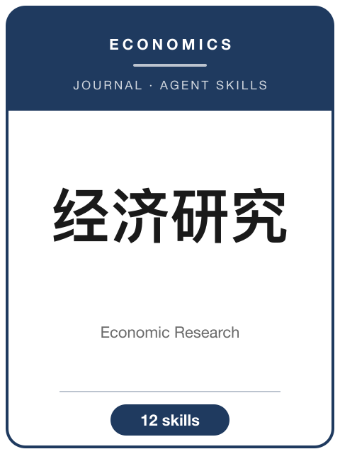</a>
  <a href="Journal-of-Management-World-Skills/">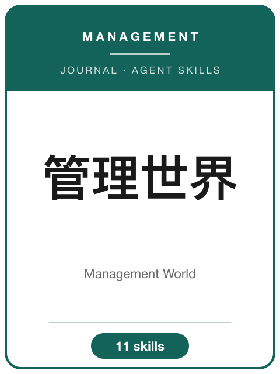</a>
  <a href="Social-Sciences-in-China-Skills/">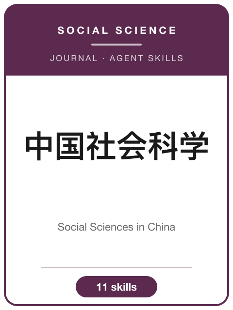</a>
  <a href="China-Industrial-Economics-Skills/">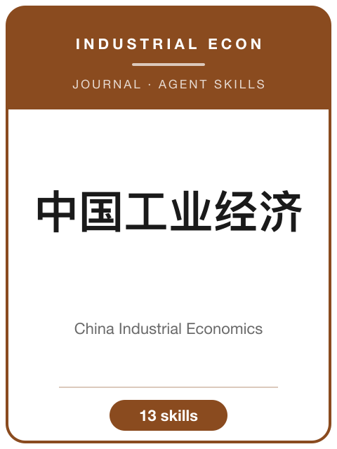</a>
  <a href="Journal-of-World-Economy-Skills/"></a>
  <a href="China-Economic-Quarterly-Skills/">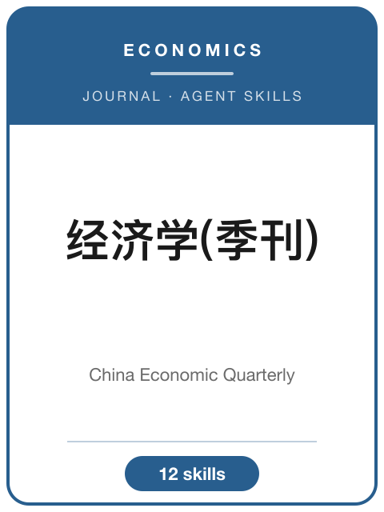</a>
  <a href="Journal-of-Quantitative-and-Technological-Economics-Skills/">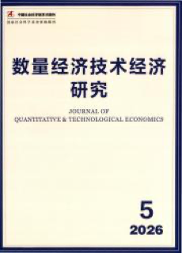</a>
  <a href="Accounting-Research-Skills/"></a>
  <a href="Journal-of-Financial-Research-Skills/">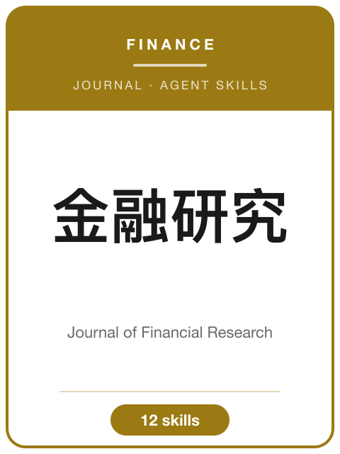</a>
  <a href="Journal-of-Management-Sciences-in-China-Skills/">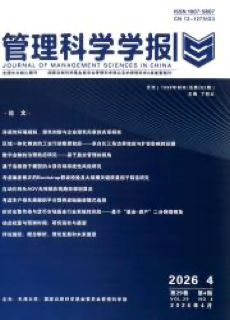</a>
  <a href="Nankai-Business-Review-Skills/">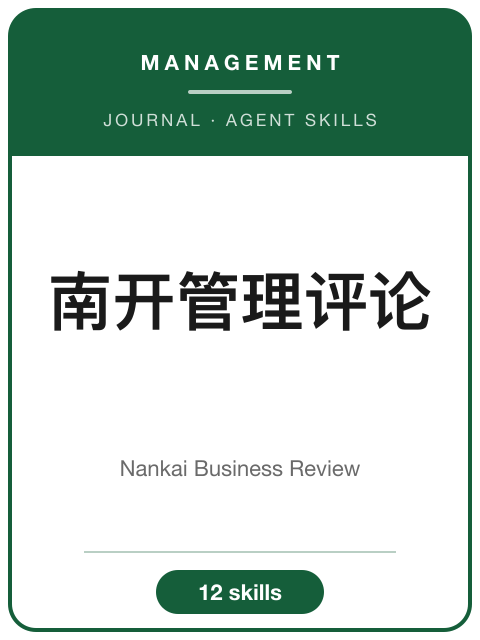</a>
  <a href="Sociological-Studies-Skills/"></a>
</p>
<p align="center">
  <sub>中文顶尖社科期刊 —— 每张封面直达一个按刊定制的 Skill 包。</sub>
</p>
<p align="center">
  <a href="English-SocialScience-Journal-Skills/skills/american-economic-review/">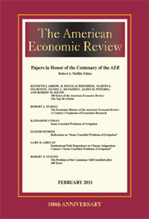</a>
  <a href="English-SocialScience-Journal-Skills/skills/quarterly-journal-of-economics/">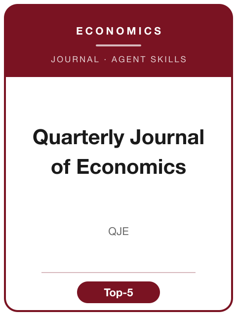</a>
  <a href="English-SocialScience-Journal-Skills/skills/journal-of-political-economy/">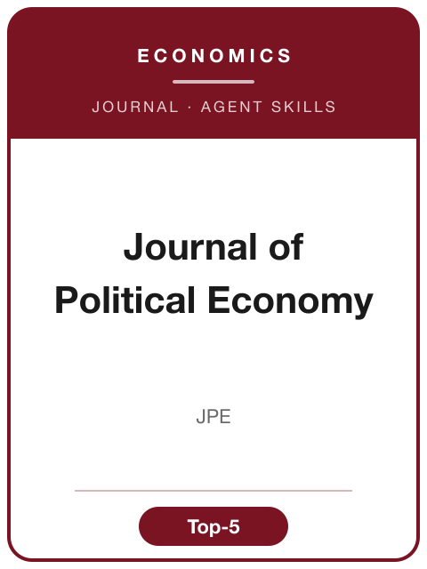</a>
  <a href="English-SocialScience-Journal-Skills/skills/econometrica/">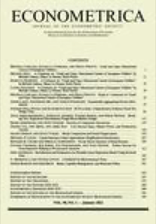</a>
  <a href="English-SocialScience-Journal-Skills/skills/review-of-economic-studies/">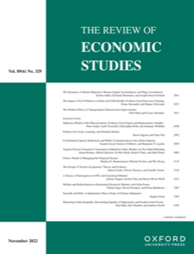</a>
  <a href="English-SocialScience-Journal-Skills/skills/journal-of-finance/">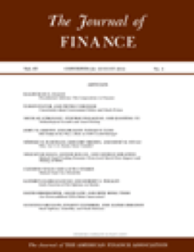</a>
  <a href="English-SocialScience-Journal-Skills/skills/journal-of-financial-economics/">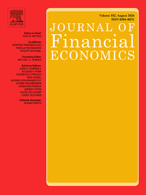</a>
  <a href="English-SocialScience-Journal-Skills/skills/review-of-financial-studies/">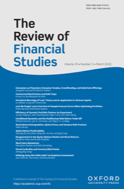</a>
  <a href="English-SocialScience-Journal-Skills/skills/academy-of-management-journal/"></a>
  <a href="English-SocialScience-Journal-Skills/skills/academy-of-management-review/">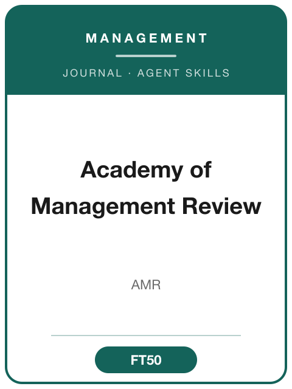</a>
  <a href="English-SocialScience-Journal-Skills/skills/administrative-science-quarterly/">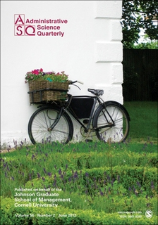</a>
  <a href="English-SocialScience-Journal-Skills/skills/strategic-management-journal/">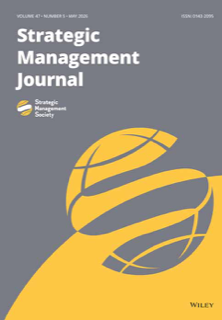</a>
  <a href="English-SocialScience-Journal-Skills/skills/journal-of-marketing/">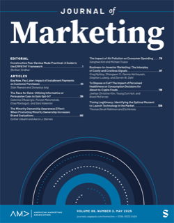</a>
  <a href="English-SocialScience-Journal-Skills/skills/journal-of-marketing-research/"></a>
  <a href="English-SocialScience-Journal-Skills/skills/marketing-science/">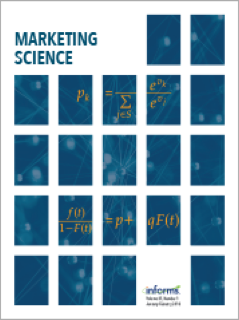</a>
  <a href="English-SocialScience-Journal-Skills/skills/the-accounting-review/">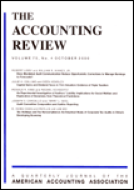</a>
  <a href="English-SocialScience-Journal-Skills/skills/journal-of-accounting-research/">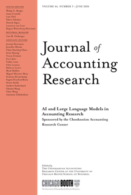</a>
  <a href="English-SocialScience-Journal-Skills/skills/journal-of-accounting-and-economics/">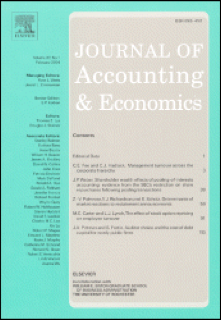</a>
  <a href="English-SocialScience-Journal-Skills/skills/management-science/">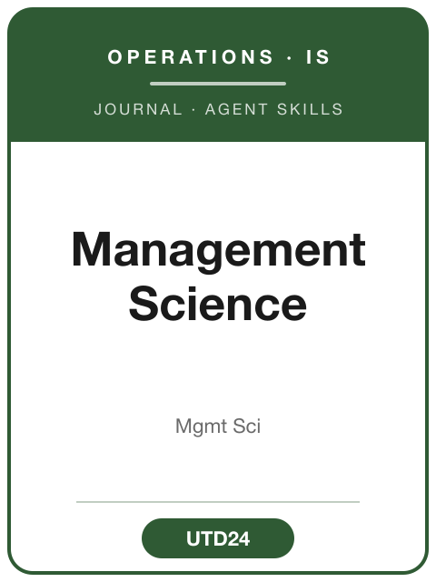</a>
  <a href="English-SocialScience-Journal-Skills/skills/operations-research/">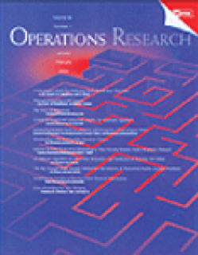</a>
  <a href="English-SocialScience-Journal-Skills/skills/mis-quarterly/"></a>
  <a href="English-SocialScience-Journal-Skills/skills/information-systems-research/">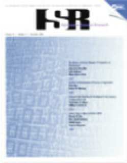</a>
</p>
<p align="center">
  <sub>英文经管顶尖期刊 —— 来自 <a href="English-SocialScience-Journal-Skills/">English-SocialScience-Journal-Skills</a> 广度合集（<b>100 本期刊 + 选刊路由</b>）。Top-5、Top-3、FT50、UTD24 等标签用于说明分层。</sub>
</p>
<details open>
<summary><b>🔬 默认展开：自然科学 · 医学国际顶刊 —— 154 本旗舰封面墙</b>　综合多学科 · 生命科学 · 临床医学 · Nature 子刊 · 物理天文 · 化学材料 · 地球环境 · 数学计算 · 跨学科前沿</summary>

<!-- STEM-WALL-START -->
<h3 align="center">🔬 自然科学 · 医学国际顶刊 —— 覆盖 154 本旗舰期刊</h3>
<p align="center"><sub>点击任意封面进入对应 Skill 包。<b>深度包（12 技能）</b>：Science · Nature · Cell · Cancer Cell · PNAS · PNAS Nexus · NEJM · JAMA · The Lancet · PRL · JACS · ES&amp;T；其余链接至 <a href="English-NaturalScience-Journal-Skills/">English-NaturalScience-Journal-Skills</a> 广度合集页。</sub></p>

<p align="center"><b>综合 · 多学科 <i>Multidisciplinary</i></b></p>
<p align="center">
  <a href="Science-Skills/">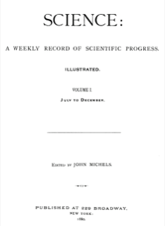</a>
  <a href="English-NaturalScience-Journal-Skills/skills/nature/">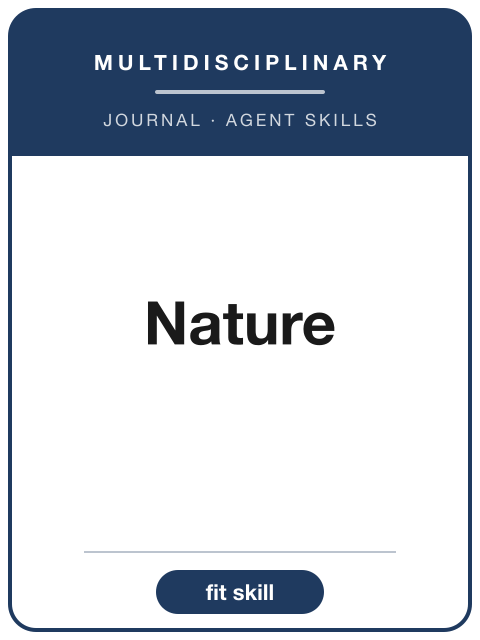</a>
  <a href="PNAS-Skills/">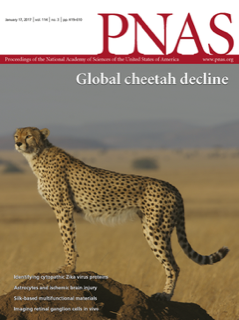</a>
  <a href="PNAS-Nexus-Skills/"></a>
  <a href="English-NaturalScience-Journal-Skills/skills/science-advances/">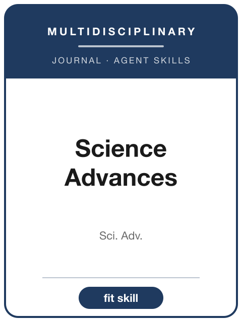</a>
  <a href="English-NaturalScience-Journal-Skills/skills/nature-communications/">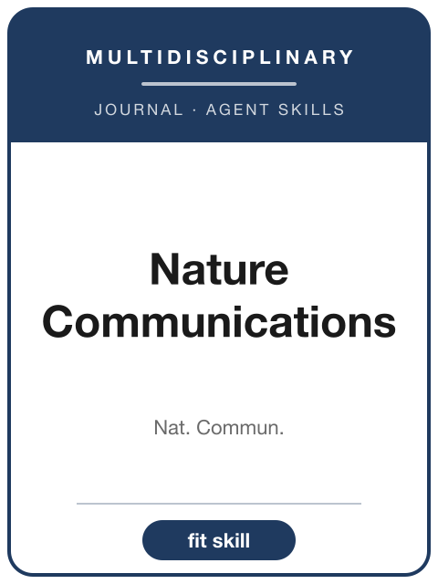</a>
  <a href="English-NaturalScience-Journal-Skills/skills/national-science-review/">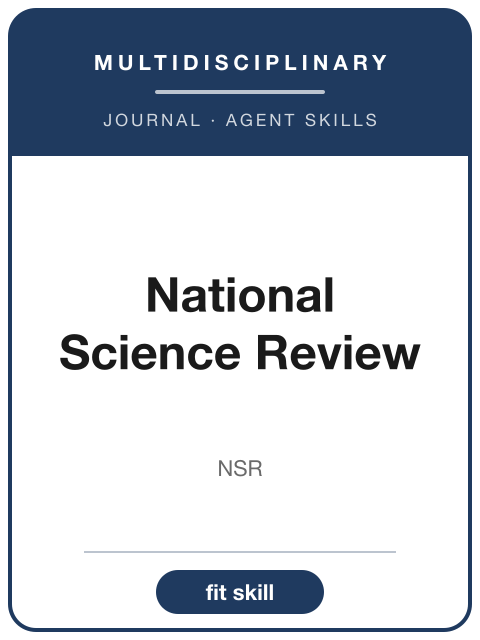</a>
  <a href="English-NaturalScience-Journal-Skills/skills/the-innovation/">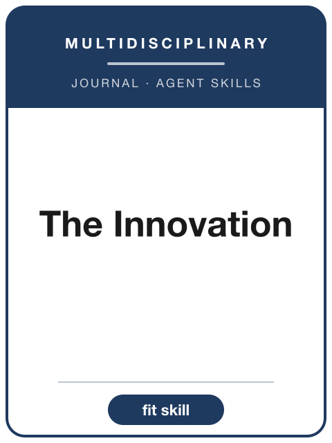</a>
</p>

<p align="center"><b>生命科学 <i>Life Sciences</i></b></p>
<p align="center">
  <a href="Cell-Skills/">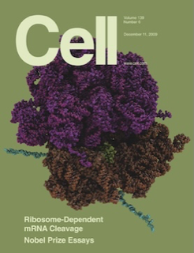</a>
  <a href="English-NaturalScience-Journal-Skills/skills/molecular-cell/">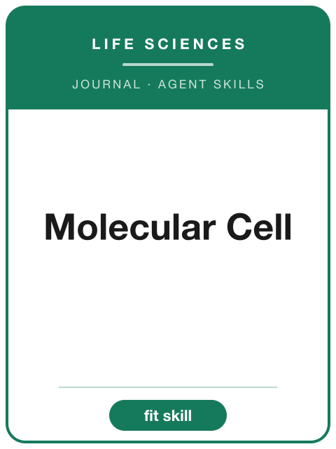</a>
  <a href="English-NaturalScience-Journal-Skills/skills/cell-stem-cell/">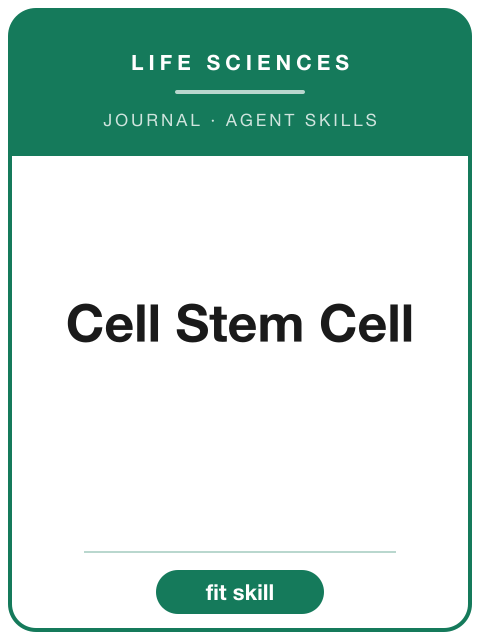</a>
  <a href="English-NaturalScience-Journal-Skills/skills/cell-metabolism/">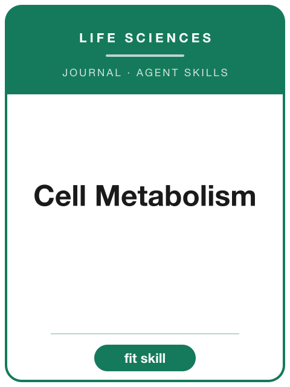</a>
  <a href="English-NaturalScience-Journal-Skills/skills/cell-host-and-microbe/"></a>
  <a href="English-NaturalScience-Journal-Skills/skills/developmental-cell/">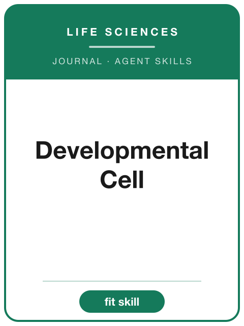</a>
  <a href="English-NaturalScience-Journal-Skills/skills/current-biology/">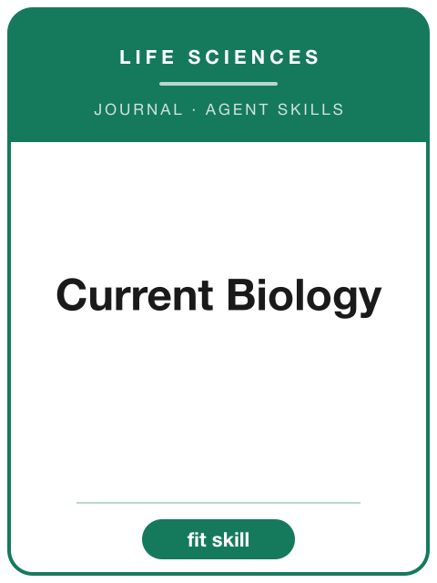</a>
  <a href="English-NaturalScience-Journal-Skills/skills/immunity/"></a>
  <a href="English-NaturalScience-Journal-Skills/skills/neuron/">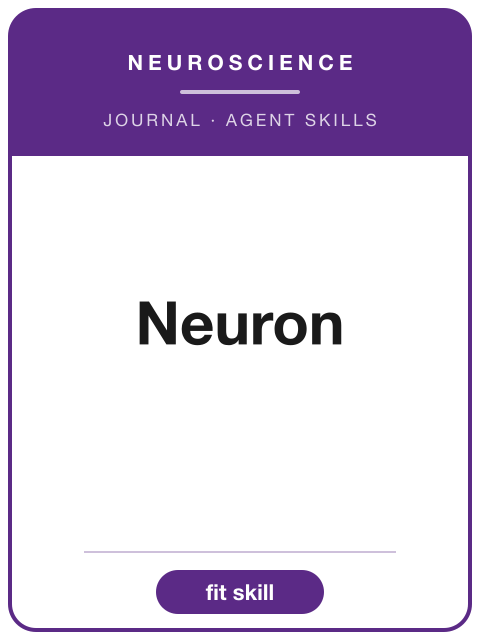</a>
  <a href="English-NaturalScience-Journal-Skills/skills/the-plant-cell/">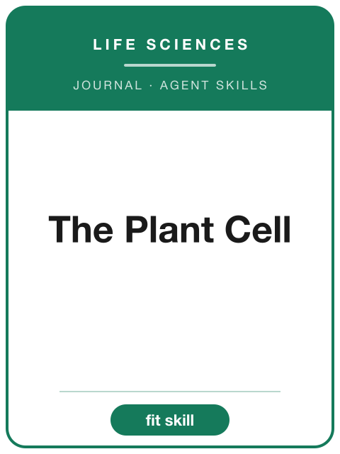</a>
  <a href="English-NaturalScience-Journal-Skills/skills/genome-biology/"></a>
  <a href="English-NaturalScience-Journal-Skills/skills/nucleic-acids-research/">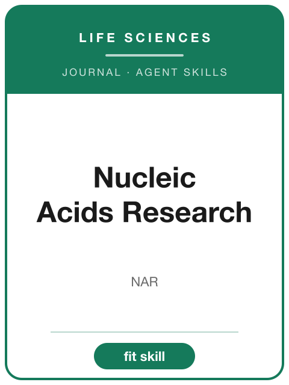</a>
  <a href="English-NaturalScience-Journal-Skills/skills/the-embo-journal/">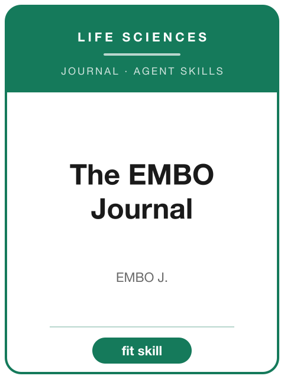</a>
  <a href="English-NaturalScience-Journal-Skills/skills/elife/">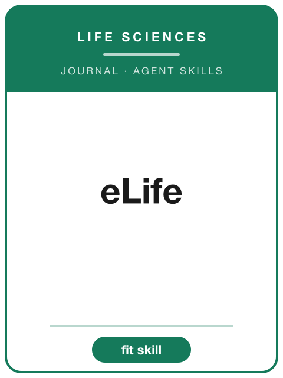</a>
  <a href="English-NaturalScience-Journal-Skills/skills/plos-biology/">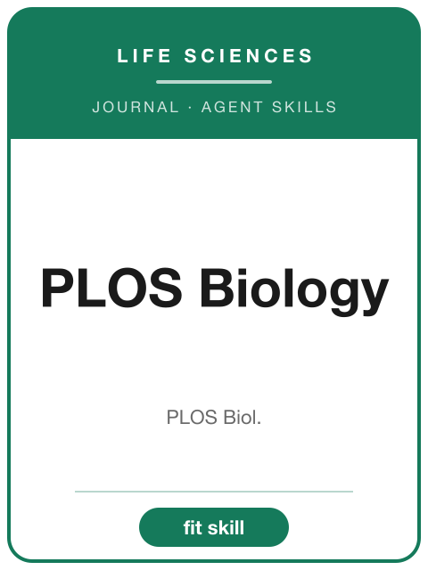</a>
  <a href="English-NaturalScience-Journal-Skills/skills/molecular-biology-and-evolution/">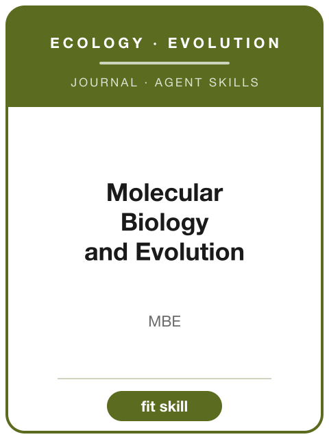</a>
</p>

<p align="center"><b>临床医学 <i>Clinical Medicine</i></b></p>
<p align="center">
  <a href="NEJM-Skills/">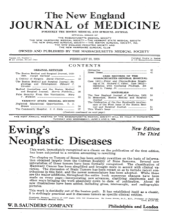</a>
  <a href="Lancet-Skills/">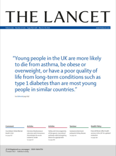</a>
  <a href="JAMA-Skills/"></a>
  <a href="English-NaturalScience-Journal-Skills/skills/the-bmj/"></a>
  <a href="English-NaturalScience-Journal-Skills/skills/annals-of-internal-medicine/"></a>
  <a href="English-NaturalScience-Journal-Skills/skills/nature-medicine/"></a>
  <a href="English-NaturalScience-Journal-Skills/skills/ca-a-cancer-journal-for-clinicians/"></a>
  <a href="English-NaturalScience-Journal-Skills/skills/journal-of-clinical-oncology/"></a>
  <a href="English-NaturalScience-Journal-Skills/skills/journal-of-clinical-investigation/"></a>
  <a href="English-NaturalScience-Journal-Skills/skills/journal-of-experimental-medicine/"></a>
  <a href="English-NaturalScience-Journal-Skills/skills/cancer-discovery/"></a>
  <a href="Cancer-Cell-Skills/"></a>
  <a href="English-NaturalScience-Journal-Skills/skills/the-lancet-oncology/"></a>
  <a href="English-NaturalScience-Journal-Skills/skills/the-lancet-neurology/"></a>
  <a href="English-NaturalScience-Journal-Skills/skills/the-lancet-infectious-diseases/"></a>
  <a href="English-NaturalScience-Journal-Skills/skills/circulation/"></a>
  <a href="English-NaturalScience-Journal-Skills/skills/european-heart-journal/"></a>
  <a href="English-NaturalScience-Journal-Skills/skills/journal-of-the-american-college-of-cardiology/"></a>
  <a href="English-NaturalScience-Journal-Skills/skills/blood/"></a>
  <a href="English-NaturalScience-Journal-Skills/skills/gastroenterology/"></a>
  <a href="English-NaturalScience-Journal-Skills/skills/gut/"></a>
  <a href="English-NaturalScience-Journal-Skills/skills/diabetes-care/"></a>
  <a href="English-NaturalScience-Journal-Skills/skills/plos-medicine/"></a>
  <a href="English-NaturalScience-Journal-Skills/skills/molecular-psychiatry/"></a>
</p>

<p align="center"><b>Nature 子刊 <i>Nature Research</i></b></p>
<p align="center">
  <a href="English-NaturalScience-Journal-Skills/skills/nature-genetics/"></a>
  <a href="English-NaturalScience-Journal-Skills/skills/nature-methods/"></a>
  <a href="English-NaturalScience-Journal-Skills/skills/nature-biotechnology/"></a>
  <a href="English-NaturalScience-Journal-Skills/skills/nature-cell-biology/"></a>
  <a href="English-NaturalScience-Journal-Skills/skills/nature-immunology/"></a>
  <a href="English-NaturalScience-Journal-Skills/skills/nature-microbiology/"></a>
  <a href="English-NaturalScience-Journal-Skills/skills/nature-neuroscience/"></a>
  <a href="English-NaturalScience-Journal-Skills/skills/nature-structural-and-molecular-biology/"></a>
  <a href="English-NaturalScience-Journal-Skills/skills/nature-human-behaviour/"></a>
  <a href="English-NaturalScience-Journal-Skills/skills/nature-machine-intelligence/"></a>
  <a href="English-NaturalScience-Journal-Skills/skills/nature-materials/"></a>
  <a href="English-NaturalScience-Journal-Skills/skills/nature-nanotechnology/"></a>
  <a href="English-NaturalScience-Journal-Skills/skills/nature-chemistry/"></a>
  <a href="English-NaturalScience-Journal-Skills/skills/nature-catalysis/"></a>
  <a href="English-NaturalScience-Journal-Skills/skills/nature-physics/"></a>
  <a href="English-NaturalScience-Journal-Skills/skills/nature-photonics/"></a>
  <a href="English-NaturalScience-Journal-Skills/skills/nature-astronomy/"></a>
  <a href="English-NaturalScience-Journal-Skills/skills/nature-geoscience/"></a>
  <a href="English-NaturalScience-Journal-Skills/skills/nature-climate-change/"></a>
  <a href="English-NaturalScience-Journal-Skills/skills/nature-ecology-and-evolution/"></a>
  <a href="English-NaturalScience-Journal-Skills/skills/nature-energy/"></a>
  <a href="English-NaturalScience-Journal-Skills/skills/nature-sustainability/"></a>
</p>

<p align="center"><b>物理与天文 <i>Physics &amp; Astronomy</i></b></p>
<p align="center">
  <a href="Physical-Review-Letters-Skills/"></a>
  <a href="English-NaturalScience-Journal-Skills/skills/physical-review-x/"></a>
  <a href="English-NaturalScience-Journal-Skills/skills/physical-review-b/"></a>
  <a href="English-NaturalScience-Journal-Skills/skills/physical-review-d/"></a>
  <a href="English-NaturalScience-Journal-Skills/skills/reviews-of-modern-physics/"></a>
  <a href="English-NaturalScience-Journal-Skills/skills/reports-on-progress-in-physics/"></a>
  <a href="English-NaturalScience-Journal-Skills/skills/prx-quantum/"></a>
  <a href="English-NaturalScience-Journal-Skills/skills/the-astrophysical-journal/"></a>
  <a href="English-NaturalScience-Journal-Skills/skills/monthly-notices-of-the-royal-astronomical-society/"></a>
  <a href="English-NaturalScience-Journal-Skills/skills/astronomy-and-astrophysics/"></a>
  <a href="English-NaturalScience-Journal-Skills/skills/the-astronomical-journal/"></a>
  <a href="English-NaturalScience-Journal-Skills/skills/journal-of-high-energy-physics/"></a>
  <a href="English-NaturalScience-Journal-Skills/skills/new-journal-of-physics/"></a>
  <a href="English-NaturalScience-Journal-Skills/skills/physical-review-e/"></a>
  <a href="English-NaturalScience-Journal-Skills/skills/physical-review-applied/"></a>
  <a href="English-NaturalScience-Journal-Skills/skills/nature-reviews-physics/"></a>
  <a href="English-NaturalScience-Journal-Skills/skills/physics-reports/"></a>
  <a href="English-NaturalScience-Journal-Skills/skills/classical-and-quantum-gravity/"></a>
  <a href="English-NaturalScience-Journal-Skills/skills/living-reviews-in-relativity/"></a>
  <a href="English-NaturalScience-Journal-Skills/skills/astrophysical-journal-letters/"></a>
  <a href="English-NaturalScience-Journal-Skills/skills/annual-review-of-astronomy-and-astrophysics/"></a>
</p>

<p align="center"><b>化学与材料 <i>Chemistry &amp; Materials</i></b></p>
<p align="center">
  <a href="Journal-of-the-American-Chemical-Society-Skills/"></a>
  <a href="English-NaturalScience-Journal-Skills/skills/angewandte-chemie-international-edition/"></a>
  <a href="English-NaturalScience-Journal-Skills/skills/chemical-reviews/"></a>
  <a href="English-NaturalScience-Journal-Skills/skills/chemical-society-reviews/"></a>
  <a href="English-NaturalScience-Journal-Skills/skills/accounts-of-chemical-research/"></a>
  <a href="English-NaturalScience-Journal-Skills/skills/chem/"></a>
  <a href="English-NaturalScience-Journal-Skills/skills/acs-nano/"></a>
  <a href="English-NaturalScience-Journal-Skills/skills/advanced-materials/"></a>
  <a href="English-NaturalScience-Journal-Skills/skills/joule/"></a>
  <a href="English-NaturalScience-Journal-Skills/skills/energy-and-environmental-science/"></a>
  <a href="English-NaturalScience-Journal-Skills/skills/nature-reviews-chemistry/"></a>
  <a href="English-NaturalScience-Journal-Skills/skills/acs-catalysis/"></a>
  <a href="English-NaturalScience-Journal-Skills/skills/nature-reviews-materials/"></a>
  <a href="English-NaturalScience-Journal-Skills/skills/matter/"></a>
  <a href="English-NaturalScience-Journal-Skills/skills/nature-synthesis/"></a>
  <a href="English-NaturalScience-Journal-Skills/skills/jacs-au/"></a>
  <a href="English-NaturalScience-Journal-Skills/skills/acs-central-science/"></a>
  <a href="English-NaturalScience-Journal-Skills/skills/coordination-chemistry-reviews/"></a>
  <a href="English-NaturalScience-Journal-Skills/skills/advanced-energy-materials/"></a>
  <a href="English-NaturalScience-Journal-Skills/skills/advanced-functional-materials/"></a>
  <a href="English-NaturalScience-Journal-Skills/skills/acs-energy-letters/"></a>
  <a href="English-NaturalScience-Journal-Skills/skills/npj-computational-materials/"></a>
</p>

<p align="center"><b>地球 · 环境 · 生态 <i>Earth &amp; Environment</i></b></p>
<p align="center">
  <a href="Environmental-Science-and-Technology-Skills/"></a>
  <a href="English-NaturalScience-Journal-Skills/skills/ecology-letters/"></a>
  <a href="English-NaturalScience-Journal-Skills/skills/one-earth/"></a>
  <a href="English-NaturalScience-Journal-Skills/skills/trends-in-ecology-and-evolution/"></a>
  <a href="English-NaturalScience-Journal-Skills/skills/global-ecology-and-biogeography/"></a>
  <a href="English-NaturalScience-Journal-Skills/skills/the-isme-journal/"></a>
  <a href="English-NaturalScience-Journal-Skills/skills/geophysical-research-letters/"></a>
  <a href="English-NaturalScience-Journal-Skills/skills/reviews-of-geophysics/"></a>
  <a href="English-NaturalScience-Journal-Skills/skills/nature-water/"></a>
  <a href="English-NaturalScience-Journal-Skills/skills/water-research/"></a>
  <a href="English-NaturalScience-Journal-Skills/skills/atmospheric-chemistry-and-physics/"></a>
  <a href="English-NaturalScience-Journal-Skills/skills/annual-review-of-ecology-evolution-and-systematics/"></a>
  <a href="English-NaturalScience-Journal-Skills/skills/molecular-ecology/"></a>
  <a href="English-NaturalScience-Journal-Skills/skills/journal-of-ecology/"></a>
  <a href="English-NaturalScience-Journal-Skills/skills/functional-ecology/"></a>
  <a href="English-NaturalScience-Journal-Skills/skills/journal-of-geophysical-research-atmospheres/"></a>
  <a href="English-NaturalScience-Journal-Skills/skills/nature-reviews-earth-and-environment/"></a>
  <a href="English-NaturalScience-Journal-Skills/skills/earths-future/"></a>
  <a href="English-NaturalScience-Journal-Skills/skills/the-cryosphere/"></a>
</p>

<p align="center"><b>数学 · 计算 <i>Mathematics &amp; Computation</i></b></p>
<p align="center">
  <a href="English-NaturalScience-Journal-Skills/skills/annals-of-mathematics/"></a>
  <a href="English-NaturalScience-Journal-Skills/skills/inventiones-mathematicae/"></a>
  <a href="English-NaturalScience-Journal-Skills/skills/journal-of-the-american-mathematical-society/"></a>
  <a href="English-NaturalScience-Journal-Skills/skills/journal-of-machine-learning-research/"></a>
  <a href="English-NaturalScience-Journal-Skills/skills/ieee-transactions-on-pattern-analysis-and-machine-intelligence/"></a>
  <a href="English-NaturalScience-Journal-Skills/skills/communications-on-pure-and-applied-mathematics/"></a>
  <a href="English-NaturalScience-Journal-Skills/skills/advances-in-mathematics/"></a>
  <a href="English-NaturalScience-Journal-Skills/skills/duke-mathematical-journal/"></a>
  <a href="English-NaturalScience-Journal-Skills/skills/siam-review/"></a>
  <a href="English-NaturalScience-Journal-Skills/skills/journal-of-the-acm/"></a>
  <a href="English-NaturalScience-Journal-Skills/skills/acta-mathematica/"></a>
  <a href="English-NaturalScience-Journal-Skills/skills/geometry-and-topology/"></a>
  <a href="English-NaturalScience-Journal-Skills/skills/foundations-of-computational-mathematics/"></a>
  <a href="English-NaturalScience-Journal-Skills/skills/siam-journal-on-computing/"></a>
</p>

<p align="center"><b>跨学科前沿 <i>Frontiers</i></b></p>
<p align="center">
  <a href="English-NaturalScience-Journal-Skills/skills/science-immunology/"></a>
  <a href="English-NaturalScience-Journal-Skills/skills/science-robotics/"></a>
  <a href="English-NaturalScience-Journal-Skills/skills/science-translational-medicine/"></a>
  <a href="English-NaturalScience-Journal-Skills/skills/trends-in-cognitive-sciences/"></a>
  <a href="English-NaturalScience-Journal-Skills/skills/science-signaling/"></a>
  <a href="English-NaturalScience-Journal-Skills/skills/cell-reports-medicine/"></a>
  <a href="English-NaturalScience-Journal-Skills/skills/nature-reviews-methods-primers/"></a>
  <a href="English-NaturalScience-Journal-Skills/skills/nature-reviews-drug-discovery/"></a>
  <a href="English-NaturalScience-Journal-Skills/skills/the-lancet-digital-health/"></a>
</p>
<!-- STEM-WALL-END -->

</details>

按**期刊与会议**组织的 Agent Skill 包索引——每个 skill 覆盖论文生命周期的一个环节：选题、定位核心进展、识别策略、表格与图件规范、复制包 / 数据可得性准备、投稿与修改回复。收录范围横跨以下 **11 个主流学科板块**：**综合·交叉**（综合性大刊、交叉科学、计算社会科学、生物信息、网络科学），**经管与商科**（经济学、金融、会计、管理、营销、运营、信息系统、创新创业），**社会科学**（社会学、人类学、政治学、法学、公共管理、人口学、传播学、地理学、心理学），**人文学科**（历史、哲学、文学、艺术、宗教学），**数学与物理科学**（数学、统计、物理、天文、化学、材料、能源），**生命科学**（细胞、分子、基因组、免疫、微生物、神经、植物、生态演化），**医学与健康**（临床综合、肿瘤、心血管、神经、感染、内科、公共卫生、转化医学），**工程与技术**（控制、通信、电子、电力、机器人、生医工程、制造、航空、土木交通、化工过程），**计算机科学与 AI**（机器学习、人工智能、数据挖掘、自然语言处理、计算机视觉、机器人、人机交互、系统、安全、软件工程），**农业·环境·地球科学**（农业、食品、植物、土壤、作物、环境、气候、地球、大气、水文、海洋），以及**体育科学**（运动人体科学、运动医学、训练学、体育人文社会学）。

每个 pack 都是**针对单一期刊**的方法论沉淀：它编码了某一本期刊的编委偏好、格式规范、识别标准和审稿文化。通用的"科研写作"Skill 包做不到这一点。

---

> ### 🎯 一句话：把"投哪本、怎么写、为什么被拒"变成一套可安装、按刊定制的 AI 工作流。
>
> 你的稿子在 **AER** 卡在识别策略，在 **《管理世界》** 卡在缺中国制度背景，在 **《经济研究》** 卡在缺经典理论文献——**同一篇文章，退稿点完全不同**。一套泛泛的"学术写作"助手永远学不会这种差异。本仓库为每一本期刊单独编码它的编委偏好、格式红线和审稿文化。

### ⚡ 30 秒上手

```bash
# 1) 把本仓库添加为 marketplace（一次即可）
/plugin marketplace add https://github.com/brycewang-stanford/awesome-journal-skills
# 2) 安装目标期刊的 pack（以 QJE 为例；pack 名见各深度包 / 广度合集页面）
/plugin install qje-skills
/reload-plugins
```

然后把目标期刊的稿子交给它的 workflow skill：

```text
用 qje-workflow 评估我这份稿子离 QJE 的发表标准还差什么，下一步该做什么。
```

> 还没定投哪本？先用**广度合集**里的 router skill 选刊 → 定下来后再装对应**深度包**。完整路径见下方[「快速浏览与布局指南」](#-快速浏览与布局指南)。

### 🧭 目录

| 🧭 入门 · 理念 | 📚 浏览 · 索引 | 🚀 使用 · 协作 |
|---|---|---|
| [快速浏览与布局指南](#-快速浏览与布局指南) | [Skill Pack 一览](#-skill-pack-一览) | [如何使用](#-如何使用) |
| [为什么按期刊](#-为什么要按期刊做-skills) | [根目录 200 个期刊入口](#-根目录-200-个期刊文件夹) | [Pack 选择速查](#-pack-选择速查) |
| [路线图](#-路线图) | [仓库结构](#-仓库结构) | [贡献](#-贡献) |
| [相关项目](#-相关项目) | [维护团队](#-维护团队) | [🌐 English README](README.en.md) |

### 📊 覆盖一览

| 板块 | 子领域 | 代表 venue | 形态 |
|------|--------|-----------|------|
| <a id="discipline-cross"></a>🌐 **综合·交叉** | 综合性大刊 · 交叉科学 · 计算社科 · 生物信息 · 网络科学 | Science · PNAS · Nature Communications · Science Advances · PNAS Nexus · Nature Human Behaviour | 深度包 + 英文自然科学广度合集 + 第三方 Nature 系 |
| <a id="discipline-business"></a>💼 **经济学与管理学** | 经济 · 金融 · 管理 · 会计 · 营销 · 运营 · 信息系统 | AER · QJE · JPE · Econometrica · JF · AMJ · TAR · MISQ ·《经济研究》·《管理世界》 | 深度包 + 中英文广度合集 |
| <a id="discipline-social-sciences"></a>🧭 **社会科学** | 社会学 · 人类学 · 政治学 · 心理学 · 教育 · 人口 · 传播 · 公共管理 · 法学 · 地理 | ASR · AJS · APSR · AJPS · JPSP · Demography · POQ · HLR · Progress in Human Geography | 深度包 + 中英文广度合集 |
| <a id="discipline-humanities"></a>🏛 **人文学科** | 历史 · 艺术史 · 哲学 · 文学 · 宗教 · 批评理论 | AHR · PMLA · Mind · Critical Inquiry · The Art Bulletin · JAAR | 深度包 + 英文人文广度合集 |
| <a id="discipline-math-physical"></a>📐 **数学与物理科学** | 数学 · 物理 · 天文 · 化学 · 材料 · 能源 | Annals of Mathematics · PRL · Nature Physics · JACS · Nature Materials · Nature Energy | 深度包 + 英文自然科学广度合集 |
| <a id="discipline-life-sciences"></a>🧬 **生命科学** | 细胞 · 分子 · 基因组 · 免疫 · 微生物 · 神经 · 植物 · 生态演化 | Cell · Cancer Cell · Molecular Cell · Neuron · Immunity · The Plant Cell · eLife | 深度包 + 英文自然科学广度合集 |
| <a id="discipline-medicine-health"></a>🩺 **医学与健康** | 临床综合 · 肿瘤 · 心血管 · 神经 · 感染 · 内科 · 公共健康 · 转化医学 | NEJM · The Lancet · JAMA · BMJ · JCO · Circulation · Blood · Gastroenterology | 深度包 + 临床医学广度合集 + 英文自然科学广度合集 |
| <a id="discipline-engineering-tech"></a>⚙️ **工程与技术** | 控制 · 通信 · 信号 · 电力 · 机器人 · 光子 · 生医工程 · 材料 | Proceedings of the IEEE · TAC · Automatica · Optica · Nature Electronics · Acta Materialia | 英文工程技术广度合集 |
| <a id="discipline-cs-ai"></a>🤖 **计算机科学与 AI** | AI/ML · CV · NLP · 数据挖掘 · 系统 · 数据库 · 安全 · HCI · 理论 | NeurIPS · ICML · ICLR · AAAI · IJCAI · AISTATS + 155 个会议 | CS/AI 深度包 + 会议广度合集 |
| <a id="discipline-agri-env-earth"></a>🌱 **农业·环境·地球科学** | 农业系统 · 作物 · 环境科学 · 气候 · 生态保护 · 地球系统 | Field Crops Research · Agricultural Systems · ES&T · Global Environmental Change · Conservation Biology · Global Change Biology | 深度包 + 农业环境广度合集 |
| <a id="discipline-sport-science"></a>🏅 **体育科学** | 运动训练 · 体育教育 · 运动人体科学 · 体育社会科学 | 《体育科学》·《北京体育大学学报》·《上海体育学院学报》 | 中文体育学广度合集 |

<sub>共 <b>195 个 pack / 2902 个 skill</b>。"深度包"= 单刊单会全流程（约 12 个 skill）；"广度合集"= 每个 venue 一个轻量"选刊定位 + 写作风格"skill 加一个 router。</sub>

---

## 🧭 快速浏览与布局指南

可以按三步理解这个仓库：

| 你看到的入口 | 它是什么 | 什么时候用 |
|---|---|---|
| **封面卡和根目录期刊文件夹**，例如 `American-Economic-Review/` 或 `Jingji-Yanjiu/` | 只负责导航；它们指向 canonical skill 位置，故意不放 `SKILL.md`。 | 你在 GitHub 根目录按期刊名浏览。 |
| **深度包**，例如 `Economic-Research-Journal-Skills/`、`Cell-Skills/` 或 `Quarterly-Journal-of-Economics-Skills/` | 单刊全流程工作流，通常含 9-13 个 skills，覆盖选题、定位、方法、表格、投稿和回复。 | 目标期刊已确定，且需要完整投稿生命周期支持。 |
| **广度合集**：`Chinese-SocialScience-Journal-Skills/`、`English-SocialScience-Journal-Skills/`、`English-NaturalScience-Journal-Skills/`、`Engineering-Technology-Journal-Skills/`、`Agriculture-Environment-Journal-Skills/`、`Clinical-Medicine-Journal-Skills/`、`English-Humanities-Journal-Skills/`、`Chinese-Sport-Science-Journal-Skills/`、`Computer-Science-Conference-Skills/` | 每本期刊一个轻量 fit-and-house-style skill，另有 router skill 用于选刊。 | 你需要覆盖 100 本期刊级别的路线图，或还在比较投稿目标。 |
| **第三方收录（外链）**，例如 [nature-skills](https://github.com/Yuan1z0825/nature-skills)、[claude-scholar](https://github.com/Galaxy-Dawn/claude-scholar) 或 [codex-claude-academic-skills](https://github.com/zLanqing/codex-claude-academic-skills) | 第三方上游包或通用学术工具，以外链形式收录（不再 vendored 进本仓库）。 | 你需要跨期刊的研究、写作或工作流支持。 |

经验法则：浏览时从根目录文件夹或封面卡开始；选刊时用广度合集；目标期刊确定后再进入对应深度包。

<details open>
<summary><b>📂 点击展开：仓库根目录的 200 个期刊入口文件夹</b>（100 中文拼音目录 + 100 英文目录，方便在 GitHub 首页直接按刊名浏览）</summary>

<!-- ROOT-JOURNAL-FOLDERS:START -->

## 📂 根目录 200 个期刊文件夹

为了让用户在仓库首页的根目录就能看到完整的社科期刊阵列，现在 200 本广度合集期刊各有一个轻量入口文件夹：100 本中文经管路线图期刊使用拼音目录名，100 本英文经管 / 商科期刊使用英文题名目录名。这些目录只负责导航；真正可安装的 `SKILL.md` 仍保留在对应 bundle 内，因此插件路径和 2902 个 skill 的计数不会被重复放大。

### 中文经管路线图 · 100 个拼音目录

|  |  |  |  |
|---|---|---|---|
| [Kuaiji-Yu-Jingji-Yanjiu/](Kuaiji-Yu-Jingji-Yanjiu/)<br><sub>《会计与经济研究》</sub> | [Kuaiji-Yanjiu/](Kuaiji-Yanjiu/)<br><sub>《会计研究》</sub> | [Yatai-Jingji/](Yatai-Jingji/)<br><sub>《亚太经济》</sub> | [Shenji-Yu-Jingji-Yanjiu/](Shenji-Yu-Jingji-Yanjiu/)<br><sub>《审计与经济研究》</sub> |
| [Shenji-Yanjiu/](Shenji-Yanjiu/)<br><sub>《审计研究》</sub> | [Zhongguo-Kexueyuan-Yuankan/](Zhongguo-Kexueyuan-Yuankan/)<br><sub>《中国科学院院刊》</sub> | [Jingji-Guanli/](Jingji-Guanli/)<br><sub>《经济管理》</sub> | [Kuaiji-Pinglun/](Kuaiji-Pinglun/)<br><sub>《会计评论》</sub> |
| [Jingjixue-Jikan/](Jingjixue-Jikan/)<br><sub>《经济学（季刊）》</sub> | [Zhongguo-Jingji-Wenti/](Zhongguo-Jingji-Wenti/)<br><sub>《中国经济问题》</sub> | [Zhongguo-Gongye-Jingji/](Zhongguo-Gongye-Jingji/)<br><sub>《中国工业经济》</sub> | [Gonggong-Guanli-Pinglun/](Gonggong-Guanli-Pinglun/)<br><sub>《公共管理评论》</sub> |
| [Zhongguo-Nongcun-Jingji/](Zhongguo-Nongcun-Jingji/)<br><sub>《中国农村经济》</sub> | [Zhongguo-Nongcun-Guancha/](Zhongguo-Nongcun-Guancha/)<br><sub>《中国农村观察》</sub> | [Zhongguo-Ruan-Kexue/](Zhongguo-Ruan-Kexue/)<br><sub>《中国软科学》</sub> | [Guanli-Xuebao/](Guanli-Xuebao/)<br><sub>《管理学报》</sub> |
| [Zhongguo-Guanli-Kexue/](Zhongguo-Guanli-Kexue/)<br><sub>《中国管理科学》</sub> | [Zhongguo-Xingzheng-Guanli/](Zhongguo-Xingzheng-Guanli/)<br><sub>《中国行政管理》</sub> | [Jinrong-Pinglun/](Jinrong-Pinglun/)<br><sub>《金融评论》</sub> | [Jingji-Shehui-Tizhi-Bijiao/](Jingji-Shehui-Tizhi-Bijiao/)<br><sub>《经济社会体制比较》</sub> |
| [Xiandai-Riben-Jingji/](Xiandai-Riben-Jingji/)<br><sub>《现代日本经济》</sub> | [Dangdai-Caijing/](Dangdai-Caijing/)<br><sub>《当代财经》</sub> | [Dianzi-Zhengwu/](Dianzi-Zhengwu/)<br><sub>《电子政务》</sub> | [Huadong-Jingji-Guanli/](Huadong-Jingji-Guanli/)<br><sub>《华东经济管理》</sub> |
| [Jingji-Zongheng/](Jingji-Zongheng/)<br><sub>《经济纵横》</sub> | [Jingjixue-Dongtai/](Jingjixue-Dongtai/)<br><sub>《经济学动态》</sub> | [Jingji-Wenti/](Jingji-Wenti/)<br><sub>《经济问题》</sub> | [Jingji-Yanjiu/](Jingji-Yanjiu/)<br><sub>《经济研究》</sub> |
| [Jingji-Pinglun/](Jingji-Pinglun/)<br><sub>《经济评论》</sub> | [Jingji-Kexue/](Jingji-Kexue/)<br><sub>《经济科学》</sub> | [Jingji-Lilun-Yu-Jingji-Guanli/](Jingji-Lilun-Yu-Jingji-Guanli/)<br><sub>《经济理论与经济管理》</sub> | [Jingjixuejia/](Jingjixuejia/)<br><sub>《经济学家》</sub> |
| [Caijing-Kexue/](Caijing-Kexue/)<br><sub>《财经科学》</sub> | [Caimao-Jingji/](Caimao-Jingji/)<br><sub>《财贸经济》</sub> | [Jinrong-Jianguan-Yanjiu/](Jinrong-Jianguan-Yanjiu/)<br><sub>《金融监管研究》</sub> | [Waiguo-Jingji-Yu-Guanli/](Waiguo-Jingji-Yu-Guanli/)<br><sub>《外国经济与管理》</sub> |
| [Zhongguo-Keji-Luntan/](Zhongguo-Keji-Luntan/)<br><sub>《中国科技论坛》</sub> | [Gongcheng-Guanli-Keji-Qianyan/](Gongcheng-Guanli-Keji-Qianyan/)<br><sub>《工程管理科技前沿》</sub> | [Zhili-Yanjiu/](Zhili-Yanjiu/)<br><sub>《治理研究》</sub> | [Chanye-Jingji-Yanjiu/](Chanye-Jingji-Yanjiu/)<br><sub>《产业经济研究》</sub> |
| [Jingji-Wenti-Tansuo/](Jingji-Wenti-Tansuo/)<br><sub>《经济问题探索》</sub> | [Guoji-Jingji-Pinglun/](Guoji-Jingji-Pinglun/)<br><sub>《国际经济评论》</sub> | [Guoji-Jingmao-Tansuo/](Guoji-Jingmao-Tansuo/)<br><sub>《国际经贸探索》</sub> | [Nongye-Jingji-Wenti/](Nongye-Jingji-Wenti/)<br><sub>《农业经济问题》</sub> |
| [Nongye-Jishu-Jingji/](Nongye-Jishu-Jingji/)<br><sub>《农业技术经济》</sub> | [Shangye-Jingji-Yu-Guanli/](Shangye-Jingji-Yu-Guanli/)<br><sub>《商业经济与管理》</sub> | [Zhongyang-Caijing-Daxue-Xuebao/](Zhongyang-Caijing-Daxue-Xuebao/)<br><sub>《中央财经大学学报》</sub> | [Caijing-Yanjiu/](Caijing-Yanjiu/)<br><sub>《财经研究》</sub> |
| [Jinrong-Yanjiu/](Jinrong-Yanjiu/)<br><sub>《金融研究》</sub> | [Guangdong-Caijing-Daxue-Xuebao/](Guangdong-Caijing-Daxue-Xuebao/)<br><sub>《广东财经大学学报》</sub> | [Guanli-Gongcheng-Xuebao/](Guanli-Gongcheng-Xuebao/)<br><sub>《管理工程学报》</sub> | [Guoji-Maoyi-Wenti/](Guoji-Maoyi-Wenti/)<br><sub>《国际贸易问题》</sub> |
| [Jiangxi-Caijing-Daxue-Xuebao/](Jiangxi-Caijing-Daxue-Xuebao/)<br><sub>《江西财经大学学报》</sub> | [Hongguan-Zhiliang-Yanjiu/](Hongguan-Zhiliang-Yanjiu/)<br><sub>《宏观质量研究》</sub> | [Guanli-Xuekan/](Guanli-Xuekan/)<br><sub>《管理学刊》</sub> | [Guanli-Kexue-Xuebao/](Guanli-Kexue-Xuebao/)<br><sub>《管理科学学报》</sub> |
| [Gonggong-Guanli-Xuebao/](Gonggong-Guanli-Xuebao/)<br><sub>《公共管理学报》</sub> | [Shuliang-Jingji-Jishu-Jingji-Yanjiu/](Shuliang-Jingji-Jishu-Jingji-Yanjiu/)<br><sub>《数量经济技术经济研究》</sub> | [Shanghai-Caijing-Daxue-Xuebao/](Shanghai-Caijing-Daxue-Xuebao/)<br><sub>《上海财经大学学报》</sub> | [Shanxi-Caijing-Daxue-Xuebao/](Shanxi-Caijing-Daxue-Xuebao/)<br><sub>《山西财经大学学报》</sub> |
| [Shijie-Jingji/](Shijie-Jingji/)<br><sub>《世界经济》</sub> | [Zhongnan-Caijing-Zhengfa-Daxue-Xuebao/](Zhongnan-Caijing-Zhengfa-Daxue-Xuebao/)<br><sub>《中南财经政法大学学报》</sub> | [Hongguan-Jingji-Yanjiu/](Hongguan-Jingji-Yanjiu/)<br><sub>《宏观经济研究》</sub> | [Guanli-Pinglun/](Guanli-Pinglun/)<br><sub>《管理评论》</sub> |
| [Guanli-Kexue/](Guanli-Kexue/)<br><sub>《管理科学》</sub> | [Guanli-Shijie/](Guanli-Shijie/)<br><sub>《管理世界》</sub> | [Xiandai-Jingji-Tantao/](Xiandai-Jingji-Tantao/)<br><sub>《现代经济探讨》</sub> | [Dangdai-Jingji-Kexue/](Dangdai-Jingji-Kexue/)<br><sub>《当代经济科学》</sub> |
| [Xiandai-Caijing-Tianjin-Caijing-Daxue-Xuebao/](Xiandai-Caijing-Tianjin-Caijing-Daxue-Xuebao/)<br><sub>《现代财经（天津财经大学学报）》</sub> | [Xiandai-Jinrong-Yanjiu/](Xiandai-Jinrong-Yanjiu/)<br><sub>《现代金融研究》</sub> | [Nankai-Guanli-Pinglun/](Nankai-Guanli-Pinglun/)<br><sub>《南开管理评论》</sub> | [Nankai-Jingji-Yanjiu/](Nankai-Jingji-Yanjiu/)<br><sub>《南开经济研究》</sub> |
| [Zuzhi-Yu-Guanli/](Zuzhi-Yu-Guanli/)<br><sub>《组织与管理》</sub> | [Gonggong-Guanli-Yu-Zhengce-Pinglun/](Gonggong-Guanli-Yu-Zhengce-Pinglun/)<br><sub>《公共管理与政策评论》</sub> | [Caizheng-Yanjiu/](Caizheng-Yanjiu/)<br><sub>《财政研究》</sub> | [Gaige/](Gaige/)<br><sub>《改革》</sub> |
| [Jingji-Tizhi-Gaige/](Jingji-Tizhi-Gaige/)<br><sub>《经济体制改革》</sub> | [Yanjiu-Yu-Fazhan-Guanli/](Yanjiu-Yu-Fazhan-Guanli/)<br><sub>《研究与发展管理》</sub> | [Jingji-Yu-Guanli-Yanjiu/](Jingji-Yu-Guanli-Yanjiu/)<br><sub>《经济与管理研究》</sub> | [Caijing-Wenti-Yanjiu/](Caijing-Wenti-Yanjiu/)<br><sub>《财经问题研究》</sub> |
| [Zhengzhi-Jingjixue-Pinglun/](Zhengzhi-Jingjixue-Pinglun/)<br><sub>《政治经济学评论》</sub> | [Nongcun-Jingji/](Nongcun-Jingji/)<br><sub>《农村经济》</sub> | [Keji-Jinbu-Yu-Duice/](Keji-Jinbu-Yu-Duice/)<br><sub>《科技进步与对策》</sub> | [Kexuexue-Yu-Kexue-Jishu-Guanli/](Kexuexue-Yu-Kexue-Jishu-Guanli/)<br><sub>《科学学与科学技术管理》</sub> |
| [Keyan-Guanli/](Keyan-Guanli/)<br><sub>《科研管理》</sub> | [Kexue-Juece/](Kexue-Juece/)<br><sub>《科学决策》</sub> | [Kexue-Guanli-Yanjiu/](Kexue-Guanli-Yanjiu/)<br><sub>《科学管理研究》</sub> | [Zhengquan-Shichang-Daobao/](Zhengquan-Shichang-Daobao/)<br><sub>《证券市场导报》</sub> |
| [Shanghai-Jingji-Yanjiu/](Shanghai-Jingji-Yanjiu/)<br><sub>《上海经济研究》</sub> | [Shehui-Baozhang-Pinglun/](Shehui-Baozhang-Pinglun/)<br><sub>《社会保障评论》</sub> | [Ruan-Kexue/](Ruan-Kexue/)<br><sub>《软科学》</sub> | [Nanfang-Jingji/](Nanfang-Jingji/)<br><sub>《南方经济》</sub> |
| [Laodong-Jingji-Yanjiu/](Laodong-Jingji-Yanjiu/)<br><sub>《劳动经济研究》</sub> | [Kexuexue-Yanjiu/](Kexuexue-Yanjiu/)<br><sub>《科学学研究》</sub> | [Jinrong-Jingjixue-Yanjiu/](Jinrong-Jingjixue-Yanjiu/)<br><sub>《金融经济学研究》</sub> | [Guoji-Jinrong-Yanjiu/](Guoji-Jinrong-Yanjiu/)<br><sub>《国际金融研究》</sub> |
| [Xitong-Gongcheng-Lilun-Yu-Shijian/](Xitong-Gongcheng-Lilun-Yu-Shijian/)<br><sub>《系统工程理论与实践》</sub> | [Shuiwu-Yanjiu/](Shuiwu-Yanjiu/)<br><sub>《税务研究》</sub> | [Shijie-Jingji-Wenhui/](Shijie-Jingji-Wenhui/)<br><sub>《世界经济文汇》</sub> | [Shijie-Jingji-Yanjiu/](Shijie-Jingji-Yanjiu/)<br><sub>《世界经济研究》</sub> |

### 英文经管 / 商科 · 100 个目录

|  |  |  |  |
|---|---|---|---|
| [American-Economic-Review/](American-Economic-Review/)<br><sub>American Economic Review</sub> | [Quarterly-Journal-of-Economics/](Quarterly-Journal-of-Economics/)<br><sub>Quarterly Journal of Economics</sub> | [Journal-of-Political-Economy/](Journal-of-Political-Economy/)<br><sub>Journal of Political Economy</sub> | [Econometrica/](Econometrica/)<br><sub>Econometrica</sub> |
| [Review-of-Economic-Studies/](Review-of-Economic-Studies/)<br><sub>Review of Economic Studies</sub> | [AER-Insights/](AER-Insights/)<br><sub>AER: Insights</sub> | [AEJ-Applied-Economics/](AEJ-Applied-Economics/)<br><sub>AEJ: Applied Economics</sub> | [AEJ-Macroeconomics/](AEJ-Macroeconomics/)<br><sub>AEJ: Macroeconomics</sub> |
| [AEJ-Microeconomics/](AEJ-Microeconomics/)<br><sub>AEJ: Microeconomics</sub> | [AEJ-Economic-Policy/](AEJ-Economic-Policy/)<br><sub>AEJ: Economic Policy</sub> | [Journal-of-Economic-Literature/](Journal-of-Economic-Literature/)<br><sub>Journal of Economic Literature</sub> | [Journal-of-Economic-Perspectives/](Journal-of-Economic-Perspectives/)<br><sub>Journal of Economic Perspectives</sub> |
| [Review-of-Economics-and-Statistics/](Review-of-Economics-and-Statistics/)<br><sub>Review of Economics and Statistics</sub> | [Journal-of-Econometrics/](Journal-of-Econometrics/)<br><sub>Journal of Econometrics</sub> | [Journal-of-Monetary-Economics/](Journal-of-Monetary-Economics/)<br><sub>Journal of Monetary Economics</sub> | [Journal-of-Economic-Growth/](Journal-of-Economic-Growth/)<br><sub>Journal of Economic Growth</sub> |
| [Journal-of-Labor-Economics/](Journal-of-Labor-Economics/)<br><sub>Journal of Labor Economics</sub> | [Journal-of-the-European-Economic-Association/](Journal-of-the-European-Economic-Association/)<br><sub>Journal of the European Economic Association</sub> | [The-Economic-Journal/](The-Economic-Journal/)<br><sub>The Economic Journal</sub> | [RAND-Journal-of-Economics/](RAND-Journal-of-Economics/)<br><sub>RAND Journal of Economics</sub> |
| [Journal-of-International-Economics/](Journal-of-International-Economics/)<br><sub>Journal of International Economics</sub> | [Journal-of-Public-Economics/](Journal-of-Public-Economics/)<br><sub>Journal of Public Economics</sub> | [Journal-of-Development-Economics/](Journal-of-Development-Economics/)<br><sub>Journal of Development Economics</sub> | [Journal-of-Economic-Theory/](Journal-of-Economic-Theory/)<br><sub>Journal of Economic Theory</sub> |
| [Journal-of-Money-Credit-and-Banking/](Journal-of-Money-Credit-and-Banking/)<br><sub>Journal of Money, Credit and Banking</sub> | [Review-of-Economic-Dynamics/](Review-of-Economic-Dynamics/)<br><sub>Review of Economic Dynamics</sub> | [European-Economic-Review/](European-Economic-Review/)<br><sub>European Economic Review</sub> | [Journal-of-Human-Resources/](Journal-of-Human-Resources/)<br><sub>Journal of Human Resources</sub> |
| [International-Economic-Review/](International-Economic-Review/)<br><sub>International Economic Review</sub> | [Experimental-Economics/](Experimental-Economics/)<br><sub>Experimental Economics</sub> | [Journal-of-Applied-Econometrics/](Journal-of-Applied-Econometrics/)<br><sub>Journal of Applied Econometrics</sub> | [Journal-of-Business-and-Economic-Statistics/](Journal-of-Business-and-Economic-Statistics/)<br><sub>Journal of Business & Economic Statistics</sub> |
| [Journal-of-Health-Economics/](Journal-of-Health-Economics/)<br><sub>Journal of Health Economics</sub> | [Journal-of-Environmental-Economics-and-Management/](Journal-of-Environmental-Economics-and-Management/)<br><sub>Journal of Environmental Economics and Management</sub> | [Journal-of-Urban-Economics/](Journal-of-Urban-Economics/)<br><sub>Journal of Urban Economics</sub> | [Games-and-Economic-Behavior/](Games-and-Economic-Behavior/)<br><sub>Games and Economic Behavior</sub> |
| [Journal-of-Law-and-Economics/](Journal-of-Law-and-Economics/)<br><sub>Journal of Law and Economics</sub> | [Journal-of-Law-Economics-and-Organization/](Journal-of-Law-Economics-and-Organization/)<br><sub>Journal of Law, Economics, and Organization</sub> | [World-Development/](World-Development/)<br><sub>World Development</sub> | [World-Bank-Economic-Review/](World-Bank-Economic-Review/)<br><sub>World Bank Economic Review</sub> |
| [IMF-Economic-Review/](IMF-Economic-Review/)<br><sub>IMF Economic Review</sub> | [Annual-Review-of-Economics/](Annual-Review-of-Economics/)<br><sub>Annual Review of Economics</sub> | [Brookings-Papers-on-Economic-Activity/](Brookings-Papers-on-Economic-Activity/)<br><sub>Brookings Papers on Economic Activity</sub> | [Economic-Policy/](Economic-Policy/)<br><sub>Economic Policy</sub> |
| [Journal-of-Risk-and-Uncertainty/](Journal-of-Risk-and-Uncertainty/)<br><sub>Journal of Risk and Uncertainty</sub> | [Quantitative-Economics/](Quantitative-Economics/)<br><sub>Quantitative Economics</sub> | [The-Econometrics-Journal/](The-Econometrics-Journal/)<br><sub>The Econometrics Journal</sub> | [Econometric-Theory/](Econometric-Theory/)<br><sub>Econometric Theory</sub> |
| [Journal-of-Economic-Behavior-and-Organization/](Journal-of-Economic-Behavior-and-Organization/)<br><sub>Journal of Economic Behavior & Organization</sub> | [Journal-of-Economic-Geography/](Journal-of-Economic-Geography/)<br><sub>Journal of Economic Geography</sub> | [Journal-of-Finance/](Journal-of-Finance/)<br><sub>Journal of Finance</sub> | [Journal-of-Financial-Economics/](Journal-of-Financial-Economics/)<br><sub>Journal of Financial Economics</sub> |
| [Review-of-Financial-Studies/](Review-of-Financial-Studies/)<br><sub>Review of Financial Studies</sub> | [Review-of-Finance/](Review-of-Finance/)<br><sub>Review of Finance</sub> | [Journal-of-Financial-and-Quantitative-Analysis/](Journal-of-Financial-and-Quantitative-Analysis/)<br><sub>Journal of Financial and Quantitative Analysis</sub> | [Journal-of-Financial-Intermediation/](Journal-of-Financial-Intermediation/)<br><sub>Journal of Financial Intermediation</sub> |
| [Journal-of-Financial-Markets/](Journal-of-Financial-Markets/)<br><sub>Journal of Financial Markets</sub> | [Journal-of-Banking-and-Finance/](Journal-of-Banking-and-Finance/)<br><sub>Journal of Banking & Finance</sub> | [Journal-of-Corporate-Finance/](Journal-of-Corporate-Finance/)<br><sub>Journal of Corporate Finance</sub> | [Journal-of-International-Money-and-Finance/](Journal-of-International-Money-and-Finance/)<br><sub>Journal of International Money and Finance</sub> |
| [Mathematical-Finance/](Mathematical-Finance/)<br><sub>Mathematical Finance</sub> | [Journal-of-Empirical-Finance/](Journal-of-Empirical-Finance/)<br><sub>Journal of Empirical Finance</sub> | [Financial-Management/](Financial-Management/)<br><sub>Financial Management</sub> | [Academy-of-Management-Journal/](Academy-of-Management-Journal/)<br><sub>Academy of Management Journal</sub> |
| [Academy-of-Management-Review/](Academy-of-Management-Review/)<br><sub>Academy of Management Review</sub> | [Academy-of-Management-Annals/](Academy-of-Management-Annals/)<br><sub>Academy of Management Annals</sub> | [Administrative-Science-Quarterly/](Administrative-Science-Quarterly/)<br><sub>Administrative Science Quarterly</sub> | [Strategic-Management-Journal/](Strategic-Management-Journal/)<br><sub>Strategic Management Journal</sub> |
| [Organization-Science/](Organization-Science/)<br><sub>Organization Science</sub> | [Journal-of-Management/](Journal-of-Management/)<br><sub>Journal of Management</sub> | [Journal-of-Management-Studies/](Journal-of-Management-Studies/)<br><sub>Journal of Management Studies</sub> | [Organization-Studies/](Organization-Studies/)<br><sub>Organization Studies</sub> |
| [Human-Relations/](Human-Relations/)<br><sub>Human Relations</sub> | [Human-Resource-Management/](Human-Resource-Management/)<br><sub>Human Resource Management</sub> | [Journal-of-International-Business-Studies/](Journal-of-International-Business-Studies/)<br><sub>Journal of International Business Studies</sub> | [Research-Policy/](Research-Policy/)<br><sub>Research Policy</sub> |
| [Journal-of-Business-Venturing/](Journal-of-Business-Venturing/)<br><sub>Journal of Business Venturing</sub> | [Entrepreneurship-Theory-and-Practice/](Entrepreneurship-Theory-and-Practice/)<br><sub>Entrepreneurship Theory and Practice</sub> | [Journal-of-Marketing/](Journal-of-Marketing/)<br><sub>Journal of Marketing</sub> | [Journal-of-Marketing-Research/](Journal-of-Marketing-Research/)<br><sub>Journal of Marketing Research</sub> |
| [Marketing-Science/](Marketing-Science/)<br><sub>Marketing Science</sub> | [Journal-of-Consumer-Research/](Journal-of-Consumer-Research/)<br><sub>Journal of Consumer Research</sub> | [Journal-of-Consumer-Psychology/](Journal-of-Consumer-Psychology/)<br><sub>Journal of Consumer Psychology</sub> | [Journal-of-the-Academy-of-Marketing-Science/](Journal-of-the-Academy-of-Marketing-Science/)<br><sub>Journal of the Academy of Marketing Science</sub> |
| [The-Accounting-Review/](The-Accounting-Review/)<br><sub>The Accounting Review</sub> | [Journal-of-Accounting-Research/](Journal-of-Accounting-Research/)<br><sub>Journal of Accounting Research</sub> | [Journal-of-Accounting-and-Economics/](Journal-of-Accounting-and-Economics/)<br><sub>Journal of Accounting and Economics</sub> | [Review-of-Accounting-Studies/](Review-of-Accounting-Studies/)<br><sub>Review of Accounting Studies</sub> |
| [Contemporary-Accounting-Research/](Contemporary-Accounting-Research/)<br><sub>Contemporary Accounting Research</sub> | [Accounting-Organizations-and-Society/](Accounting-Organizations-and-Society/)<br><sub>Accounting, Organizations and Society</sub> | [Management-Science/](Management-Science/)<br><sub>Management Science</sub> | [Operations-Research/](Operations-Research/)<br><sub>Operations Research</sub> |
| [Manufacturing-and-Service-Operations-Management/](Manufacturing-and-Service-Operations-Management/)<br><sub>Manufacturing & Service Operations Management</sub> | [Journal-of-Operations-Management/](Journal-of-Operations-Management/)<br><sub>Journal of Operations Management</sub> | [Production-and-Operations-Management/](Production-and-Operations-Management/)<br><sub>Production and Operations Management</sub> | [MIS-Quarterly/](MIS-Quarterly/)<br><sub>MIS Quarterly</sub> |
| [Information-Systems-Research/](Information-Systems-Research/)<br><sub>Information Systems Research</sub> | [Journal-of-Management-Information-Systems/](Journal-of-Management-Information-Systems/)<br><sub>Journal of Management Information Systems</sub> | [Journal-of-the-Association-for-Information-Systems/](Journal-of-the-Association-for-Information-Systems/)<br><sub>Journal of the Association for Information Systems</sub> | [INFORMS-Journal-on-Computing/](INFORMS-Journal-on-Computing/)<br><sub>INFORMS Journal on Computing</sub> |

<!-- ROOT-JOURNAL-FOLDERS:END -->

</details>

---

## 🎯 为什么要"按期刊"做 Skills？

不同顶刊对手稿的约束**显著不同**：

- **AER** 退稿点常在识别策略（TWFE、弱 IV、naive RDD）
- **《管理世界》** 退稿点常在缺中国制度背景
- **《经济研究》** 退稿点常在缺经典理论文献

一套"经济学写作"Skill 不可能同时编码这些差异。本索引下的每个 pack 都是按期刊定制的。

---

## 🔬 一个深度包里有什么？

以最完整的 **《经济研究》深度包**（18 个 skill）为例：一个深度包就是把一篇实证论文从选题到回复审稿的**完整生命周期**，拆成可被 agent 逐环节调用的工序。每个 skill 只负责一个环节，但都编码了**这一本期刊**的具体红线，而不是泛泛的"学术写作"。

| 阶段 | Skills | 它替你把关什么 |
|------|--------|----------------|
| **① 选题与定位** | `er-topic-selection` · `er-literature-review` · `er-theory-hypotheses` | 理论贡献是否够格、文献站位、假设链条 |
| **② 实证设计** | `er-identification` · `er-data-sample` · `er-mechanism` · `er-heterogeneity` · `er-robustness` | 识别策略、数据口径、机制与异质性、稳健性 |
| **③ 写作成稿** | `er-introduction` · `er-abstract` · `er-tables-figures` · `er-style` · `er-policy-implication` | 引言叙事、中文提要规范、表图格式、政策含义 |
| **④ 投稿与修改** | `er-reviewer-lens` · `er-reproducibility` · `er-submission` · `er-rebuttal` | 审稿人视角自检、复制包、投稿前 preflight、逐条回复 |
| **⑤ 编排** | `er-workflow` | 贯穿全程，决定下一步该调用哪个 skill |

> **深度包 vs 广度合集：** 一个**广度合集**里的期刊只有 1 个"选刊定位 + 写作风格"轻量 skill —— 适合**选刊阶段**横向比较；目标定下来后，再装对应**深度包**走完整 18 步流程。不同期刊的深度包阶段数略有差异（约 11–18 步）。

---

## 📚 Skill Pack 一览

> **收录范围。** 本索引聚焦**经管社科中英文顶刊**、**人文与广义社科顶刊**（社会学 / 人类学 / 法学 / 地理学 / 政治学 / 心理学 / 人口学 / 传播 / 历史 / 艺术 / 哲学 / 文学 / 宗教）、**自然科学 / 临床 / 物理 / 环境 / 农业英文顶刊**、**工程技术英文顶刊**，以及 **AI 优先的计算机科学顶会**。每个重点期刊都是一个**深度包**（单刊全流程，约 12 步）；九个**广度合集**则为每个 venue 提供一个“选刊/选会定位 + 写作风格”技能——[Computer-Science-Conference-Skills](Computer-Science-Conference-Skills/) 覆盖 155 个 CS 会议 + router，[Chinese-SocialScience-Journal-Skills](Chinese-SocialScience-Journal-Skills/) 覆盖 103 个中文社科期刊 profile，[English-SocialScience-Journal-Skills](English-SocialScience-Journal-Skills/) 覆盖 100 本英文主流经管/商科期刊，[English-NaturalScience-Journal-Skills](English-NaturalScience-Journal-Skills/) 覆盖 154 本英文主流自然科学/临床/物理/形式科学期刊，[Engineering-Technology-Journal-Skills](Engineering-Technology-Journal-Skills/) 覆盖 40 本英文工程技术旗舰期刊，[Agriculture-Environment-Journal-Skills](Agriculture-Environment-Journal-Skills/) 覆盖 30 本英文农业·环境·地球科学旗舰期刊，[Clinical-Medicine-Journal-Skills](Clinical-Medicine-Journal-Skills/) 覆盖 30 本英文临床专科旗舰期刊，[English-Humanities-Journal-Skills](English-Humanities-Journal-Skills/) 覆盖 36 本英文人文旗舰期刊，[Chinese-Sport-Science-Journal-Skills](Chinese-Sport-Science-Journal-Skills/) 覆盖 12 本中文体育学旗舰期刊。重点中文期刊、英文侧的 AER、以及 5 本自然科学旗舰（Science、Cell、PNAS、NEJM、The Lancet），有意同时以两种形态收录。自然科学另以**自有深度包**形态提供，与收录的第三方 Nature 包并列。

### 计算机科学 · AI 优先会议广度合集

| 合集 | Pack | 覆盖 | 技能数 |
|------|------|------|-------:|
| **155 个 CS/AI 会议 profile** | [Computer-Science-Conference-Skills/](Computer-Science-Conference-Skills/) | 155 个会议 skill + `cs-ai-conference-workflow` 路由 | 156 |

### 计算机科学 · AI 优先会议深度包

| 会议 | Pack | 覆盖 | 技能数 |
|------|------|------|-------:|
| **NeurIPS** Conference on Neural Information Processing Systems | [NeurIPS-Skills/](NeurIPS-Skills/) | 主会投稿、OpenReview 作者回复、camera-ready、artifact、可复现性、补充材料、审稿流程、写作风格、相关工作、实验、workflow 与选题定位 | 12 |
| **ICML** International Conference on Machine Learning | [ICML-Skills/](ICML-Skills/) | 主会投稿、OpenReview rebuttal、PMLR camera-ready、artifact、可复现性、补充材料、审稿流程、写作风格、相关工作、实验、workflow 与选题定位 | 12 |
| **ICLR** International Conference on Learning Representations | [ICLR-Skills/](ICLR-Skills/) | OpenReview 投稿、作者讨论、camera-ready、artifact、可复现性、补充材料、审稿流程、写作风格、相关工作、实验、workflow 与选题定位 | 12 |
| **AAAI** AAAI Conference on Artificial Intelligence | [AAAI-Skills/](AAAI-Skills/) | 主技术轨投稿、两阶段审稿、rebuttal、AI-assisted review 处理、camera-ready、artifact、可复现性、补充材料、写作风格、实验、workflow 与选题定位 | 12 |
| **IJCAI** International Joint Conference on Artificial Intelligence | [IJCAI-Skills/](IJCAI-Skills/) | Chairing Tool 投稿、两阶段审稿、1 页 author response、camera-ready、artifact、可复现性、补充材料、相关工作、实验、workflow 与选题定位 | 12 |
| **AISTATS** International Conference on Artificial Intelligence and Statistics | [AISTATS-Skills/](AISTATS-Skills/) | OpenReview 投稿、text-only author-reviewer discussion、PMLR camera-ready、artifact、可复现性 checklist、补充材料、统计写作、实验、workflow 与选题定位 | 12 |

这个合集把 AI 会议放在最前面：NeurIPS、ICML、ICLR、AAAI、IJCAI、AISTATS、UAI、COLT、MLSys、KDD、CVPR、ACL、EMNLP、SIGIR、ICRA、CHI、SOSP、IEEE S&P、ICSE、PLDI、SIGMOD、STOC，以及 130+ 个其它 CS 会议。每个 profile 都是“会议 fit + 当年投稿要求核验清单”；deadline、页数、模板、AI 使用政策、artifact 规则、rebuttal 格式、camera-ready 要求等易变事实，必须以当前官方 CFP / author kit 为准。

### 社会科学 · 中文顶刊 —— 深度独立包

| 封面 | 期刊 | Pack | 学科 | 技能数 |
|:----:|------|------|------|-------:|
| <a href="Economic-Research-Journal-Skills/"></a> | **《经济研究》** | [Economic-Research-Journal-Skills/](Economic-Research-Journal-Skills/) | 经济学（中国 CSSCI 顶级） | 18 |
| <a href="Journal-of-Management-World-Skills/"></a> | **《管理世界》** | [Journal-of-Management-World-Skills/](Journal-of-Management-World-Skills/) | 管理学 + 应用经济 | 11 |
| <a href="Social-Sciences-in-China-Skills/"></a> | **《中国社会科学》** | [Social-Sciences-in-China-Skills/](Social-Sciences-in-China-Skills/) | 综合社科 | 11 |
| <a href="China-Industrial-Economics-Skills/"></a> | **《中国工业经济》** | [China-Industrial-Economics-Skills/](China-Industrial-Economics-Skills/) | 产业经济 | 13 |
| <a href="Journal-of-Quantitative-and-Technological-Economics-Skills/"></a> | **《数量经济技术经济研究》** | [Journal-of-Quantitative-and-Technological-Economics-Skills/](Journal-of-Quantitative-and-Technological-Economics-Skills/) | 数量经济 | 13 |
| <a href="Accounting-Research-Skills/"></a> | **《会计研究》** | [Accounting-Research-Skills/](Accounting-Research-Skills/) | 会计 | 13 |
| <a href="China-Economic-Quarterly-Skills/"></a> | **《经济学(季刊)》** | [China-Economic-Quarterly-Skills/](China-Economic-Quarterly-Skills/) | 经济学 | 12 |
| <a href="Journal-of-Financial-Research-Skills/"></a> | **《金融研究》** | [Journal-of-Financial-Research-Skills/](Journal-of-Financial-Research-Skills/) | 金融 | 12 |
| <a href="Journal-of-World-Economy-Skills/"></a> | **《世界经济》** | [Journal-of-World-Economy-Skills/](Journal-of-World-Economy-Skills/) | 国际经济 | 12 |
| <a href="Journal-of-Management-Sciences-in-China-Skills/"></a> | **《管理科学学报》** | [Journal-of-Management-Sciences-in-China-Skills/](Journal-of-Management-Sciences-in-China-Skills/) | 管理科学 | 12 |
| <a href="Nankai-Business-Review-Skills/"></a> | **《南开管理评论》** | [Nankai-Business-Review-Skills/](Nankai-Business-Review-Skills/) | 管理学 | 12 |
| <a href="Sociological-Studies-Skills/"></a> | **《社会学研究》** | [Sociological-Studies-Skills/](Sociological-Studies-Skills/) | 社会学 | 12 |
| <a href="China-Rural-Economy-Skills/"></a> | **《中国农村经济》** China Rural Economy | [China-Rural-Economy-Skills/](China-Rural-Economy-Skills/) | 农业与农村经济 | 12 |
| <a href="Journal-of-Finance-and-Economics-Skills/"></a> | **《财经研究》** Journal of Finance and Economics | [Journal-of-Finance-and-Economics-Skills/](Journal-of-Finance-and-Economics-Skills/) | 综合性经济与财经 | 12 |
| <a href="Chinese-Public-Administration-Skills/"></a> | **《中国行政管理》** Chinese Public Administration | [Chinese-Public-Administration-Skills/](Chinese-Public-Administration-Skills/) | 公共管理与治理 | 12 |

### 社会科学 · 中文顶刊 —— 广度合集

| 合集 | Pack | 覆盖 | 技能数 |
|------|------|------|-------:|
| **102 个中文社科期刊 profile** | [Chinese-SocialScience-Journal-Skills/](Chinese-SocialScience-Journal-Skills/) | 102 个期刊 skill + 1 个 router | 103 |

<details open>
<summary><b>🖼️ 点击展开：全部 102 本中文社科期刊封面墙</b>（按学科分组）</summary>

<!-- COVER-GALLERY:cn-soc:START -->
<p align="center"><sub>📚 <b>全部 102 本中文社科期刊封面</b> &mdash; 按学科分组</sub></p>

<p align="center">
  <a href="Chinese-SocialScience-Journal-Skills/skills/economic-research/"></a>
  <a href="Chinese-SocialScience-Journal-Skills/skills/china-industrial-economics/"></a>
  <a href="Chinese-SocialScience-Journal-Skills/skills/journal-of-world-economy/"></a>
  <a href="Chinese-SocialScience-Journal-Skills/skills/china-economic-quarterly/"></a>
  <a href="Chinese-SocialScience-Journal-Skills/skills/asia-pacific-economic-review/"></a>
  <a href="Chinese-SocialScience-Journal-Skills/skills/china-economic-studies/"></a>
  <a href="Chinese-SocialScience-Journal-Skills/skills/china-rural-economy/"></a>
  <a href="Chinese-SocialScience-Journal-Skills/skills/china-rural-survey/"></a>
  <a href="Chinese-SocialScience-Journal-Skills/skills/comparative-economic-and-social-systems/"></a>
  <a href="Chinese-SocialScience-Journal-Skills/skills/contemporary-economy-of-japan/"></a>
  <a href="Chinese-SocialScience-Journal-Skills/skills/contemporary-finance-and-economics/"></a>
  <a href="Chinese-SocialScience-Journal-Skills/skills/east-china-economic-management/"></a>
  <a href="Chinese-SocialScience-Journal-Skills/skills/economic-aspects/"></a>
  <a href="Chinese-SocialScience-Journal-Skills/skills/economic-perspectives/"></a>
  <a href="Chinese-SocialScience-Journal-Skills/skills/economic-problems/"></a>
  <a href="Chinese-SocialScience-Journal-Skills/skills/economic-review-cn/"></a>
  <a href="Chinese-SocialScience-Journal-Skills/skills/economic-science/"></a>
  <a href="Chinese-SocialScience-Journal-Skills/skills/economic-theory-and-business-management/"></a>
  <a href="Chinese-SocialScience-Journal-Skills/skills/economist-cn/"></a>
  <a href="Chinese-SocialScience-Journal-Skills/skills/finance-and-economics/"></a>
  <a href="Chinese-SocialScience-Journal-Skills/skills/finance-and-trade-economics/"></a>
  <a href="Chinese-SocialScience-Journal-Skills/skills/industrial-economics-research/"></a>
  <a href="Chinese-SocialScience-Journal-Skills/skills/inquiry-into-economic-issues/"></a>
  <a href="Chinese-SocialScience-Journal-Skills/skills/international-economic-review-cn/"></a>
  <a href="Chinese-SocialScience-Journal-Skills/skills/international-economics-and-trade-research/"></a>
  <a href="Chinese-SocialScience-Journal-Skills/skills/issues-in-agricultural-economy/"></a>
  <a href="Chinese-SocialScience-Journal-Skills/skills/journal-of-agrotechnical-economics/"></a>
  <a href="Chinese-SocialScience-Journal-Skills/skills/journal-of-business-economics/"></a>
  <a href="Chinese-SocialScience-Journal-Skills/skills/journal-of-central-university-of-finance-and-economics/"></a>
  <a href="Chinese-SocialScience-Journal-Skills/skills/journal-of-finance-and-economics/"></a>
  <a href="Chinese-SocialScience-Journal-Skills/skills/journal-of-guangdong-university-of-finance-and-economics/"></a>
  <a href="Chinese-SocialScience-Journal-Skills/skills/journal-of-international-trade/"></a>
  <a href="Chinese-SocialScience-Journal-Skills/skills/journal-of-jiangxi-university-of-finance-and-economics/"></a>
  <a href="Chinese-SocialScience-Journal-Skills/skills/journal-of-macro-quality-research/"></a>
  <a href="Chinese-SocialScience-Journal-Skills/skills/journal-of-shanghai-university-of-finance-and-economics/"></a>
  <a href="Chinese-SocialScience-Journal-Skills/skills/journal-of-shanxi-university-of-finance-and-economics/"></a>
  <a href="Chinese-SocialScience-Journal-Skills/skills/journal-of-zhongnan-university-of-economics-and-law/"></a>
  <a href="Chinese-SocialScience-Journal-Skills/skills/macroeconomics/"></a>
  <a href="Chinese-SocialScience-Journal-Skills/skills/modern-economic-research/"></a>
  <a href="Chinese-SocialScience-Journal-Skills/skills/modern-economic-science/"></a>
  <a href="Chinese-SocialScience-Journal-Skills/skills/modern-finance-and-economics/"></a>
  <a href="Chinese-SocialScience-Journal-Skills/skills/nankai-economic-studies/"></a>
  <a href="Chinese-SocialScience-Journal-Skills/skills/public-finance-research/"></a>
  <a href="Chinese-SocialScience-Journal-Skills/skills/reform/"></a>
  <a href="Chinese-SocialScience-Journal-Skills/skills/reform-of-economic-system/"></a>
  <a href="Chinese-SocialScience-Journal-Skills/skills/research-on-economics-and-management/"></a>
  <a href="Chinese-SocialScience-Journal-Skills/skills/research-on-financial-and-economic-issues/"></a>
  <a href="Chinese-SocialScience-Journal-Skills/skills/review-of-political-economy/"></a>
  <a href="Chinese-SocialScience-Journal-Skills/skills/rural-economy/"></a>
  <a href="Chinese-SocialScience-Journal-Skills/skills/shanghai-journal-of-economics/"></a>
  <a href="Chinese-SocialScience-Journal-Skills/skills/south-china-journal-of-economics/"></a>
  <a href="Chinese-SocialScience-Journal-Skills/skills/studies-in-labor-economics/"></a>
  <a href="Chinese-SocialScience-Journal-Skills/skills/world-economic-papers/"></a>
  <a href="Chinese-SocialScience-Journal-Skills/skills/world-economic-studies/"></a>
  <a href="Chinese-SocialScience-Journal-Skills/skills/journal-of-financial-research/"></a>
  <a href="Chinese-SocialScience-Journal-Skills/skills/chinese-review-of-financial-studies/"></a>
  <a href="Chinese-SocialScience-Journal-Skills/skills/financial-regulation-research/"></a>
  <a href="Chinese-SocialScience-Journal-Skills/skills/modern-financial-research/"></a>
  <a href="Chinese-SocialScience-Journal-Skills/skills/securities-market-herald/"></a>
  <a href="Chinese-SocialScience-Journal-Skills/skills/studies-of-financial-economics/"></a>
  <a href="Chinese-SocialScience-Journal-Skills/skills/studies-of-international-finance/"></a>
  <a href="Chinese-SocialScience-Journal-Skills/skills/management-world/"></a>
  <a href="Chinese-SocialScience-Journal-Skills/skills/nankai-business-review/"></a>
  <a href="Chinese-SocialScience-Journal-Skills/skills/journal-of-management-sciences-china/"></a>
  <a href="Chinese-SocialScience-Journal-Skills/skills/business-management-journal/"></a>
  <a href="Chinese-SocialScience-Journal-Skills/skills/chinese-journal-of-management/"></a>
  <a href="Chinese-SocialScience-Journal-Skills/skills/chinese-journal-of-management-science/"></a>
  <a href="Chinese-SocialScience-Journal-Skills/skills/foreign-economics-and-management/"></a>
  <a href="Chinese-SocialScience-Journal-Skills/skills/frontiers-of-engineering-management-science-and-technology/"></a>
  <a href="Chinese-SocialScience-Journal-Skills/skills/journal-of-industrial-engineering-and-engineering-management/"></a>
  <a href="Chinese-SocialScience-Journal-Skills/skills/journal-of-management/"></a>
  <a href="Chinese-SocialScience-Journal-Skills/skills/management-review/"></a>
  <a href="Chinese-SocialScience-Journal-Skills/skills/management-science-cn/"></a>
  <a href="Chinese-SocialScience-Journal-Skills/skills/organization-and-management/"></a>
  <a href="Chinese-SocialScience-Journal-Skills/skills/accounting-research/"></a>
  <a href="Chinese-SocialScience-Journal-Skills/skills/accounting-and-economics-research/"></a>
  <a href="Chinese-SocialScience-Journal-Skills/skills/auditing-and-economics-research/"></a>
  <a href="Chinese-SocialScience-Journal-Skills/skills/auditing-research/"></a>
  <a href="Chinese-SocialScience-Journal-Skills/skills/china-accounting-review/"></a>
  <a href="Chinese-SocialScience-Journal-Skills/skills/tax-research/"></a>
  <a href="Chinese-SocialScience-Journal-Skills/skills/journal-of-quantitative-technological-economics/"></a>
  <a href="Chinese-SocialScience-Journal-Skills/skills/bulletin-of-chinese-academy-of-sciences/"></a>
  <a href="Chinese-SocialScience-Journal-Skills/skills/china-soft-science/"></a>
  <a href="Chinese-SocialScience-Journal-Skills/skills/forum-on-science-and-technology-in-china/"></a>
  <a href="Chinese-SocialScience-Journal-Skills/skills/research-and-development-management/"></a>
  <a href="Chinese-SocialScience-Journal-Skills/skills/science-and-technology-progress-and-policy/"></a>
  <a href="Chinese-SocialScience-Journal-Skills/skills/science-of-science-and-management-of-st/"></a>
  <a href="Chinese-SocialScience-Journal-Skills/skills/science-research-management/"></a>
  <a href="Chinese-SocialScience-Journal-Skills/skills/scientific-decision-making/"></a>
  <a href="Chinese-SocialScience-Journal-Skills/skills/scientific-management-research/"></a>
  <a href="Chinese-SocialScience-Journal-Skills/skills/soft-science/"></a>
  <a href="Chinese-SocialScience-Journal-Skills/skills/studies-in-science-of-science/"></a>
  <a href="Chinese-SocialScience-Journal-Skills/skills/systems-engineering-theory-and-practice/"></a>
  <a href="Chinese-SocialScience-Journal-Skills/skills/china-public-administration-review/"></a>
  <a href="Chinese-SocialScience-Journal-Skills/skills/chinese-public-administration/"></a>
  <a href="Chinese-SocialScience-Journal-Skills/skills/e-government/"></a>
  <a href="Chinese-SocialScience-Journal-Skills/skills/governance-studies/"></a>
  <a href="Chinese-SocialScience-Journal-Skills/skills/journal-of-public-management/"></a>
  <a href="Chinese-SocialScience-Journal-Skills/skills/public-administration-and-policy-review/"></a>
  <a href="Chinese-SocialScience-Journal-Skills/skills/social-sciences-in-china/"></a>
  <a href="Chinese-SocialScience-Journal-Skills/skills/sociological-studies/"></a>
  <a href="Chinese-SocialScience-Journal-Skills/skills/social-security-studies/"></a>
</p>
<!-- COVER-GALLERY:cn-soc:END -->

</details>

### 社会科学 · 英文顶刊 —— 深度独立包

| 封面 | 期刊 | Pack | 学科 | 技能数 |
|:----:|------|------|------|-------:|
| <a href="https://github.com/brycewang-stanford/AER-skills"></a> | **American Economic Review** + AER:Insights + AEJ 系列 | [AER-skills](https://github.com/brycewang-stanford/AER-skills) | 经济学（Top-5） | 9 |
| <a href="Quarterly-Journal-of-Economics-Skills/"></a> | **Quarterly Journal of Economics** (QJE) | [Quarterly-Journal-of-Economics-Skills/](Quarterly-Journal-of-Economics-Skills/) | 经济学（Top-5） | 12 |
| <a href="Journal-of-Political-Economy-Skills/"></a> | **Journal of Political Economy** (JPE) | [Journal-of-Political-Economy-Skills/](Journal-of-Political-Economy-Skills/) | 经济学（Top-5） | 12 |
| <a href="Econometrica-Skills/"></a> | **Econometrica** | [Econometrica-Skills/](Econometrica-Skills/) | 计量与经济理论（Top-5） | 12 |
| <a href="Review-of-Economic-Studies-Skills/"></a> | **The Review of Economic Studies** (REStud) | [Review-of-Economic-Studies-Skills/](Review-of-Economic-Studies-Skills/) | 经济学（Top-5） | 12 |
| <a href="Journal-of-Development-Economics-Skills/"></a> | **Journal of Development Economics** (JDE) | [Journal-of-Development-Economics-Skills/](Journal-of-Development-Economics-Skills/) | 发展经济学 | 12 |
| <a href="Journal-of-Public-Economics-Skills/"></a> | **Journal of Public Economics** (JPubE) | [Journal-of-Public-Economics-Skills/](Journal-of-Public-Economics-Skills/) | 公共经济学 | 12 |
| <a href="Journal-of-Labor-Economics-Skills/"></a> | **Journal of Labor Economics** (JOLE) | [Journal-of-Labor-Economics-Skills/](Journal-of-Labor-Economics-Skills/) | 劳动经济学 | 12 |
| <a href="Journal-of-International-Economics-Skills/"></a> | **Journal of International Economics** (JIE) | [Journal-of-International-Economics-Skills/](Journal-of-International-Economics-Skills/) | 国际经济学 | 12 |
| <a href="Journal-of-Monetary-Economics-Skills/"></a> | **Journal of Monetary Economics** (JME) | [Journal-of-Monetary-Economics-Skills/](Journal-of-Monetary-Economics-Skills/) | 货币经济学与宏观经济学 | 12 |
| <a href="RAND-Journal-of-Economics-Skills/"></a> | **RAND Journal of Economics** (RJE) | [RAND-Journal-of-Economics-Skills/](RAND-Journal-of-Economics-Skills/) | 产业组织 | 12 |
| <a href="Journal-of-Econometrics-Skills/"></a> | **Journal of Econometrics** (JoE) | [Journal-of-Econometrics-Skills/](Journal-of-Econometrics-Skills/) | 计量经济学方法 | 12 |
| <a href="Econometric-Theory-Skills/"></a> | **Econometric Theory** (ET) | [Econometric-Theory-Skills/](Econometric-Theory-Skills/) | 计量经济学理论 | 12 |
| <a href="Quantitative-Economics-Skills/"></a> | **Quantitative Economics** (QE) | [Quantitative-Economics-Skills/](Quantitative-Economics-Skills/) | 数量经济学 | 12 |
| <a href="Journal-of-Applied-Econometrics-Skills/"></a> | **Journal of Applied Econometrics** (JAE) | [Journal-of-Applied-Econometrics-Skills/](Journal-of-Applied-Econometrics-Skills/) | 应用计量经济学 | 12 |
| <a href="Journal-of-Business-and-Economic-Statistics-Skills/"></a> | **Journal of Business & Economic Statistics** (JBES) | [Journal-of-Business-and-Economic-Statistics-Skills/](Journal-of-Business-and-Economic-Statistics-Skills/) | 商业与经济统计 | 12 |
| <a href="The-Econometrics-Journal-Skills/"></a> | **The Econometrics Journal** (EctJ) | [The-Econometrics-Journal-Skills/](The-Econometrics-Journal-Skills/) | 计量经济学（RES/OUP） | 12 |
| <a href="Review-of-Economic-Dynamics-Skills/"></a> | **Review of Economic Dynamics** (RED) | [Review-of-Economic-Dynamics-Skills/](Review-of-Economic-Dynamics-Skills/) | 动态经济学 | 12 |
| <a href="Journal-of-Economic-Growth-Skills/"></a> | **Journal of Economic Growth** (JEG) | [Journal-of-Economic-Growth-Skills/](Journal-of-Economic-Growth-Skills/) | 增长与动态宏观经济学 | 12 |
| <a href="Journal-of-Economic-Theory-Skills/"></a> | **Journal of Economic Theory** (JET) | [Journal-of-Economic-Theory-Skills/](Journal-of-Economic-Theory-Skills/) | 经济理论 | 12 |
| <a href="Games-and-Economic-Behavior-Skills/"></a> | **Games and Economic Behavior** (GEB) | [Games-and-Economic-Behavior-Skills/](Games-and-Economic-Behavior-Skills/) | 博弈论 | 12 |
| <a href="Journal-of-Human-Resources-Skills/"></a> | **Journal of Human Resources** (JHR) | [Journal-of-Human-Resources-Skills/](Journal-of-Human-Resources-Skills/) | 实证微观经济学 | 12 |
| <a href="Journal-of-Finance-Skills/"></a> | **The Journal of Finance** (JF) | [Journal-of-Finance-Skills/](Journal-of-Finance-Skills/) | 金融（Top-3） | 12 |
| <a href="Journal-of-Financial-Economics-Skills/"></a> | **Journal of Financial Economics** (JFE) | [Journal-of-Financial-Economics-Skills/](Journal-of-Financial-Economics-Skills/) | 金融（Top-3） | 12 |
| <a href="Review-of-Financial-Studies-Skills/"></a> | **The Review of Financial Studies** (RFS) | [Review-of-Financial-Studies-Skills/](Review-of-Financial-Studies-Skills/) | 金融（Top-3） | 12 |
| <a href="Review-of-Finance-Skills/"></a> | **Review of Finance** (RoF) | [Review-of-Finance-Skills/](Review-of-Finance-Skills/) | 金融 | 12 |
| <a href="Journal-of-Financial-and-Quantitative-Analysis-Skills/"></a> | **Journal of Financial and Quantitative Analysis** (JFQA) | [Journal-of-Financial-and-Quantitative-Analysis-Skills/](Journal-of-Financial-and-Quantitative-Analysis-Skills/) | 数量金融 | 12 |
| <a href="Journal-of-Financial-Intermediation-Skills/"></a> | **Journal of Financial Intermediation** (JFI) | [Journal-of-Financial-Intermediation-Skills/](Journal-of-Financial-Intermediation-Skills/) | 银行与金融中介 | 12 |
| <a href="Journal-of-Corporate-Finance-Skills/"></a> | **Journal of Corporate Finance** (JCF) | [Journal-of-Corporate-Finance-Skills/](Journal-of-Corporate-Finance-Skills/) | 公司金融 | 12 |
| <a href="Journal-of-Banking-and-Finance-Skills/"></a> | **Journal of Banking & Finance** (JBF) | [Journal-of-Banking-and-Finance-Skills/](Journal-of-Banking-and-Finance-Skills/) | 银行与金融 | 12 |
| <a href="Mathematical-Finance-Skills/"></a> | **Mathematical Finance** | [Mathematical-Finance-Skills/](Mathematical-Finance-Skills/) | 金融数学 | 12 |
| <a href="Academy-of-Management-Journal-Skills/"></a> | **Academy of Management Journal** (AMJ) | [Academy-of-Management-Journal-Skills/](Academy-of-Management-Journal-Skills/) | 管理学（实证） | 12 |
| <a href="Academy-of-Management-Review-Skills/"></a> | **Academy of Management Review** (AMR) | [Academy-of-Management-Review-Skills/](Academy-of-Management-Review-Skills/) | 管理学理论 | 12 |
| <a href="Administrative-Science-Quarterly-Skills/"></a> | **Administrative Science Quarterly** (ASQ) | [Administrative-Science-Quarterly-Skills/](Administrative-Science-Quarterly-Skills/) | 组织理论 | 12 |
| <a href="Strategic-Management-Journal-Skills/"></a> | **Strategic Management Journal** (SMJ) | [Strategic-Management-Journal-Skills/](Strategic-Management-Journal-Skills/) | 战略管理 | 12 |
| <a href="Management-Science-Skills/"></a> | **Management Science** | [Management-Science-Skills/](Management-Science-Skills/) | 管理科学 / INFORMS | 12 |
| <a href="Operations-Research-Skills/"></a> | **Operations Research** (OR) | [Operations-Research-Skills/](Operations-Research-Skills/) | 运筹学 | 12 |
| <a href="Manufacturing-and-Service-Operations-Management-Skills/"></a> | **Manufacturing & Service Operations Management** (M&SOM) | [Manufacturing-and-Service-Operations-Management-Skills/](Manufacturing-and-Service-Operations-Management-Skills/) | 运营管理 | 12 |
| <a href="Journal-of-Operations-Management-Skills/"></a> | **Journal of Operations Management** (JOM) | [Journal-of-Operations-Management-Skills/](Journal-of-Operations-Management-Skills/) | 实证运营管理 | 12 |
| <a href="Production-and-Operations-Management-Skills/"></a> | **Production and Operations Management** (POM) | [Production-and-Operations-Management-Skills/](Production-and-Operations-Management-Skills/) | 运营管理 | 12 |
| <a href="Journal-of-Marketing-Skills/"></a> | **Journal of Marketing** (JM) | [Journal-of-Marketing-Skills/](Journal-of-Marketing-Skills/) | 营销学 | 12 |
| <a href="Journal-of-Marketing-Research-Skills/"></a> | **Journal of Marketing Research** (JMR) | [Journal-of-Marketing-Research-Skills/](Journal-of-Marketing-Research-Skills/) | 营销研究 | 12 |
| <a href="Marketing-Science-Skills/"></a> | **Marketing Science** | [Marketing-Science-Skills/](Marketing-Science-Skills/) | 数量营销 | 12 |
| <a href="Journal-of-Consumer-Research-Skills/"></a> | **Journal of Consumer Research** (JCR) | [Journal-of-Consumer-Research-Skills/](Journal-of-Consumer-Research-Skills/) | 消费者研究 | 12 |
| <a href="MIS-Quarterly-Skills/"></a> | **MIS Quarterly** (MISQ) | [MIS-Quarterly-Skills/](MIS-Quarterly-Skills/) | 信息系统 | 12 |
| <a href="Information-Systems-Research-Skills/"></a> | **Information Systems Research** (ISR) | [Information-Systems-Research-Skills/](Information-Systems-Research-Skills/) | 信息系统 | 12 |
| <a href="The-Accounting-Review-Skills/"></a> | **The Accounting Review** (TAR) | [The-Accounting-Review-Skills/](The-Accounting-Review-Skills/) | 会计学 | 12 |
| <a href="Journal-of-Accounting-Research-Skills/"></a> | **Journal of Accounting Research** (JAR) | [Journal-of-Accounting-Research-Skills/](Journal-of-Accounting-Research-Skills/) | 会计学 | 12 |
| <a href="Journal-of-Accounting-and-Economics-Skills/"></a> | **Journal of Accounting and Economics** (JAE) | [Journal-of-Accounting-and-Economics-Skills/](Journal-of-Accounting-and-Economics-Skills/) | 会计学 | 12 |
| <a href="Contemporary-Accounting-Research-Skills/"></a> | **Contemporary Accounting Research** (CAR) | [Contemporary-Accounting-Research-Skills/](Contemporary-Accounting-Research-Skills/) | 会计学 | 12 |
| <a href="Organization-Science-Skills/"></a> | **Organization Science** | [Organization-Science-Skills/](Organization-Science-Skills/) | 组织理论 | 12 |
| <a href="Journal-of-International-Business-Studies-Skills/"></a> | **Journal of International Business Studies** (JIBS) | [Journal-of-International-Business-Studies-Skills/](Journal-of-International-Business-Studies-Skills/) | 国际商务 | 12 |
| <a href="Journal-of-Business-Venturing-Skills/"></a> | **Journal of Business Venturing** (JBV) | [Journal-of-Business-Venturing-Skills/](Journal-of-Business-Venturing-Skills/) | 创业学 | 12 |
| <a href="AEJ-Applied-Economics-Skills/"></a> | **American Economic Journal: Applied Economics** (AEJ: Applied) | [AEJ-Applied-Economics-Skills/](AEJ-Applied-Economics-Skills/) | 应用微观经济学 | 12 |
| <a href="AEJ-Macroeconomics-Skills/"></a> | **American Economic Journal: Macroeconomics** (AEJ: Macro) | [AEJ-Macroeconomics-Skills/](AEJ-Macroeconomics-Skills/) | 宏观经济学 | 12 |
| <a href="AEJ-Microeconomics-Skills/"></a> | **American Economic Journal: Microeconomics** (AEJ: Micro) | [AEJ-Microeconomics-Skills/](AEJ-Microeconomics-Skills/) | 微观经济理论 | 12 |
| <a href="AEJ-Economic-Policy-Skills/"></a> | **American Economic Journal: Economic Policy** (AEJ: Policy) | [AEJ-Economic-Policy-Skills/](AEJ-Economic-Policy-Skills/) | 经济政策 | 12 |
| <a href="AER-Insights-Skills/"></a> | **American Economic Review: Insights** (AER: Insights) | [AER-Insights-Skills/](AER-Insights-Skills/) | 经济学（短文顶刊） | 12 |
| <a href="Journal-of-the-European-Economic-Association-Skills/"></a> | **Journal of the European Economic Association** (JEEA) | [Journal-of-the-European-Economic-Association-Skills/](Journal-of-the-European-Economic-Association-Skills/) | 经济学（综合） | 12 |
| <a href="The-Economic-Journal-Skills/"></a> | **The Economic Journal** (EJ) | [The-Economic-Journal-Skills/](The-Economic-Journal-Skills/) | 经济学（综合） | 12 |
| <a href="International-Economic-Review-Skills/"></a> | **International Economic Review** (IER) | [International-Economic-Review-Skills/](International-Economic-Review-Skills/) | 经济学（理论/计量） | 12 |
| <a href="Review-of-Economics-and-Statistics-Skills/"></a> | **The Review of Economics and Statistics** (REStat) | [Review-of-Economics-and-Statistics-Skills/](Review-of-Economics-and-Statistics-Skills/) | 应用经济学 | 12 |
| <a href="European-Economic-Review-Skills/"></a> | **European Economic Review** (EER) | [European-Economic-Review-Skills/](European-Economic-Review-Skills/) | 经济学（综合） | 12 |
| <a href="Journal-of-Economic-Literature-Skills/"></a> | **Journal of Economic Literature** (JEL) | [Journal-of-Economic-Literature-Skills/](Journal-of-Economic-Literature-Skills/) | 经济学综述 | 12 |
| <a href="Journal-of-Economic-Perspectives-Skills/"></a> | **Journal of Economic Perspectives** (JEP) | [Journal-of-Economic-Perspectives-Skills/](Journal-of-Economic-Perspectives-Skills/) | 经济学（非技术综述） | 12 |
| <a href="Journal-of-Money-Credit-and-Banking-Skills/"></a> | **Journal of Money, Credit and Banking** (JMCB) | [Journal-of-Money-Credit-and-Banking-Skills/](Journal-of-Money-Credit-and-Banking-Skills/) | 货币与银行 | 12 |
| <a href="Journal-of-Financial-Markets-Skills/"></a> | **Journal of Financial Markets** (JFM) | [Journal-of-Financial-Markets-Skills/](Journal-of-Financial-Markets-Skills/) | 金融市场 | 12 |
| <a href="Journal-of-International-Money-and-Finance-Skills/"></a> | **Journal of International Money and Finance** (JIMF) | [Journal-of-International-Money-and-Finance-Skills/](Journal-of-International-Money-and-Finance-Skills/) | 国际金融 | 12 |
| <a href="Financial-Management-Skills/"></a> | **Financial Management** (FM) | [Financial-Management-Skills/](Financial-Management-Skills/) | 公司金融 | 12 |
| <a href="Journal-of-Health-Economics-Skills/"></a> | **Journal of Health Economics** (JHE) | [Journal-of-Health-Economics-Skills/](Journal-of-Health-Economics-Skills/) | 健康经济学 | 12 |
| <a href="Journal-of-Urban-Economics-Skills/"></a> | **Journal of Urban Economics** (JUE) | [Journal-of-Urban-Economics-Skills/](Journal-of-Urban-Economics-Skills/) | 城市经济学 | 12 |
| <a href="Journal-of-Environmental-Economics-and-Management-Skills/"></a> | **Journal of Environmental Economics and Management** (JEEM) | [Journal-of-Environmental-Economics-and-Management-Skills/](Journal-of-Environmental-Economics-and-Management-Skills/) | 环境经济学 | 12 |
| <a href="Journal-of-Economic-Behavior-and-Organization-Skills/"></a> | **Journal of Economic Behavior & Organization** (JEBO) | [Journal-of-Economic-Behavior-and-Organization-Skills/](Journal-of-Economic-Behavior-and-Organization-Skills/) | 行为与组织经济学 | 12 |
| <a href="Journal-of-Law-and-Economics-Skills/"></a> | **The Journal of Law and Economics** (JLE) | [Journal-of-Law-and-Economics-Skills/](Journal-of-Law-and-Economics-Skills/) | 法与经济学 | 12 |
| <a href="World-Development-Skills/"></a> | **World Development** (WD) | [World-Development-Skills/](World-Development-Skills/) | 发展研究 | 12 |
| <a href="World-Bank-Economic-Review-Skills/"></a> | **The World Bank Economic Review** (WBER) | [World-Bank-Economic-Review-Skills/](World-Bank-Economic-Review-Skills/) | 发展经济学 | 12 |
| <a href="Journal-of-Economic-Geography-Skills/"></a> | **Journal of Economic Geography** (JEG) | [Journal-of-Economic-Geography-Skills/](Journal-of-Economic-Geography-Skills/) | 经济地理 | 12 |
| <a href="Journal-of-Risk-and-Uncertainty-Skills/"></a> | **Journal of Risk and Uncertainty** (JRU) | [Journal-of-Risk-and-Uncertainty-Skills/](Journal-of-Risk-and-Uncertainty-Skills/) | 风险与不确定性 | 12 |
| <a href="Experimental-Economics-Skills/"></a> | **Experimental Economics** (Exp. Econ.) | [Experimental-Economics-Skills/](Experimental-Economics-Skills/) | 实验经济学 | 12 |
| <a href="Journal-of-Management-Skills/"></a> | **Journal of Management** (JOM) | [Journal-of-Management-Skills/](Journal-of-Management-Skills/) | 管理学 | 12 |
| <a href="Journal-of-Management-Studies-Skills/"></a> | **Journal of Management Studies** (JMS) | [Journal-of-Management-Studies-Skills/](Journal-of-Management-Studies-Skills/) | 管理学 | 12 |
| <a href="Research-Policy-Skills/"></a> | **Research Policy** (RP) | [Research-Policy-Skills/](Research-Policy-Skills/) | 创新研究 | 12 |
| <a href="Organization-Studies-Skills/"></a> | **Organization Studies** (OS) | [Organization-Studies-Skills/](Organization-Studies-Skills/) | 组织研究 | 12 |
| <a href="Academy-of-Management-Annals-Skills/"></a> | **Academy of Management Annals** (AMA) | [Academy-of-Management-Annals-Skills/](Academy-of-Management-Annals-Skills/) | 管理学综述 | 12 |
| <a href="Review-of-Accounting-Studies-Skills/"></a> | **Review of Accounting Studies** (RAST) | [Review-of-Accounting-Studies-Skills/](Review-of-Accounting-Studies-Skills/) | 会计学 | 12 |
| <a href="Journal-of-the-Academy-of-Marketing-Science-Skills/"></a> | **Journal of the Academy of Marketing Science** (JAMS) | [Journal-of-the-Academy-of-Marketing-Science-Skills/](Journal-of-the-Academy-of-Marketing-Science-Skills/) | 营销学 | 12 |
| <a href="Journal-of-Consumer-Psychology-Skills/"></a> | **Journal of Consumer Psychology** (JCP) | [Journal-of-Consumer-Psychology-Skills/](Journal-of-Consumer-Psychology-Skills/) | 消费者心理 | 12 |
| <a href="Human-Resource-Management-Skills/"></a> | **Human Resource Management** (HRM) | [Human-Resource-Management-Skills/](Human-Resource-Management-Skills/) | 人力资源管理 | 12 |
| <a href="Human-Relations-Skills/"></a> | **Human Relations** | [Human-Relations-Skills/](Human-Relations-Skills/) | 组织与管理 | 12 |
| <a href="Entrepreneurship-Theory-and-Practice-Skills/"></a> | **Entrepreneurship Theory and Practice** (ETP) | [Entrepreneurship-Theory-and-Practice-Skills/](Entrepreneurship-Theory-and-Practice-Skills/) | 创业学 | 12 |
| <a href="Journal-of-Management-Information-Systems-Skills/"></a> | **Journal of Management Information Systems** (JMIS) | [Journal-of-Management-Information-Systems-Skills/](Journal-of-Management-Information-Systems-Skills/) | 信息系统 | 12 |
| <a href="Journal-of-the-Association-for-Information-Systems-Skills/"></a> | **Journal of the Association for Information Systems** (JAIS) | [Journal-of-the-Association-for-Information-Systems-Skills/](Journal-of-the-Association-for-Information-Systems-Skills/) | 信息系统 | 12 |
| <a href="INFORMS-Journal-on-Computing-Skills/"></a> | **INFORMS Journal on Computing** (IJOC) | [INFORMS-Journal-on-Computing-Skills/](INFORMS-Journal-on-Computing-Skills/) | 计算与运筹 | 12 |
| <a href="IMF-Economic-Review-Skills/"></a> | **IMF Economic Review** (IMFER) | [IMF-Economic-Review-Skills/](IMF-Economic-Review-Skills/) | 国际宏观经济学 | 12 |
| <a href="Economic-Policy-Skills/"></a> | **Economic Policy** (EP) | [Economic-Policy-Skills/](Economic-Policy-Skills/) | 经济政策 | 12 |
| <a href="Journal-of-Law-Economics-and-Organization-Skills/"></a> | **Journal of Law, Economics, and Organization** (JLEO) | [Journal-of-Law-Economics-and-Organization-Skills/](Journal-of-Law-Economics-and-Organization-Skills/) | 法与经济学 | 12 |
| <a href="Annual-Review-of-Economics-Skills/"></a> | **Annual Review of Economics** (ARE) | [Annual-Review-of-Economics-Skills/](Annual-Review-of-Economics-Skills/) | 经济学综述 | 12 |
| <a href="Comparative-Political-Studies-Skills/"></a> | **Comparative Political Studies** (CPS) | [Comparative-Political-Studies-Skills/](Comparative-Political-Studies-Skills/) | 政治学（比较） | 12 |
| <a href="British-Journal-of-Political-Science-Skills/"></a> | **British Journal of Political Science** (BJPS) | [British-Journal-of-Political-Science-Skills/](British-Journal-of-Political-Science-Skills/) | 政治学（综合） | 12 |
| <a href="European-Sociological-Review-Skills/"></a> | **European Sociological Review** (ESR) | [European-Sociological-Review-Skills/](European-Sociological-Review-Skills/) | 社会学（定量） | 12 |
| <a href="Public-Administration-Review-Skills/"></a> | **Public Administration Review** (PAR) | [Public-Administration-Review-Skills/](Public-Administration-Review-Skills/) | 公共管理 | 12 |
| <a href="Journal-of-Public-Administration-Research-and-Theory-Skills/"></a> | **Journal of Public Administration Research and Theory** (JPART) | [Journal-of-Public-Administration-Research-and-Theory-Skills/](Journal-of-Public-Administration-Research-and-Theory-Skills/) | 公共管理（理论） | 12 |
| <a href="Journal-of-Policy-Analysis-and-Management-Skills/"></a> | **Journal of Policy Analysis and Management** (JPAM) | [Journal-of-Policy-Analysis-and-Management-Skills/](Journal-of-Policy-Analysis-and-Management-Skills/) | 公共政策分析 | 12 |
| <a href="Governance-Journal-Skills/"></a> | **Governance** | [Governance-Journal-Skills/](Governance-Journal-Skills/) | 治理与制度 | 12 |
| <a href="Population-and-Development-Review-Skills/"></a> | **Population and Development Review** (PDR) | [Population-and-Development-Review-Skills/](Population-and-Development-Review-Skills/) | 人口与发展 | 12 |
| <a href="Communication-Research-Skills/"></a> | **Communication Research** (CR) | [Communication-Research-Skills/](Communication-Research-Skills/) | 传播学（定量） | 12 |
| <a href="New-Media-and-Society-Skills/"></a> | **New Media & Society** | [New-Media-and-Society-Skills/](New-Media-and-Society-Skills/) | 数字媒体与社会 | 12 |
| <a href="Annals-of-the-American-Association-of-Geographers-Skills/"></a> | **Annals of the American Association of Geographers** (Annals of the AAG) | [Annals-of-the-American-Association-of-Geographers-Skills/](Annals-of-the-American-Association-of-Geographers-Skills/) | 地理学 | 12 |
| <a href="American-Anthropologist-Skills/"></a> | **American Anthropologist** (AA) | [American-Anthropologist-Skills/](American-Anthropologist-Skills/) | 人类学 | 12 |

### 社会科学 · 英文顶刊 —— 广度合集

| 合集 | Pack | 覆盖 | 技能数 |
|------|------|------|-------:|
| **100 本英文经管路线图期刊** | [English-SocialScience-Journal-Skills/](English-SocialScience-Journal-Skills/) | 一刊一个“选刊定位 + 写作风格”技能 + `en-journal-workflow` 路由 | 101 |

该合集覆盖下方完整英文路线图：经济学 50 · 金融 13 · 管理/战略/组织 15 · 营销 6 · 会计 6 · 运营与信息系统 10。与中文广度合集一致，每个 profile 都是“选刊 / 改写框架”工具，并把易变事实（影响因子、版面费、字数限制）交由单刊“官方核验清单”在投稿前重新核对。

<details open>
<summary><b>🖼️ 点击展开：全部 100 本英文社科期刊封面墙</b>（按学科分组）</summary>

<!-- COVER-GALLERY:en-soc:START -->
<p align="center"><sub>📚 <b>全部 100 本英文社科期刊封面</b> &mdash; 按学科分组</sub></p>

<p align="center">
  <a href="English-SocialScience-Journal-Skills/skills/american-economic-review/"></a>
  <a href="English-SocialScience-Journal-Skills/skills/quarterly-journal-of-economics/"></a>
  <a href="English-SocialScience-Journal-Skills/skills/journal-of-political-economy/"></a>
  <a href="English-SocialScience-Journal-Skills/skills/econometrica/"></a>
  <a href="English-SocialScience-Journal-Skills/skills/review-of-economic-studies/"></a>
  <a href="English-SocialScience-Journal-Skills/skills/aer-insights/"></a>
  <a href="English-SocialScience-Journal-Skills/skills/aej-applied-economics/"></a>
  <a href="English-SocialScience-Journal-Skills/skills/aej-macroeconomics/"></a>
  <a href="English-SocialScience-Journal-Skills/skills/aej-microeconomics/"></a>
  <a href="English-SocialScience-Journal-Skills/skills/aej-economic-policy/"></a>
  <a href="English-SocialScience-Journal-Skills/skills/journal-of-economic-literature/"></a>
  <a href="English-SocialScience-Journal-Skills/skills/journal-of-economic-perspectives/"></a>
  <a href="English-SocialScience-Journal-Skills/skills/review-of-economics-and-statistics/"></a>
  <a href="English-SocialScience-Journal-Skills/skills/journal-of-econometrics/"></a>
  <a href="English-SocialScience-Journal-Skills/skills/journal-of-monetary-economics/"></a>
  <a href="English-SocialScience-Journal-Skills/skills/journal-of-economic-growth/"></a>
  <a href="English-SocialScience-Journal-Skills/skills/journal-of-labor-economics/"></a>
  <a href="English-SocialScience-Journal-Skills/skills/journal-of-the-european-economic-association/"></a>
  <a href="English-SocialScience-Journal-Skills/skills/the-economic-journal/"></a>
  <a href="English-SocialScience-Journal-Skills/skills/rand-journal-of-economics/"></a>
  <a href="English-SocialScience-Journal-Skills/skills/journal-of-international-economics/"></a>
  <a href="English-SocialScience-Journal-Skills/skills/journal-of-public-economics/"></a>
  <a href="English-SocialScience-Journal-Skills/skills/journal-of-development-economics/"></a>
  <a href="English-SocialScience-Journal-Skills/skills/journal-of-economic-theory/"></a>
  <a href="English-SocialScience-Journal-Skills/skills/journal-of-money-credit-and-banking/"></a>
  <a href="English-SocialScience-Journal-Skills/skills/review-of-economic-dynamics/"></a>
  <a href="English-SocialScience-Journal-Skills/skills/european-economic-review/"></a>
  <a href="English-SocialScience-Journal-Skills/skills/journal-of-human-resources/"></a>
  <a href="English-SocialScience-Journal-Skills/skills/international-economic-review/"></a>
  <a href="English-SocialScience-Journal-Skills/skills/experimental-economics/"></a>
  <a href="English-SocialScience-Journal-Skills/skills/journal-of-applied-econometrics/"></a>
  <a href="English-SocialScience-Journal-Skills/skills/journal-of-business-and-economic-statistics/"></a>
  <a href="English-SocialScience-Journal-Skills/skills/journal-of-health-economics/"></a>
  <a href="English-SocialScience-Journal-Skills/skills/journal-of-environmental-economics-and-management/"></a>
  <a href="English-SocialScience-Journal-Skills/skills/journal-of-urban-economics/"></a>
  <a href="English-SocialScience-Journal-Skills/skills/games-and-economic-behavior/"></a>
  <a href="English-SocialScience-Journal-Skills/skills/journal-of-law-and-economics/"></a>
  <a href="English-SocialScience-Journal-Skills/skills/journal-of-law-economics-and-organization/"></a>
  <a href="English-SocialScience-Journal-Skills/skills/world-development/"></a>
  <a href="English-SocialScience-Journal-Skills/skills/world-bank-economic-review/"></a>
  <a href="English-SocialScience-Journal-Skills/skills/imf-economic-review/"></a>
  <a href="English-SocialScience-Journal-Skills/skills/annual-review-of-economics/"></a>
  <a href="English-SocialScience-Journal-Skills/skills/brookings-papers-on-economic-activity/"></a>
  <a href="English-SocialScience-Journal-Skills/skills/economic-policy/"></a>
  <a href="English-SocialScience-Journal-Skills/skills/journal-of-risk-and-uncertainty/"></a>
  <a href="English-SocialScience-Journal-Skills/skills/quantitative-economics/"></a>
  <a href="English-SocialScience-Journal-Skills/skills/the-econometrics-journal/"></a>
  <a href="English-SocialScience-Journal-Skills/skills/econometric-theory/"></a>
  <a href="English-SocialScience-Journal-Skills/skills/journal-of-economic-behavior-and-organization/"></a>
  <a href="English-SocialScience-Journal-Skills/skills/journal-of-economic-geography/"></a>
  <a href="English-SocialScience-Journal-Skills/skills/journal-of-finance/"></a>
  <a href="English-SocialScience-Journal-Skills/skills/journal-of-financial-economics/"></a>
  <a href="English-SocialScience-Journal-Skills/skills/review-of-financial-studies/"></a>
  <a href="English-SocialScience-Journal-Skills/skills/review-of-finance/"></a>
  <a href="English-SocialScience-Journal-Skills/skills/journal-of-financial-and-quantitative-analysis/"></a>
  <a href="English-SocialScience-Journal-Skills/skills/journal-of-financial-intermediation/"></a>
  <a href="English-SocialScience-Journal-Skills/skills/journal-of-financial-markets/"></a>
  <a href="English-SocialScience-Journal-Skills/skills/journal-of-banking-and-finance/"></a>
  <a href="English-SocialScience-Journal-Skills/skills/journal-of-corporate-finance/"></a>
  <a href="English-SocialScience-Journal-Skills/skills/journal-of-international-money-and-finance/"></a>
  <a href="English-SocialScience-Journal-Skills/skills/mathematical-finance/"></a>
  <a href="English-SocialScience-Journal-Skills/skills/journal-of-empirical-finance/"></a>
  <a href="English-SocialScience-Journal-Skills/skills/financial-management/"></a>
  <a href="English-SocialScience-Journal-Skills/skills/academy-of-management-journal/"></a>
  <a href="English-SocialScience-Journal-Skills/skills/academy-of-management-review/"></a>
  <a href="English-SocialScience-Journal-Skills/skills/academy-of-management-annals/"></a>
  <a href="English-SocialScience-Journal-Skills/skills/administrative-science-quarterly/"></a>
  <a href="English-SocialScience-Journal-Skills/skills/strategic-management-journal/"></a>
  <a href="English-SocialScience-Journal-Skills/skills/organization-science/"></a>
  <a href="English-SocialScience-Journal-Skills/skills/journal-of-management-en/"></a>
  <a href="English-SocialScience-Journal-Skills/skills/journal-of-management-studies/"></a>
  <a href="English-SocialScience-Journal-Skills/skills/organization-studies/"></a>
  <a href="English-SocialScience-Journal-Skills/skills/human-relations/"></a>
  <a href="English-SocialScience-Journal-Skills/skills/human-resource-management/"></a>
  <a href="English-SocialScience-Journal-Skills/skills/journal-of-international-business-studies/"></a>
  <a href="English-SocialScience-Journal-Skills/skills/research-policy/"></a>
  <a href="English-SocialScience-Journal-Skills/skills/journal-of-business-venturing/"></a>
  <a href="English-SocialScience-Journal-Skills/skills/entrepreneurship-theory-and-practice/"></a>
  <a href="English-SocialScience-Journal-Skills/skills/journal-of-marketing/"></a>
  <a href="English-SocialScience-Journal-Skills/skills/journal-of-marketing-research/"></a>
  <a href="English-SocialScience-Journal-Skills/skills/marketing-science/"></a>
  <a href="English-SocialScience-Journal-Skills/skills/journal-of-consumer-research/"></a>
  <a href="English-SocialScience-Journal-Skills/skills/journal-of-consumer-psychology/"></a>
  <a href="English-SocialScience-Journal-Skills/skills/journal-of-the-academy-of-marketing-science/"></a>
  <a href="English-SocialScience-Journal-Skills/skills/the-accounting-review/"></a>
  <a href="English-SocialScience-Journal-Skills/skills/journal-of-accounting-research/"></a>
  <a href="English-SocialScience-Journal-Skills/skills/journal-of-accounting-and-economics/"></a>
  <a href="English-SocialScience-Journal-Skills/skills/review-of-accounting-studies/"></a>
  <a href="English-SocialScience-Journal-Skills/skills/contemporary-accounting-research/"></a>
  <a href="English-SocialScience-Journal-Skills/skills/accounting-organizations-and-society/"></a>
  <a href="English-SocialScience-Journal-Skills/skills/management-science/"></a>
  <a href="English-SocialScience-Journal-Skills/skills/operations-research/"></a>
  <a href="English-SocialScience-Journal-Skills/skills/manufacturing-and-service-operations-management/"></a>
  <a href="English-SocialScience-Journal-Skills/skills/journal-of-operations-management/"></a>
  <a href="English-SocialScience-Journal-Skills/skills/production-and-operations-management/"></a>
  <a href="English-SocialScience-Journal-Skills/skills/mis-quarterly/"></a>
  <a href="English-SocialScience-Journal-Skills/skills/information-systems-research/"></a>
  <a href="English-SocialScience-Journal-Skills/skills/journal-of-management-information-systems/"></a>
  <a href="English-SocialScience-Journal-Skills/skills/journal-of-the-association-for-information-systems/"></a>
  <a href="English-SocialScience-Journal-Skills/skills/informs-journal-on-computing/"></a>
</p>
<!-- COVER-GALLERY:en-soc:END -->

</details>

### 社会科学 · 人文与广义社科 —— 深度独立包

经管之外，本仓库已把单刊深度包扩展到**社会学、政治学与国际关系、心理学、传播学、教育学、人口学**，以及**历史、艺术、哲学、文学、宗教**等人文学科的旗舰刊。每个包同样是单刊全流程（约 12 个 skill），编码该刊的理论传统、方法偏好、格式规范与审稿文化——例如 ASR/AJS 的理论—机制叙事、APSR 的形式化与因果识别并重、JPSP 的多研究 + 预注册规范、AHR 的史学史定位、PMLA 的 MLA 文体。

| 学科 | 期刊 | Pack | 技能数 |
|------|------|------|-------:|
| 社会学 / 犯罪学 | American Sociological Review (ASR) | [American-Sociological-Review-Skills/](American-Sociological-Review-Skills/) | 12 |
| 社会学 | American Journal of Sociology (AJS) | [American-Journal-of-Sociology-Skills/](American-Journal-of-Sociology-Skills/) | 12 |
| 社会学 | Social Forces | [Social-Forces-Skills/](Social-Forces-Skills/) | 12 |
| 社会心理学 | Social Psychology Quarterly (SPQ) | [Social-Psychology-Quarterly-Skills/](Social-Psychology-Quarterly-Skills/) | 12 |
| 家庭社会学 | Journal of Marriage and Family (JMF) | [Journal-of-Marriage-and-Family-Skills/](Journal-of-Marriage-and-Family-Skills/) | 12 |
| 犯罪学 | Criminology | [Criminology-Skills/](Criminology-Skills/) | 12 |
| 人口学 | Demography | [Demography-Skills/](Demography-Skills/) | 12 |
| 政治学 | American Political Science Review (APSR) | [American-Political-Science-Review-Skills/](American-Political-Science-Review-Skills/) | 12 |
| 政治学 | American Journal of Political Science (AJPS) | [American-Journal-of-Political-Science-Skills/](American-Journal-of-Political-Science-Skills/) | 12 |
| 政治学 | The Journal of Politics (JOP) | [Journal-of-Politics-Skills/](Journal-of-Politics-Skills/) | 12 |
| 国际关系 | World Politics | [World-Politics-Skills/](World-Politics-Skills/) | 12 |
| 国际关系 | International Organization (IO) | [International-Organization-Skills/](International-Organization-Skills/) | 12 |
| 心理学 | Journal of Personality and Social Psychology (JPSP) | [Journal-of-Personality-and-Social-Psychology-Skills/](Journal-of-Personality-and-Social-Psychology-Skills/) | 12 |
| 心理学 | Psychological Bulletin | [Psychological-Bulletin-Skills/](Psychological-Bulletin-Skills/) | 12 |
| 心理学 | Psychological Science | [Psychological-Science-Skills/](Psychological-Science-Skills/) | 12 |
| 传播学 | Journal of Communication | [Journal-of-Communication-Skills/](Journal-of-Communication-Skills/) | 12 |
| 舆论 / 调查 | Public Opinion Quarterly (POQ) | [Public-Opinion-Quarterly-Skills/](Public-Opinion-Quarterly-Skills/) | 12 |
| 教育学 | American Educational Research Journal (AERJ) | [American-Educational-Research-Journal-Skills/](American-Educational-Research-Journal-Skills/) | 12 |
| 历史 | The American Historical Review (AHR) | [American-Historical-Review-Skills/](American-Historical-Review-Skills/) | 12 |
| 艺术史 | The Art Bulletin | [The-Art-Bulletin-Skills/](The-Art-Bulletin-Skills/) | 12 |
| 哲学 | Mind | [Mind-Skills/](Mind-Skills/) | 12 |
| 文学 / 语言 | PMLA | [PMLA-Skills/](PMLA-Skills/) | 12 |
| 批评理论 | Critical Inquiry | [Critical-Inquiry-Skills/](Critical-Inquiry-Skills/) | 12 |
| 宗教 | Journal of the American Academy of Religion (JAAR) | [Journal-of-the-American-Academy-of-Religion-Skills/](Journal-of-the-American-Academy-of-Religion-Skills/) | 12 |

<details open>
<summary><b>🖼️ 点击展开：24 本人文与广义社科新刊封面墙</b>（社会学 · 政治学 · 心理学 · 传播 · 教育 · 历史 · 艺术 · 哲学 · 文学 · 宗教）</summary>

<p align="center"><sub>📚 覆盖 24 本人文 / 广义社科顶刊 · 每本一个独立深度包</sub></p>

<p align="center">
  <a href="American-Sociological-Review-Skills/"></a>
  <a href="American-Journal-of-Sociology-Skills/"></a>
  <a href="Social-Forces-Skills/"></a>
  <a href="Social-Psychology-Quarterly-Skills/"></a>
  <a href="Journal-of-Marriage-and-Family-Skills/"></a>
  <a href="Criminology-Skills/"></a>
  <a href="Demography-Skills/"></a>
  <a href="American-Political-Science-Review-Skills/"></a>
  <a href="American-Journal-of-Political-Science-Skills/"></a>
  <a href="Journal-of-Politics-Skills/"></a>
  <a href="World-Politics-Skills/"></a>
  <a href="International-Organization-Skills/"></a>
  <a href="Journal-of-Personality-and-Social-Psychology-Skills/"></a>
  <a href="Psychological-Bulletin-Skills/"></a>
  <a href="Psychological-Science-Skills/"></a>
  <a href="Journal-of-Communication-Skills/"></a>
  <a href="Public-Opinion-Quarterly-Skills/"></a>
  <a href="American-Educational-Research-Journal-Skills/"></a>
  <a href="American-Historical-Review-Skills/"></a>
  <a href="The-Art-Bulletin-Skills/"></a>
  <a href="Mind-Skills/"></a>
  <a href="PMLA-Skills/"></a>
  <a href="Critical-Inquiry-Skills/"></a>
  <a href="Journal-of-the-American-Academy-of-Religion-Skills/"></a>
</p>

</details>

### 自然科学 · 英文顶刊 —— 深度独立包

| 封面 | 期刊 | Pack | 学科 | 技能数 |
|:----:|------|------|------|-------:|
| <a href="Science-Skills/"></a> | **Science**（AAAS） | [Science-Skills/](Science-Skills/) | 综合（自然科学） | 12 |
| <a href="Cell-Skills/"></a> | **Cell**（Cell Press） | [Cell-Skills/](Cell-Skills/) | 生命科学 / 分子生物 | 12 |
| <a href="PNAS-Skills/"></a> | **PNAS** | [PNAS-Skills/](PNAS-Skills/) | 综合（生物 / 物理 / 社科） | 12 |
| <a href="PNAS-Nexus-Skills/"></a> | **PNAS Nexus**（OUP，金色 OA） | [PNAS-Nexus-Skills/](PNAS-Nexus-Skills/) | 综合 · 跨学科（开放获取） | 12 |
| <a href="NEJM-Skills/"></a> | **NEJM** 新英格兰医学杂志 | [NEJM-Skills/](NEJM-Skills/) | 临床医学 | 12 |
| <a href="Lancet-Skills/"></a> | **The Lancet** 柳叶刀 | [Lancet-Skills/](Lancet-Skills/) | 临床医学 / 全球健康 | 12 |
| <a href="JAMA-Skills/"></a> | **JAMA** 美国医学会杂志 | [JAMA-Skills/](JAMA-Skills/) | 临床医学 | 12 |
| <a href="Cancer-Cell-Skills/"></a> | **Cancer Cell**（Cell Press） | [Cancer-Cell-Skills/](Cancer-Cell-Skills/) | 肿瘤 / 分子生物学 | 12 |
| <a href="Physical-Review-Letters-Skills/"></a> | **Physical Review Letters** (PRL) | [Physical-Review-Letters-Skills/](Physical-Review-Letters-Skills/) | 物理（快报） | 12 |
| <a href="Journal-of-the-American-Chemical-Society-Skills/"></a> | **J. of the American Chemical Society** (JACS) | [Journal-of-the-American-Chemical-Society-Skills/](Journal-of-the-American-Chemical-Society-Skills/) | 化学 | 12 |
| <a href="Annals-of-Mathematics-Skills/"></a> | **Annals of Mathematics** | [Annals-of-Mathematics-Skills/](Annals-of-Mathematics-Skills/) | 纯数学 | 12 |

每个自然科学包都按刊定制：Science 编码"一句话总结"与广泛意义初筛；Cell 编码 STAR Methods + Key Resources Table 以及 Highlights/eTOC/图形摘要三件套；PNAS 编码 ≤120 词的 Significance Statement 与 Direct/Contributed 投稿通道；**PNAS Nexus（PNAS 的金色开放获取姊妹刊，由 OUP 出版）则编码完全不同的另一套：金色 OA + APC + CC BY/CC BY-NC 许可证选择、无 Direct/Contributed 通道、从 PNAS 转投的 transfer 通道、50–120 词 Significance Statement、以页数计的篇幅与文章类型（含 Registered Reports）、强制数据/代码存放，以及投稿时对参考文献格式不作硬性要求**；NEJM 与 The Lancet 编码试验注册、CONSORT/STROBE/PRISMA 报告规范、结构化临床摘要、ICMJE 伦理与利益声明，以及（柳叶刀的）*Research in context* 面板。

### 自然科学 · 环境 / 生态 / 农业 —— 深度独立包

面向环境科学、生态保护与农业系统研究者的单刊深度包（各约 12 个 skill），编码各刊的方法学红线与数据 / 报告规范——例如 ES&T 的环境相关性与分析方法可重复性、Conservation Biology 的保护实践含义、Global Change Biology 的跨尺度机制证据、Field Crops Research 的田间多点多季试验设计。

| 学科 | 期刊 | Pack | 技能数 |
|------|------|------|-------:|
| 环境科学与技术 | Environmental Science & Technology (ES&T) | [Environmental-Science-and-Technology-Skills/](Environmental-Science-and-Technology-Skills/) | 12 |
| 保护生物学 | Conservation Biology | [Conservation-Biology-Skills/](Conservation-Biology-Skills/) | 12 |
| 全球变化生态 | Global Change Biology | [Global-Change-Biology-Skills/](Global-Change-Biology-Skills/) | 12 |
| 全球环境变化 | Global Environmental Change | [Global-Environmental-Change-Skills/](Global-Environmental-Change-Skills/) | 12 |
| 农业系统 | Agricultural Systems | [Agricultural-Systems-Skills/](Agricultural-Systems-Skills/) | 12 |
| 作物科学 | Field Crops Research | [Field-Crops-Research-Skills/](Field-Crops-Research-Skills/) | 12 |

<details open>
<summary><b>🖼️ 点击展开：6 本环境 / 生态 / 农业新刊封面墙</b></summary>

<p align="center"><sub>📚 覆盖 6 本环境 / 生态 / 农业顶刊 · 每本一个独立深度包</sub></p>

<p align="center">
  <a href="Environmental-Science-and-Technology-Skills/"></a>
  <a href="Conservation-Biology-Skills/"></a>
  <a href="Global-Change-Biology-Skills/"></a>
  <a href="Global-Environmental-Change-Skills/"></a>
  <a href="Agricultural-Systems-Skills/"></a>
  <a href="Field-Crops-Research-Skills/"></a>
</p>

</details>

### 自然科学 · 英文顶刊 —— 广度合集

| 合集 | Pack | 覆盖 | 技能数 |
|------|------|------|-------:|
| **154 本英文自然科学 / 临床 / 物理 / 形式科学期刊** | [English-NaturalScience-Journal-Skills/](English-NaturalScience-Journal-Skills/) | 一刊一个“选刊定位 + 写作风格”技能 + `en-natsci-journal-workflow` 路由 | 155 |

这是英文经管广度合集的自然科学姊妹包——“另一个 100”如今已扩展到 154 本：综合/多学科 9 · 细胞/分子/基因组生物学 16 · 生态/演化/植物 12 · 免疫/微生物/实验医学 4 · 开放获取与基因组学 3 · 神经科学与行为 4 · 临床综合 9 · 临床专科 11 · 转化与肿瘤 5 · 物理 17 · 天文 7 · 化学 16 · 材料与能源 11 · 地球/环境/气候 14 · CS/AI/工程 6 · 数学 10。与其它广度合集一致，每个 profile 都把易变事实（影响因子、版面费、字数/图数限制）交由单刊“官方核验清单”在投稿前重新核对；临床类还需核对适用报告规范（CONSORT/PRISMA/STROBE/ARRIVE）。

<details open>
<summary><b>🖼️ 点击展开：全部 154 本英文自然科学期刊封面墙</b>（按学科分组）</summary>

<!-- COVER-GALLERY:en-nat:START -->
<p align="center"><sub>📚 <b>全部 154 本英文自然科学期刊封面</b> &mdash; 按学科分组</sub></p>

<p align="center">
  <a href="English-NaturalScience-Journal-Skills/skills/nature/"></a>
  <a href="English-NaturalScience-Journal-Skills/skills/science/"></a>
  <a href="English-NaturalScience-Journal-Skills/skills/pnas/"></a>
  <a href="English-NaturalScience-Journal-Skills/skills/science-advances/"></a>
  <a href="English-NaturalScience-Journal-Skills/skills/nature-communications/"></a>
  <a href="English-NaturalScience-Journal-Skills/skills/national-science-review/"></a>
  <a href="English-NaturalScience-Journal-Skills/skills/the-innovation/"></a>
  <a href="English-NaturalScience-Journal-Skills/skills/science-signaling/"></a>
  <a href="English-NaturalScience-Journal-Skills/skills/nature-reviews-methods-primers/"></a>
  <a href="English-NaturalScience-Journal-Skills/skills/cell/"></a>
  <a href="English-NaturalScience-Journal-Skills/skills/molecular-cell/"></a>
  <a href="English-NaturalScience-Journal-Skills/skills/developmental-cell/"></a>
  <a href="English-NaturalScience-Journal-Skills/skills/cell-stem-cell/"></a>
  <a href="English-NaturalScience-Journal-Skills/skills/current-biology/"></a>
  <a href="English-NaturalScience-Journal-Skills/skills/nature-cell-biology/"></a>
  <a href="English-NaturalScience-Journal-Skills/skills/nature-genetics/"></a>
  <a href="English-NaturalScience-Journal-Skills/skills/nature-methods/"></a>
  <a href="English-NaturalScience-Journal-Skills/skills/nature-biotechnology/"></a>
  <a href="English-NaturalScience-Journal-Skills/skills/nature-structural-and-molecular-biology/"></a>
  <a href="English-NaturalScience-Journal-Skills/skills/the-embo-journal/"></a>
  <a href="English-NaturalScience-Journal-Skills/skills/genome-biology/"></a>
  <a href="English-NaturalScience-Journal-Skills/skills/nucleic-acids-research/"></a>
  <a href="English-NaturalScience-Journal-Skills/skills/the-plant-cell/"></a>
  <a href="English-NaturalScience-Journal-Skills/skills/plos-biology/"></a>
  <a href="English-NaturalScience-Journal-Skills/skills/elife/"></a>
  <a href="English-NaturalScience-Journal-Skills/skills/cell-metabolism/"></a>
  <a href="English-NaturalScience-Journal-Skills/skills/ecology-letters/"></a>
  <a href="English-NaturalScience-Journal-Skills/skills/nature-ecology-and-evolution/"></a>
  <a href="English-NaturalScience-Journal-Skills/skills/molecular-biology-and-evolution/"></a>
  <a href="English-NaturalScience-Journal-Skills/skills/trends-in-ecology-and-evolution/"></a>
  <a href="English-NaturalScience-Journal-Skills/skills/global-ecology-and-biogeography/"></a>
  <a href="English-NaturalScience-Journal-Skills/skills/the-isme-journal/"></a>
  <a href="English-NaturalScience-Journal-Skills/skills/annual-review-of-ecology-evolution-and-systematics/"></a>
  <a href="English-NaturalScience-Journal-Skills/skills/molecular-ecology/"></a>
  <a href="English-NaturalScience-Journal-Skills/skills/journal-of-ecology/"></a>
  <a href="English-NaturalScience-Journal-Skills/skills/functional-ecology/"></a>
  <a href="English-NaturalScience-Journal-Skills/skills/immunity/"></a>
  <a href="English-NaturalScience-Journal-Skills/skills/nature-immunology/"></a>
  <a href="English-NaturalScience-Journal-Skills/skills/nature-microbiology/"></a>
  <a href="English-NaturalScience-Journal-Skills/skills/cell-host-and-microbe/"></a>
  <a href="English-NaturalScience-Journal-Skills/skills/journal-of-experimental-medicine/"></a>
  <a href="English-NaturalScience-Journal-Skills/skills/science-immunology/"></a>
  <a href="English-NaturalScience-Journal-Skills/skills/neuron/"></a>
  <a href="English-NaturalScience-Journal-Skills/skills/nature-neuroscience/"></a>
  <a href="English-NaturalScience-Journal-Skills/skills/trends-in-cognitive-sciences/"></a>
  <a href="English-NaturalScience-Journal-Skills/skills/molecular-psychiatry/"></a>
  <a href="English-NaturalScience-Journal-Skills/skills/nature-human-behaviour/"></a>
  <a href="English-NaturalScience-Journal-Skills/skills/nejm/"></a>
  <a href="English-NaturalScience-Journal-Skills/skills/the-lancet/"></a>
  <a href="English-NaturalScience-Journal-Skills/skills/jama/"></a>
  <a href="English-NaturalScience-Journal-Skills/skills/the-bmj/"></a>
  <a href="English-NaturalScience-Journal-Skills/skills/annals-of-internal-medicine/"></a>
  <a href="English-NaturalScience-Journal-Skills/skills/plos-medicine/"></a>
  <a href="English-NaturalScience-Journal-Skills/skills/nature-medicine/"></a>
  <a href="English-NaturalScience-Journal-Skills/skills/science-translational-medicine/"></a>
  <a href="English-NaturalScience-Journal-Skills/skills/circulation/"></a>
  <a href="English-NaturalScience-Journal-Skills/skills/european-heart-journal/"></a>
  <a href="English-NaturalScience-Journal-Skills/skills/journal-of-the-american-college-of-cardiology/"></a>
  <a href="English-NaturalScience-Journal-Skills/skills/gastroenterology/"></a>
  <a href="English-NaturalScience-Journal-Skills/skills/gut/"></a>
  <a href="English-NaturalScience-Journal-Skills/skills/blood/"></a>
  <a href="English-NaturalScience-Journal-Skills/skills/diabetes-care/"></a>
  <a href="English-NaturalScience-Journal-Skills/skills/the-lancet-infectious-diseases/"></a>
  <a href="English-NaturalScience-Journal-Skills/skills/the-lancet-neurology/"></a>
  <a href="English-NaturalScience-Journal-Skills/skills/journal-of-clinical-investigation/"></a>
  <a href="English-NaturalScience-Journal-Skills/skills/cell-reports-medicine/"></a>
  <a href="English-NaturalScience-Journal-Skills/skills/nature-reviews-drug-discovery/"></a>
  <a href="English-NaturalScience-Journal-Skills/skills/the-lancet-digital-health/"></a>
  <a href="English-NaturalScience-Journal-Skills/skills/cancer-cell/"></a>
  <a href="English-NaturalScience-Journal-Skills/skills/cancer-discovery/"></a>
  <a href="English-NaturalScience-Journal-Skills/skills/journal-of-clinical-oncology/"></a>
  <a href="English-NaturalScience-Journal-Skills/skills/ca-a-cancer-journal-for-clinicians/"></a>
  <a href="English-NaturalScience-Journal-Skills/skills/the-lancet-oncology/"></a>
  <a href="English-NaturalScience-Journal-Skills/skills/physical-review-letters/"></a>
  <a href="English-NaturalScience-Journal-Skills/skills/physical-review-b/"></a>
  <a href="English-NaturalScience-Journal-Skills/skills/physical-review-d/"></a>
  <a href="English-NaturalScience-Journal-Skills/skills/physical-review-x/"></a>
  <a href="English-NaturalScience-Journal-Skills/skills/reviews-of-modern-physics/"></a>
  <a href="English-NaturalScience-Journal-Skills/skills/reports-on-progress-in-physics/"></a>
  <a href="English-NaturalScience-Journal-Skills/skills/nature-physics/"></a>
  <a href="English-NaturalScience-Journal-Skills/skills/nature-photonics/"></a>
  <a href="English-NaturalScience-Journal-Skills/skills/prx-quantum/"></a>
  <a href="English-NaturalScience-Journal-Skills/skills/journal-of-high-energy-physics/"></a>
  <a href="English-NaturalScience-Journal-Skills/skills/new-journal-of-physics/"></a>
  <a href="English-NaturalScience-Journal-Skills/skills/physical-review-e/"></a>
  <a href="English-NaturalScience-Journal-Skills/skills/physical-review-applied/"></a>
  <a href="English-NaturalScience-Journal-Skills/skills/nature-reviews-physics/"></a>
  <a href="English-NaturalScience-Journal-Skills/skills/physics-reports/"></a>
  <a href="English-NaturalScience-Journal-Skills/skills/classical-and-quantum-gravity/"></a>
  <a href="English-NaturalScience-Journal-Skills/skills/living-reviews-in-relativity/"></a>
  <a href="English-NaturalScience-Journal-Skills/skills/the-astrophysical-journal/"></a>
  <a href="English-NaturalScience-Journal-Skills/skills/monthly-notices-of-the-royal-astronomical-society/"></a>
  <a href="English-NaturalScience-Journal-Skills/skills/nature-astronomy/"></a>
  <a href="English-NaturalScience-Journal-Skills/skills/astronomy-and-astrophysics/"></a>
  <a href="English-NaturalScience-Journal-Skills/skills/the-astronomical-journal/"></a>
  <a href="English-NaturalScience-Journal-Skills/skills/astrophysical-journal-letters/"></a>
  <a href="English-NaturalScience-Journal-Skills/skills/annual-review-of-astronomy-and-astrophysics/"></a>
  <a href="English-NaturalScience-Journal-Skills/skills/journal-of-the-american-chemical-society/"></a>
  <a href="English-NaturalScience-Journal-Skills/skills/angewandte-chemie-international-edition/"></a>
  <a href="English-NaturalScience-Journal-Skills/skills/chemical-reviews/"></a>
  <a href="English-NaturalScience-Journal-Skills/skills/chemical-society-reviews/"></a>
  <a href="English-NaturalScience-Journal-Skills/skills/accounts-of-chemical-research/"></a>
  <a href="English-NaturalScience-Journal-Skills/skills/nature-chemistry/"></a>
  <a href="English-NaturalScience-Journal-Skills/skills/nature-catalysis/"></a>
  <a href="English-NaturalScience-Journal-Skills/skills/chem/"></a>
  <a href="English-NaturalScience-Journal-Skills/skills/acs-nano/"></a>
  <a href="English-NaturalScience-Journal-Skills/skills/nature-reviews-chemistry/"></a>
  <a href="English-NaturalScience-Journal-Skills/skills/acs-catalysis/"></a>
  <a href="English-NaturalScience-Journal-Skills/skills/nature-synthesis/"></a>
  <a href="English-NaturalScience-Journal-Skills/skills/jacs-au/"></a>
  <a href="English-NaturalScience-Journal-Skills/skills/acs-central-science/"></a>
  <a href="English-NaturalScience-Journal-Skills/skills/coordination-chemistry-reviews/"></a>
  <a href="English-NaturalScience-Journal-Skills/skills/advanced-materials/"></a>
  <a href="English-NaturalScience-Journal-Skills/skills/nature-materials/"></a>
  <a href="English-NaturalScience-Journal-Skills/skills/nature-nanotechnology/"></a>
  <a href="English-NaturalScience-Journal-Skills/skills/energy-and-environmental-science/"></a>
  <a href="English-NaturalScience-Journal-Skills/skills/joule/"></a>
  <a href="English-NaturalScience-Journal-Skills/skills/nature-energy/"></a>
  <a href="English-NaturalScience-Journal-Skills/skills/nature-reviews-materials/"></a>
  <a href="English-NaturalScience-Journal-Skills/skills/matter/"></a>
  <a href="English-NaturalScience-Journal-Skills/skills/advanced-energy-materials/"></a>
  <a href="English-NaturalScience-Journal-Skills/skills/advanced-functional-materials/"></a>
  <a href="English-NaturalScience-Journal-Skills/skills/acs-energy-letters/"></a>
  <a href="English-NaturalScience-Journal-Skills/skills/npj-computational-materials/"></a>
  <a href="English-NaturalScience-Journal-Skills/skills/nature-geoscience/"></a>
  <a href="English-NaturalScience-Journal-Skills/skills/nature-climate-change/"></a>
  <a href="English-NaturalScience-Journal-Skills/skills/nature-sustainability/"></a>
  <a href="English-NaturalScience-Journal-Skills/skills/one-earth/"></a>
  <a href="English-NaturalScience-Journal-Skills/skills/environmental-science-and-technology/"></a>
  <a href="English-NaturalScience-Journal-Skills/skills/geophysical-research-letters/"></a>
  <a href="English-NaturalScience-Journal-Skills/skills/reviews-of-geophysics/"></a>
  <a href="English-NaturalScience-Journal-Skills/skills/nature-water/"></a>
  <a href="English-NaturalScience-Journal-Skills/skills/water-research/"></a>
  <a href="English-NaturalScience-Journal-Skills/skills/atmospheric-chemistry-and-physics/"></a>
  <a href="English-NaturalScience-Journal-Skills/skills/journal-of-geophysical-research-atmospheres/"></a>
  <a href="English-NaturalScience-Journal-Skills/skills/nature-reviews-earth-and-environment/"></a>
  <a href="English-NaturalScience-Journal-Skills/skills/earths-future/"></a>
  <a href="English-NaturalScience-Journal-Skills/skills/the-cryosphere/"></a>
  <a href="English-NaturalScience-Journal-Skills/skills/ieee-transactions-on-pattern-analysis-and-machine-intelligence/"></a>
  <a href="English-NaturalScience-Journal-Skills/skills/journal-of-machine-learning-research/"></a>
  <a href="English-NaturalScience-Journal-Skills/skills/nature-machine-intelligence/"></a>
  <a href="English-NaturalScience-Journal-Skills/skills/science-robotics/"></a>
  <a href="English-NaturalScience-Journal-Skills/skills/journal-of-the-acm/"></a>
  <a href="English-NaturalScience-Journal-Skills/skills/siam-journal-on-computing/"></a>
  <a href="English-NaturalScience-Journal-Skills/skills/annals-of-mathematics/"></a>
  <a href="English-NaturalScience-Journal-Skills/skills/inventiones-mathematicae/"></a>
  <a href="English-NaturalScience-Journal-Skills/skills/journal-of-the-american-mathematical-society/"></a>
  <a href="English-NaturalScience-Journal-Skills/skills/communications-on-pure-and-applied-mathematics/"></a>
  <a href="English-NaturalScience-Journal-Skills/skills/advances-in-mathematics/"></a>
  <a href="English-NaturalScience-Journal-Skills/skills/duke-mathematical-journal/"></a>
  <a href="English-NaturalScience-Journal-Skills/skills/siam-review/"></a>
  <a href="English-NaturalScience-Journal-Skills/skills/acta-mathematica/"></a>
  <a href="English-NaturalScience-Journal-Skills/skills/geometry-and-topology/"></a>
  <a href="English-NaturalScience-Journal-Skills/skills/foundations-of-computational-mathematics/"></a>
</p>
<!-- COVER-GALLERY:en-nat:END -->

</details>

### 自然科学 · 英文顶刊 —— 第三方收录

| 期刊 | 仓库 | 学科 | 状态 |
|------|------|------|------|
| **Nature**（学术表达 + 科研绘图） | [nature-skills](https://github.com/Yuan1z0825/nature-skills) | 自然科学（Nature 系） | upstream |
| **Nature 风格手稿**（起草 · 修改 · 审计 · 重投） | [Nature-Paper-Skills](https://github.com/Boom5426/Nature-Paper-Skills) | 自然科学（Nature 系） | upstream |

### 通用研究工具 —— 第三方收录

| Pack | 仓库 | 范围 | 状态 |
|------|------|------|------|
| **Claude Scholar** | [claude-scholar](https://github.com/Galaxy-Dawn/claude-scholar) | 选题 → 写作 → 发表（Claude Code / OpenCode / Codex） | upstream |
| **Codex/Claude 学术 Skills** | [codex-claude-academic-skills](https://github.com/zLanqing/codex-claude-academic-skills) | 阅读 · 写作 · 科学计算 | upstream |

<sub><b>计数口径。</b> 首页 <b>2902</b> = 仓库内全部 <code>SKILL.md</code>，分布在 <b>195 个 pack</b> 中。九个广度合集与深度独立包均计入，因此同时双形态收录的 venue（既有广度 profile，又有深度包）会被计两次。三段对账：<b>2227</b>（185 个仓库内深度包，单刊/单会全流程，每包约 12 个 skill）+ <b>668</b>（9 个广度合集：中文社科 103 + 英文社科 101 + 英文自然科学 155 + 工程技术 41 + 农业环境 31 + 临床医学 31 + 英文人文 37 + 中文体育 13 + CS 会议 156）+ <b>7</b>（1 个跨刊工具包 Research-Toolkit-Skills，按投稿生命周期组织：选刊→执行→就绪→预演→回应→复现）= <b>2902</b>。AER、Nature 系等第三方包以外链形式收录，不再 vendored，故不计入本仓库的 SKILL.md 计数。该数字由 <code>python3 tools/audit_repo.py</code> 在 CI 中强制校验，README 与实际文件数不允许漂移。</sub>

---

## 🗂 仓库结构

本仓库的 pack 全部为**仓库内目录包**（在本仓库内编写维护），并由根级 [`.claude-plugin/marketplace.json`](.claude-plugin/marketplace.json) 聚合，可一次 `/plugin marketplace add` 后安装任意 pack。AER 及第三方包（Nature 系、claude-scholar、codex-claude-academic-skills 等）不再作为 git submodule vendored，改为以外链形式收录——这样 `/plugin marketplace add` 递归克隆时不会再被第三方包的嵌套 submodule 拖垮。

根目录还额外提供 **200 个轻量期刊入口文件夹**，用于首页浏览冲击力：100 本中文经管路线图期刊使用拼音目录名（`Jingji-Yanjiu/`、`Guanli-Shijie/` 等），100 本英文经管 / 商科期刊使用英文题名目录名（`American-Economic-Review/`、`Journal-of-Finance/` 等）。这些目录只放导航 README；真正可安装的 `SKILL.md` 仍保留在下方 canonical bundle 路径里。

```text
awesome-journal-skills/
│   # 根目录期刊入口（navigation alias，不含 SKILL.md）
├── Jingji-Yanjiu/                 → 《经济研究》根目录入口
├── Guanli-Shijie/                 → 《管理世界》根目录入口
├── American-Economic-Review/      → American Economic Review 根目录入口
├── Journal-of-Finance/            → Journal of Finance 根目录入口
├── ...                            → 其余 196 个根目录期刊入口
│   # 仓库内目录包（first-party，在本仓库内编写维护）
├── Economic-Research-Journal-Skills/      → 《经济研究》（18 skills）
├── Journal-of-Management-World-Skills/    → 《管理世界》（11 skills）
├── Social-Sciences-in-China-Skills/       → 《中国社会科学》（11 skills）
├── China-Economic-Quarterly-Skills/       → 《经济学(季刊)》（12 skills）
├── Journal-of-World-Economy-Skills/       → 《世界经济》（12 skills）
├── Journal-of-Financial-Research-Skills/  → 《金融研究》（12 skills）
├── China-Industrial-Economics-Skills/     → 《中国工业经济》（13 skills）
├── Journal-of-Management-Sciences-in-China-Skills/  → 《管理科学学报》（12 skills）
├── Nankai-Business-Review-Skills/         → 《南开管理评论》（12 skills）
├── Accounting-Research-Skills/            → 《会计研究》（13 skills）
├── Sociological-Studies-Skills/           → 《社会学研究》（12 skills）
├── Journal-of-Quantitative-and-Technological-Economics-Skills/  → 《数量经济技术经济研究》（13 skills）
├── China-Rural-Economy-Skills/            → 《中国农村经济》（12 skills）
├── Journal-of-Finance-and-Economics-Skills/  → 《财经研究》（12 skills）
├── Chinese-Public-Administration-Skills/  → 《中国行政管理》（12 skills）
│   # 英文社科深度包（本仓库内编写维护）
├── Quarterly-Journal-of-Economics-Skills/ → Quarterly Journal of Economics（12 skills）
├── Journal-of-Political-Economy-Skills/   → Journal of Political Economy（12 skills）
├── Econometrica-Skills/                   → Econometrica（12 skills）
├── Review-of-Economic-Studies-Skills/     → Review of Economic Studies（12 skills）
├── Journal-of-Econometrics-Skills/        → Journal of Econometrics（12 skills）
├── Econometric-Theory-Skills/             → Econometric Theory（12 skills）
├── Quantitative-Economics-Skills/         → Quantitative Economics（12 skills）
├── Journal-of-Applied-Econometrics-Skills/  → Journal of Applied Econometrics（12 skills）
├── Journal-of-Business-and-Economic-Statistics-Skills/  → JBES（12 skills）
├── The-Econometrics-Journal-Skills/       → The Econometrics Journal（12 skills）
├── Review-of-Economic-Dynamics-Skills/    → Review of Economic Dynamics（12 skills）
├── Journal-of-Finance-Skills/             → The Journal of Finance（12 skills）
├── Journal-of-Financial-Economics-Skills/ → Journal of Financial Economics（12 skills）
├── Review-of-Financial-Studies-Skills/    → The Review of Financial Studies（12 skills）
├── Review-of-Finance-Skills/              → Review of Finance（12 skills）
├── Journal-of-Financial-and-Quantitative-Analysis-Skills/  → JFQA（12 skills）
├── Journal-of-Financial-Intermediation-Skills/  → Journal of Financial Intermediation（12 skills）
├── Journal-of-Corporate-Finance-Skills/   → Journal of Corporate Finance（12 skills）
├── Academy-of-Management-Journal-Skills/  → Academy of Management Journal（12 skills）
├── Academy-of-Management-Review-Skills/   → Academy of Management Review（12 skills）
├── Administrative-Science-Quarterly-Skills/  → Administrative Science Quarterly（12 skills）
├── Strategic-Management-Journal-Skills/   → Strategic Management Journal（12 skills）
├── Management-Science-Skills/             → Management Science（12 skills）
├── Operations-Research-Skills/            → Operations Research（12 skills）
├── Manufacturing-and-Service-Operations-Management-Skills/  → M&SOM（12 skills）
├── Journal-of-Operations-Management-Skills/  → Journal of Operations Management（12 skills）
├── Production-and-Operations-Management-Skills/  → Production and Operations Management（12 skills）
├── Journal-of-Marketing-Skills/           → Journal of Marketing（12 skills）
├── Journal-of-Marketing-Research-Skills/  → Journal of Marketing Research（12 skills）
├── Marketing-Science-Skills/              → Marketing Science（12 skills）
├── Journal-of-Consumer-Research-Skills/   → Journal of Consumer Research（12 skills）
├── MIS-Quarterly-Skills/                  → MIS Quarterly（12 skills）
├── Information-Systems-Research-Skills/   → Information Systems Research（12 skills）
├── The-Accounting-Review-Skills/          → The Accounting Review（12 skills）
├── Journal-of-Accounting-Research-Skills/ → Journal of Accounting Research（12 skills）
├── Journal-of-Accounting-and-Economics-Skills/  → Journal of Accounting and Economics（12 skills）
├── Contemporary-Accounting-Research-Skills/  → Contemporary Accounting Research（12 skills）
├── Organization-Science-Skills/           → Organization Science（12 skills）
├── Journal-of-International-Business-Studies-Skills/  → JIBS（12 skills）
├── Journal-of-Business-Venturing-Skills/  → Journal of Business Venturing（12 skills）
│   # 人文与广义社科深度包（社会学 / 政治学 / 心理学 / 人口 / 传播 / 历史 / 艺术 / 哲学 / 文学 / 宗教）
├── American-Sociological-Review-Skills/   → American Sociological Review（12 skills）
├── American-Journal-of-Sociology-Skills/  → American Journal of Sociology（12 skills）
├── Social-Forces-Skills/                  → Social Forces（12 skills）
├── Social-Psychology-Quarterly-Skills/    → Social Psychology Quarterly（12 skills）
├── Journal-of-Marriage-and-Family-Skills/ → Journal of Marriage and Family（12 skills）
├── Criminology-Skills/                    → Criminology（12 skills）
├── Demography-Skills/                     → Demography（12 skills）
├── American-Political-Science-Review-Skills/ → American Political Science Review（12 skills）
├── American-Journal-of-Political-Science-Skills/ → American Journal of Political Science（12 skills）
├── Journal-of-Politics-Skills/            → The Journal of Politics（12 skills）
├── World-Politics-Skills/                 → World Politics（12 skills）
├── International-Organization-Skills/      → International Organization（12 skills）
├── Journal-of-Personality-and-Social-Psychology-Skills/ → JPSP（12 skills）
├── Psychological-Bulletin-Skills/         → Psychological Bulletin（12 skills）
├── Psychological-Science-Skills/          → Psychological Science（12 skills）
├── Journal-of-Communication-Skills/       → Journal of Communication（12 skills）
├── Public-Opinion-Quarterly-Skills/       → Public Opinion Quarterly（12 skills）
├── American-Educational-Research-Journal-Skills/ → American Educational Research Journal（12 skills）
├── American-Historical-Review-Skills/     → The American Historical Review（12 skills）
├── The-Art-Bulletin-Skills/               → The Art Bulletin（12 skills）
├── Mind-Skills/                           → Mind（哲学）（12 skills）
├── PMLA-Skills/                           → PMLA（文学 / 语言）（12 skills）
├── Critical-Inquiry-Skills/               → Critical Inquiry（12 skills）
├── Journal-of-the-American-Academy-of-Religion-Skills/ → JAAR（12 skills）
├── Chinese-SocialScience-Journal-Skills/  → 中文广度合集，102 个期刊 profile + router（103 skills）
├── Chinese-Sport-Science-Journal-Skills/  → 中文体育学广度合集，12 本期刊 fit 技能 + 路由（13 skills）
├── English-SocialScience-Journal-Skills/  → 英文经管广度合集，100 本期刊 fit 技能 + 路由（101 skills）
├── English-NaturalScience-Journal-Skills/ → 英文自然科学广度合集，154 本期刊 fit 技能 + 路由（155 skills）
├── Engineering-Technology-Journal-Skills/ → 英文工程技术广度合集，40 本期刊 fit 技能 + 路由（41 skills）
├── Agriculture-Environment-Journal-Skills/ → 英文农业·环境·地球广度合集，30 本期刊 fit 技能 + 路由（31 skills）
├── Clinical-Medicine-Journal-Skills/      → 英文临床专科广度合集，30 本期刊 fit 技能 + 路由（31 skills）
├── English-Humanities-Journal-Skills/     → 英文人文广度合集，36 本期刊 fit 技能 + 路由（37 skills）
│   # CS/AI 会议深度包（本仓库内编写维护）
├── AAAI-Skills/                   → AAAI 主技术轨（12 skills）
├── AISTATS-Skills/                → AISTATS 主会（12 skills）
├── IJCAI-Skills/                  → IJCAI 主会（12 skills）
├── NeurIPS-Skills/                → NeurIPS 主会（12 skills）
├── ICML-Skills/                   → ICML 主会（12 skills）
├── ICLR-Skills/                   → ICLR 主会（12 skills）
│   # 自然科学与临床深度包（本仓库内编写维护）
├── Science-Skills/                → Science（AAAS）（12 skills）
├── Cell-Skills/                   → Cell（Cell Press）（12 skills）
├── PNAS-Skills/                   → PNAS（12 skills）
├── PNAS-Nexus-Skills/             → PNAS Nexus（金色 OA 姊妹刊）（12 skills）
├── NEJM-Skills/                   → 新英格兰医学杂志（12 skills）
├── Lancet-Skills/                 → 柳叶刀 The Lancet（12 skills）
├── JAMA-Skills/                   → JAMA 美国医学会杂志（12 skills）
├── Cancer-Cell-Skills/            → Cancer Cell（12 skills）
├── Physical-Review-Letters-Skills/  → Physical Review Letters（12 skills）
├── Journal-of-the-American-Chemical-Society-Skills/  → JACS（12 skills）
├── Annals-of-Mathematics-Skills/  → Annals of Mathematics（12 skills）
│   # 环境 / 生态 / 农业深度包（本仓库内编写维护）
├── Environmental-Science-and-Technology-Skills/ → Environmental Science & Technology（12 skills）
├── Conservation-Biology-Skills/   → Conservation Biology（12 skills）
├── Global-Change-Biology-Skills/  → Global Change Biology（12 skills）
├── Global-Environmental-Change-Skills/ → Global Environmental Change（12 skills）
├── Agricultural-Systems-Skills/   → Agricultural Systems（12 skills）
├── Field-Crops-Research-Skills/   → Field Crops Research（12 skills）
│   # 根级 marketplace 清单（聚合全部 193 个仓库内 pack）
└── .claude-plugin/marketplace.json
```

克隆本仓库（已无 git submodule，普通克隆即可）：

```bash
git clone https://github.com/brycewang-stanford/awesome-journal-skills.git
cd awesome-journal-skills
```

---

## 🚀 如何使用

### 方式 A —— Claude Code 插件（推荐）

**推荐：把本仓库作为一个 marketplace 添加，然后安装任意仓库内 pack（pack 名见各深度包 / 广度合集页面）：**

```bash
# 添加本仓库（一次即可）
/plugin marketplace add https://github.com/brycewang-stanford/awesome-journal-skills
/plugin install qje-skills                    # 例：QJE 深度包
/plugin install english-natsci-journal-skills # 例：英文自然科学广度合集
/reload-plugins
```

也可单独添加某个独立仓库（AER / 管理世界 / 经济研究 等以独立 marketplace 维护）：

```bash
# AER（独立仓库）
/plugin marketplace add https://github.com/brycewang-stanford/AER-skills
/plugin install aer-skills

# 管理世界
/plugin marketplace add https://github.com/brycewang-stanford/management-world-skills
/plugin install management-world-skills

# 经济研究
/plugin marketplace add https://github.com/brycewang-stanford/Economic-Research-Skills
/plugin install economic-research-skills

/reload-plugins
```

### 方式 B —— 手动拷贝

```bash
git clone https://github.com/brycewang-stanford/AER-skills.git
git clone https://github.com/brycewang-stanford/management-world-skills.git
git clone https://github.com/brycewang-stanford/Economic-Research-Skills.git Economic-Research-Journal-Skills

mkdir -p ~/.claude/skills
cp -R AER-skills/skills/aer-* ~/.claude/skills/
cp -R management-world-skills/skills/mw-* ~/.claude/skills/
cp -R Economic-Research-Journal-Skills/skills/er-* ~/.claude/skills/
```

### 第一条 Prompt

```
用 aer-workflow（或 mw-workflow / er-workflow）告诉我这份目标[期刊]的稿子下一步该做什么。
```

---

## 🧩 Pack 选择速查

| 你的稿子是…                                  | 用这个 pack                  |
|------------------------------------------|---------------------------|
| 因果识别为主的实证文章，目标 top-5 经济学           | `AER-skills`              |
| AI / ML / CS 会议论文，需要先选会和定位              | `Computer-Science-Conference-Skills` |
| 中国情境实证 + 政策可操作                          | `management-world-skills` |
| 中国情境 + 理论贡献突出                            | `Economic-Research-Journal-Skills`|

---

## 🗺 路线图

**进度：** 九个广度合集已全部落地（含 AI 优先 CS 会议合集、工程技术合集、农业·环境合集、临床医学合集、英文人文合集与中文体育学合集）；深度包已从经管社科扩展到**人文与广义社科**（社会学、人类学、法学、地理学、政治学、心理学、人口、传播、历史、艺术、哲学、文学、宗教共 51 本旗舰刊）以及**环境 / 生态 / 农业** 6 本，全仓库现共 **195 个 pack / 2902 个 skill**。路线图现在聚焦下一梯队的扩展。

### ✅ 已落地

- **九个广度合集** —— 每个 venue 一个“选刊/选会定位 + 写作风格”技能：
  - [Computer-Science-Conference-Skills](Computer-Science-Conference-Skills/) —— 155 个计算机科学会议 profile + `cs-ai-conference-workflow`，以 NeurIPS / ICML / ICLR / AAAI / IJCAI 开头
  - [Chinese-SocialScience-Journal-Skills](Chinese-SocialScience-Journal-Skills/) —— 102 个中文社科期刊 profile
  - [English-SocialScience-Journal-Skills](English-SocialScience-Journal-Skills/) —— 100 本英文经济 / 金融 / 管理 / 会计 / 营销 / 运营 / 信息系统期刊
  - [English-NaturalScience-Journal-Skills](English-NaturalScience-Journal-Skills/) —— 154 本英文自然科学 / 临床 / 物理 / 形式科学期刊
  - [Engineering-Technology-Journal-Skills](Engineering-Technology-Journal-Skills/) —— 40 本英文工程技术期刊
  - [Agriculture-Environment-Journal-Skills](Agriculture-Environment-Journal-Skills/) —— 30 本英文农业·环境·地球科学期刊
  - [Clinical-Medicine-Journal-Skills](Clinical-Medicine-Journal-Skills/) —— 30 本英文临床专科期刊
  - [English-Humanities-Journal-Skills](English-Humanities-Journal-Skills/) —— 36 本英文人文期刊
  - [Chinese-Sport-Science-Journal-Skills](Chinese-Sport-Science-Journal-Skills/) —— 12 本中文体育学（体育科学）期刊
- **每刊封面直达** 覆盖全部广度期刊，两份 README 内嵌默认展开的封面画廊，并提供 200 个根目录轻量入口文件夹便于首页浏览。
- **单刊/单会全流程深度包（约 12 步）** —— 185 个仓库内自有 venue 包，覆盖 11 个主流学科板块：综合·交叉、经管与商科、社会科学、人文学科、数学与物理科学、生命科学、医学与健康、工程与技术、计算机科学与 AI、农业·环境·地球科学、体育科学（AER 与 Nature 以第三方外链形式收录）：
  - **英文经济学：** AER（外链收录）· AER: Insights · AEJ Applied Economics · AEJ Economic Policy · AEJ Macroeconomics · AEJ Microeconomics · JEEA · IER · The Economic Journal · European Economic Review · Journal of Economic Literature · Journal of Economic Perspectives · Review of Economics and Statistics · QJE · JPE · Econometrica · REStud · Journal of Development Economics · Journal of Public Economics · Journal of Labor Economics · Journal of International Economics · Journal of Monetary Economics · JMCB · IMF Economic Review · Economic Policy · RAND Journal of Economics · Journal of Econometrics · Econometric Theory · Quantitative Economics · Journal of Applied Econometrics · JBES · The Econometrics Journal · Review of Economic Dynamics · Journal of Economic Growth · Journal of Economic Theory · Games and Economic Behavior · Journal of Human Resources · Journal of Health Economics · Journal of Urban Economics · JEEM · JEBO · Journal of Law and Economics · JLEO · World Development · World Bank Economic Review · Journal of Economic Geography · Journal of Risk and Uncertainty · Experimental Economics · Annual Review of Economics
  - **英文金融：** Journal of Finance · Journal of Financial Economics · Review of Financial Studies · Review of Finance · JFQA · JFI · Journal of Corporate Finance · Journal of Banking & Finance · Journal of Financial Markets · Journal of International Money and Finance · Financial Management · Mathematical Finance
  - **英文管理 / 运营 / 信息系统：** AMJ · AMR · Academy of Management Annals · ASQ · SMJ · Organization Science · Organization Studies · Journal of Management · Journal of Management Studies · Human Relations · Human Resource Management · ETP · Research Policy · JIBS · JBV · Management Science · Operations Research · INFORMS Journal on Computing · M&SOM · JOM · POM · MISQ · ISR · JMIS · JAIS
  - **英文营销 / 消费者研究：** JM · JMR · JAMS · Marketing Science · JCR · Journal of Consumer Psychology
  - **英文会计：** TAR · JAR · JAE · CAR · Review of Accounting Studies
  - **英文自然科学：** Science · Cell · PNAS · NEJM · The Lancet · JAMA · Cancer Cell · Physical Review Letters · JACS · Annals of Mathematics（另收录 Nature 包）
  - **英文环境 / 生态 / 农业：** Environmental Science & Technology · Conservation Biology · Global Change Biology · Global Environmental Change · Agricultural Systems · Field Crops Research
  - **人文与广义社科（24）：** 社会学 ASR · AJS · Social Forces · SPQ · JMF · Criminology；人口学 Demography；政治学/IR APSR · AJPS · JOP · World Politics · International Organization；心理学 JPSP · Psychological Bulletin · Psychological Science；传播/舆论 Journal of Communication · POQ；教育 AERJ；人文 The American Historical Review · The Art Bulletin · Mind · PMLA · Critical Inquiry · JAAR
  - **CS/AI 会议：** NeurIPS · ICML · ICLR · AAAI · IJCAI · AISTATS
  - **中文重点刊（15）：** 经济研究 · 经济学（季刊）· 中国工业经济 · 世界经济 · 金融研究 · 数量经济技术经济研究 · 管理世界 · 管理科学学报 · 南开管理评论 · 会计研究 · 中国社会科学 · 社会学研究 · 中国农村经济 · 财经研究 · 中国行政管理

### 🚧 待办 —— 下一梯队扩展

上一版路线图的优先深度包候选、以及人文与广义社科 / 环境 / 农业首批扩展均已落地。下一梯队的待选项：

- **剩余英文营销与会计深度包：** JPP&M / JIM；Accounting, Organizations and Society。
- **更多学科旗舰自然科学刊**（在现有基础上扩展：Cell Press / Nature 子刊家族，以及地球科学、材料领域的学科领头刊）。
- **更多人文与广义社科旗舰刊**（在现有 51 本之外，按学科补齐法学、人类学、地理学、语言学等领域的代表刊）。
- **更多中文重点刊**（在现有 15 本之外，按需求扩展 CSSCI / FMS 高质量期刊）。

希望优先把某本升级为深度包，请提 issue 或 PR 补充。

数据来源：[RePEc / IDEAS 经济学聚合排名](https://ideas.repec.org/top/top.journals.all.html)、[FT50](https://guides.lib.purdue.edu/ft50) + [UTD24](https://jsom.utdallas.edu/the-utd-top-100-business-school-research-rankings/list-of-journals) + [ABS AJG 2024](https://charteredabs.org/academic-journal-guide/academic-journal-guide-2024)、[CSSCI 2023–2024 来源期刊目录](https://rwskc.zust.edu.cn/__local/C/2D/AB/B2AE8C5DC9C1A75618611EE3F00_2F8A1CF6_3DC4D.pdf) + [FMS 高质量期刊 2025 版](https://www.fms-journal.net/news/2720)。

### 收录期刊 —— 均已以广度合集形态落地

<details open>
<summary><b>英文 —— 经管主流 100 本</b>（点击展开）</summary>

#### 经济学 Economics (50)

1. American Economic Review (AER)
2. Quarterly Journal of Economics (QJE)
3. Journal of Political Economy (JPE)
4. Econometrica
5. Review of Economic Studies (REStud)
6. AER: Insights
7. AEJ: Applied Economics
8. AEJ: Macroeconomics
9. AEJ: Microeconomics
10. AEJ: Economic Policy
11. Journal of Economic Literature (JEL)
12. Journal of Economic Perspectives (JEP)
13. Review of Economics and Statistics (REStat)
14. Journal of Econometrics
15. Journal of Monetary Economics
16. Journal of Economic Growth
17. Journal of Labor Economics
18. Journal of the European Economic Association (JEEA)
19. The Economic Journal (EJ)
20. RAND Journal of Economics
21. Journal of International Economics
22. Journal of Public Economics
23. Journal of Development Economics (JDE)
24. Journal of Economic Theory (JET)
25. Journal of Money, Credit and Banking (JMCB)
26. Review of Economic Dynamics (RED)
27. European Economic Review (EER)
28. Journal of Human Resources (JHR)
29. International Economic Review (IER)
30. Experimental Economics
31. Journal of Applied Econometrics
32. Journal of Business & Economic Statistics (JBES)
33. Journal of Health Economics
34. Journal of Environmental Economics and Management (JEEM)
35. Journal of Urban Economics
36. Games and Economic Behavior (GEB)
37. Journal of Law and Economics
38. Journal of Law, Economics, and Organization (JLEO)
39. World Development
40. World Bank Economic Review
41. IMF Economic Review
42. Annual Review of Economics
43. Brookings Papers on Economic Activity (BPEA)
44. Economic Policy
45. Journal of Risk and Uncertainty (JRU)
46. Quantitative Economics
47. The Econometrics Journal
48. Econometric Theory
49. Journal of Economic Behavior & Organization (JEBO)
50. Journal of Economic Geography

#### 金融 Finance (13)

1. Journal of Finance (JF)
2. Journal of Financial Economics (JFE)
3. Review of Financial Studies (RFS)
4. Review of Finance
5. Journal of Financial and Quantitative Analysis (JFQA)
6. Journal of Financial Intermediation (JFI)
7. Journal of Financial Markets (JFM)
8. Journal of Banking & Finance (JBF)
9. Journal of Corporate Finance (JCF)
10. Journal of International Money and Finance (JIMF)
11. Mathematical Finance
12. Journal of Empirical Finance (JEF)
13. Financial Management

#### 管理 / 战略 / 组织 Management (15)

1. Academy of Management Journal (AMJ)
2. Academy of Management Review (AMR)
3. Academy of Management Annals (AMA)
4. Administrative Science Quarterly (ASQ)
5. Strategic Management Journal (SMJ)
6. Organization Science (OrgSci)
7. Journal of Management (JOM-mgmt)
8. Journal of Management Studies (JMS)
9. Organization Studies (OS)
10. Human Relations
11. Human Resource Management (HRM)
12. Journal of International Business Studies (JIBS)
13. Research Policy
14. Journal of Business Venturing (JBV)
15. Entrepreneurship Theory and Practice (ETP)

#### 营销 Marketing (6)

1. Journal of Marketing (JM)
2. Journal of Marketing Research (JMR)
3. Marketing Science
4. Journal of Consumer Research (JCR)
5. Journal of Consumer Psychology (JCP)
6. Journal of the Academy of Marketing Science (JAMS)

#### 会计 Accounting (6)

1. The Accounting Review (TAR)
2. Journal of Accounting Research (JAR)
3. Journal of Accounting and Economics (JAE)
4. Review of Accounting Studies (RAST)
5. Contemporary Accounting Research (CAR)
6. Accounting, Organizations and Society (AOS)

#### 运营管理与信息系统 OM & IS (10)

1. Management Science
2. Operations Research (OR)
3. Manufacturing and Service Operations Management (M&SOM)
4. Journal of Operations Management (JOM-ops)
5. Production and Operations Management (POM)
6. MIS Quarterly (MISQ)
7. Information Systems Research (ISR)
8. Journal of Management Information Systems (JMIS)
9. Journal of the Association for Information Systems (JAIS)
10. INFORMS Journal on Computing (IJOC)

</details>

<details open>
<summary><b>英文 —— 自然科学 / 临床 / 物理 / 形式科学 154 本</b>（点击展开）</summary>

#### 综合 General science (9)

1. Nature
2. Science
3. Proceedings of the National Academy of Sciences (PNAS)
4. Science Advances
5. Nature Communications
6. National Science Review
7. The Innovation
8. Science Signaling
9. Nature Reviews Methods Primers

#### 生命科学 Life sciences (17)

1. Cell
2. Molecular Cell
3. Developmental Cell
4. Cell Stem Cell
5. Current Biology
6. Nature Cell Biology
7. Nature Genetics
8. Nature Methods
9. Nature Biotechnology
10. Nature Structural & Molecular Biology
11. The EMBO Journal
12. Genome Biology
13. Nucleic Acids Research
14. The Plant Cell
15. PLOS Biology
16. eLife
17. Cell Metabolism

#### 生态与进化 Ecology & evolution (10)

1. Ecology Letters
2. Nature Ecology & Evolution
3. Molecular Biology and Evolution
4. Trends in Ecology & Evolution (TREE)
5. Global Ecology and Biogeography (GEB)
6. The ISME Journal
7. Annual Review of Ecology, Evolution, and Systematics (AREES)
8. Molecular Ecology
9. Journal of Ecology
10. Functional Ecology

#### 免疫与微生物 Immunology & microbiology (6)

1. Immunity
2. Nature Immunology
3. Nature Microbiology
4. Cell Host & Microbe
5. Journal of Experimental Medicine
6. Science Immunology

#### 神经与行为 Neuroscience & behaviour (5)

1. Neuron
2. Nature Neuroscience
3. Trends in Cognitive Sciences
4. Molecular Psychiatry
5. Nature Human Behaviour

#### 临床医学 Clinical medicine (21)

1. The New England Journal of Medicine (NEJM)
2. The Lancet
3. JAMA
4. The BMJ
5. Annals of Internal Medicine
6. PLOS Medicine
7. Nature Medicine
8. Science Translational Medicine
9. Circulation
10. European Heart Journal
11. Journal of the American College of Cardiology (JACC)
12. Gastroenterology
13. Gut
14. Blood
15. Diabetes Care
16. The Lancet Infectious Diseases
17. The Lancet Neurology
18. Journal of Clinical Investigation (JCI)
19. Cell Reports Medicine
20. Nature Reviews Drug Discovery
21. The Lancet Digital Health

#### 肿瘤 Oncology (5)

1. Cancer Cell
2. Cancer Discovery
3. Journal of Clinical Oncology (JCO)
4. CA: A Cancer Journal for Clinicians
5. The Lancet Oncology

#### 物理 Physics (17)

1. Physical Review Letters (PRL)
2. Physical Review B
3. Physical Review D
4. Physical Review X (PRX)
5. Reviews of Modern Physics (RMP)
6. Reports on Progress in Physics
7. Nature Physics
8. Nature Photonics
9. PRX Quantum
10. Journal of High Energy Physics (JHEP)
11. New Journal of Physics (NJP)
12. Physical Review E (PRE)
13. Physical Review Applied
14. Nature Reviews Physics
15. Physics Reports
16. Classical and Quantum Gravity (CQG)
17. Living Reviews in Relativity

#### 天文与天体物理 Astronomy & astrophysics (7)

1. The Astrophysical Journal (ApJ)
2. Monthly Notices of the Royal Astronomical Society (MNRAS)
3. Nature Astronomy
4. Astronomy & Astrophysics (A&A)
5. The Astronomical Journal (AJ)
6. The Astrophysical Journal Letters (ApJL)
7. Annual Review of Astronomy and Astrophysics (ARA&A)

#### 化学 Chemistry (15)

1. Journal of the American Chemical Society (JACS)
2. Angewandte Chemie International Edition
3. Chemical Reviews
4. Chemical Society Reviews
5. Accounts of Chemical Research
6. Nature Chemistry
7. Nature Catalysis
8. Chem
9. ACS Nano
10. Nature Reviews Chemistry
11. ACS Catalysis
12. Nature Synthesis
13. JACS Au
14. ACS Central Science
15. Coordination Chemistry Reviews

#### 材料与能源 Materials & energy (12)

1. Advanced Materials
2. Nature Materials
3. Nature Nanotechnology
4. Energy & Environmental Science
5. Joule
6. Nature Energy
7. Nature Reviews Materials
8. Matter
9. Advanced Energy Materials
10. Advanced Functional Materials
11. ACS Energy Letters
12. npj Computational Materials

#### 地球与环境 Earth & environment (14)

1. Nature Geoscience
2. Nature Climate Change
3. Nature Sustainability
4. One Earth
5. Environmental Science & Technology
6. Geophysical Research Letters (GRL)
7. Reviews of Geophysics
8. Nature Water
9. Water Research
10. Atmospheric Chemistry and Physics (ACP)
11. Journal of Geophysical Research: Atmospheres (JGR)
12. Nature Reviews Earth & Environment
13. Earth's Future
14. The Cryosphere

#### 计算机与人工智能 Computer science & AI (6)

1. IEEE Transactions on Pattern Analysis and Machine Intelligence (TPAMI)
2. Journal of Machine Learning Research (JMLR)
3. Nature Machine Intelligence
4. Science Robotics
5. Journal of the ACM (JACM)
6. SIAM Journal on Computing (SICOMP)

#### 数学 Mathematics (10)

1. Annals of Mathematics
2. Inventiones Mathematicae
3. Journal of the American Mathematical Society (JAMS)
4. Communications on Pure and Applied Mathematics (CPAM)
5. Advances in Mathematics
6. Duke Mathematical Journal
7. SIAM Review
8. Acta Mathematica
9. Geometry & Topology
10. Foundations of Computational Mathematics (FoCM)

</details>

<details open>
<summary><b>中文 —— 社科期刊 profile 102 个</b>（点击展开）</summary>

#### 经济学 (50)

1. 《经济研究》
2. 《经济学（季刊）》
3. 《中国工业经济》
4. 《世界经济》
5. 《金融研究》
6. 《中国农村经济》
7. 《数量经济技术经济研究》
8. 《经济学动态》
9. 《财经研究》
10. 《财贸经济》
11. 《国际金融研究》
12. 《国际经济评论》
13. 《国际贸易问题》
14. 《经济科学》
15. 《南开经济研究》
16. 《经济理论与经济管理》
17. 《经济评论》
18. 《财经科学》
19. 《财政研究》
20. 《财经问题研究》
21. 《中国农村观察》
22. 《农业经济问题》
23. 《中央财经大学学报》
24. 《上海财经大学学报》
25. 《上海经济研究》
26. 《世界经济研究》
27. 《世界经济文汇》
28. 《当代财经》
29. 《当代经济科学》
30. 《政治经济学评论》
31. 《改革》
32. 《产业经济研究》
33. 《宏观经济研究》
34. 《金融经济学研究》
35. 《现代金融研究》（原《金融论坛》）
36. 《金融评论》
37. 《金融监管研究》
38. 《农业技术经济》
39. 《农村经济》
40. 《南方经济》
41. 《经济问题》
42. 《经济问题探索》
43. 《经济社会体制比较》
44. 《经济纵横》
45. 《经济学家》
46. 《经济与管理研究》
47. 《中国经济问题》
48. 《中南财经政法大学学报》
49. 《劳动经济研究》
50. 《国际经贸探索》

#### 管理学 / 战略 / 公共管理 (30)

1. 《管理世界》
2. 《管理科学学报》
3. 《南开管理评论》
4. 《中国管理科学》
5. 《管理评论》
6. 《管理学报》
7. 《系统工程理论与实践》
8. 《公共管理学报》
9. 《中国软科学》
10. 《科学学研究》
11. 《科研管理》
12. 《管理科学》
13. 《管理工程学报》
14. 《公共管理评论》
15. 《公共管理与政策评论》
16. 《工程管理科技前沿》
17. 《科学管理研究》
18. 《科学决策》
19. 《科学学与科学技术管理》
20. 《中国行政管理》
21. 《治理研究》
22. 《中国科技论坛》
23. 《中国科学院院刊》
24. 《软科学》
25. 《经济管理》
26. 《经济体制改革》
27. 《外国经济与管理》
28. 《科技进步与对策》
29. 《研究与发展管理》
30. 《管理学刊》

#### 会计 / 审计 / 其他经管交叉 (20)

1. 《会计研究》
2. 《会计评论》
3. 《审计研究》
4. 《审计与经济研究》
5. 《会计与经济研究》
6. 《社会保障评论》
7. 《华东经济管理》
8. 《宏观质量研究》
9. 《电子政务》
10. 《组织与管理》
11. 《税务研究》
12. 《现代日本经济》
13. 《亚太经济》
14. 《证券市场导报》
15. 《商业经济与管理》
16. 《现代经济探讨》
17. 《山西财经大学学报》
18. 《现代财经（天津财经大学学报）》
19. 《江西财经大学学报》
20. 《广东财经大学学报》

</details>

---

## 🤝 贡献

每个 pack 都在自己的仓库里。要为某个 pack 贡献内容，请到对应仓库提 PR。要提议新增 pack，请在本仓库提 issue。

多 agent 协作流程与验证检查见 [CONTRIBUTING.md](CONTRIBUTING.md)。
月度质量提升计划、score/source/clone/root-card 报告栈见 [tools/README.md](tools/README.md)。

如果 PR 会改根目录导航、manifest 或 pack 元数据，请先运行：

```bash
python3 tools/run_checks.py
```

GitHub Actions 会运行同一套硬门槛检查。它会检查 canonical skill 计数、精选 pack 计数、200 个根目录期刊入口及其 canonical skill 指向、pack README / license 是否齐全、中文深度包 source map、plugin / marketplace 漂移、`SKILL.md` frontmatter、README 内部链接、Python 工具语法、空白字符，以及严重技能克隆。CI 从 `tools/clone_audit.py --threshold 0.75` 开始报告相似对，仅在达到 `--fail-threshold 0.90` 时失败。

收录到本索引的质量门槛：

1. 必须按期刊定制（不是通用 pack）
2. 中英文双语 README（针对中国相关期刊）
3. 至少有一个 `*-workflow` 路由 skill
4. 含 plugin manifest（`.claude-plugin/plugin.json` + `marketplace.json`）
5. MIT 协议

---

## 🔗 相关项目

更宽口径的 agent skill 合集（与本索引互补）：

- [Awesome-Agent-Skills-for-Empirical-Research](https://github.com/brycewang-stanford/Awesome-Agent-Skills-for-Empirical-Research) — 精选 23,000+ agent skills，覆盖 8 大社科学科的实证研究（由 CoPaper.AI / Stanford REAP 维护）。
- [academic-research-skills](https://github.com/Imbad0202/academic-research-skills) — 通用的 research → write → review → revise → finalize 科研流水线 skill 包。

以外链形式收录（不再 vendored 进本仓库；点击前往各自上游仓库）：

- [nature-skills](https://github.com/Yuan1z0825/nature-skills)
- [Nature-Paper-Skills](https://github.com/Boom5426/Nature-Paper-Skills)
- [claude-scholar](https://github.com/Galaxy-Dawn/claude-scholar)
- [codex-claude-academic-skills](https://github.com/zLanqing/codex-claude-academic-skills)

通用的科研写作 skill 包（定位不同——非特定期刊，仅供参考）：

- [paper-writer-skill](https://github.com/kgraph57/paper-writer-skill) —— 全流程学术论文写作（IMRAD、文献管理、质量清单）。
- [academic-paper-skills](https://github.com/lishix520/academic-paper-skills) —— strategist（规划）+ composer（写作）双 skill，含质量检查点。
- [Research-Paper-Writing-Skills](https://github.com/Master-cai/Research-Paper-Writing-Skills) —— ML/CV/NLP 论文写作，源自彭思达老师公开笔记。
- [academic-writing-agents](https://github.com/andrehuang/academic-writing-agents) —— 多 agent 编排，含审稿/检索/起草/润色等专家 agent。
- [claude-scientific-writer](https://github.com/K-Dense-AI/claude-scientific-writer) / [scientific-agent-skills](https://github.com/k-dense-ai/scientific-agent-skills) —— 通用科学写作。
- [literature-review-skill](https://github.com/YANZHANLIN/literature-review-skill) —— 5 步文献综述流水线（检索/获取/精读/综述/章节）。
- [agent-research-skills](https://github.com/lingzhi227/agent-research-skills) —— deep-research 系统性文献综述。
- [qinyan-academic-skills](https://github.com/LeonChaoX/qinyan-academic-skills) —— 沁言学术，177+ skill，覆盖 17 个学科。

自然科学 / 生命科学 skill 库（覆盖广，非特定期刊，仅供参考）：

- [research-skills](https://github.com/neuromechanist/research-skills) —— 科研插件，带**多刊手稿与图件格式预设**（Nature / Science / PNAS / Cell / IEEE）、文献检索、基金写作。最接近"按刊定制包"的第三方方案——但它是面向多刊套格式，而非深度编码单一期刊的编辑文化。
- [SciAgent-Skills](https://github.com/jaechang-hits/SciAgent-Skills) —— 197 个生物信息与生命科学 skill（RNA-seq、单细胞、蛋白组、药物发现）。
- [claude-scientific-skills](https://github.com/K-Dense-AI/claude-scientific-skills)（K-Dense）—— 140+ 科学 skill + 100+ 科学数据库，覆盖生物/化学/医学，兼容开放 Agent Skills 标准。

---

## 👥 维护团队

本索引由 **[CoPaper.AI](https://copaper.ai)** 团队精选与维护 —— 一款**由 [Stanford REAP](https://reap.fsi.stanford.edu/) 研究人员孵化**的实证研究 AI 助手。各 pack 中编码的单刊编委标准，源自 Stanford REAP 在实证经济学方法论与应用因果推断上的长期积累。

| 层次 | 依托 | 角色 |
|------|------|------|
| 🏛️ **学术血统** | **Stanford REAP** | 本仓库单刊识别标准与编委规范背后的实证经济学方法论与应用因果推断传统 |
| 🔧 **工程交付** | **[CoPaper.AI](https://copaper.ai)** | 将这些单刊 Skills 串成端到端、可直接投稿的论文流水线的实证研究 AI 助手 |
| ⚙️ **开源引擎** | **[StatsPAI](https://github.com/brycewang-stanford/StatsPAI)** | 驱动 CoPaper.AI 的因果推断引擎（900+ 函数，MIT 许可，JOSS 在投） |

> 💡 **想开箱即用？** 跳过自行组装 —— 试试 [**→ copaper.ai**](https://copaper.ai)，让斯坦福方法论团队为你跑通端到端的实证流水线。

---

## 📄 License

MIT

---

<div align="center">
  <table>
    <tr>
      <td align="center">
        <a href="https://copaper.ai"></a>
      </td>
      <td width="40"></td>
      <td align="center">
        <a href="https://reap.fsi.stanford.edu/"></a>
      </td>
    </tr>
  </table>

  <sub><strong>Stanford REAP × CoPaper.AI</strong> · 面向实证研究的产学一体 AI 工具箱</sub>

  <br/><br/>

  <table>
    <tr>
      <td align="center">
        <a href="https://copaper.ai"></a><br/>
        <strong>访问 <a href="https://copaper.ai">copaper.ai</a></strong>
      </td>
      <td width="40"></td>
      <td align="center">
        <br/>
        <strong>微信公众号：CoPaper.AI</strong>
      </td>
    </tr>
  </table>

  <br/>

  由 <a href="https://copaper.ai"><strong>CoPaper.AI</strong></a> 维护，孵化于 <a href="https://reap.fsi.stanford.edu/"><strong>Stanford REAP</strong></a> · 由 <a href="https://github.com/brycewang-stanford/StatsPAI">StatsPAI</a> 驱动（900+ 函数，MIT）
</div>

## Star History

<a href="https://star-history.com/#brycewang-stanford/Awesome-Journal-Skills&Date">
  <picture>
    <source media="(prefers-color-scheme: dark)" srcset="https://api.star-history.com/svg?repos=brycewang-stanford/Awesome-Journal-Skills&type=Date&theme=dark" />
    <source media="(prefers-color-scheme: light)" srcset="https://api.star-history.com/svg?repos=brycewang-stanford/Awesome-Journal-Skills&type=Date" />
    
  </picture>
</a>
