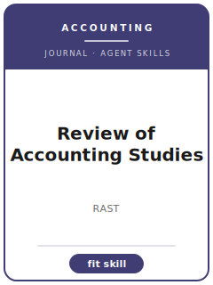

# Review of Accounting Studies Skills

<p align="center"></p>

[English](README.md) | 简体中文

面向 **Review of Accounting Studies（RAST）** 投稿的 12 个 agent skills。本包围绕 analytical, empirical, and experimental accounting research with strong economics foundations 设计，帮助稿件区别于 The Accounting Review, Journal of Accounting Research, Journal of Accounting and Economics, and Contemporary Accounting Research，并强调 accounting research that links institutional reporting detail to credible economic mechanisms。

**官方依据核验日期：2026-06**（投稿前需复核易变细节）：见 [`resources/official-source-map.md`](resources/official-source-map.md)。

## 为什么需要单独的技能栈？

| RAST 约束 | 对稿件的要求 |
|-------------------|--------------|
| 范围 | 主张必须服务于 analytical, empirical, and experimental accounting research with strong economics foundations |
| 同门边界 | 说明为什么不是 The Accounting Review, Journal of Accounting Research, Journal of Accounting and Economics, and Contemporary Accounting Research |
| 证据标准 | 设计、模型、综述或质性证据必须匹配 accounting research that links institutional reporting detail to credible economic mechanisms |
| 来源纪律 | 当前流程事实必须有来源，或明确标记 待核实 |

## 快速开始

```text
/plugin marketplace add ./Review-of-Accounting-Studies-Skills
/plugin install review-of-accounting-studies-skills
```

手动使用：先打开 [`skills/revacc-workflow/SKILL.md`](skills/revacc-workflow/SKILL.md)。

## 默认工作流

```text
revacc-workflow → revacc-topic-selection → revacc-theory-development → revacc-literature-positioning → revacc-methods → revacc-data-analysis → revacc-contribution-framing → revacc-tables-figures → revacc-writing-style → revacc-submission → revacc-review-process → revacc-rebuttal
```

## 技能列表

| # | Skill | 作用 |
|---|-------|------|
| 1 | [`revacc-workflow`](skills/revacc-workflow/SKILL.md) | 面向 RAST 稿件的 Workflow Router |
| 2 | [`revacc-topic-selection`](skills/revacc-topic-selection/SKILL.md) | 面向 RAST 稿件的 Topic Selection |
| 3 | [`revacc-theory-development`](skills/revacc-theory-development/SKILL.md) | 面向 RAST 稿件的 Theory Development |
| 4 | [`revacc-literature-positioning`](skills/revacc-literature-positioning/SKILL.md) | 面向 RAST 稿件的 Literature Positioning |
| 5 | [`revacc-methods`](skills/revacc-methods/SKILL.md) | 面向 RAST 稿件的 Methods |
| 6 | [`revacc-data-analysis`](skills/revacc-data-analysis/SKILL.md) | 面向 RAST 稿件的 Data Analysis |
| 7 | [`revacc-contribution-framing`](skills/revacc-contribution-framing/SKILL.md) | 面向 RAST 稿件的 Contribution Framing |
| 8 | [`revacc-tables-figures`](skills/revacc-tables-figures/SKILL.md) | 面向 RAST 稿件的 Tables and Figures |
| 9 | [`revacc-writing-style`](skills/revacc-writing-style/SKILL.md) | 面向 RAST 稿件的 Writing Style |
| 10 | [`revacc-submission`](skills/revacc-submission/SKILL.md) | 面向 RAST 稿件的 Submission Preflight |
| 11 | [`revacc-review-process`](skills/revacc-review-process/SKILL.md) | 面向 RAST 稿件的 Review Process |
| 12 | [`revacc-rebuttal`](skills/revacc-rebuttal/SKILL.md) | 面向 RAST 稿件的 Rebuttal Strategy |

## 资源

- [`resources/README.md`](resources/README.md) — 资源索引
- [`resources/official-source-map.md`](resources/official-source-map.md) — 官方 URL 与易变信息
- [`resources/external_tools.md`](resources/external_tools.md) — 数据库、方法与软件工具
- [`resources/worked-examples/01-introduction.md`](resources/worked-examples/01-introduction.md) — 虚构引言改写示例
- [`resources/exemplars/library.md`](resources/exemplars/library.md) — 真实论文槽位与来源纪律
- [`resources/code/`](resources/code/) — 适用时使用的实证代码脚手架

## 许可

MIT (c) 2026 Bryce Wang。见 [LICENSE](LICENSE)。
