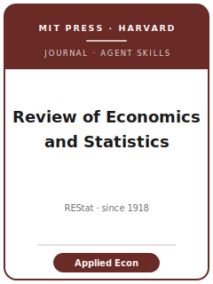

# Review of Economics and Statistics Skills

<p align="center"></p>

[](LICENSE)
[](https://direct.mit.edu/rest)

English | [简体中文](README.zh-CN.md)

Twelve agent skills for manuscripts targeted at **The Review of Economics and Statistics (REStat)**, the MIT Press applied economics and applied econometrics journal. The pack is empirical-first: topic fit, literature positioning, identification, theory/model discipline, robustness, tables and figures, writing style, replication package, referee strategy, submission preflight, and rebuttal.

**Official basis checked 2026-06-20**: see [`resources/official-source-map.md`](resources/official-source-map.md).

## Quick Start

```
/plugin marketplace add ./Review-of-Economics-and-Statistics-Skills
/plugin install restat-skills
```

Manual use: start with [`skills/restat-workflow/SKILL.md`](skills/restat-workflow/SKILL.md).

## Skills

| # | Skill | Role |
|---|-------|------|
| 1 | [`restat-workflow`](skills/restat-workflow/SKILL.md) | Route a REStat manuscript |
| 2 | [`restat-topic-selection`](skills/restat-topic-selection/SKILL.md) | Test fit for applied economics and measurement |
| 3 | [`restat-literature-positioning`](skills/restat-literature-positioning/SKILL.md) | Position the empirical contribution |
| 4 | [`restat-identification`](skills/restat-identification/SKILL.md) | Stress-test causal design and inference |
| 5 | [`restat-theory-model`](skills/restat-theory-model/SKILL.md) | Keep theory/model pieces disciplined |
| 6 | [`restat-robustness`](skills/restat-robustness/SKILL.md) | Organize robustness checks |
| 7 | [`restat-tables-figures`](skills/restat-tables-figures/SKILL.md) | Prepare readable exhibits |
| 8 | [`restat-writing-style`](skills/restat-writing-style/SKILL.md) | Write for REStat's concise empirical style |
| 9 | [`restat-replication-package`](skills/restat-replication-package/SKILL.md) | Prepare data and code materials |
| 10 | [`restat-referee-strategy`](skills/restat-referee-strategy/SKILL.md) | Anticipate referee objections |
| 11 | [`restat-submission`](skills/restat-submission/SKILL.md) | Run submission preflight |
| 12 | [`restat-rebuttal`](skills/restat-rebuttal/SKILL.md) | Draft response and revision plan |

## Resources

- [`resources/official-source-map.md`](resources/official-source-map.md) — official REStat sources
- [`resources/external_tools.md`](resources/external_tools.md) — data and software tools
- [`resources/code/`](resources/code/) — empirical Stata/Python code kit

## License

MIT (c) 2026 Bryce Wang. See [LICENSE](LICENSE).
