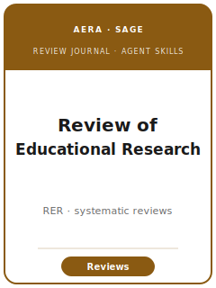

# Review of Educational Research 技能包

<p align="center"></p>

[](LICENSE)
[](https://journals.sagepub.com/home/rer)
[](https://www.aera.net/Publications/Journals/Review-of-Educational-Research)
[](https://github.com/brycewang-stanford/review-of-educational-research-skills)

[English](README.md) | 简体中文

面向 **《教育研究评论》（Review of Educational Research, RER）** 系统综述、元分析与批判性整合综述的 12 个智能体技能。RER 是 **美国教育研究协会（AERA）** 的综述旗舰刊，由 **SAGE** 出版（创刊于 1931 年）：它发表 **关于教育的全面、批判性、整合性研究综述**，**不发表作者本人的原创实证研究**（除非作为更宽广整合综述的一部分被纳入）。关键区别在于——与受邀撰写的《Annual Review》不同——RER 的综述是 **自由投稿并经同行评审** 的，因此 **综述本身的严谨性**（有据可查的 PRISMA 检索、可靠的双人编码、可辩护的元分析模型、偏倚风险与敏感性分析，以及一个能 **推进理论或政策** 的组织框架）才是核心贡献。本技能包正是为此而建：界定值得综述的问题、撰写并预注册研究方案、系统检索与筛选、构建概念框架、在稳健性下保证全面与平衡、PRISMA/MARS 透明度、RER 的匿名 APA-7 文体、投稿与修改。

**官方依据核查于 2026-06**：见 [`resources/official-source-map.md`](resources/official-source-map.md)。

## 为什么需要独立技能包？

为 RER 写综述并非原创研究论文，其约束高度专属：

| 约束 | RER 的要求（检索于 2026-06；以官网为准） |
|---|---|
| 成果形态 | 全面、**批判性、整合性综述**——不含作者本人的原创实证研究 |
| 过程严谨性 | 系统综述/元分析须有据可查的检索 + **PRISMA 流程图**、可靠双人编码、偏倚风险与敏感性分析 |
| 贡献 | 一个 **推进理论或政策的组织框架**——而非注释式书目或简单计票 |
| 文体 | **APA 第 7 版**；**摘要 ≤ 150 词** + 关键词；**Microsoft Word**（非 PDF） |
| 评审模式 | **匿名评审**；仅匿名 **小范围流通** 的自引；非匿名标题页 + 匿名正文 + 作者简介 |
| 报告标准 | 参照 **PRISMA** + APA **研究报告标准**（MARS/JARS）；建议在 PROSPERO/OSF 预注册 |

## 快速开始

```
/plugin marketplace add ./Review-of-Educational-Research-Skills
/plugin install review-of-educational-research-skills
```

手动使用：从 [`skills/revedres-workflow/SKILL.md`](skills/revedres-workflow/SKILL.md) 开始。

## 默认工作流

```
topic-selection → proposal-and-commissioning → literature-synthesis → organizing-framework
   → comprehensiveness-and-balance → tables-figures → writing-style
   → transparency-and-reproducibility → editor-strategy → submission → revision
                         （revedres-workflow 在每一步进行路由）
```

## 技能列表

| # | 技能 | 作用 |
|---|-------|------|
| 1 | [`revedres-workflow`](skills/revedres-workflow/SKILL.md) | 为 RER 综述项目进行路由 |
| 2 | [`revedres-topic-selection`](skills/revedres-topic-selection/SKILL.md) | 检验问题是否值得综述、是否达到 RER 量级 |
| 3 | [`revedres-proposal-and-commissioning`](skills/revedres-proposal-and-commissioning/SKILL.md) | 在检索前撰写并预注册研究方案 |
| 4 | [`revedres-literature-synthesis`](skills/revedres-literature-synthesis/SKILL.md) | 执行系统检索并筛选至 PRISMA 流程 |
| 5 | [`revedres-organizing-framework`](skills/revedres-organizing-framework/SKILL.md) | 将语料转化为推进理论/政策的分析主线 |
| 6 | [`revedres-comprehensiveness-and-balance`](skills/revedres-comprehensiveness-and-balance/SKILL.md) | 全面性、偏倚风险、异质性、敏感性 |
| 7 | [`revedres-tables-figures`](skills/revedres-tables-figures/SKILL.md) | PRISMA 流程图、森林/漏斗图、编码表 |
| 8 | [`revedres-writing-style`](skills/revedres-writing-style/SKILL.md) | 以 APA 7 写出整合性的 RER 文体 |
| 9 | [`revedres-transparency-and-reproducibility`](skills/revedres-transparency-and-reproducibility/SKILL.md) | 编码信度、开放材料、PRISMA/MARS |
| 10 | [`revedres-editor-strategy`](skills/revedres-editor-strategy/SKILL.md) | 应对 AERA/SAGE 编辑与评审的期待 |
| 11 | [`revedres-submission`](skills/revedres-submission/SKILL.md) | 执行 Manuscript Central 投稿前检查 |
| 12 | [`revedres-revision`](skills/revedres-revision/SKILL.md) | 收到决定信后进行修改 |

## 资源

- [`resources/README.md`](resources/README.md) — 资源索引
- [`resources/official-source-map.md`](resources/official-source-map.md) — 官方 SAGE/AERA RER 来源
- [`resources/external_tools.md`](resources/external_tools.md) — 检索、筛选、编码与元分析工具
- [`resources/worked-examples/01-introduction.md`](resources/worked-examples/01-introduction.md) — RER 文体的综述引言改写示例（before→after）
- [`resources/exemplars/library.md`](resources/exemplars/library.md) — 经网络核实的真实 RER 综述（按类型）

## 与姊妹刊的区别

| 期刊 | 与 RER 的关系 |
|---|---|
| **AERJ /《AERA Open》** | AERA 的原创研究刊——原创实证研究投这里，而非 RER |
| **《Educational Researcher》** | AERA 的短篇评论、政策随笔、方法札记——并非全面综述（共享 `10.3102/` DOI 前缀） |
| **《Review of Research in Education》** | AERA 的 **受邀** 主题综述卷——RER 综述则为自由投稿 |
| **《Psychological Bulletin》** | 心理学综述——RER 是教育领域的综述旗舰 |
| **Annual Reviews** | **受邀** 的非系统性概述——RER 综述系投稿并以系统严谨性评判 |

## 许可

MIT (c) 2026 Bryce Wang。见 [LICENSE](LICENSE)。
