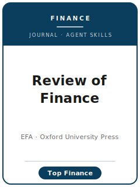

# Review of Finance Skills

<p align="center">
  
</p>

[](LICENSE)
[](https://academic.oup.com/rof)
[](https://revfin.org/)
[](https://github.com/anthropics/claude-code)

English | [简体中文](README.zh-CN.md)

Agent skill stack for manuscripts targeted at the **Review of Finance (RoF)** — the **official journal of the European Finance Association (EFA)**, published by **Oxford University Press**, covering **general-interest empirical and theoretical finance at the level of the top-three finance journals**.

This repository is opinionated. It is **not** a generic finance-writing toolbox. It is an **RoF-specific** stack covering both **empirical** finance (asset pricing, corporate finance, banking, household finance, microstructure) and **theoretical** finance (asset-pricing theory, security/contract design, microstructure theory), built around the journal's actual rules: a hard 60-page cap, a 150-word abstract, Chicago citations, double-blind review, a two-round decision philosophy, a real tiered submission fee with an optional Fast-Track, and the Code Sharing and Data Availability Policy.

Official basis checked **2026-06-01**: Oxford Academic author guidelines, RoF / EFA journal pages, fee categories, editorial policy, code-sharing policy, FAQ, and editorial-board updates. See [`resources/official-source-map.md`](resources/official-source-map.md).

---

## Why a Separate RoF Skill Stack?

RoF imposes constraints that differ materially from a generic finance journal:

| Constraint            | Review of Finance                                                               | Implication                                                |
|-----------------------|----------------------------------------------------------------------------------|------------------------------------------------------------|
| Audience              | General-interest finance, empirical **and** theoretical                          | A subfield-only result is off-fit                          |
| Standard              | Referees apply **top-three-finance-journal** standards                           | "Competent" is not enough                                  |
| Length                | **Hard 60-page cap** incl. appendices, bibliography, figures, tables             | A bloated paper is rejected; budget exhibit space          |
| Abstract              | **≤ 150 words**                                                                  | A long abstract reads as off-template                      |
| References            | **Chicago** style                                                                | Numbered/footnote styles read as non-compliant             |
| Review                | **Double-blind**, **two-round** decision philosophy                              | Round one is decisive; new round-two issues may be ignored |
| Fee                   | **EUR 350** (EUR 300 EFA members); **Fast-Track EUR 900, 14-day** decision       | Budget the fee; EFA membership lowers it                   |
| Citation duty         | Authors **must** find and cite relevant work; lack of awareness is no defense    | Omissions can be sanctioned                                |
| Strategic submission  | Non-disclosed resubmission or dual submission → **2-year ban**                   | Disclose in the cover letter                               |
| Replication           | Code/data policy is a **condition of publication**                               | Build the package as you go                                |

Volatile specifics (current editors, exact fees, refund amounts, page/abstract limits, policy wording) change — **verify them on the official pages**. Items this pack could not confirm against a single primary source are marked **待核实** in `resources/official-source-map.md`.

---

## Quick Start

### Option A — Claude Code Plugin (recommended)

```bash
/plugin marketplace add https://github.com/brycewang-stanford/rof-skills
/plugin install rof-skills
/reload-plugins
```

### Option B — Manual Copy

```bash
git clone https://github.com/brycewang-stanford/rof-skills.git
cd rof-skills

mkdir -p ~/.claude/skills && cp -R skills/rof-* ~/.claude/skills/
# or
mkdir -p ~/.codex/skills && cp -R skills/rof-* ~/.codex/skills/
```

### First Prompt

```
Use rof-workflow to tell me which skill I should use next for my Review of Finance manuscript.
```

---

## Default Workflow

```text
rof-topic-selection
        ▼
rof-contribution-framing
        ▼
rof-literature-positioning
        ▼
rof-identification-strategy   (empirical: causal design | theory: assumptions/results)
        ▼
rof-data-analysis
        ▼
rof-tables-figures            (mind the 60-page cap)
        ▼
rof-writing-style             (abstract ≤150 words; polish last)
        ▼
rof-replication-and-data-policy
        ▼
rof-review-process
        ▼
rof-submission                (Editorial Express; regular vs. Fast-Track)
        ▼
rof-rebuttal
```

`rof-workflow` is the router — it tells you which skill to use next based on where you are.

---

## Skills

| Skill                             | Purpose                                                                       |
|-----------------------------------|-------------------------------------------------------------------------------|
| `rof-workflow`                    | Router — decides which sub-skill to invoke next                               |
| `rof-topic-selection`             | First-order, general-interest finance fit (empirical or theoretical)          |
| `rof-contribution-framing`        | State the marginal finance contribution a top-three referee will accept       |
| `rof-literature-positioning`      | Position against the finance frontier; honor the strict citation duty         |
| `rof-identification-strategy`     | Causal design (empirical) **or** assumptions/results/proofs (theory)          |
| `rof-data-analysis`               | Sample, variables, estimation, SE, robustness (or reproducible numerics)      |
| `rof-tables-figures`              | Self-contained exhibits inside the hard 60-page cap                           |
| `rof-writing-style`               | Land the contribution in a ≤150-word abstract; Chicago style                  |
| `rof-replication-and-data-policy` | Code/data package, pseudo-data + logs, Data Availability Statement            |
| `rof-review-process`              | Double-blind, Screen Reports, two-round logic, strategic-submission rules     |
| `rof-submission`                  | Editorial Express preflight + regular-vs-Fast-Track fee decision              |
| `rof-rebuttal`                    | Two-round R&R response-letter strategy                                        |

### Resources

- [`skills/rof-submission/templates/cover_letter.md`](skills/rof-submission/templates/cover_letter.md) — RoF cover-letter skeleton with required disclosures
- [`skills/rof-submission/templates/checklist.md`](skills/rof-submission/templates/checklist.md) — pre-submission self-check
- [`resources/external_tools.md`](resources/external_tools.md) — finance data sources (CRSP / Compustat / TRACE / OptionMetrics / Call Reports) + Stata / R / Python packages, and theory/numerical tools
- [`resources/official-source-map.md`](resources/official-source-map.md) — official RoF/EFA URLs behind every fact, accessed 2026-06-01

---

## What This Repo Does Not Do

- It does not write a submittable manuscript for you
- It does not simulate any specific editor's or referee's taste
- It does not assert volatile metadata (current editors, exact fee, refund amounts) — verify on the official pages
- It does not judge whether your idea is genuinely first-order — that is the researcher's call

---

## Related

- [awesome-journal-skills](https://github.com/brycewang-stanford/awesome-journal-skills) — Index of journal-specific skill packs
- [Review of Finance (official)](https://academic.oup.com/rof) — Oxford University Press
- [European Finance Association / RoF](https://revfin.org/) — society and journal site

---

## License

MIT
