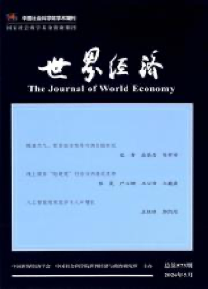

<!-- AJS-ROOT-JOURNAL-ENTRY -->
# 《世界经济》

> 战略性、理论性兼具的世界经济权威期刊。

| 期刊概览 | |
|---|---|
| **学科** | 世界经济 |
| **主办/出版** | 中国社会科学院主管 · 中国世界经济学会、世界经济与政治研究所主办 |
| **创刊** | 1978 |
| **ISSN** | 1002-9621 · CN 11-1138/F |
| **周期** | 月刊 |
| **收录/地位** | CSSCI · 北大中文核心 |
| **官网** | [sjjj.magtech.com.cn](https://sjjj.magtech.com.cn/) |
| **核验日期** | 2026-06-17 |

**▶ 调用 skill —— [`journal-of-world-economy`](../Chinese-SocialScience-Journal-Skills/skills/journal-of-world-economy/)：** 选题契合度、框架、方法与证据门槛、写作体例与拒稿雷区。

属于 **[中文社会科学期刊 Skills](../Chinese-SocialScience-Journal-Skills/)** 合集。投稿前请以官网最新《投稿须知》为准。

---

<!-- 机器可读的规范指针——请勿删除或改动（由 tools/audit_repo.py 校验）。 -->

- Canonical skill: [Chinese-SocialScience-Journal-Skills/skills/journal-of-world-economy/](../Chinese-SocialScience-Journal-Skills/skills/journal-of-world-economy/)
- Skill name: `journal-of-world-economy`
- Bundle: [Chinese-SocialScience-Journal-Skills/](../Chinese-SocialScience-Journal-Skills/)

此目录刻意不包含 `SKILL.md`；真正可安装的 skill 保留在 bundle 内，确保插件路径和 skill 计数保持稳定。
