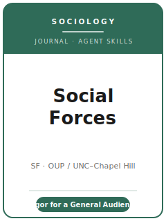

# Social Forces Skills

<p align="center">
  
</p>

[](LICENSE)
[](https://academic.oup.com/sf)
[](https://sociology.unc.edu/social-forces/)
[](https://github.com/anthropics/claude-code)

English | [简体中文](README.zh-CN.md)

Agent skill stack for manuscripts targeted at **Social Forces (SF)** — founded in **1922** by Howard
Odum and published by **Oxford University Press** in partnership with the **Department of Sociology at
the University of North Carolina at Chapel Hill (UNC)**. Social Forces calls itself **"a global leader
among social research journals,"** publishing **"articles of interest to a general social science
audience."** It is centered on sociology but explicitly multidisciplinary — stratification and
mobility, demography, comparative-historical sociology, social-psychological and macro work,
political and economic sociology, networks, and computational social science — reaching into
psychology, anthropology, political science, history, and economics.

This repository is opinionated. It is **not** a generic social-science writing toolbox and it is
**not** the American Sociological Review (ASR) or American Journal of Sociology (AJS) pack relabeled.
All three are general sociology flagships, but Social Forces is its own venue: an **Oxford University
Press** journal with a **reference-inclusive 10,000-word cap**, a hard **10 tables-and-figure-panels**
exhibit limit, **Chicago Manual of Style (17th ed.) author-date**, **double-anonymized** review via
**ScholarOne Manuscript Central**, a **$50 processing fee**, and a reputation for **methodologically
rigorous, theoretically grounded empirical research** that speaks to a broad social-science readership.

---

## What Is Social Forces, and Why a Dedicated Stack?

SF's constraints differ from a subfield journal, a methods journal, and from its sociology siblings:

| Constraint            | Social Forces                                                                 | Implication                                                       |
|-----------------------|-------------------------------------------------------------------------------|------------------------------------------------------------------|
| Scope                 | **General social science**, centered on sociology, multidisciplinary reach    | The paper must matter to a general audience, not one subfield    |
| Premium on            | **Methodological rigor** + a theoretically grounded, portable contribution    | A narrow or under-identified result is off-fit                   |
| Methods               | Quantitative, demographic, comparative-historical, ethnographic, network, computational — judged on own terms | Don't force one template onto every paper        |
| Publisher / owner     | **Oxford University Press** / **UNC Chapel Hill** (Dept. of Sociology)         | Submitted via **ScholarOne**, not Sage Track or Editorial Manager |
| Review model          | **Double-anonymized** — anon manuscript + **separate title page**             | Move names, affiliations, acknowledgements, funding off the text |
| Fee                   | **$50 non-refundable** processing fee (**$20** for student-only manuscripts)  | Budget it; differs from ASR's $25 and AJS's $30                  |
| Length                | **≤ 10,000 words including text, endnotes, AND references**                    | References count — unusually tight; budget citations             |
| Exhibits              | **≤ 10 tables and figure panels** total; supplementary materials **≤ 10 pages** | Every exhibit must earn its slot                               |
| Style                 | **Chicago Manual of Style, 17th ed.** (author-date) at final submission        | **Not** the ASA Style Guide and **not** AJS's house style        |
| Transparency          | **Data availability statement required**; deposit where ethically feasible    | A required statement, not an editor-run replication check        |

Volatile specifics (editor and term, exact caps, fee/APC, abstract length, data policy) change — items
not directly confirmed are marked **待核实** in
[`resources/official-source-map.md`](resources/official-source-map.md).
**Verify on the official journal page.**

### Social Forces vs. ASR vs. AJS at a glance

- **Social Forces** — OUP / UNC; general social-science audience, rigor-forward; double-anonymized via
  ScholarOne; **$50 fee** ($20 student); **10,000 words incl. references**; **≤ 10 tables/figure
  panels**; **Chicago 17th author-date**; required data availability statement.
- **ASR** — SAGE / ASA; discipline-wide flagship; masked via Sage Track; **$25 fee**; **~15,000 words**
  (refs count, but a higher cap); **ASA Style Guide**; ASA data-sharing norm.
- **AJS** — UChicago Press; theory-forward; double-blind, student-run; **$30 fee**; **no fixed word
  cap**; **own house style**; Comment-and-Reply tradition.

---

## Quick Start

### Option A — Claude Code Plugin (recommended)

```bash
/plugin marketplace add https://github.com/brycewang-stanford/sf-skills
/plugin install sf-skills
/reload-plugins
```

### Option B — Manual Copy

```bash
git clone https://github.com/brycewang-stanford/sf-skills.git
cd sf-skills

mkdir -p ~/.claude/skills && cp -R skills/sf-* ~/.claude/skills/
# or
mkdir -p ~/.codex/skills && cp -R skills/sf-* ~/.codex/skills/
```

### First Prompt

```
Use sf-workflow to tell me which skill I should use next for my Social Forces manuscript.
```

---

## Default Workflow

```text
sf-topic-selection
        ▼
sf-literature-positioning
        ▼
sf-theory-building
        ▼
sf-research-design
        ▼
sf-data-analysis
        ▼
sf-tables-figures
        ▼
sf-writing-style          (polish)
        ▼
sf-data-and-transparency
        ▼
sf-review-process
        ▼
sf-submission
        ▼
sf-rebuttal
```

`sf-workflow` is the router — it tells you which skill to use next based on where you are. Because the
**10,000-word cap includes the reference list** and exhibits are capped at **10 panels**, most SF
papers loop theory ↔ design ↔ analysis several times and then spend real effort trimming in
`sf-writing-style` and `sf-tables-figures` before submission.

---

## Skills

| Skill                          | Purpose                                                                       |
|--------------------------------|-------------------------------------------------------------------------------|
| `sf-workflow`                  | Router — decides which sub-skill to invoke next                               |
| `sf-topic-selection`           | General social-science significance + a rigorous, portable contribution       |
| `sf-literature-positioning`    | Place the contribution in a debate a general SF reader will recognize          |
| `sf-theory-building`           | Build a portable theoretical argument, not just a finding                      |
| `sf-research-design`           | Defend the design — quant, demographic, comparative-historical, ethnographic, network |
| `sf-data-analysis`             | Analysis norms, uncertainty, robustness across SF's methodological range       |
| `sf-tables-figures`            | Exhibits within the hard **10 tables-and-figure-panels** cap                   |
| `sf-writing-style`             | Chicago 17th author-date; fit **10,000 words including references**            |
| `sf-data-and-transparency`     | Required **data availability statement**; documentation; restricted-data paths |
| `sf-review-process`            | Double-anonymized review, decisions, what reviewers weigh                      |
| `sf-submission`                | ScholarOne preflight ($50 fee, title-page anonymization, word + panel caps)    |
| `sf-rebuttal`                  | R&R response-letter strategy for multiple reviewers + editor                   |

### Resources

- [`resources/external_tools.md`](resources/external_tools.md) — sociology data sources (GSS / PSID / IPUMS / LIS / Add Health / V-Dem) + R / Stata / Python and CAQDAS/QCA tooling
- [`resources/official-source-map.md`](resources/official-source-map.md) — official Oxford Academic / UNC URLs behind every fact, with 待核实 markers on unverified items

---

## What This Repo Does Not Do

- It does not write a submittable manuscript for you
- It does not simulate any specific editor's or reviewer's taste
- It does not assert volatile metadata (current editor and term, exact caps, fee/APC, abstract length, data policy) — verify on the official page; unverified items are marked 待核实
- It does not decide whether your question is of broad social-science significance — that is the researcher's call

---

## Related

- [awesome-journal-skills](https://github.com/brycewang-stanford/awesome-journal-skills) — Index of journal-specific skill packs
- [Social Forces (Oxford Academic)](https://academic.oup.com/sf) — publisher home, instructions, policies
- [Social Forces at UNC](https://sociology.unc.edu/social-forces/) — editorial home, Department of Sociology

---

## License

MIT
