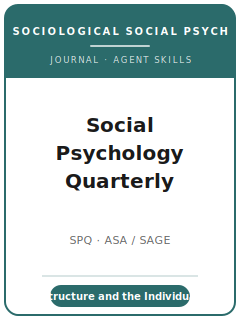

# Social Psychology Quarterly Skills

<p align="center">
  
</p>

[](LICENSE)
[](https://journals.sagepub.com/home/spq)
[](https://www.asanet.org/publications/journals/social-psychology-quarterly/)
[](https://github.com/anthropics/claude-code)

English | [简体中文](README.zh-CN.md)

Agent skill stack for manuscripts targeted at **Social Psychology Quarterly (SPQ)** — the leading journal
of **sociological social psychology**, owned by the **American Sociological Association (ASA)** and
published by **SAGE**. Founded in **1937** as *Sociometry* (it became *Social Psychology* in 1978 and
*Social Psychology Quarterly* in 1979), SPQ publishes theoretical and empirical work on the **link between
the individual and society** — self and identity, social structure and personality, group processes,
social interaction, symbolic interaction, status and expectation states, and affect and emotion.

This repository is opinionated. It is **not** a generic social-science writing toolbox, it is **not** a
psychological-social-psychology pack (JPSP / Psychological Science) relabeled, and it is **not** a
general-sociology pack (ASR / AJS) relabeled. SPQ centers the **link between social structure and the
individual**: a social-psychological mechanism, defended on the methodological terms of its tradition, a
properly **masked** manuscript, and submission through **SageTrack** with the ASA **$25 processing fee**
and the ASA **data-sharing** norm — under which sharing materials is **encouraged but not required**.

---

## What Is SPQ, and Why a Dedicated Stack?

SPQ is a **social-psychology specialist within sociology** — distinct from both the psychology journals
and the general-sociology journals:

| Constraint            | Social Psychology Quarterly                                                   | Implication                                                       |
|-----------------------|-------------------------------------------------------------------------------|------------------------------------------------------------------|
| Scope                 | **Sociological social psychology** — the structure–individual link            | Not individual cognition (JPSP/Psych Sci); not macro sociology (ASR/AJS) |
| Premium on            | A **social-psychological mechanism** connecting structure/process to the self | A bare association or a clever lab finding is off-fit            |
| Traditions            | Symbolic interaction · social structure & personality · group processes · identity · affect | Locate your paper in one; engage its program |
| Methods               | **Experiments, surveys/secondary data, observation/ethnography** — judged on own terms | Don't force one template onto every paper            |
| Publisher / owner     | **SAGE** / **ASA**                                                            | Submitted via **SageTrack / Manuscript Central**                 |
| Review model          | **Masked (blinded)** — blinded manuscript + **separate title page**           | Under-blinded papers are **temporarily rejected**                |
| Fee                   | **$25** processing fee on first submission (waived for resubmissions & ASA student members) | Budget it unless you qualify for a waiver       |
| Length                | **Articles ≤ 10,000 words** (all parts, excl. supplementary); **Notes ≤ 5,000** | Word count goes on the title page                              |
| Abstract              | **~150 words**, **non-identifying**, with keywords; author names omitted      | A short, blinded abstract                                        |
| Style                 | **ASA Style Guide** (author-date)                                             | Not APA; not Chicago-generic                                     |
| Data / transparency   | Sharing data/code/materials **encouraged, NOT required**; **no impact on acceptance** | A norm, **not** a verified replication gate              |

The pack's venue facts are mapped to SAGE / ASA sources in
[`resources/official-source-map.md`](resources/official-source-map.md). Before an actual upload,
live-check the official pages for operational details such as the submission link, fee workflow,
editorial-office email, file handling, open-access prompts, and policy wording.

### The traditions of sociological social psychology

- **Symbolic interaction** — how meaning, the self, and the interaction order are constructed and managed.
- **Social structure and personality (SSP)** — how structural position shapes the self, well-being, attitudes.
- **Group processes** — status, expectation states, exchange, legitimacy, and justice in interaction.
- **Identity theory** — identity salience, prominence, and verification, with structural antecedents.
- **Affect and emotion** — sentiments, impression formation, and emotion management (e.g., affect control).

---

## Quick Start

### Option A — Claude Code Plugin (recommended)

```bash
/plugin marketplace add https://github.com/brycewang-stanford/spq-skills
/plugin install spq-skills
/reload-plugins
```

### Option B — Manual Copy

```bash
git clone https://github.com/brycewang-stanford/spq-skills.git
cd spq-skills

mkdir -p ~/.claude/skills && cp -R skills/spq-* ~/.claude/skills/
# or
mkdir -p ~/.codex/skills && cp -R skills/spq-* ~/.codex/skills/
```

### First Prompt

```
Use spq-workflow to tell me which skill I should use next for my SPQ manuscript.
```

---

## Default Workflow

```text
spq-topic-selection
        ▼
spq-literature-positioning
        ▼
spq-theory-building
        ▼
spq-research-design
        ▼
spq-data-analysis
        ▼
spq-tables-figures
        ▼
spq-writing-style          (polish)
        ▼
spq-data-and-transparency
        ▼
spq-review-process
        ▼
spq-submission
        ▼
spq-rebuttal
```

`spq-workflow` is the router — it tells you which skill to use next based on where you are, which
**tradition** the paper sits in (symbolic interaction / SSP / group processes / identity / affect), and
whether you are writing a full **Article** or a **Note**.

---

## Skills

| Skill                          | Purpose                                                                       |
|--------------------------------|-------------------------------------------------------------------------------|
| `spq-workflow`                 | Router — decides which sub-skill to invoke next                               |
| `spq-topic-selection`          | Test the structure–individual fit; locate the tradition; Article vs. Note     |
| `spq-literature-positioning`   | Place the paper in a sociological-social-psychology program                   |
| `spq-theory-building`          | Build the mechanism linking social structure/process to the individual         |
| `spq-research-design`          | Defend the design — experiments, surveys/secondary, observation/ethnography    |
| `spq-data-analysis`            | Analysis norms, measurement quality, uncertainty, robustness                  |
| `spq-tables-figures`           | Self-contained, ASA-style exhibits that show the structure–individual link    |
| `spq-writing-style`            | ASA Style Guide; reach sociology + psychology within ~10,000 words            |
| `spq-data-and-transparency`    | ASA data-sharing norm; encouraged-not-required; qualitative confidentiality   |
| `spq-review-process`           | Masked review, the blinding check, fit screening, decision pattern            |
| `spq-submission`               | SageTrack preflight (blinding, title page, $25 fee, ~150-word abstract)       |
| `spq-rebuttal`                 | R&R response-letter strategy across cross-tradition reviewers + editor        |

### Resources

- [`resources/external_tools.md`](resources/external_tools.md) — sociological-social-psychology data (GSS / ACL / MIDUS / Add Health) + experimental, survey, SEM, affect-control, and CAQDAS tooling by tradition
- [`resources/official-source-map.md`](resources/official-source-map.md) — official SAGE / ASA URLs behind the pack's venue-specific facts

---

## What This Repo Does Not Do

- It does not write a submittable manuscript for you
- It does not simulate any specific editor's or reviewer's taste
- It does not replace a live final check of operational metadata (submission link, fee workflow, current masthead, file handling, policy wording)
- It does not turn a psychology paper or a macro-sociology paper into an SPQ paper — the structure–individual contribution is the researcher's to make

---

## Related

- [awesome-journal-skills](https://github.com/brycewang-stanford/awesome-journal-skills) — Index of journal-specific skill packs
- [Social Psychology Quarterly (SAGE)](https://journals.sagepub.com/home/spq) — publisher home
- [SPQ at ASA](https://www.asanet.org/publications/journals/social-psychology-quarterly/) — owner, submission information, policies

---

## License

MIT
