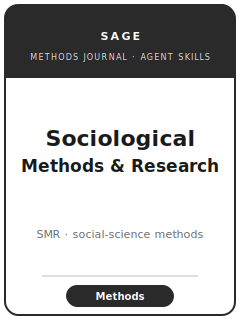

# Sociological Methods & Research 技能包

<p align="center">
  
</p>

[](LICENSE)
[](https://journals.sagepub.com/home/smr)
[](https://journals.sagepub.com/author-instructions/smr)
[](https://github.com/anthropics/claude-code)

[English](README.md) | 简体中文

面向 **Sociological Methods & Research（SMR）** 投稿的智能体技能包。SMR 是 **SAGE** 出版的社会学与社会
科学 **定量与统计方法学** 旗舰期刊，发表 **发展、评估或批判性审视方法** 的论文：因果推断、测量与潜变量
模型、结构方程模型、多层与纵向数据、社会网络分析、缺失数据、模拟、序列分析，以及日益增多的计算社会科学
与文本即数据（text-as-data）。**没有方法学贡献** 的纯应用类论文不在范围之内。

本仓库立场鲜明：它 **不是** 通用社会科学写作工具箱，也 **不是** 被改造来做方法的应用类实证模板。它是
**SMR 专属** 的方法期刊套件：清晰陈述的 **方法贡献**、**推导出的解析性质**、对真实竞争方法的 **蒙特卡洛
模拟研究**、能 **改变实质性结论** 的真实数据实证说明，以及 SMR 读者可以真正运行的 **可复现、已发布的软件**。

官方依据核于 **2026-06（检索于 2026-06；以官网为准）**：SAGE SMR 主页与作者须知、ScholarOne 投稿系统、
ASA + DataCite 引用规范、≤150 词且无括号引用的摘要、双盲评审、数据与代码可得性政策，以及生成式 AI 披露
规则。精确来源映射与未决 **待核实** 条目见
[`resources/official-source-map.md`](resources/official-source-map.md)。

---

## SMR 是什么，为什么需要专门的技能包？

SMR 是 **方法** 期刊——其约束既不同于实质性社会学期刊（ASR/AJS），也不同于其方法学姊妹刊：

| 约束        | SMR                                                       | 含义                                                       |
|-------------|----------------------------------------------------------|------------------------------------------------------------|
| 范围        | **发展 / 评估 / 批判性审视** 一种方法                       | 无方法收益的应用类论文极易被退稿                            |
| “结果”      | 是 **方法** 本身，而非实质性发现                            | 抽掉数据集后，仍须留下方法层面的可借鉴点                    |
| 证据        | **性质 + 蒙特卡洛 + 真实数据实证说明**                      | 每条性质需有有限样本检验；模拟需纳入真实竞争方法            |
| 软件        | 期望 **可复现、已发布** 的软件包                            | 没有可用代码的方法无人采用                                  |
| 出版方      | **SAGE**                                                  | 通过 **ScholarOne Manuscripts** 投稿                       |
| 评审模式    | **双盲**                                                  | 正文、图表、代码与元数据均须匿名化                          |
| 摘要        | **≤150 词，且无括号引用**                                  | 不允许 “(Smith 2015)”；允许 “Smith (2015)”                 |
| 体例        | 正文与文献用 **ASA** 体例；数据集用 **DataCite**           | 不是通用 APA/Chicago                                       |
| 透明度      | 投稿时即须 **数据与代码可得性声明**；存入可信仓库            | 现在就写，而非接收时再补                                    |
| 披露        | 在文末 **声明生成式 AI 使用**                               | 若未使用 AI 工具则无需声明                                  |

易变细节（现任主编与任期、开放获取费用、政策措辞）会变化——未直接确认的条目在
[`resources/official-source-map.md`](resources/official-source-map.md) 中标注为 **待核实**。**请以
SAGE 官方页面为准。**

### 与方法学姊妹刊的区别

- **Sociological Methodology**（**ASA 年刊**，同由 SAGE 出版）——编辑模式与节奏不同，切勿与 SMR 混淆。
- **Psychological Methods**（APA）——面向心理学的测量/统计读者群。
- **Political Analysis**——政治学方法。SMR 是面向社会学家及广义社会科学家的 **SAGE 定量社会学方法** 旗舰刊。

---

## 快速开始

### 方式 A — Claude Code 插件（推荐）

```bash
/plugin marketplace add https://github.com/brycewang-stanford/sociological-methods-and-research-skills
/plugin install sociological-methods-and-research-skills
/reload-plugins
```

### 方式 B — 手动复制

```bash
git clone https://github.com/brycewang-stanford/sociological-methods-and-research-skills.git
cd sociological-methods-and-research-skills

mkdir -p ~/.claude/skills && cp -R skills/smr-* ~/.claude/skills/
# 或
mkdir -p ~/.codex/skills && cp -R skills/smr-* ~/.codex/skills/
```

### 第一条提示

```
使用 smr-workflow 告诉我，针对我的 SMR 稿件，下一步应使用哪个技能。
```

---

## 默认工作流

```text
smr-topic-selection
        ▼
smr-method-contribution
        ▼
smr-literature-positioning
        ▼
smr-derivation-and-properties
        ▼
smr-simulation-studies
        ▼
smr-empirical-illustration
        ▼
smr-tables-figures
        ▼
smr-writing-style              （润色）
        ▼
smr-software-and-reproducibility
        ▼
smr-submission
        ▼
smr-rebuttal
```

`smr-workflow` 是路由器——根据你所处的阶段告诉你下一步用哪个技能。第一道硬关是 **契合度**：必须是方法
贡献，而非应用。

---

## 技能列表

| 技能                                  | 用途                                                                       |
|--------------------------------------|----------------------------------------------------------------------------|
| `smr-workflow`                       | 路由器——决定下一步调用哪个子技能                                            |
| `smr-topic-selection`                | 这是方法贡献（发展/评估/审视），还是应用？                                  |
| `smr-method-contribution`            | 新估计量/设计/诊断，及其相对现有方法解决了什么问题                          |
| `smr-literature-positioning`         | 在社会学、统计、计量、心理计量、计算社会科学的方法文献中定位                |
| `smr-derivation-and-properties`      | 假设、识别、偏误/一致性/有效性、解析性质                                    |
| `smr-simulation-studies`             | 蒙特卡洛数据生成过程、竞争方法、指标、方法的优势与失效区间                  |
| `smr-empirical-illustration`         | 表明方法能改变实质性结论的真实数据演示                                      |
| `smr-tables-figures`                 | ASA 体例下自足的模拟网格与方法对比图表                                      |
| `smr-writing-style`                  | 方法论文的叙事弧；ASA 体例；≤150 词且无括号引用的摘要                       |
| `smr-software-and-reproducibility`   | 已发布软件包 + 可复现脚本 + 数据与代码可得性声明                            |
| `smr-submission`                     | ScholarOne 投稿前检查（匿名化、ASA、摘要、可得性、AI 披露）                 |
| `smr-rebuttal`                       | 逐条（verbatim）回应审稿意见的策略与修改计划                                |

### 资源

- [`resources/worked-examples/01-introduction.md`](resources/worked-examples/01-introduction.md) — SMR 体例方法论文引言的“修改前→修改后”示例（虚构，已明确标注）
- [`resources/exemplars/library.md`](resources/exemplars/library.md) — 按方法族整理的、经 **Crossref 核验** 的真实 SMR 论文，附姊妹刊辨识防护
- [`resources/official-source-map.md`](resources/official-source-map.md) — 支撑每条事实的 SAGE 官方链接，未核实项标注 待核实
- [`resources/external_tools.md`](resources/external_tools.md) — 学科数据来源、软件生态（R/Stata/Python/Mplus）、ASA/DataCite 与可复现存档

本技能包面向 **方法期刊**：它 **不** 内置通用应用因果推断代码套件。SMR 论文应附自己的软件
（`smr-software-and-reproducibility`）；共享的
[`reviewer-objection-checklist`](../shared-resources/empirical-methods/reviewer-objection-checklist.md)
与 [`reporting-standards`](../shared-resources/empirical-methods/reporting-standards.md) 仅作为压力测试
实证说明的 **背景** 链接。

---

## 与方法学姊妹刊的差异

| 维度        | SMR（本包）                                | Sociological Methodology（ASA 年刊） | Psychological Methods（APA） | Political Analysis |
|-------------|-------------------------------------------|--------------------------------------|------------------------------|--------------------|
| 所有方/出版 | **SAGE**                                   | ASA / SAGE                           | APA                          | Cambridge / SPM    |
| 出版节奏    | 连续刊                                      | **年度卷**                           | 期刊                         | 期刊               |
| 核心读者    | 社会学 + 社会科学方法学者                   | 社会学方法学者                        | 心理学方法学者               | 政治学方法学者      |
| 典型论文    | 估计量/诊断 + 模拟 + 实证说明 + 代码        | 常更长/更具纲领性的方法              | 面向心理学的测量/统计        | 政治学方法          |
| 引用体例    | **ASA**（+ DataCite）                       | ASA                                  | APA                          | 各刊体例           |

任何跨刊说法在依赖前请先核实；编辑模式会变化。

---

## 本仓库不做什么

- 不替你写出可直接投稿的稿件
- 不模拟任何特定主编或审稿人的口味
- 不断言易变元数据（现任主编与任期、开放获取费用、政策措辞）——请以 SAGE 官方页面为准；未核实项标注 待核实
- 不替你判定你的方法是否构成真正的贡献——这是研究者自己的判断（`smr-topic-selection` 关卡帮助你自评）

---

## 相关链接

- [awesome-journal-skills](https://github.com/brycewang-stanford/awesome-journal-skills) — 期刊专属技能包索引
- [Sociological Methods & Research（SAGE Journals）](https://journals.sagepub.com/home/smr) — 出版方主页
- [SMR 作者须知](https://journals.sagepub.com/author-instructions/smr) — 投稿指南与政策

---

## 许可证

MIT
