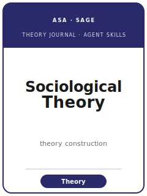

# Sociological Theory（ST）技能包

<p align="center">
  
</p>

[](LICENSE)
[](https://journals.sagepub.com/home/stx)
[](https://www.asanet.org/publications/journals/sociological-theory-2/)
[](https://github.com/anthropics/claude-code)

[English](README.md) | 简体中文

面向 **Sociological Theory（ST）** 投稿的智能体技能包。ST 是**美国社会学会（ASA）专门的理论期刊**，由 SAGE 出版。ST 发表推进社会学**理论**的概念性工作：新的实质理论、理论史、元理论、形式理论建构与综合性贡献。它**不包含假设检验、不做估计、没有结果部分**——数据即便出现，也仅是**示例性**的，绝非检验。

本仓库立场鲜明：它**不是**通用的社会学写作工具箱，也**不是**实证社会学技能栈，而是一个**ST 专用的、面向理论建构**的技能栈，覆盖理论问题界定、传统定位、概念与命题建构、论证有效性、边界条件、概念图示、ASA 文风、Manuscript Central 投稿系统以及双盲评审。

> 官方信息核对于 2026-06。易变细节（编辑团队、确切篇幅/摘要字数、处理费、ASA 文风指南版本、投稿门户 URL）会变动；投稿前请以官方 ST / SAGE 作者页为准。

---

## 为什么需要独立的 ST 技能栈？

ST 的约束与实证社会学期刊（ASR / AJS）有实质差异：

| 约束               | Sociological Theory                                          | 含义                                                        |
|--------------------|-------------------------------------------------------------|-------------------------------------------------------------|
| 交付物             | **概念性推进**（新理论 / 机制 / 类型学 / 重读传统）           | 有"发现"的研究不契合，应投 ASR / AJS                          |
| 数据               | **仅示例性**——无样本、测量、估计、结果                       | 没有方法或结果部分                                          |
| 核心单元           | **命题**（理论性主张），每条由论证支撑                        | 不是针对样本检验的假设                                       |
| 严谨性标准         | **逻辑自洽与内部一致性**                                      | 逻辑在此扮演实证期刊中统计所扮演的角色                       |
| 概念               | 有定义、由外延界定、与近邻概念相区分                          | "换标签"的概念即拒稿信号                                     |
| 传统               | 介入某个活跃对话（场域论、实用主义、机制、文化、系统、关系）   | 凭空臆测会被拒                                              |
| 边界条件           | 作为理论的一部分被陈述                                        | 视为贡献，而非免责声明                                       |
| 贡献               | 区分化的"之前 → 之后"；理论现在能**看见**什么                  | "未与既有理论区分"是首要拒稿理由                             |
| 图示               | 概念性：机制图、类型学、过程模型                              | 无数据图——每个框是一个概念，每个箭头都有理由                 |
| 篇幅               | 最多约 14,500 词，**含脚注、参考文献、表、图、附录**（待核实）| 参考文献与脚注计入上限                                       |
| 评审               | 双盲、多轮（Manuscript Central）                              | 多轮属常态；门槛逐轮抬高                                     |

通用"科学写作"或实证社会学技能包无法处理这些约束。

---

## 快速开始

### 方式 A — Claude Code 插件（推荐）

```bash
/plugin marketplace add https://github.com/brycewang-stanford/sociological-theory-skills
/plugin install sociological-theory-skills
/reload-plugins
```

### 方式 B — 手动复制

```bash
git clone https://github.com/brycewang-stanford/sociological-theory-skills.git
cd sociological-theory-skills

mkdir -p ~/.claude/skills && cp -R skills/soctheory-* ~/.claude/skills/
# 或
mkdir -p ~/.codex/skills && cp -R skills/soctheory-* ~/.codex/skills/
```

### 第一条提示词

```
用 soctheory-workflow 告诉我，我的 Sociological Theory 稿件下一步该用哪个技能。
```

---

## 默认工作流

```text
soctheory-topic-selection
        ▼
soctheory-literature-positioning
        ▼
soctheory-theory-construction
        ▼
soctheory-argument-development     （有效性 + 对手理论）
        ▼
soctheory-boundary-conditions      （范围 / 领域 / 不主张什么）
        ▼
soctheory-conceptual-exhibits      （类型学 / 机制图）
        ▼
soctheory-contribution-framing
        ▼
soctheory-writing-style            （润色）
        ▼
soctheory-submission
        ▼
soctheory-review-process
        ▼
soctheory-rebuttal
```

`soctheory-workflow` 是路由器——根据你所处的阶段告诉你下一步用哪个技能。

---

## 技能一览

| 技能                              | 用途                                                                    |
|-----------------------------------|-------------------------------------------------------------------------|
| `soctheory-workflow`              | 路由器——决定下一步调用哪个子技能                                          |
| `soctheory-topic-selection`       | 是否存在真正的理论问题？是否契合 ST（而非实证）？                          |
| `soctheory-theory-construction`   | 建构概念、机制、内部一致的命题                                            |
| `soctheory-literature-positioning`| 选定传统；扩展 / 挑战 / 重构 / 综合                                       |
| `soctheory-argument-development`   | 论证有效性——担保、对手理论、反例（无数据）                               |
| `soctheory-boundary-conditions`   | 范围、领域，以及理论**不**主张什么                                        |
| `soctheory-conceptual-exhibits`   | 概念图示——类型学、机制图（绝非数据图）                                    |
| `soctheory-writing-style`         | ASA 文风；论证驱动的行文；含全部内容的篇幅上限（润色）                     |
| `soctheory-contribution-framing`  | 命名"新的观看方式"；陈述"之前 → 之后"                                     |
| `soctheory-review-process`        | 理解双盲、多轮评审与决定信                                                |
| `soctheory-submission`            | Manuscript Central 投稿前检查（格式、匿名、ASA 文风、处理费、伦理）       |
| `soctheory-rebuttal`              | 展示理论确有强化的 R&R 回复文档                                           |

### 资源

- [`skills/soctheory-submission/templates/checklist.md`](skills/soctheory-submission/templates/checklist.md) — 8 部分投稿前自查（范围 / 格式 / 匿名 / 摘要 / 理论 / 图示 / 参考文献 / 伦理与门户）
- [`resources/external_tools.md`](resources/external_tools.md) — 理论建构工具（引用图谱、文献管理、概念图软件、论证逻辑辅助）
- [`resources/official-source-map.md`](resources/official-source-map.md) — ST 范围、投稿机制、篇幅/费用事实及"尚未核实"清单
- [`resources/exemplars/library.md`](resources/exemplars/library.md) — 经网络核实的 ST 理论论文，附姊妹刊误归避雷指南
- [`resources/worked-examples/01-introduction.md`](resources/worked-examples/01-introduction.md) — 一篇虚构的 ST 风格理论引言（之前 → 之后）

---

## 与实证社会学及姊妹理论刊的差异

| 维度       | Sociological Theory          | ASR / AJS（实证）                   | Theory and Society / EJST       |
|------------|------------------------------|-------------------------------------|---------------------------------|
| 交付物     | 概念性推进                   | 用数据**检验/展示**的理论            | 理论（T&S：历史比较；EJST：欧陆）|
| 数据       | 仅示例性                     | 样本、测量、估计                     | T&S 常用历史证据                |
| 核心单元   | 命题（论证）                 | 假设（检验）                         | 论文 / 历史论证                 |
| 严谨性标准 | 逻辑自洽                     | 统计 / 实证严谨                      | 解释性 / 历史性                 |
| 图示       | 概念模型、类型学             | 数据图、结果表                       | 多为文字                        |

如果你的项目有需在数据中展示的发现，实证社会学技能栈更合适——ST 建构的正是那些期刊日后检验的理论。ST 也有别于 *Theory and Society*、*European Journal of Social Theory* 与 *Sociological Methodology*：它是 ASA 多元包容、专门面向理论本身的旗舰刊。

---

## 相关链接

- [awesome-journal-skills](https://github.com/brycewang-stanford/awesome-journal-skills) — 期刊专用技能包索引
- [Academy-of-Management-Review-Skills](https://github.com/brycewang-stanford/amr-skills) — AMR，纯理论的管理学期刊

---

## 许可证

MIT
