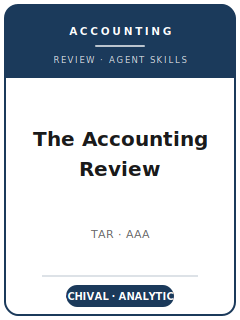

# The Accounting Review (TAR) Skills

<p align="center">
  
</p>

[](LICENSE)
[](https://aaahq.org/Research/Journals/The-Accounting-Review)
[](https://aaahq.org)
[](https://github.com/anthropics/claude-code)

English | [简体中文](README.zh-CN.md)

Agent skill stack for manuscripts targeted at **The Accounting Review (TAR)** — the flagship journal of the **American Accounting Association (AAA)**, covering archival/empirical and analytical accounting research.

This repository is opinionated. It is **not** a generic "academic writing" toolbox. It is a **TAR-specific** stack built around TAR's defining bar: the **significance of the contribution to the accounting literature**, established with a credible identification strategy (archival), a proven model (analytical), or a clean manipulation (experimental). It covers contribution-driven topic selection, economic-mechanism and model development, literature positioning, identification and research design, large-sample archival and analytical estimation with TAR's data-authenticity / code-access regime, Chicago-Manual-of-Style exhibits and prose, Editorial Manager submission with AI disclosure and ORCID, the double-blind review process, and multi-round R&R rebuttals.

> Durable norms only. Editors, the submission fee, exact page limits, and policies change — always verify on the official TAR Editorial Policy, Guide for Authors, and the AAA Manuscript Preparation Guide.

---

## Why a Separate TAR Skill Stack?

TAR imposes constraints that differ materially from management or generic social-science journals:

| Constraint              | The Accounting Review                                       | Implication                                                  |
|-------------------------|------------------------------------------------------------|--------------------------------------------------------------|
| Discipline              | Accounting — financial, capital markets, audit, tax, managerial, AIS | Generic finance/economics papers are off-fit         |
| Core bar                | **Significance of the contribution** to the accounting literature | A clean method with no contribution is not enough     |
| Dominant method (de facto) | Large-sample **archival/empirical**, plus experimental & analytical streams | Identification, not just correlation, is expected |
| Identification          | Shock / DiD / IV / RDD / setting that breaks endogeneity   | "We control for everything" does not identify an effect      |
| Data authenticity       | Description **+ processing code** (public/abstracted/private rules) | Unreproducible samples and missing code are rejected  |
| Format                  | Chicago Manual of Style (16th ed.); 55-page initial limit incl. exhibits | APA references and overlong drafts are flagged    |
| Abstract                | **≤ 150 words**, plus an **AI disclosure statement** after it | Vague/overlong abstracts and missing disclosure cost you  |
| Review                  | **Double-blind**; editor + a minimum of two reviewers      | Any self-identification defeats the process                  |
| Process                 | Editorial Manager; tiered Senior/Lead/Editor/Ad hoc routing; multi-round R&R | First-round accepts are essentially unheard of |
| Submission caps         | 8 first-round submissions / author / 24 months; ≤ 10 authors | Volume and byline throttles generic journals do not have   |

Generic "scientific writing" or "social-science methods" packs do not address these constraints.

---

## Quick Start

### Option A — Claude Code Plugin (recommended)

```bash
/plugin marketplace add https://github.com/brycewang-stanford/tar-skills
/plugin install tar-skills
/reload-plugins
```

### Option B — Manual Copy

```bash
git clone https://github.com/brycewang-stanford/tar-skills.git
cd tar-skills

mkdir -p ~/.claude/skills && cp -R skills/tar-* ~/.claude/skills/
# or
mkdir -p ~/.codex/skills && cp -R skills/tar-* ~/.codex/skills/
```

### First Prompt

```
Use tar-workflow to tell me which skill I should use next for my TAR manuscript.
```

---

## Default Workflow

```text
tar-topic-selection
        ▼
tar-theory-development
        ▼
tar-literature-positioning
        ▼
tar-methods
        ▼
tar-data-analysis
        ▼
tar-contribution-framing
        ▼
tar-tables-figures
        ▼
tar-writing-style        (polish)
        ▼
tar-submission
        ▼
tar-review-process
        ▼
tar-rebuttal
```

`tar-workflow` is the router — it tells you which skill to use next based on where you are.

---

## Skills

| Skill                        | Purpose                                                                  |
|------------------------------|--------------------------------------------------------------------------|
| `tar-workflow`               | Router — decides which sub-skill to invoke next                          |
| `tar-topic-selection`        | Contribution-driven question + TAR fit test (vs. JAR/JAE/section)        |
| `tar-theory-development`     | Economic mechanism / analytical model and testable predictions           |
| `tar-literature-positioning` | Joining an accounting conversation; problematization over gap-spotting   |
| `tar-methods`                | Identification design (DiD/IV/RDD/shock), experiment, or analytical model |
| `tar-data-analysis`          | Estimator, fixed effects, clustering, robustness, data-authenticity code |
| `tar-contribution-framing`   | Explicit accounting-contribution statement with calibrated claims        |
| `tar-tables-figures`         | Archival table set, event-study/RDD/model figures in Chicago style       |
| `tar-writing-style`          | Result front-loaded prose, Chicago house style, ≤150-word abstract        |
| `tar-submission`             | Editorial Manager preflight (anonymization, AI disclosure, ORCID, code)  |
| `tar-review-process`         | How TAR double-blind review/decisions work; reading a decision letter    |
| `tar-rebuttal`               | Multi-round R&R revision and point-by-point response letter              |

### Resources

- [`resources/external_tools.md`](resources/external_tools.md) — accounting data sources (Compustat / CRSP / I·B·E·S / Audit Analytics / EDGAR / PCAOB) and software (Stata `reghdfe`/`csdid`, R `fixest`, SAS+WRDS, Mathematica for analytical work)
- [`resources/official-source-map.md`](resources/official-source-map.md) — official AAA/TAR URLs behind every verified fact in this pack (accessed 2026-06-01; unverified items marked 待核实)

---

## Differences vs. JAR / JAE and the AAA family

| Dimension          | TAR                                | JAR                          | JAE                                | AAA section journals          |
|--------------------|------------------------------------|------------------------------|------------------------------------|-------------------------------|
| Owner              | American Accounting Association     | Chicago Booth                | Elsevier                           | AAA sections                  |
| Scope              | All accounting, all rigorous methods | Archival-leaning, broad     | Economics-based archival           | Sub-field (audit/tax/managerial/AIS) |
| Review             | **Double-blind**                   | own norms                    | own norms                          | varies (JFR is single-blind)  |
| Best fit           | Broad accounting significance       | Top archival, Chicago style  | Economics-driven accounting        | Primarily sub-field interest  |

If the accounting construct is incidental and the question is really finance or economics, TAR is the wrong venue.

---

## Related

- [awesome-journal-skills](https://github.com/brycewang-stanford/awesome-journal-skills) — index of journal-specific skill packs
- [Academy-of-Management-Journal-Skills](https://github.com/brycewang-stanford) — AMJ stack (empirical management)

---

## License

MIT
