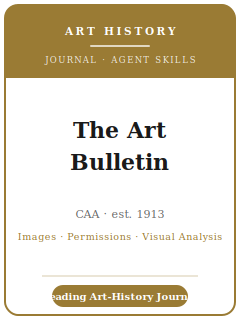

# 《艺术通报》（The Art Bulletin）技能包

<p align="center">
  
</p>

[](LICENSE)
[](https://www.collegeart.org/publications/art-bulletin)
[](https://www.tandfonline.com/journals/rcab20)
[](https://github.com/anthropics/claude-code)

[English](README.md) | 简体中文

面向 **《艺术通报》（The Art Bulletin）** 投稿的 Agent 技能栈。《艺术通报》是 **英语世界领先的艺术史
期刊**，创刊于 **1913 年**，由 **美国大学艺术协会（College Art Association, CAA）** 拥有，经
**Taylor & Francis / Routledge** 季刊出版（3、6、9、12 月）。它发表经严格同行评审的、涵盖
**艺术史所有时期与所有地区** 的研究，方法从历史取向到理论取向兼收并蓄。

本仓库是**有主见的**，而且是一个 **人文学科** 技能包——**不是** 社会科学包。这里**没有数据集、统计或
可复现材料包**。艺术史出版的独特之处在于 **与图像打交道**：由 **细读式视觉／形式分析** 支撑的原创论证，
建立在 **文献、档案与流传（provenance）** 证据之上，并通过一套 **繁重的图像授权工作流** 交付——即
作者须自行 **取得并付费获得复制权**、提供 **高分辨率** 文件——这一环节由作者负责，且必须尽早启动。

---

## 《艺术通报》是什么，为何需要专属技能栈？

《艺术通报》的约束不同于社会科学期刊——其重心是 **图像**，而非数据集：

| 约束 | 《艺术通报》 | 含义 |
|------|------|------|
| 领域 | **艺术史**——所有时期、所有地区、所有方法 | 贡献是一个艺术史论证，而非一个"发现" |
| 核心方法 | 对作品的 **细读式视觉／形式分析** | 看图必须精确，并与图版对应 |
| 证据 | 实物、**档案、文献、流传**、技术艺术史 | 不用数据/统计——靠可核验的来源，而非断言 |
| **独特轴线** | **图像：版权清理 + 复制质量**（作者自费） | 尽早启动授权；该环节耗时且昂贵 |
| 所有者 / 出版方 | **CAA** / **Taylor & Francis（Routledge）** | 通过电子邮件 / 大文件传输投稿，而非社科投稿系统 |
| 评审模式 | **双向匿名（double-blind）** | 正文**与注释**均须匿名；提交 **Word，不是 PDF** |
| 篇幅 | 论文 **最多 16,000 词，含尾注** | 尾注计入字数——注释须克制 |
| 摘要 / 简介 | 摘要 **≤ 100 词**；作者简介 **≤ 50 词** | 单独的封面页，前置信息须精简 |
| 插图 | **最多 20 幅图**，置于一个 **≤ 10 MB** 的 Word 文件；接受后再提供高清 | 让论证决定图版清单 |
| 体例 | **Chicago Manual of Style**——**尾注**，非作者—年份 | 完整的图注与版权署名；CMOS 第 14 章 |
| 费用 | 未列投稿费；可选开放获取 **APC**（T&F Open Select） | 不要预算投稿费 |

易变的具体信息（编辑、确切上限、插图/文件限制、Chicago 版次、费用/APC、合理使用措辞）会变化——未直接
核实项在 [`resources/official-source-map.md`](resources/official-source-map.md) 中标记 **待核实**。
**请以官方期刊页面为准。**

### 图像与授权的现实

- **作者自行取得并付费** 获得复制权与摄影费用——清理授权可能耗时数月。
- **公有领域的作品** 仍可能附带 **受版权保护的照片**：要清理你实际印刷的那张复制图的权利。
- **投稿时**，插图置于一个 Word 文件（**≤ 20 幅、≤ 10 MB**）；**接受后再提供高分辨率文件**。
- **合理使用** 由作者判断——**CAA 视觉艺术合理使用最佳实践准则** 是该领域参考标准。

---

## 快速开始

### 方式 A — Claude Code 插件（推荐）

```bash
/plugin marketplace add https://github.com/brycewang-stanford/artbull-skills
/plugin install artbull-skills
/reload-plugins
```

### 方式 B — 手动复制

```bash
git clone https://github.com/brycewang-stanford/artbull-skills.git
cd artbull-skills

mkdir -p ~/.claude/skills && cp -R skills/artbull-* ~/.claude/skills/
# 或
mkdir -p ~/.codex/skills && cp -R skills/artbull-* ~/.codex/skills/
```

### 第一条提示

```
用 artbull-workflow 告诉我，我的《艺术通报》论文下一步该用哪个技能。
```

---

## 默认工作流

```text
artbull-topic-selection
        ▼
artbull-scholarly-positioning
        ▼
artbull-argument-development
        ▼
artbull-visual-analysis
        ▼
artbull-evidence-and-sources
        ▼
artbull-images-and-permissions   （尽早启动；并行进行）
        ▼
artbull-structure-and-exposition
        ▼
artbull-writing-style-and-citation   （Chicago，尾注）
        ▼
artbull-review-process
        ▼
artbull-submission
        ▼
artbull-revision-and-response
```

`artbull-workflow` 是路由器——根据你所处阶段告诉你下一步用哪个技能。它的固定提醒是：把
`artbull-images-and-permissions` 与写作 **并行** 推进，因为版权清理是最慢、最贵、由作者负责的环节。

---

## 技能列表

| 技能 | 用途 |
|------|------|
| `artbull-workflow` | 路由器——决定下一步调用哪个子技能 |
| `artbull-topic-selection` | 艺术史契合度与贡献（而非描述）；图像可行性 |
| `artbull-scholarly-positioning` | 史学史与学界论争；点明空白；明确自己的方法 |
| `artbull-argument-development` | 由视觉 + 文献证据构建有据可依的新论点 |
| `artbull-visual-analysis` | 与编号图版对应的细读式视觉／形式分析 |
| `artbull-evidence-and-sources` | 实物、档案、文献、流传、技术艺术史；严谨性 |
| `artbull-images-and-permissions` | **独特技能**——版权清理、合理使用、复制质量、高清文件 |
| `artbull-structure-and-exposition` | 约 16,000 词论文的结构；图版位置；篇幅克制 |
| `artbull-writing-style-and-citation` | Chicago 体例；尾注；完整的图注与版权署名 |
| `artbull-review-process` | 双向匿名评审；评审人看重什么；可能的结果 |
| `artbull-submission` | 投稿前检查——仅 Word 文件、匿名、上限、插图、授权 |
| `artbull-revision-and-response` | 修订并回应评审人，且不稀释贡献 |

### 资源

- [`resources/external_tools.md`](resources/external_tools.md) — 图像来源（开放获取博物馆 / IIIF / Wikimedia）、版权代理（Art Resource / Bridgeman / Scala / ARS）、档案与流传索引、技术艺术史，以及 Chicago 尾注工具
- [`resources/official-source-map.md`](resources/official-source-map.md) — 每条事实背后的 CAA / Taylor & Francis 官方 URL，未核实项标 待核实

---

## 本仓库不做什么

- 不替你写出可直接投稿的论文，也不替你看图或做档案研究
- 不分析数据、不做统计——这是艺术史，不是社会科学
- 不替你清理版权、授予许可、减免费用或提供图像
- 不臆断易变元数据（现任编辑、确切上限、插图/文件限制、Chicago 版次、费用/APC）——请以官方页面为准；未核实项标 待核实
- 不替你判断你的贡献是否足以登上该学科的旗舰刊——那是研究者的判断

---

## 相关

- [awesome-journal-skills](https://github.com/brycewang-stanford/awesome-journal-skills) — 期刊专属技能包索引
- [The Art Bulletin（美国大学艺术协会 CAA）](https://www.collegeart.org/publications/art-bulletin) — 所有者、投稿指南、稿件准备
- [The Art Bulletin（Taylor & Francis Online）](https://www.tandfonline.com/journals/rcab20) — 出版方主页、各期、开放获取

---

## 许可

MIT
