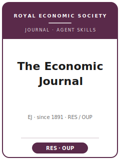

# The Economic Journal Skills

<p align="center"></p>

[English](README.md) | 简体中文

面向 **The Economic Journal（EJ）** 投稿的 12 个 agent skills。EJ 是 Royal Economic Society 旗下、由 OUP 出版的综合性经济学期刊。本包覆盖面向广泛读者的选题契合度、文献定位、识别或理论、稳健性、图表、写作风格、复现包、审稿人策略、Editorial Express 投稿终检与 R&R 回复。

**官方依据核验日期：2026-06-20**：见 [`resources/official-source-map.md`](resources/official-source-map.md)。当前来源表覆盖 Editorial Express 投稿、Francesco Lippi 任 Editor-in-Chief、Damian Clarke 任 Data Editor、single-blind 审稿、新投稿费用类别、short-paper 路线、accepted-author 元数据限制、author-date 参考文献和 EJ Data Editor 复现流程。

## 快速开始

```
/plugin marketplace add ./The-Economic-Journal-Skills
/plugin install economic-journal-skills
```

手动使用：先打开 [`skills/ecj-workflow/SKILL.md`](skills/ecj-workflow/SKILL.md)。

## 技能列表

| # | Skill | 作用 |
|---|-------|------|
| 1 | [`ecj-workflow`](skills/ecj-workflow/SKILL.md) | 路由 EJ 稿件 |
| 2 | [`ecj-topic-selection`](skills/ecj-topic-selection/SKILL.md) | 判断 RES/EJ 综合性契合度 |
| 3 | [`ecj-literature-positioning`](skills/ecj-literature-positioning/SKILL.md) | 面向一般经济学读者定位贡献 |
| 4 | [`ecj-identification`](skills/ecj-identification/SKILL.md) | 压力测试识别与可信度 |
| 5 | [`ecj-theory-model`](skills/ecj-theory-model/SKILL.md) | 打磨理论或机制 |
| 6 | [`ecj-robustness`](skills/ecj-robustness/SKILL.md) | 组织稳健性检查 |
| 7 | [`ecj-tables-figures`](skills/ecj-tables-figures/SKILL.md) | 构建清晰图表 |
| 8 | [`ecj-writing-style`](skills/ecj-writing-style/SKILL.md) | 执行综合性清晰文风 |
| 9 | [`ecj-replication-package`](skills/ecj-replication-package/SKILL.md) | 准备数据与代码材料 |
| 10 | [`ecj-referee-strategy`](skills/ecj-referee-strategy/SKILL.md) | 预判审稿人质疑 |
| 11 | [`ecj-submission`](skills/ecj-submission/SKILL.md) | 运行投稿终检 |
| 12 | [`ecj-rebuttal`](skills/ecj-rebuttal/SKILL.md) | 起草回复信与修改计划 |

## 资源

- [`resources/official-source-map.md`](resources/official-source-map.md) — EJ/OUP/RES 官方来源
- [`resources/external_tools.md`](resources/external_tools.md) — 数据与软件工具
- [`resources/code/`](resources/code/) — 实证 Stata/Python 代码脚手架

## 许可

MIT (c) 2026 Bryce Wang。见 [LICENSE](LICENSE)。
