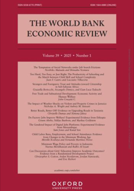

<!-- AJS-ROOT-JOURNAL-ENTRY -->
# World Bank Economic Review

> Specializes in quantitative development policy analysis, publishing refereed articles that examine policy choices with an emphasis on policy relevance.

| At a glance | |
|---|---|
| **Field** | Economics (development) |
| **Publisher** | Oxford University Press (for the World Bank) |
| **Founded** | 1986 |
| **ISSN** | 0258-6770 (print) · 1564-698X (online) |
| **Frequency** | 3 issues/year |
| **Official** | [academic.oup.com](https://academic.oup.com/wber) |
| **Checked** | 2026-06-17 |

**▶ Use the skill — [`world-bank-economic-review`](../English-SocialScience-Journal-Skills/skills/world-bank-economic-review/):** venue fit, framing, the method-and-evidence bar, house style, and desk-reject heuristics.

Part of the **[English Social-Science Journal Skills](../English-SocialScience-Journal-Skills/)** bundle. Always re-check the live author guidelines on the official site before submitting.

---

<!-- Machine-readable canonical pointer — do not remove or alter (validated by tools/audit_repo.py). -->

- Canonical skill: [English-SocialScience-Journal-Skills/skills/world-bank-economic-review/](../English-SocialScience-Journal-Skills/skills/world-bank-economic-review/)
- Skill name: `world-bank-economic-review`
- Bundle: [English-SocialScience-Journal-Skills/](../English-SocialScience-Journal-Skills/)

This folder intentionally does not contain a `SKILL.md`; the installable skill stays inside the bundle so plugin paths and skill counts remain stable.
