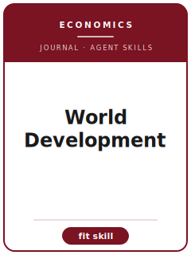

# World Development Skills

<p align="center"></p>

[English](README.md) | 简体中文

面向 **World Development（World Development）** 投稿的 12 个 agent skills。本包围绕 development studies and development economics across poverty, institutions, sustainability, and policy implementation 设计，帮助稿件区别于 Journal of Development Economics, World Bank Economic Review, Economic Development and Cultural Change, and World Development Perspectives，并强调 development evidence that connects identification to implementation, equity, and institutions。

**官方依据核验日期：2026-06**（投稿前需复核易变细节）：见 [`resources/official-source-map.md`](resources/official-source-map.md)。

## 为什么需要单独的技能栈？

| World Development 约束 | 对稿件的要求 |
|-------------------|--------------|
| 范围 | 主张必须服务于 development studies and development economics across poverty, institutions, sustainability, and policy implementation |
| 同门边界 | 说明为什么不是 Journal of Development Economics, World Bank Economic Review, Economic Development and Cultural Change, and World Development Perspectives |
| 证据标准 | 设计、模型、综述或质性证据必须匹配 development evidence that connects identification to implementation, equity, and institutions |
| 来源纪律 | 当前流程事实必须有来源，或明确标记 待核实 |

## 快速开始

```text
/plugin marketplace add ./World-Development-Skills
/plugin install world-development-skills
```

手动使用：先打开 [`skills/worlddev-workflow/SKILL.md`](skills/worlddev-workflow/SKILL.md)。

## 默认工作流

```text
worlddev-workflow → worlddev-topic-selection → worlddev-literature-positioning → worlddev-identification → worlddev-theory-model → worlddev-robustness → worlddev-tables-figures → worlddev-writing-style → worlddev-replication-package → worlddev-referee-strategy → worlddev-submission → worlddev-rebuttal
```

## 技能列表

| # | Skill | 作用 |
|---|-------|------|
| 1 | [`worlddev-workflow`](skills/worlddev-workflow/SKILL.md) | 面向 World Development 稿件的 Workflow Router |
| 2 | [`worlddev-topic-selection`](skills/worlddev-topic-selection/SKILL.md) | 面向 World Development 稿件的 Topic Selection |
| 3 | [`worlddev-literature-positioning`](skills/worlddev-literature-positioning/SKILL.md) | 面向 World Development 稿件的 Literature Positioning |
| 4 | [`worlddev-identification`](skills/worlddev-identification/SKILL.md) | 面向 World Development 稿件的 Identification Strategy |
| 5 | [`worlddev-theory-model`](skills/worlddev-theory-model/SKILL.md) | 面向 World Development 稿件的 Theory and Model Craft |
| 6 | [`worlddev-robustness`](skills/worlddev-robustness/SKILL.md) | 面向 World Development 稿件的 Robustness Strategy |
| 7 | [`worlddev-tables-figures`](skills/worlddev-tables-figures/SKILL.md) | 面向 World Development 稿件的 Tables and Figures |
| 8 | [`worlddev-writing-style`](skills/worlddev-writing-style/SKILL.md) | 面向 World Development 稿件的 Writing Style |
| 9 | [`worlddev-replication-package`](skills/worlddev-replication-package/SKILL.md) | 面向 World Development 稿件的 Replication Package |
| 10 | [`worlddev-referee-strategy`](skills/worlddev-referee-strategy/SKILL.md) | 面向 World Development 稿件的 Referee Strategy |
| 11 | [`worlddev-submission`](skills/worlddev-submission/SKILL.md) | 面向 World Development 稿件的 Submission Preflight |
| 12 | [`worlddev-rebuttal`](skills/worlddev-rebuttal/SKILL.md) | 面向 World Development 稿件的 Rebuttal Strategy |

## 资源

- [`resources/README.md`](resources/README.md) — 资源索引
- [`resources/official-source-map.md`](resources/official-source-map.md) — 官方 URL 与易变信息
- [`resources/external_tools.md`](resources/external_tools.md) — 数据库、方法与软件工具
- [`resources/worked-examples/01-introduction.md`](resources/worked-examples/01-introduction.md) — 虚构引言改写示例
- [`resources/exemplars/library.md`](resources/exemplars/library.md) — 真实论文槽位与来源纪律
- [`resources/code/`](resources/code/) — 适用时使用的实证代码脚手架

## 许可

MIT (c) 2026 Bryce Wang。见 [LICENSE](LICENSE)。
