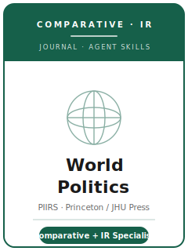

# World Politics Skills

<p align="center">
  
</p>

[](LICENSE)
[](https://wpj.princeton.edu/)
[](https://www.cambridge.org/core/journals/world-politics)
[](https://github.com/anthropics/claude-code)

English | [简体中文](README.zh-CN.md)

Agent skill stack for manuscripts targeted at **World Politics** — a leading quarterly journal of
**comparative politics and international relations**, founded in **1948** and produced under the
**Princeton Institute for International and Regional Studies (PIIRS)** at Princeton University,
published by **Johns Hopkins University Press** (Cambridge University Press hosted it through 2022).
World Politics "aims to publish outstanding scholarship in the fields of international relations and
comparative politics" — theory and original empirics, across quantitative, qualitative,
comparative-historical, experimental, and formal-empirical methods.

This repository is opinionated. It is **not** a generic social-science writing toolbox and it is
**not** a generalist political-science pack with the names swapped. It is a **World Politics–specific**
stack built around the one thing that defines the journal: it is a **comparative-politics + IR
specialist**. The contribution must **travel across cases or systems**, sit squarely in comparative
politics or international relations, and stay out of the categories World Politics explicitly does not
publish.

---

## What Is World Politics, and Why a Dedicated Stack?

World Politics' constraints differ from a discipline-wide flagship and from a pure-IR journal:

| Constraint            | World Politics                                                                 | Implication                                                       |
|-----------------------|--------------------------------------------------------------------------------|-------------------------------------------------------------------|
| Sponsor / publisher   | **PIIRS, Princeton** / **Johns Hopkins University Press** (Cambridge ≤ 2022)    | Submitted via **ScholarOne** (`mc.manuscriptcentral.com/wp`)      |
| Scope                 | **Comparative politics + international relations** — a *specialist*, not generalist | The question must sit in CP/IR and **travel across cases**    |
| Premium on            | A substantive question that **advances theoretical debate** + original empirics | A single-case description that doesn't travel is off-fit         |
| Methods               | Quantitative, qualitative, comparative-historical, experimental, formal — judged on own terms | Match method to a cross-case question                  |
| Review model          | **Triple-blind** (author, readers, editors)                                    | Anonymize fully; anonymity preserved through the decision         |
| Length                | **≤ 12,500 words including notes and references**; tables/figures/appendixes excluded | Notes and references eat the budget; plan exhibits out       |
| Online supplement     | **≤ 15 pages**, used judiciously                                               | Not an unlimited appendix — cap your overflow                     |
| Abstract              | **≤ 150 words**                                                                | Question + approach + findings                                    |
| Article types         | **Research articles** + **review articles** (the latter usually commissioned)  | Choose the right type; review articles ≠ book reviews             |
| Data policy           | Quantitative data → **World Politics Dataverse** after acceptance, before publication | Build a re-runnable package; embargoes ≤ 2 yrs by approval  |
| Out of scope          | No opinion/policy pieces, stand-alone political theory, historical or journalistic narratives | Don't send these — they are explicit non-fits            |

Volatile specifics (publisher of record, editors and term, exact limits, embargo terms, policy wording)
change — items not directly confirmed are marked **待核实** in
[`resources/official-source-map.md`](resources/official-source-map.md). The publisher site often returns
HTTP 403 to automated fetches; **verify on the official journal page.**

### Three differentiators worth internalizing

- **Comparative + IR specialist — it must travel.** Unlike the discipline-wide **APSR / AJPS / JOP**,
  World Politics is a *specialist*: the contribution must sit in comparative politics or international
  relations and generalize **beyond a single case**. A great paper on one country must be a case *of*
  something, not just about that country.
- **Comparative, not IR-only.** Unlike a pure-IR venue (e.g., *International Organization*), World
  Politics centers **comparative politics on equal footing with IR**, and prizes work at their
  intersection (domestic institutions ↔ international behavior). A purely IR-theoretic piece with no
  comparative leverage or empirics is a poor fit.
- **Two article types, both triple-blind.** Beyond research articles, World Politics publishes **review
  articles** that synthesize thematically related books **and reframe a field's agenda** (distinct from
  book reviews; usually commissioned). All manuscripts — even commissioned ones — go through
  triple-blind review.

### Two article types

- **Research article** — full original study (theory + original empirics) on a comparative/IR question
  that travels, **≤ 12,500 words** including notes and references, with an online supplement **≤ 15
  pages**.
- **Review article** — analyzes and compares a set of thematically related books *and* advances how the
  field should pursue future work. **Usually commissioned**; confirm with the editors before drafting
  (待核实).

---

## Quick Start

### Option A — Claude Code Plugin (recommended)

```bash
/plugin marketplace add https://github.com/brycewang-stanford/wp-skills
/plugin install wp-skills
/reload-plugins
```

### Option B — Manual Copy

```bash
git clone https://github.com/brycewang-stanford/wp-skills.git
cd wp-skills

mkdir -p ~/.claude/skills && cp -R skills/wp-* ~/.claude/skills/
# or
mkdir -p ~/.codex/skills && cp -R skills/wp-* ~/.codex/skills/
```

### First Prompt

```
Use wp-workflow to tell me which skill I should use next for my World Politics manuscript.
```

---

## Default Workflow

```text
wp-topic-selection
        ▼
wp-literature-positioning
        ▼
wp-theory-building
        ▼
wp-research-design
        ▼
wp-data-analysis
        ▼
wp-tables-figures
        ▼
wp-writing-style          (polish)
        ▼
wp-transparency-and-data-policy
        ▼
wp-review-process
        ▼
wp-submission
        ▼
wp-rebuttal
```

`wp-workflow` is the router — it tells you which skill to use next based on where you are. Its first
job is to confirm the question **travels across cases** and sits in comparative politics or IR; if you
are preparing a **review article**, it routes you to positioning and theory-building first.

---

## Skills

| Skill                              | Purpose                                                                       |
|------------------------------------|-------------------------------------------------------------------------------|
| `wp-workflow`                      | Router — decides which sub-skill to invoke next                               |
| `wp-topic-selection`               | CP/IR fit and the "travels across cases" test; research vs. review article    |
| `wp-literature-positioning`        | Locate the paper in a live cross-case CP/IR debate; bridge comparative ↔ IR    |
| `wp-theory-building`               | Build a portable argument — mechanisms, scope conditions, what travels        |
| `wp-research-design`               | Defend the design — comparative-historical, cross-national, qualitative, formal |
| `wp-data-analysis`                 | Cross-national inference, robustness, measurement that travels, triangulation |
| `wp-tables-figures`                | Self-contained, accessible exhibits; the ≤ 15-page online-supplement budget   |
| `wp-writing-style`                 | World Politics house style; read across cases within ≤ 12,500 words           |
| `wp-transparency-and-data-policy`  | World Politics Dataverse package; embargoes; qualitative transparency         |
| `wp-review-process`                | Triple-blind review, reviewer norms, scope screening, APSA human subjects     |
| `wp-submission`                    | ScholarOne preflight (anonymization, word limit, abstract, double-spacing)    |
| `wp-rebuttal`                      | R&R response memo (≤ ~5 pages) for multiple anonymous reviewers + editors      |

### Resources

- [`resources/external_tools.md`](resources/external_tools.md) — comparative + IR data sources (V-Dem / Polity / COW / UCDP / ACLED / CSES / Manifesto Project) + R / Stata / Python and QCA/CAQDAS tooling
- [`resources/official-source-map.md`](resources/official-source-map.md) — official PIIRS / JHU / Cambridge URLs behind every fact, with 待核实 markers on unverified items

---

## What This Repo Does Not Do

- It does not write a submittable manuscript for you
- It does not simulate any specific editor's or reviewer's taste
- It does not assert volatile metadata (publisher of record, current editors, exact limits, embargo terms, policy wording) — verify on the official page; unverified items are marked 待核实
- It does not decide whether your question travels across cases — that is the researcher's call

---

## Related

- [awesome-journal-skills](https://github.com/brycewang-stanford/awesome-journal-skills) — Index of journal-specific skill packs
- [World Politics (PIIRS, Princeton)](https://wpj.princeton.edu/) — journal home, reviewer guidelines, Dataverse
- [World Politics (Cambridge Core)](https://www.cambridge.org/core/journals/world-politics) — archive and author instructions

---

## License

MIT
