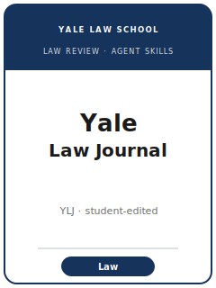

# 耶鲁法律评论技能包（Yale Law Journal Skills）

<p align="center">
  
</p>

[](LICENSE)
[](https://yalelawjournal.org/)
[](https://law.yale.edu/)
[](https://github.com/anthropics/claude-code)

[English](README.md) | 简体中文

面向 **The Yale Law Journal（YLJ，耶鲁法律评论）** 投稿的法学论文写作 Agent 技能栈。YLJ 是 **耶鲁法学院学生主编的旗舰法律评论**，
是美国被引用最多的法律出版物之一。它是一份 **通识型（generalist）** 评论：刊发法学专业学者撰写的 **Articles、Essays、Features
与书评**、**学生撰写的 Notes 与 Comments**，以及在线栏目 **YLJ Forum**。

本仓库立场鲜明：它 **不是** 通用的学术写作工具箱，也 **不是** 把同行评审范式套用到法学上。学生主编的法律评论与同行评审期刊运作方式不同：
作者提交的是一份 **接近定稿、脚注密集、符合 Bluebook** 的稿件；**学生编辑** 在 **匿名** 状态下评审，录用后进行高强度编辑与
**逐条核源（source-pull）**——人工核对每一条脚注。本技能栈把这一现实编码进来：**抢先性检索（preemption check）**、
**“原理→理论→规范（doctrine→theory→normative）”** 的论证结构、**Bluebook 脚注体系**、**YLJ 自有投稿系统**（不是 Scholastica）、
以及与市场惯例不同的 **加急（expedite）** 规则。

---

## 为什么需要一个专属技能栈？

YLJ 的约束既不同于同行评审期刊，也不同于其他法律评论：

| 约束 | YLJ | 含义 |
|---|---|---|
| 编辑模式 | **学生主编**（耶鲁法学院）；**无同行评审** | 提交成稿，而非待共同打磨的草稿 |
| 范围 | **通识型** 法学研究 | 主张须面向整个法律职业，而非单一细分领域 |
| 评审 | **匿名**（Articles & Essays Committee） | 去除一切身份/声望线索；声誉不可见 |
| 投稿门户 | **YLJ 自有在线系统**——**不用 Scholastica/ExpressO** | YLJ 经其门户投稿/加急；其他评论用 Scholastica 群投 |
| 加急 | 在 YLJ **不带来竞争优势** | 外部录用并不会让你插队 |
| 体例 | **Bluebook** + 期刊自有引注要求 | 精确页码引证；引文加标；投稿即需完整脚注 |
| 核验 | 录用后对每条脚注 **逐条核源** | 引证须真实、定位精确、且确能支撑该句 |
| 篇幅（建议，含脚注） | **Article < 2.5 万词**、**Essay < 1.5 万词**、**Forum < 1 万词**；学生 **Note ~2 万** / **Comment ~7 千** | 超长会成为不利因素 |
| 在线栏目 | **YLJ Forum**（2005 年首创，2014 年重启） | 短小、及时的文章与回应在线发表 |

易变细节（各卷确切上限、费用、季节窗口、门户机制）会变化——未经直接确认的条目在
[`resources/official-source-map.md`](resources/official-source-map.md) 中标注 **待核实**。**请以官网为准。**

### 发表类型（tracks）

- **Articles**——专业学者的原创研究；建议 **< 2.5 万词**（含脚注）。
- **Essays**——更精炼、更聚焦的专业文章；建议 **< 1.5 万词**（含脚注）。
- **Features**——专题/研讨会合辑。
- **Notes & Comments**——**仅限耶鲁法学院学生**的长/短篇研究（设 Notes Development 辅导）。
- **YLJ Forum**——短小、及时的在线文章与回应；建议 **< 1 万词**（含脚注）。

---

## 快速开始

### 方式 A — Claude Code 插件（推荐）

```bash
/plugin marketplace add https://github.com/brycewang-stanford/yale-law-journal-skills
/plugin install yale-law-journal-skills
/reload-plugins
```

### 方式 B — 手动复制

```bash
git clone https://github.com/brycewang-stanford/yale-law-journal-skills.git
cd yale-law-journal-skills

mkdir -p ~/.claude/skills && cp -R skills/ylj-* ~/.claude/skills/
# 或
mkdir -p ~/.codex/skills && cp -R skills/ylj-* ~/.codex/skills/
```

### 第一条提示词

```
用 ylj-workflow 告诉我，我的 Yale Law Journal 稿件下一步该用哪个技能。
```

---

## 默认工作流

```text
ylj-topic-selection
        ▼
ylj-thesis-and-contribution
        ▼
ylj-preemption-check
        ▼
ylj-argument-structure
        ▼
ylj-sources-and-bluebook
        ▼
ylj-writing-style              （润色）
        ▼
ylj-placement-strategy
        ▼
ylj-submission
        ▼
ylj-student-editor-review       （录用后）
        ▼
ylj-revision-and-editing        （+ YLJ Forum 路径）
        ▼
ylj-footnotes-and-cite-check    （贯穿全程；最终核验）
```

`ylj-workflow` 是路由器——根据阶段与类型告诉你下一步用哪个技能。**脚注体系贯穿全程构建**，并非最后才补；
`ylj-footnotes-and-cite-check` 在投稿前与编辑核源阶段各跑一次。若选题及时或回应近期 YLJ 文章，可走
`ylj-revision-and-editing` 的 **Forum** 路径。

---

## 技能一览

| 技能 | 用途 |
|---|---|
| `ylj-workflow` | 路由器——决定下一个子技能；选定发表类型 |
| `ylj-topic-selection` | 通识意义契合度；在 Article/Essay/Feature/Note/Comment/Forum 中选型 |
| `ylj-thesis-and-contribution` | 锻造唯一、可争辩的核心主张；明确贡献类型 |
| `ylj-preemption-check` | SSRN/Westlaw/HeinOnline 新颖性检索；撰写“新意”段落 |
| `ylj-argument-structure` | 按“原理→理论→规范”排布各 Part；正面回应最强反驳 |
| `ylj-sources-and-bluebook` | 为每个论断建立精确页码、合 Bluebook 的引证 |
| `ylj-writing-style` | 通识可读的文风；论证在正文、支撑在脚注 |
| `ylj-placement-strategy` | 群投 + 季节时机 + YLJ 自有门户/加急无优势规则 |
| `ylj-student-editor-review` | 匿名委员会评审、Notes Development、逐条核源 |
| `ylj-submission` | YLJ 门户投稿前检查（匿名化、篇幅、脚注体系、材料） |
| `ylj-revision-and-editing` | 高强度学生编辑周期 + YLJ Forum 在线路径 |
| `ylj-footnotes-and-cite-check` | 脚注终审：存在性、支撑性、精确定位、Bluebook 体例 |

### 资源

- [`resources/external_tools.md`](resources/external_tools.md) — 法律检索数据库（Westlaw / Lexis / HeinOnline / SSRN / CourtListener / Congress.gov / govinfo）与 Bluebook、核引工具
- [`resources/official-source-map.md`](resources/official-source-map.md) — 每条事实背后的官方 YLJ 链接，未确认项标注 待核实
- [`resources/worked-examples/01-introduction.md`](resources/worked-examples/01-introduction.md) — YLJ 引言改写前后对照（虚构、示例）
- [`resources/exemplars/library.md`](resources/exemplars/library.md) — 按贡献类型整理的真实、经检索核实的 YLJ 文章，附姊妹评论混淆防护

---

## 本仓库不做什么

- 不替你写出可投稿的成稿
- 不模拟任何特定学生编辑或委员会的口味
- 不断言易变元数据（各卷确切上限、费用、季节窗口、门户机制）——请以官网为准；未确认项标注 待核实
- 不替你判断主张是否具有通识意义——这是作者的判断
- 不提供法律意见；它是论文写作工具包

---

## 与姊妹法律评论的差异

| 维度 | YLJ | 典型同行评审期刊 | 许多其他法律评论 |
|---|---|---|---|
| 编辑 | 耶鲁法学院 **学生** | 学者同行评审 | 学生（其他院校） |
| 评审 | 对成稿 **匿名** 评审 | 同行评审、共同打磨 | 常经 **Scholastica** |
| 投稿门户 | **自有在线系统** | Editorial Manager / OUP 等 | 常用 **Scholastica/ExpressO** |
| 加急 | **不带来插队优势** | 不适用 | 常用于以录用施压 |
| 体例 | **Bluebook** | APA / Chicago / 期刊体例 | Bluebook |
| 核验 | 对每条脚注 **逐条核源** | 方法/数据审查 | 核引程度不一 |

（耶鲁的 **其他** 学生期刊——Yale Law & Policy Review、Yale Journal on Regulation 等——是独立刊物，规则各异；
切勿把 YLJ 的规则套用到它们身上。）

---

## 相关链接

- [awesome-journal-skills](https://github.com/brycewang-stanford/awesome-journal-skills) — 期刊专属技能包索引
- [The Yale Law Journal](https://yalelawjournal.org/) — 期刊主页、投稿、Forum
- [Yale Law School](https://law.yale.edu/) — 期刊所属机构

---

## 许可证

MIT
