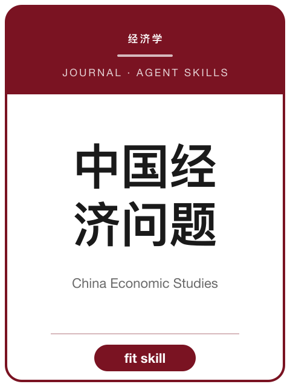

<!-- AJS-ROOT-JOURNAL-ENTRY -->
# 《中国经济问题》

> 新中国高校首家经济学专业学术期刊。

| 期刊概览 | |
|---|---|
| **学科** | 经济学 |
| **主办/出版** | 厦门大学（经济研究所）主办 |
| **创刊** | 1959 |
| **ISSN** | 1000-4181 · CN 35-1020/F |
| **周期** | 双月刊 |
| **收录/地位** | CSSCI · 北大中文核心 · AMI |
| **官网** | [ces.xmu.edu.cn](https://ces.xmu.edu.cn/) |
| **核验日期** | 2026-06-17 |

**▶ 调用 skill —— [`china-economic-studies`](../Chinese-SocialScience-Journal-Skills/skills/china-economic-studies/)：** 选题契合度、框架、方法与证据门槛、写作体例与拒稿雷区。

属于 **[中文社会科学期刊 Skills](../Chinese-SocialScience-Journal-Skills/)** 合集。投稿前请以官网最新《投稿须知》为准。

---

<!-- 机器可读的规范指针——请勿删除或改动（由 tools/audit_repo.py 校验）。 -->

- Canonical skill: [Chinese-SocialScience-Journal-Skills/skills/china-economic-studies/](../Chinese-SocialScience-Journal-Skills/skills/china-economic-studies/)
- Skill name: `china-economic-studies`
- Bundle: [Chinese-SocialScience-Journal-Skills/](../Chinese-SocialScience-Journal-Skills/)

此目录刻意不包含 `SKILL.md`；真正可安装的 skill 保留在 bundle 内，确保插件路径和 skill 计数保持稳定。
