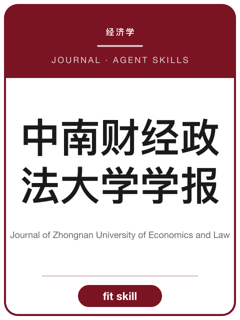

<!-- AJS-ROOT-JOURNAL-ENTRY -->
# 《中南财经政法大学学报》

> 财经政法类综合性高校学报。

| 期刊概览 | |
|---|---|
| **学科** | 经济学与法学（财经政法） |
| **主办/出版** | 中南财经政法大学主办 |
| **创刊** | 1958 |
| **ISSN** | 1003-5230 · CN 42-1663/F |
| **周期** | 双月刊 |
| **收录/地位** | CSSCI · 北大中文核心 |
| **官网** | [xuebao.zuel.edu.cn](http://xuebao.zuel.edu.cn/) |
| **核验日期** | 2026-06-17 |

**▶ 调用 skill —— [`journal-of-zhongnan-university-of-economics-and-law`](../Chinese-SocialScience-Journal-Skills/skills/journal-of-zhongnan-university-of-economics-and-law/)：** 选题契合度、框架、方法与证据门槛、写作体例与拒稿雷区。

属于 **[中文社会科学期刊 Skills](../Chinese-SocialScience-Journal-Skills/)** 合集。投稿前请以官网最新《投稿须知》为准。

---

<!-- 机器可读的规范指针——请勿删除或改动（由 tools/audit_repo.py 校验）。 -->

- Canonical skill: [Chinese-SocialScience-Journal-Skills/skills/journal-of-zhongnan-university-of-economics-and-law/](../Chinese-SocialScience-Journal-Skills/skills/journal-of-zhongnan-university-of-economics-and-law/)
- Skill name: `journal-of-zhongnan-university-of-economics-and-law`
- Bundle: [Chinese-SocialScience-Journal-Skills/](../Chinese-SocialScience-Journal-Skills/)

此目录刻意不包含 `SKILL.md`；真正可安装的 skill 保留在 bundle 内，确保插件路径和 skill 计数保持稳定。
