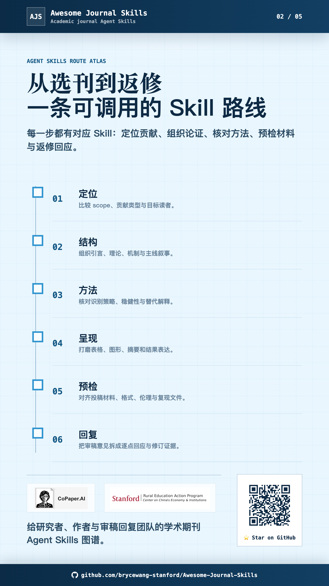
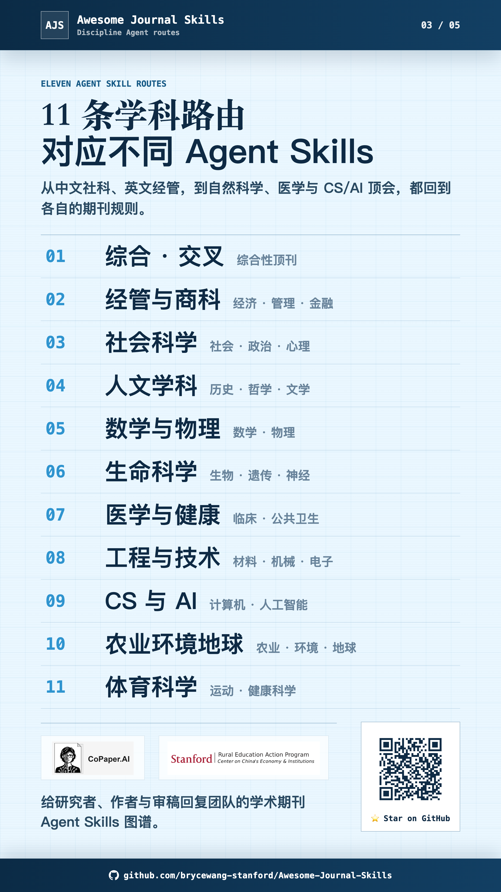
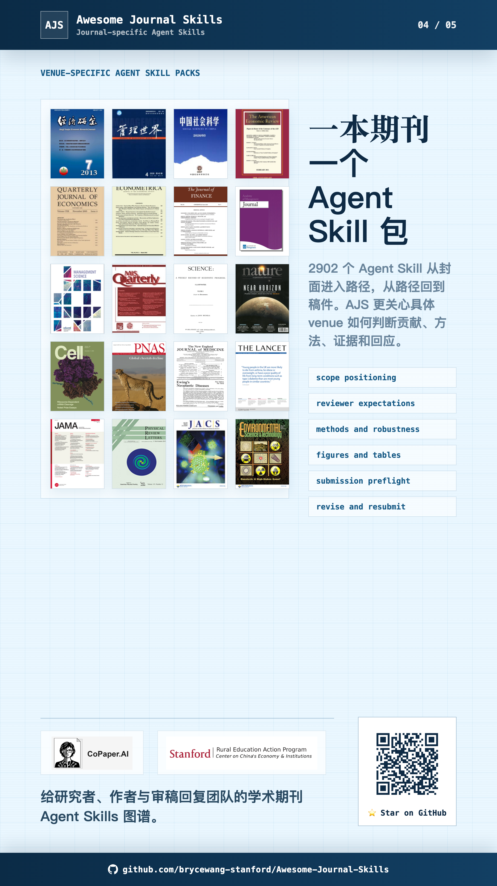
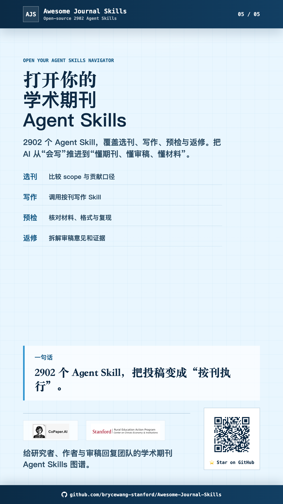

# AJS 小红书海报 · Xiaohongshu Poster Set

淡蓝简洁风格的 5 张宣传海报，介绍 **Awesome Journal Skills**（学术期刊 Agent Skills 与按刊执行路线）。
每张原生 1080×1920，导出为 2×（2160×3840）PNG，底部带项目地址与可扫描的 GitHub 二维码。

A 5-poster light-blue promo set for **Awesome Journal Skills** and its academic
journal Agent Skills. Native 1080×1920,
exported at 2× (2160×3840). Each poster carries the project URL and a scannable QR
that resolves to <https://github.com/brycewang-stanford/Awesome-Journal-Skills>.

## 海报 · Posters

### 01 — 总览 / Overview


### 02 — 投稿工作流 / Submission workflow atlas


### 03 — 学科地图 / Discipline map


### 04 — 期刊封面墙 / Journal cover wall


### 05 — 行动号召 / Call to action


## 重新生成 · Regenerate

源文件是同目录下的 [`light-blue-posters.html`](light-blue-posters.html)。改完文案后，从仓库根目录运行渲染脚本即可刷新这 5 张 PNG：

```bash
node tools/render_posters.mjs gallery/xiaohongshu-ajs/light-blue-posters.html
```

The deck pulls shared images (logos, journal covers, QR) from the repo's
[`assets/`](../../assets/) folder via relative paths, so it renders correctly
from this location. See [`tools/README.md`](../../tools/README.md) for the
renderer's requirements (a global Playwright install).

> 注 / Note: 设计的工作副本放在被 git 忽略的 `社媒文件/` 下；此 `gallery/` 目录是发布到仓库的成品快照（HTML 源 + 5 张成品图），可独立复现。
